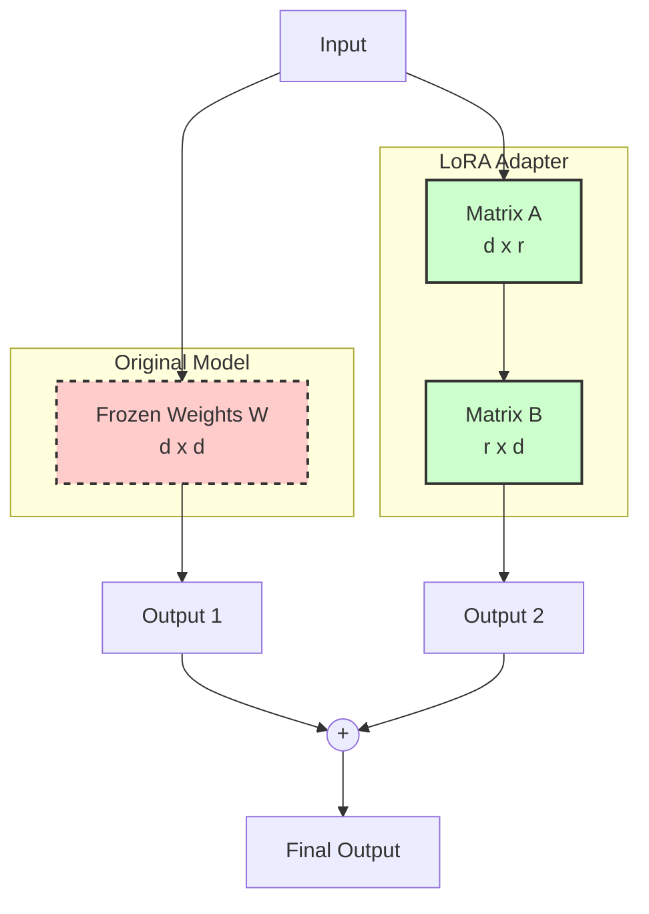

# Tinh chỉnh hiệu quả tham số - PEFT

## Summary

**Parameter-Efficient Fine-Tuning (PEFT)** là một tập hợp các kỹ thuật huấn luyện học máy cho phép "tinh chỉnh" (fine-tune) các Mô hình Ngôn ngữ Lớn (LLM) để chúng thích ứng với các nhiệm vụ mới hoặc tri thức đặc thù mà không cần phải cập nhật toàn bộ hàng tỷ tham số gốc của mô hình. Thay vì huấn luyện lại toàn bộ mạng nơ-ron (Full Fine-Tuning) đòi hỏi tài nguyên siêu máy tính đắt đỏ, PEFT đóng băng phần lớn mô hình gốc và chỉ cập nhật một lượng rất nhỏ tham số mới, giúp việc huấn luyện LLM trở nên khả thi đối với các nhà phát triển thông thường với chỉ một GPU dân dụng.

---

## Definition

Khi một LLM mã nguồn mở (như Llama 3 8B) được phát hành, nó chứa kiến thức tổng quát. Để mô hình này giỏi viết code Python nội bộ của công ty, bạn cần tinh chỉnh (Fine-tune) nó trên bộ dữ liệu code riêng. 

**Full Fine-Tuning** yêu cầu tải toàn bộ 8 tỷ tham số (weights), tính toán đạo hàm (gradients) và cập nhật optimizer states cho toàn bộ 8 tỷ tham số này. Việc này đòi hỏi nhiều card đồ họa cao cấp (như A100/H100 80GB VRAM) kết nối với nhau, tiêu tốn hàng chục nghìn đô la.

**PEFT (Parameter-Efficient Fine-Tuning)** giải quyết bài toán này. Nó nói rằng: "Chúng ta không cần sửa đổi bộ não khổng lồ gốc. Hãy đóng băng (freeze) nó lại. Chúng ta chỉ cần cấy thêm một bộ não phụ (nhỏ xíu, chiếm chưa tới 1% số lượng tham số gốc) và chỉ huấn luyện cái bộ não phụ này thôi". 

Phương pháp nổi tiếng và chiếm ưu thế tuyệt đối trong họ PEFT hiện nay là **LoRA (Low-Rank Adaptation)**.

---

## Why it exists

Mục đích tồn tại của PEFT/LoRA là dân chủ hóa AI (Democratizing AI), phá vỡ thế độc quyền của các công ty công nghệ lớn:
1. **Rào cản phần cứng (VRAM bottleneck)**: Huấn luyện một LLM 7B tham số theo cách thông thường tốn khoảng 100GB+ VRAM (để chứa weights, gradients, và Adam optimizer states). Không có một card đồ họa đơn lẻ nào đáp ứng được. Với PEFT (đặc biệt khi kết hợp lượng tử hóa - QLoRA), bạn có thể huấn luyện mô hình 7B trên một chiếc card RTX 3090/4090 24GB của game thủ.
2. **Hiện tượng Quên tai hại (Catastrophic Forgetting)**: Khi Full Fine-Tune quá mức trên một tác vụ nhỏ, LLM thường bị "cháy" weights, quên mất khả năng ngôn ngữ tổng quát. PEFT giữ nguyên bộ não gốc nên mô hình không bao giờ mất đi trí thông minh nền tảng.
3. **Chi phí lưu trữ và triển khai đa nhiệm**: Nếu bạn làm 5 dự án khác nhau từ 1 mô hình 7B. Với Full Fine-Tuning, bạn lưu 5 cục file 14GB = 70GB. Với PEFT/LoRA, mỗi dự án (gọi là Adapter) chỉ nặng khoảng vài chục Megabytes. Bạn giữ 1 cục model gốc 14GB, cộng thêm 5 file LoRA 50MB, và có thể "lắp ráp" (swap) adapter nóng vào model ngay trong lúc chạy (inference).

---

## Core idea

Ý tưởng lõi của phương pháp phổ biến nhất **LoRA (Low-Rank Adaptation)** bắt nguồn từ toán học Đại số tuyến tính.

Một mạng nơ-ron thực chất là các ma trận số khổng lồ thực hiện phép nhân. Giả sử ta có ma trận trọng số gốc $W$ (kích thước $d \times d$, rất lớn). Thay vì cập nhật $W$ thành $W + \Delta W$ (với $\Delta W$ cũng to bằng $W$), nghiên cứu chỉ ra rằng những sự thay đổi để học kiến thức mới thực chất có "thứ hạng thấp" (low intrinsic rank). 

Do đó, ta có thể xấp xỉ ma trận $\Delta W$ khổng lồ này bằng tích của hai ma trận nhỏ hơn rất nhiều: $\Delta W \approx A \times B$.
* Ma trận $A$ kích thước $d \times r$.
* Ma trận $B$ kích thước $r \times d$.
* Với $r$ (rank) là một số rất nhỏ, ví dụ $r=8$ hoặc $r=16$.

**Kết quả**: Thay vì phải huấn luyện $d \times d$ tham số (ví dụ $4096 \times 4096 \approx 16.7$ triệu), ta chỉ cần huấn luyện $(4096 \times 8) + (8 \times 4096) \approx 65$ nghìn tham số. Khối lượng tính toán giảm hơn 250 lần!

---

## How it works

Quy trình huấn luyện và sử dụng với LoRA:



**Giai đoạn Huấn luyện (Training):**
1. Tải LLM gốc vào VRAM và khóa hoàn toàn các tham số lại (`requires_grad = False`).
2. Chèn các ma trận nhỏ $A$ và $B$ (Adapter) song song với các lớp Attention của mô hình gốc. Khởi tạo $A$ ngẫu nhiên, khởi tạo $B$ bằng $0$ (để lúc ban đầu adapter không làm thay đổi hành vi mô hình gốc).
3. Đưa dữ liệu huấn luyện qua mô hình. Tính toán sai số (Loss).
4. Phép tính lan truyền ngược (Backpropagation) chỉ cập nhật các giá trị số trong ma trận $A$ và $B$.

**Giai đoạn Triển khai (Inference):**
1. Có thể giữ Adapter rời, khi chạy inference, dữ liệu đi qua model gốc VÀ đi qua Adapter, sau đó cộng kết quả lại.
2. Hoặc tốt hơn, **Hợp nhất (Merging)**: Vì các phép tính là tuyến tính, ta cộng thẳng các tham số đã huấn luyện $A \times B$ vào ma trận $W$ gốc vĩnh viễn trên đĩa cứng: $W_{new} = W + (A \times B)$. Trọng số sau khi merge được sử dụng như một mô hình bình thường mà không bị chậm (zero inference latency).

---

## Practical example

Công ty của bạn muốn một chatbot trả lời theo phong cách "Cướp biển" và rành luật nội bộ.
Bạn sử dụng **QLoRA** (phiên bản ép kiểu dữ liệu siêu nhẹ của LoRA) trên mô hình Llama-3 8B.

1. Bạn có tập dữ liệu gồm 10,000 cặp câu hỏi - câu trả lời được viết theo giọng cướp biển.
2. Bạn dùng thư viện `PEFT` và `TRL` (của HuggingFace) để huấn luyện. Thay vì cần hệ thống 100,000 USD, bạn thuê 1 GPU A10G trên AWS tốn 1 USD/giờ.
3. Sau 3 tiếng (tốn 3 USD), quá trình train hoàn tất. Kết quả không phải là một mô hình 16GB khổng lồ, mà là một thư mục `lora-adapter` nặng đúng... 35 MB.
4. Khi chạy, bạn load Llama-3, load đè file 35MB này lên. Chatbot bỗng nhiên bắt đầu nói "Ahoy matey!" và tuân thủ luật công ty một cách mượt mà.

**Đoạn mã ví dụ hợp nhất (merge) mô hình với PEFT:**

```python
from peft import PeftModel
from transformers import AutoModelForCausalLM

# 1. Tải Base Model (Ví dụ Llama-3 8B)
base_model = AutoModelForCausalLM.from_pretrained("meta-llama/Meta-Llama-3-8B")

# 2. Tải LoRA Adapter siêu nhẹ (35MB)
model = PeftModel.from_pretrained(base_model, "./pirate-lora-adapter")

# 3. Hợp nhất vĩnh viễn trọng số Adapter vào Base Model để inference không bị chậm
merged_model = model.merge_and_unload()

# Lưu mô hình đã hợp nhất để sử dụng độc lập
merged_model.save_pretrained("./llama-3-pirate-final")
```

---

## Best practices

* **Thiết lập Rank (r)**: Thông thường bắt đầu với $r=8$ hoặc $r=16$. Tăng rank cao hơn (như 64 hay 128) không đồng nghĩa với mô hình thông minh hơn, mà chỉ làm tốn VRAM và tăng nguy cơ overfitting.
* **Target Modules**: Theo mặc định, LoRA chỉ áp dụng vào các lớp `q_proj` và `v_proj` (Query và Value của Self-Attention). Tuy nhiên, các báo cáo mới nhất khuyên nên áp dụng LoRA lên **tất cả** các lớp tuyến tính (`all-linear` bao gồm cả MLP layers) để thu được kết quả gần với Full Fine-Tuning nhất.
* **Sử dụng QLoRA để tối ưu**: Luôn kết hợp lượng tử hóa (Quantization) 4-bit của bitsandbytes với LoRA (tạo thành QLoRA) để nhồi mô hình 7B vào GPU 8GB-12GB (VRAM của các máy trạm cá nhân) mà hầu như không mất độ chính xác.

---

## Common mistakes

* **Quên hệ số Alpha (`lora_alpha`)**: `alpha` là hệ số nhân scale sự tác động của ma trận LoRA. Một quy tắc bất thành văn (rule of thumb) phổ biến là luôn đặt `alpha` gấp đôi `r` (ví dụ `r=16` thì `alpha=32`). Đặt sai tỷ lệ này có thể khiến mô hình hội tụ kém hoặc sụp đổ.
* **Học dữ liệu "kiến thức mới" quá khó**: LoRA và PEFT nói chung cực kỳ xuất sắc trong việc học **phong cách** (style), **định dạng** (formatting như JSON/XML) và **giọng văn** (tone). Nhưng chúng khá chật vật và tốn nhiều công sức để nhồi nhét **Sự thật mới** (factual knowledge) vào mô hình. (Nên dùng RAG cho sự thật).
* **Quên tắt Dropout**: Để giá trị `lora_dropout` quá cao. Với các tập dữ liệu nhỏ (vài nghìn sample), dropout khoảng 0.05 - 0.1 là ổn định.

---

## Trade-offs

### Ưu điểm
* **Dân chủ hóa AI**: Mang khả năng Fine-tuning xuống cấp độ cá nhân và máy tính để bàn.
* **Không làm chậm inference**: Sau khi hợp nhất (merge weights), mô hình chạy nhanh chính xác bằng mô hình gốc, không phát sinh chi phí tính toán.
* **Modular (Dạng module)**: Có thể thay thế các Adapter LoRA khác nhau on-the-fly cho các khách hàng khác nhau sử dụng chung một Base Model trên server.

### Nhược điểm
* **Giới hạn Capacity**: Vì chỉ huấn luyện <1% tham số, PEFT khó thể hiện tốt trên các tác vụ đòi hỏi sự chuyển đổi ngữ nghĩa (paradigm shift) quá mạnh mẽ, ví dụ như huấn luyện LLM nói một ngôn ngữ hoàn toàn mới (ví dụ tiếng Việt) từ một mô hình thuần tiếng Anh bằng LoRA thường đạt kết quả rất tệ so với Full Fine-Tune.
* **Độ phức tạp siêu tham số (Hyperparameters)**: Thêm các tham số rắc rối (rank, alpha, modules) khiến việc tìm cấu hình tối ưu đòi hỏi thử nghiệm nhiều vòng.

---

## When to use

* Tinh chỉnh mô hình sinh ra định dạng code JSON, XML ổn định, làm chatbot tuân theo persona cụ thể.
* Tối ưu hóa LLM chuyên giải quyết các bài toán phân loại văn bản phức tạp (thay vì Few-shot Prompting rườm rà và tốn token).
* Nguồn tài nguyên máy tính hạn hẹp, muốn R&D nhanh chóng mô hình mã nguồn mở (Llama 3, Mistral, Qwen).

## When not to use

* Muốn nhồi một khối lượng kiến thức sự thật khổng lồ, luôn thay đổi liên tục vào mô hình (hãy dùng RAG).
* Pre-training tiếp diễn (Continued Pre-training) để thêm một ngôn ngữ mới vào từ vựng của LLM (nên Full Fine-Tune).

---

## Related concepts

* [Large Language Model (LLM)](/concepts/llm)
* [Retrieval-Augmented Generation (RAG)](/concepts/rag)
* [Học qua vài ví dụ (Few-shot Prompting)](/concepts/few-shot)

---

## Interview questions

### 1. Phân biệt Full Fine-Tuning, PEFT (LoRA), và RAG. Khi nào dùng cái nào?
* **Người phỏng vấn muốn kiểm tra**: Tầm nhìn bao quát về Data Engineering cho hệ sinh thái AI doanh nghiệp.
* **Gợi ý trả lời (Strong Answer)**:
  * **RAG**: Dùng khi cần thêm **kiến thức thực tế (Facts)**, tri thức liên tục thay đổi nội bộ mà không cần đổi định dạng ngôn ngữ.
  * **PEFT/LoRA**: Dùng khi cần mô hình học một **kỹ năng hoặc định dạng (Form/Style)** mới cố định (ví dụ học cách viết SQL dialect riêng, hiểu tone of voice của công ty) với chi phí thấp và tài nguyên GPU hạn chế.
  * **Full Fine-Tuning**: Dùng khi cần thay đổi sâu sắc cốt lõi của mô hình, ví dụ dạy nó một bộ từ vựng ngôn ngữ hoàn toàn mới hoặc ứng dụng vào lĩnh vực y tế, sinh học cốt lõi nơi mà khả năng ngôn ngữ tổng quát cần thay đổi mạnh. Chi phí đắt nhất.

### 2. Ý nghĩa của tham số Rank (`r`) trong LoRA là gì? Nếu tôi tăng `r` từ 8 lên 1024 thì chuyện gì xảy ra?
* **Người phỏng vấn muốn kiểm tra**: Hiểu biết toán học và rủi ro thực hành của hệ thống LoRA.
* **Gợi ý trả lời (Strong Answer)**: Rank (`r`) xác định kích thước của hai ma trận phân rã A và B, hay nói cách khác là lượng "dung lượng thông tin" mà Adapter được phép học. Tăng `r` lên 1024 làm tăng kích thước ma trận lên theo cấp số nhân, khiến số tham số huấn luyện gần bằng Full Fine-Tuning. Hệ quả là làm tràn bộ nhớ VRAM (OOM Error), phá vỡ lợi ích chi phí của PEFT, và dễ gây ra Overfitting trên tập huấn luyện mà không mang lại cải thiện ý nghĩa về độ chính xác (vì rank nội tại của tri thức mới thường rất thấp).

### 3. Bạn có thể sử dụng đồng thời nhiều LoRA adapters trên cùng một Base Model lúc chạy Inference được không?
* **Người phỏng vấn muốn kiểm tra**: Kiến thức kiến trúc hệ thống phục vụ (Serving architecture) của mô hình mã nguồn mở.
* **Gợi ý trả lời (Strong Answer)**: Được. Đây là một trong những tính năng mạnh nhất của kiến trúc LoRA gọi là **Multi-LoRA Serving** (hỗ trợ bởi các framework như vLLM hoặc LoRAX). Ta tải 1 mô hình gốc duy nhất vào VRAM GPU, sau đó đính kèm nhiều file LoRA adapter nhỏ (cho các tác vụ khác nhau: dịch thuật, tóm tắt, viết code) vào bộ nhớ. Mỗi request gọi API có thể chỉ định `adapter_id`, hệ thống sẽ tự động switch phần tính toán song song, tiết kiệm tài nguyên GPU cực lớn thay vì phải host nhiều model khổng lồ.

---

## References

1. **"LoRA: Low-Rank Adaptation of Large Language Models"** - Hu et al. (Microsoft, 2021) (Paper nền tảng làm thay đổi hoàn toàn cách cộng đồng tinh chỉnh AI).
2. **"QLoRA: Efficient Finetuning of Quantized LLMs"** - Dettmers et al. (2023) (Đột phá giúp Fine-tune mô hình 65B thông số trên một GPU 48GB).
3. **HuggingFace PEFT Documentation** - Thư viện chuẩn mực công nghiệp để áp dụng PEFT cho Transformer models.

---

## English summary

**Parameter-Efficient Fine-Tuning (PEFT)** comprises techniques that adapt massive Large Language Models to specific downstream tasks by training only a minuscule fraction of parameters while keeping the original model's weights frozen. **LoRA (Low-Rank Adaptation)** is the most prominent PEFT method, achieving this by injecting trainable low-rank decomposition matrices (A and B) into the transformer architecture. This drastic reduction in trainable parameters (often <1%) slashes hardware constraints (VRAM usage), allows fine-tuning on consumer-grade GPUs, prevents catastrophic forgetting, and enables efficient serving by swapping lightweight adapter modules on top of a single base model.
