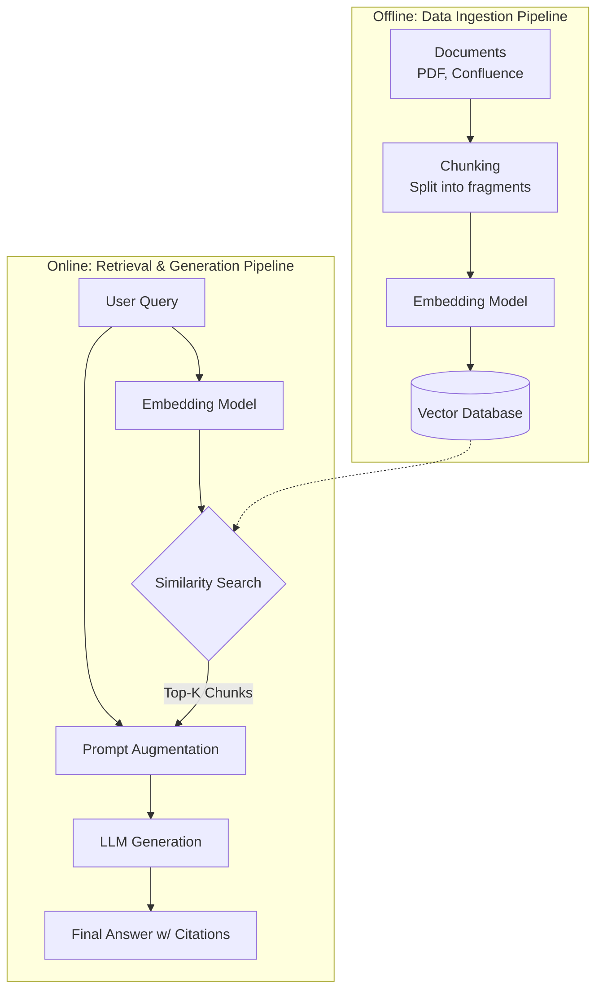

# Tạo lập Truy xuất Tăng cường - RAG (Retrieval-Augmented Generation)

## Summary

**Retrieval-Augmented Generation (RAG)** là một khuôn khổ kiến trúc AI kết hợp giữa khả năng sinh ngôn ngữ mạnh mẽ của Mô hình Ngôn ngữ Lớn (LLM) với một hệ thống truy xuất thông tin (Information Retrieval - thường là Vector Database). Thay vì dựa hoàn toàn vào kiến thức đã được huấn luyện (nằm trong trọng số của mô hình), RAG chủ động tìm kiếm các tài liệu thực tế, cập nhật từ một nguồn dữ liệu bên ngoài và cung cấp chúng làm ngữ cảnh (context) cho LLM để sinh ra câu trả lời chính xác, có căn cứ và giảm thiểu tối đa hiện tượng ảo giác (hallucination).

---

## Definition

Trong AI tạo sinh, **RAG** là phương pháp cung cấp "sách mở" (open-book) cho LLM. Quá trình bao gồm hai pha chính được gói gọn trong tên gọi:
1. **Retrieval (Truy xuất)**: Khi người dùng đặt câu hỏi, hệ thống sẽ truy vấn một kho dữ liệu nội bộ (ví dụ tài liệu nội bộ công ty, cơ sở dữ liệu kiến thức) để trích xuất ra các đoạn văn bản có chứa thông tin liên quan nhất.
2. **Augmented Generation (Tạo lập Tăng cường)**: Các đoạn văn bản này được nối (append) vào prompt ban đầu của người dùng như một phần ngữ cảnh. LLM sau đó đọc ngữ cảnh này và sinh ra (generate) câu trả lời cuối cùng dựa trên các sự thật (facts) vừa được cung cấp.

---

## Why it exists

LLMs (như GPT-4, Llama) tuy rất thông minh nhưng mắc phải 3 tử huyệt lớn khi ứng dụng vào môi trường doanh nghiệp:
1. **Ảo giác (Hallucination)**: LLM có xu hướng tự bịa ra thông tin nghe rất hợp lý và tự tin khi nó không biết câu trả lời thực sự.
2. **Kiến thức lỗi thời (Knowledge Cut-off)**: Mô hình bị đóng băng kiến thức tại thời điểm nó được huấn luyện xong. Nó không biết những sự kiện xảy ra vào ngày hôm qua.
3. **Không biết dữ liệu nội bộ (Private Data)**: Các LLM thương mại không được huấn luyện trên dữ liệu bảo mật nội bộ của công ty bạn (tài liệu tài chính, sổ tay nhân sự, mã nguồn riêng).

**Cách giải quyết truyền thống là Fine-tuning (Tinh chỉnh)**. Tuy nhiên Fine-tuning rất tốn kém, đòi hỏi tài nguyên tính toán cao, cần chuẩn bị dữ liệu gán nhãn phức tạp và không thể cập nhật liên tục hàng ngày. 

RAG ra đời như một giải pháp thay thế hoàn hảo: Nó cho phép "bơm" kiến thức mới, nội bộ vào mô hình ngay tại thời điểm truy vấn (inference time) một cách linh hoạt, rẻ tiền và có thể dẫn nguồn (citation) minh bạch.

---

## Core idea

Ý tưởng cốt lõi của RAG dựa trên nguyên lý tách biệt giữa **Bộ nhớ lý thuyết (Parametric Memory)** và **Bộ nhớ thực tế (Non-parametric Memory)**:
* *Parametric Memory*: Kỹ năng ngôn ngữ, ngữ pháp, tư duy logic, định dạng văn bản được mã hóa chặt chẽ trong các trọng số (weights) của LLM.
* *Non-parametric Memory*: Sự thật, số liệu, tài liệu, chính sách công ty được lưu trữ lỏng lẻo bên ngoài trong các cơ sở dữ liệu tìm kiếm (Vector Database, Elasticsearch) và có thể cập nhật, sửa xóa dễ dàng theo thời gian thực.

RAG hoạt động như một "thủ thư" tìm sách chứa thông tin liên quan, sau đó đưa cho "giáo sư" (LLM) để tổng hợp và trả lời một cách mạch lạc.

---

## How it works

Kiến trúc RAG tiêu chuẩn bao gồm hai luồng (pipelines) hoạt động song song:



### 1. Luồng Lập chỉ mục dữ liệu (Data Ingestion/Indexing Pipeline)
Chạy nền (offline) để chuẩn bị kho tri thức:
1. **Load**: Trích xuất dữ liệu từ nhiều nguồn (PDF, Confluence, Jira, Notion).
2. **Chunk/Split**: Cắt các tài liệu dài thành các đoạn nhỏ (chunks) có kích thước tối ưu (ví dụ 512 hoặc 1024 tokens) và có đoạn gối đầu (overlap) để giữ ngữ cảnh.
3. **Embed**: Chạy các chunks qua một Embedding Model để biến văn bản thành các vector đa chiều.
4. **Store**: Lưu trữ các vector và siêu dữ liệu (metadata như URL, tiêu đề tài liệu) vào Vector Database.

### 2. Luồng Truy vấn và Tạo lập (Retrieval & Generation Pipeline)
Chạy khi người dùng tương tác (online/real-time):
1. **Query Formulation**: Người dùng nhập câu hỏi (ví dụ: "Chính sách remote work mới nhất là gì?").
2. **Embed Query**: Câu hỏi được chuyển thành vector bằng chính Embedding Model ở trên.
3. **Retrieve**: Vector Database dùng phép tìm kiếm tương đồng (như Cosine Similarity) để lấy ra Top-K chunks liên quan nhất đến câu hỏi.
4. **Augment**: Chèn Top-K chunks này vào một System Prompt mẫu.
5. **Generate**: Gửi Prompt đã được "tăng cường" này cho LLM. LLM đọc tài liệu đính kèm và sinh ra phản hồi chính xác cuối cùng cho người dùng.

---

## Practical example

**Luồng hệ thống khi không có RAG:**
* **User**: "Dự án Alpha có doanh thu quý 3/2025 là bao nhiêu?"
* **LLM**: "Tôi là mô hình AI được huấn luyện tới năm 2024 nên không có thông tin này." (Hoặc tệ hơn là bịa ra một con số).

**Luồng hệ thống khi có RAG:**
1. Hệ thống tìm kiếm (Retrieve) trong Vector DB công ty bằng câu hỏi trên.
2. Vector DB trả về Chunk: `"Báo cáo tài chính nội bộ ngày 10/10/2025: Dự án Alpha đạt tổng doanh thu 4.5 triệu USD trong Quý 3, vượt chỉ tiêu 15%."`
3. Hệ thống cấu trúc prompt (Augment): 
```text
Bạn là một trợ lý ảo. Trả lời câu hỏi dựa TRÊN thông tin cung cấp dưới đây. Nếu không có thông tin, hãy nói "Tôi không biết".
<context>
Báo cáo tài chính nội bộ ngày 10/10/2025: Dự án Alpha đạt tổng doanh thu 4.5 triệu USD trong Quý 3, vượt chỉ tiêu 15%.
</context>
<question>Dự án Alpha có doanh thu quý 3/2025 là bao nhiêu?</question>
```
4. LLM trả lời (Generate): `"Theo báo cáo nội bộ ngày 10/10/2025, dự án Alpha đạt doanh thu 4.5 triệu USD trong Quý 3/2025."`

**Mã Python cơ bản mô phỏng luồng RAG bằng LangChain:**

```python
from langchain.vectorstores import Chroma
from langchain.embeddings import OpenAIEmbeddings
from langchain.llms import OpenAI
from langchain.chains import RetrievalQA

# 1. Khởi tạo kết nối tới Vector DB (nơi đã lưu sẵn tài liệu)
vector_db = Chroma(persist_directory="./chroma_db", embedding_function=OpenAIEmbeddings())

# 2. Khởi tạo LLM (Generator)
llm = OpenAI(temperature=0)

# 3. Kết hợp thành RAG Chain (Retrieval + Generation)
rag_chain = RetrievalQA.from_chain_type(
    llm=llm, 
    chain_type="stuff", # Nhét các chunks tìm được vào Prompt
    retriever=vector_db.as_retriever(search_kwargs={"k": 3}) # Lấy Top-3 tài liệu
)

# 4. Trả lời câu hỏi
answer = rag_chain.run("Dự án Alpha có doanh thu quý 3/2025 là bao nhiêu?")
print(answer)
```

---

## Best practices

* **Chiến lược Chunking khôn ngoan**: Không cắt chuỗi văn bản một cách ngẫu nhiên. Cố gắng cắt theo ngữ nghĩa (Semantic Chunking) hoặc cấu trúc tài liệu (Header, Paragraph) để đảm bảo một chunk chứa trọn vẹn một ý tưởng mạch lạc. Giữ phần gối đầu (overlap) khoảng 10-15%.
* **Kiểm soát chất lượng dữ liệu đầu vào**: RAG tuân theo quy tắc "Garbage in, garbage out". Tài liệu được lưu vào Vector DB phải được làm sạch, loại bỏ các ký tự rác, format HTML thừa để Embedding model hoạt động chính xác.
* **Luôn yêu cầu dẫn nguồn (Citation)**: Thiết kế prompt buộc LLM phải trích dẫn tên tài liệu hoặc đường link của chunk mà nó sử dụng để sinh câu trả lời. Điều này giúp tăng độ tin cậy và minh bạch.
* **Sử dụng Re-ranking (Xếp hạng lại)**: Ở kiến trúc RAG nâng cao, Vector DB thường lấy dư ra (ví dụ Top 20), sau đó dùng một mô hình Cross-Encoder (như Cohere Rerank) để chấm điểm và sắp xếp lại sự liên quan ngữ nghĩa tinh tế hơn trước khi chỉ lấy Top 5 gửi cho LLM.

---

## Common mistakes

* **Quá tin tưởng vào Semantic Search độc lập**: Chỉ dùng Vector Database thường không giải quyết được các câu hỏi tìm kiếm từ khóa cụ thể (tên người, mã nhân viên). Rất nên dùng Hybrid Search (kết hợp Vector Search và Keyword Search).
* **Nhồi nhét quá nhiều Context (Context Stuffing)**: Đưa 50 chunks vào prompt vì nghĩ "càng nhiều thông tin càng tốt". Điều này làm LLM bị nhiễu (Lost in the middle phenomenon), giảm khả năng suy luận, tăng chi phí API và chậm độ trễ.
* **Bỏ qua quản lý phân quyền (Access Control)**: Các chunk dữ liệu nằm trong Vector DB mang tính bảo mật. Nếu không gắn metadata phân quyền cẩn thận, hệ thống có thể truy xuất báo cáo lương của CEO trả lời cho câu hỏi của một nhân viên cấp thấp.

---

## Trade-offs

### Ưu điểm
* **Tránh Ảo giác (Mitigate Hallucination)**: Đảm bảo tính chính xác và bám sát vào kho tài liệu tổ chức.
* **Chi phí thấp, triển khai nhanh**: Rẻ hơn rất nhiều so với Fine-tuning LLM do chỉ tốn phí API embedding và tiền lưu trữ Vector DB.
* **Cập nhật tri thức thời gian thực**: Chỉ cần xóa/thêm tài liệu trong cơ sở dữ liệu là hệ thống ngay lập tức học được thông tin mới mà không cần train lại model.

### Nhược điểm
* **Độ trễ tăng cao (Latency)**: Phải tốn thời gian cho việc Embed câu hỏi -> Truy vấn DB mạng -> Gửi qua LLM. Tổng thời gian sinh câu trả lời chậm hơn việc hỏi LLM trực tiếp.
* **Sự phức tạp của Pipeline**: Yêu cầu vận hành nhiều hệ thống song song: Data Pipelines, Vector Store, Embedding models, LLMs. 
* **Phụ thuộc mạnh vào Retrieval**: Nếu Vector DB tìm sai tài liệu liên quan ở bước 1, bước 2 chắc chắn LLM sẽ trả lời sai (bất kể LLM thông minh đến đâu).

---

## When to use

* Xây dựng các chatbot nội bộ, trợ lý ảo hỗ trợ khách hàng dựa trên tài liệu (Tài liệu kỹ thuật, chính sách công ty).
* Phân tích và tóm tắt kho tài liệu khổng lồ nơi kiến thức thay đổi liên tục.
* Bất kỳ bài toán GenAI nào đặt tiêu chí "sự thật chính xác tuyệt đối" và "có nguồn gốc rõ ràng" lên hàng đầu.

## When not to use

* Khi bài toán chủ yếu yêu cầu LLM thay đổi văn phong (style transfer), viết code, sáng tạo nội dung giải trí mà không cần kiến thức miền cụ thể (Domain-specific knowledge).
* Cần LLM tự động học một định dạng output (schema) cực kỳ phức tạp hoặc ngôn ngữ riêng biệt (Fine-tuning phù hợp hơn RAG trong trường hợp này).

---

## Related concepts

* [Cơ sở dữ liệu Vector (Vector Database)](/concepts/vector-database)
* [Tìm kiếm kết hợp (Hybrid Search)](/concepts/hybrid-search)
* [Ảo giác LLM (Hallucination)](/concepts/hallucination)
* [Large Language Model (LLM)](/concepts/llm)

---

## Interview questions

### 1. RAG giải quyết được vấn đề gì mà Fine-tuning LLM không giải quyết được (hoặc làm rất kém)?
* **Người phỏng vấn muốn kiểm tra**: Khả năng phân biệt và lựa chọn kiến trúc GenAI phù hợp với bài toán doanh nghiệp.
* **Gợi ý trả lời (Strong Answer)**: 
  * (1) *Cập nhật thời gian thực*: Tri thức công ty thay đổi mỗi ngày (ví dụ giá cổ phiếu). Với Fine-tuning, bạn phải retrain tốn hàng tuần. Với RAG, bạn chỉ cần upsert tài liệu vào Vector DB mất vài mili-giây.
  * (2) *Khả năng dẫn nguồn (Citation)*: Fine-tuning trộn lẫn kiến thức vào các trọng số tham số (weights), LLM không thể chỉ ra chính xác nó học thông tin đó từ tài liệu cụ thể nào. RAG chèn văn bản rõ ràng vào prompt, dễ dàng truy vết và chứng minh độ tin cậy.
  * (3) *Phân quyền (RBAC)*: Với RAG, ta có thể lọc metadata ở bước Retrieval dựa theo user ID, đảm bảo ai có quyền mới được xem tài liệu. Một mô hình Fine-tuned không có khái niệm phân quyền bộ nhớ nội tại.

### 2. Hiện tượng "Lost in the middle" (Lạc lối giữa dòng) trong hệ thống RAG là gì và cách khắc phục?
* **Người phỏng vấn muốn kiểm tra**: Kiến thức chuyên sâu về hành vi của LLM khi xử lý RAG prompt dài.
* **Gợi ý trả lời (Strong Answer)**: 
  * Các nghiên cứu chỉ ra rằng khi LLM nhận một chuỗi context rất dài (từ việc gộp quá nhiều retrieved chunks), nó thường chỉ chú ý tốt tới thông tin nằm ở *đầu* hoặc *cuối* prompt, và "quên" hoặc suy luận kém đối với thông tin nằm ở *giữa*.
  * *Cách khắc phục*: (1) Chỉ lấy số lượng Top-K chunk nhỏ nhưng chất lượng (Top 3-5 thay vì Top 20); (2) Sử dụng Re-ranking để đẩy các tài liệu quan trọng nhất lên sát đầu hoặc sát cuối ngữ cảnh thay vì xếp ở giữa; (3) Cải thiện Embedding model để tìm kiếm chính xác, giảm thiểu chunk rác (noise) độn vào prompt.

### 3. Bạn sẽ thiết kế một luồng RAG như thế nào để xử lý các câu hỏi "Follow-up" (Câu hỏi nối tiếp có sử dụng đại từ)?
* **Người phỏng vấn muốn kiểm tra**: Kỹ năng xây dựng hệ thống Conversational AI (có bộ nhớ hội thoại).
* **Gợi ý trả lời (Strong Answer)**: Nếu người dùng hỏi "CEO của công ty X là ai?" (câu 1) rồi hỏi tiếp "Ông ấy bao nhiêu tuổi?" (câu 2), từ "Ông ấy" trong câu 2 nếu đem đi embed sẽ không tìm được tài liệu nào trong Vector DB. Giải pháp là thêm bước **Query Reformulation (Định hình lại truy vấn)**: Sử dụng một LLM phụ (nhỏ và nhanh) đọc lịch sử chat (câu 1) và viết lại câu 2 thành một câu truy vấn độc lập hoàn chỉnh: *"CEO của công ty X bao nhiêu tuổi?"*. Sau đó mới lấy câu truy vấn đã viết lại này đem đi vector hóa và tìm kiếm trong Vector DB.

---

## References

1. **"Retrieval-Augmented Generation for Knowledge-Intensive NLP Tasks"** - Lewis et al. (Facebook AI Research, 2020) (Nghiên cứu học thuật đặt nền móng và tên gọi cho khái niệm RAG).
2. **LangChain Documentation** (Tài liệu về RAG workflow, Chunking Strategies và Retrievers trong thực tiễn).
3. **LlamaIndex Documentation** (Thư viện hàng đầu tập trung vào cấu trúc dữ liệu và data ingestion cho RAG).

---

## English summary

**Retrieval-Augmented Generation (RAG)** is an AI architectural framework that improves the quality and factual accuracy of Large Language Models (LLMs) by grounding their responses in external, domain-specific knowledge bases. It mitigates inherent LLM issues like hallucinations and outdated training data by executing a two-step process: First, the system **retrieves** relevant document chunks from a Vector Database using semantic search based on the user's query. Second, it **augments** the prompt with this retrieved context and passes it to the LLM to **generate** an informed, verifiable response. RAG is highly cost-effective, supports dynamic knowledge updates, and enables enterprise-grade data privacy and access control without the need for expensive model fine-tuning.
