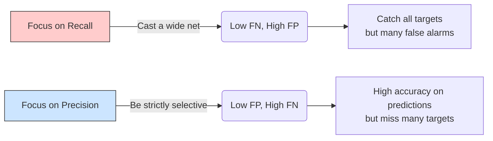

# Độ phủ - Recall trong Máy học

## Summary

Recall (Độ phủ), hay còn gọi là Độ nhạy (Sensitivity) hoặc True Positive Rate (TPR), là một thước đo đánh giá hiệu năng (metric) phổ biến trong các bài toán Phân loại (Classification) và Truy xuất thông tin (Information Retrieval). Recall đo lường tỷ lệ các trường hợp "Đúng" (Positive) thực tế đã được mô hình nhận diện thành công so với tổng số trường hợp "Đúng" tồn tại trong tập dữ liệu. Recall trả lời cho câu hỏi: *"Trong tất cả các trường hợp thực sự là mục tiêu, mô hình đã tìm ra được bao nhiêu phần trăm?"*

---

## Definition

Về mặt toán học, **Recall** được tính bằng công thức:

$$Recall = \frac{True Positives (TP)}{True Positives (TP) + False Negatives (FN)}$$

Trong đó:
* **True Positives (TP - Điểm dương thật)**: Số lượng mẫu thực sự là Positive và mô hình cũng dự đoán đúng là Positive.
* **False Negatives (FN - Điểm âm giả)**: Số lượng mẫu thực sự là Positive nhưng mô hình lại bỏ sót và dự đoán sai thành Negative.

Tổng $(TP + FN)$ chính là toàn bộ số lượng nhãn Positive thực tế có trong tập dữ liệu (Ground Truth Positives).

Trong bối cảnh Hệ thống Truy xuất Thông tin (Information Retrieval / Search Engines) hay RAG (Retrieval-Augmented Generation), Recall được định nghĩa là tỷ lệ số lượng tài liệu liên quan (relevant documents) mà hệ thống truy xuất được trên tổng số tất cả tài liệu liên quan có trong cơ sở dữ liệu.

---

## Why it exists

Độ chính xác tổng thể (Accuracy) thường xuyên bị đánh lừa trong các bộ dữ liệu mất cân bằng (Imbalanced Datasets). Ví dụ: Nếu một hệ thống phát hiện gian lận thẻ tín dụng có 99% giao dịch bình thường và 1% giao dịch gian lận. Mô hình ngu ngốc cứ dự đoán mọi giao dịch là "Bình thường" sẽ đạt Accuracy 99%, nhưng hoàn toàn vô dụng vì nó bỏ lọt 100% giao dịch gian lận.

Recall tồn tại để đánh giá năng lực **"Không bỏ sót"** của mô hình. Trong các bài toán rủi ro cao (y tế, an ninh, tài chính), việc bỏ lọt một ca bệnh ung thư (False Negative) nguy hiểm hơn rất nhiều so với việc chẩn đoán nhầm người khỏe thành người bệnh (False Positive). Recall sinh ra để đặt trọng tâm tối ưu hóa vào việc bắt giữ trọn vẹn lớp Positive.

---

## Core idea

Ý tưởng cốt lõi của Recall xoay quanh việc giảm thiểu **False Negatives (FN)**.
* FN càng thấp $\rightarrow$ Recall càng cao.
* Recall đạt 100% (hoặc 1.0) nghĩa là mô hình không bỏ sót bất kỳ trường hợp Positive nào (Tuy nhiên điều này thường dẫn đến hệ lụy là bắt nhầm rất nhiều trường hợp Negative).

Sự cân bằng (Trade-off): Bạn luôn có thể đạt Recall 100% bằng một cách cực đoan là "Dự đoán mọi thứ đều là Positive". Ví dụ: Chuông báo cháy lúc nào cũng kêu, chắc chắn sẽ không bỏ sót vụ cháy nào. Nhưng lúc này, Precision (Độ chuẩn xác) sẽ sụt giảm thê thảm.

---

## How it works (Ví dụ thực tế)

**Kịch bản 1: Phân loại email Spam**
Giả sử hộp thư của bạn có tổng cộng 10 email Spam (TP + FN = 10).
Bộ lọc của bạn đánh dấu 7 email là Spam. 
Trong 7 email đó, có 5 email thực sự là Spam (TP = 5), 2 email là thư công việc bị bắt nhầm (FP = 2).
Số email Spam bị lọt lưới (chui vào hòm thư chính) là 5 (FN = 5).
* $Recall = \frac{5}{5 + 5} = 0.5$ (50%)
* Nhận xét: Bộ lọc bắt được một nửa số thư rác.

**Kịch bản 2: Truy xuất tài liệu cho RAG (Vector Search)**
Người dùng hỏi "Chính sách nghỉ phép của công ty". Trong cơ sở dữ liệu có 4 tài liệu liên quan (Ground Truth).
Mô hình Vector Search trả về Top 5 tài liệu, trong đó có 3 tài liệu thực sự liên quan, 2 tài liệu nói về chuyện khác.
1 tài liệu liên quan đã bị bỏ sót (nằm ở top 20 nên không được lấy).
* $Recall = \frac{3}{4} = 0.75$ (75%)
* $Precision = \frac{3}{5} = 0.60$ (60%)

---

## Best practices

* **Đo lường kết hợp (F1-Score)**: Không bao giờ đánh giá mô hình chỉ bằng Recall. Luôn xem xét song song với Precision thông qua chỉ số F1-Score (Trung bình điều hòa của Precision và Recall) để có cái nhìn toàn diện: $F1 = 2 \times \frac{Precision \times Recall}{Precision + Recall}$
* **Sử dụng ROC Curve và Precision-Recall (PR) Curve**: Thay vì cố định ngưỡng phân loại (threshold) mặc định là 0.5, hãy vẽ biểu đồ PR Curve để tìm ra ngưỡng tối ưu nhất thỏa mãn yêu cầu nghiệp vụ giữa Recall và Precision.
* **Recall@K trong Search**: Trong các hệ thống truy xuất (như Elasticsearch, Vector Database), hãy đo lường Recall@K (ví dụ Recall@10). Tức là tỷ lệ tài liệu liên quan nằm trong top K kết quả trả về đầu tiên, vì người dùng hiếm khi lướt xem quá trang đầu tiên.

---

## Trade-offs (Precision vs Recall)

Đây là sự đánh đổi kinh điển nhất trong Machine Learning:

* **Tăng Recall, Giảm Precision**: Mô hình trở nên "thoáng" hơn, dễ dàng gắn nhãn Positive. Kết quả: Không bỏ sót mục tiêu, nhưng bắt nhầm rất nhiều "người vô tội" (False Positives tăng).
* **Tăng Precision, Giảm Recall**: Mô hình trở nên "khắt khe" và bảo thủ. Chỉ khi cực kỳ chắc chắn mới gắn nhãn Positive. Kết quả: Dự đoán lần nào trúng lần đó (ít False Positives), nhưng bỏ lọt rất nhiều mục tiêu thật (False Negatives tăng, Recall giảm).

---

## When to use

Nên tối ưu hóa mô hình tập trung vào Recall (chấp nhận hy sinh Precision) trong các bài toán mà **chi phí của việc BỎ SÓT lớn hơn rất nhiều so với chi phí BÁT NHẦM**:
* **Y tế**: Tầm soát ung thư. Bắt nhầm người khỏe đi xét nghiệm lại (tốn tiền) còn hơn bỏ sót người bệnh ung thư (mất mạng).
* **An ninh mạng**: Phát hiện mã độc, xâm nhập hệ thống.
* **An toàn xe tự lái**: Nhận diện vật cản. Thà phanh gấp nhầm bóng cây còn hơn đâm vào người đi đường.
* **Hệ thống RAG (Giai đoạn Retrieval)**: Bắt buộc phải có Recall cao để lấy đủ ngữ cảnh (context) đưa vào cho LLM, việc có lẫn một chút thông tin nhiễu (low precision) LLM có thể tự chắt lọc được.

## When not to use

Không nên dùng Recall làm chỉ số mục tiêu khi hậu quả của việc **BẮT NHẦM (False Positive) gây ra sự khó chịu hoặc rủi ro nghiêm trọng**:
* **Hệ thống đề xuất (Recommender Systems)**: Nếu gợi ý sai phim cho người xem quá nhiều lần (Precision thấp), họ sẽ hủy đăng ký Netflix.
* **Hệ thống xét xử hình sự tự động**: Thà bỏ lọt tội phạm còn hơn kết án nhầm người vô tội (Yêu cầu Precision phải tuyệt đối).

---

## Related concepts

* [Vector Database](/concepts/vector-store)
* [Reranking](/concepts/reranking)
* [Chunking Strategy](/concepts/chunking-strategy)

---

## Interview questions

### 1. Hãy giải thích tình huống nào nên tối ưu Recall và tình huống nào nên tối ưu Precision?
* **Người phỏng vấn muốn kiểm tra**: Tư duy giải quyết bài toán nghiệp vụ kinh doanh, hiểu ý nghĩa thực tế của metrics thay vì học thuộc lòng công thức.
* **Gợi ý trả lời (Strong Answer)**:
  * Tối ưu Recall khi rủi ro (chi phí) của False Negative (bỏ sót) là không thể chấp nhận được. Ví dụ: Chẩn đoán y tế, phát hiện khủng bố, hệ thống phanh khẩn cấp. Lúc này ta thà báo động nhầm (FP) còn hơn bỏ lọt (FN).
  * Tối ưu Precision khi rủi ro của False Positive (bắt nhầm) cao và làm hỏng trải nghiệm người dùng hoặc lãng phí tiền bạc lớn. Ví dụ: Bộ lọc Spam email (nhét nhầm email sếp vào thùng rác là thảm họa), Hệ thống gợi ý sản phẩm mua sắm.

### 2. Làm thế nào để tăng Recall trong một hệ thống Vector Retrieval cho ứng dụng RAG?
* **Người phỏng vấn muốn kiểm tra**: Kiến thức kỹ thuật chuyên môn về RAG pipeline.
* **Gợi ý trả lời (Strong Answer)**:
  * Tăng giá trị $K$ (số lượng kết quả trả về). Ví dụ lấy Top-20 thay vì Top-5.
  * Sử dụng Hybrid Search: Kết hợp Vector Search (Semantic) và Keyword Search (BM25/Lexical) để bù trừ điểm yếu của nhau, đảm bảo tài liệu chứa từ khóa chính xác không bị rớt.
  * Tối ưu hóa Chunking Strategy: Đảm bảo văn bản được chia cắt với kích thước và độ chồng lấp (overlap) phù hợp để không làm vỡ ngữ nghĩa.
  * Sử dụng các Embedding Model mạnh hơn, hỗ trợ đa ngôn ngữ nếu dữ liệu có tiếng Việt.

### 3. F1-Score là gì và tại sao lại dùng trung bình điều hòa (Harmonic Mean) thay vì trung bình cộng (Arithmetic Mean) của Precision và Recall?
* **Người phỏng vấn muốn kiểm tra**: Kiến thức toán học căn bản trong ML metrics.
* **Gợi ý trả lời (Strong Answer)**:
  * F1-Score cân bằng giữa Precision và Recall. 
  * Dùng Harmonic Mean vì nó sẽ trừng phạt rất nặng các trường hợp cực đoan. Nếu dùng trung bình cộng, một mô hình dự đoán mọi thứ là Positive (Recall = 1.0, Precision = 0.01) sẽ có điểm trung bình là 0.505 (nghe có vẻ không tệ). Nhưng với trung bình điều hòa, điểm F1 sẽ kéo tụt xuống gần 0.02. Harmonic mean chỉ cao khi CẢ HAI chỉ số Precision và Recall đều đồng đều ở mức cao.

---

## English summary

Recall, also known as Sensitivity or True Positive Rate, is a performance metric used in classification and information retrieval systems. It measures the proportion of actual positive cases that the model successfully identified ($TP / (TP + FN)$). Recall is critically important in risk-averse scenarios, such as medical diagnostics or anomaly detection, where the cost of a False Negative (missing a target) is vastly higher than a False Positive (false alarm). In search and Retrieval-Augmented Generation (RAG) contexts, Recall indicates how comprehensively the system retrieved relevant documents from the database. It is typically evaluated alongside Precision using the F1-Score or plotted on a Precision-Recall curve to determine the optimal operational threshold.
