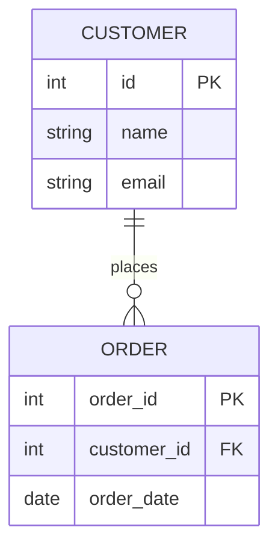

# Cơ sở Dữ liệu Quan hệ - Relational Database

## Summary

Cơ sở dữ liệu quan hệ (Relational Database - RDBMS) là một loại cơ sở dữ liệu lưu trữ và cung cấp quyền truy cập vào các điểm dữ liệu có liên quan chặt chẽ với nhau. Dữ liệu được tổ chức thành các bảng (tables) bao gồm các cột (columns) và dòng (rows). RDBMS sử dụng SQL (Structured Query Language) làm ngôn ngữ truy vấn tiêu chuẩn và nổi tiếng với việc đảm bảo tính toàn vẹn dữ liệu thông qua các thuộc tính ACID.

---

## Definition

**Relational Database (Cơ sở dữ liệu quan hệ)** dựa trên "mô hình quan hệ" (relational model) do Edgar F. Codd đề xuất năm 1970. Trong mô hình này:
* Dữ liệu được tổ chức dưới dạng bảng (Tables / Relations).
* Mỗi bảng có các cột (Columns / Attributes) đại diện cho một loại dữ liệu cụ thể (ví dụ: Tên, Tuổi).
* Mỗi dòng (Row / Tuple) đại diện cho một bản ghi dữ liệu riêng biệt.
* Các bảng được liên kết với nhau thông qua các **Khóa chính (Primary Key)** và **Khóa ngoại (Foreign Key)**.

Các hệ quản trị CSDL quan hệ phổ biến nhất: MySQL, PostgreSQL, Oracle Database, Microsoft SQL Server.

---

## Why it exists

Trước khi RDBMS ra đời, dữ liệu thường được lưu trữ trong các cấu trúc cây (Hierarchical databases) hoặc mạng lưới (Network databases), gây khó khăn cực độ khi muốn thêm loại dữ liệu mới hoặc truy vấn các mối quan hệ phức tạp.

RDBMS ra đời để giải quyết 3 vấn đề:
1. **Tính độc lập của dữ liệu**: Tách biệt cách dữ liệu được lưu trữ vật lý trên đĩa cứng và cách nó được biểu diễn logic cho người dùng.
2. **Sự trùng lặp dữ liệu (Data Redundancy)**: Bằng cách chuẩn hóa dữ liệu (Normalization) và dùng Khóa ngoại, RDBMS loại bỏ việc lưu trữ lặp đi lặp lại cùng một thông tin (ví dụ: tên khách hàng không cần lưu đi lưu lại trên mỗi đơn hàng).
3. **Tính toàn vẹn (Integrity)**: Đảm bảo dữ liệu không bị sai lệch khi có nhiều người dùng cùng lúc truy cập và sửa đổi.

---

## Core idea

**1. Khóa (Keys)**
* **Primary Key (Khóa chính)**: Định danh duy nhất cho mỗi dòng trong bảng (ví dụ: `student_id`).
* **Foreign Key (Khóa ngoại)**: Một cột trong bảng này trỏ đến Khóa chính của bảng khác, tạo ra "mối quan hệ" (Relationship).

**2. Tính chất ACID**
Đây là linh hồn của RDBMS, đảm bảo các giao dịch (Transactions) luôn an toàn:
* **A - Atomicity (Tính nguyên tử)**: Giao dịch hoặc là thành công toàn bộ, hoặc thất bại toàn bộ. Không có trạng thái lửng lơ. (Ví dụ: Chuyển tiền từ tài khoản A sang B, nếu A đã trừ tiền nhưng B lỗi chưa cộng, giao dịch phải Rollback).
* **C - Consistency (Tính nhất quán)**: Dữ liệu trước và sau giao dịch phải tuân thủ mọi quy tắc ràng buộc (Constraints) đã định nghĩa.
* **I - Isolation (Tính cô lập)**: Các giao dịch chạy đồng thời không được can thiệp vào kết quả của nhau.
* **D - Durability (Tính bền vững)**: Một khi giao dịch đã được xác nhận (Committed), dữ liệu sẽ được lưu vĩnh viễn dù hệ thống có mất điện.

---

## How it works

Khi bạn thực thi một câu lệnh SQL (ví dụ: `SELECT` hoặc `INSERT`):
1. **Parser (Trình phân tích cú pháp)**: Kiểm tra xem câu lệnh SQL có đúng ngữ pháp không.
2. **Query Optimizer (Trình tối ưu hóa)**: RDBMS sẽ tính toán hàng chục chiến lược thực thi khác nhau (quét bảng hay dùng index) và chọn ra cách nhanh nhất.
3. **Execution Engine**: Thực hiện việc đọc/ghi vật lý xuống ổ đĩa, có thể sử dụng bộ đệm (Buffer Pool/Cache) trong RAM để tăng tốc.
4. **Transaction Manager & Lock Manager**: Đảm bảo tính ACID, khóa (lock) các dòng dữ liệu đang bị sửa đổi để tránh xung đột với người dùng khác.

---

## Architecture / Flow



*Sơ đồ Thực thể - Liên kết (ERD) cơ bản minh họa mối quan hệ 1-Nhiều giữa Khách hàng và Đơn hàng.*

---

## Practical example

Ví dụ về việc tạo bảng và thiết lập mối quan hệ:

```sql
-- Tạo bảng Khách hàng
CREATE TABLE Customers (
    CustomerID INT PRIMARY KEY AUTO_INCREMENT,
    Name VARCHAR(100) NOT NULL,
    Email VARCHAR(100) UNIQUE
);

-- Tạo bảng Đơn hàng, liên kết với Khách hàng bằng Foreign Key
CREATE TABLE Orders (
    OrderID INT PRIMARY KEY AUTO_INCREMENT,
    OrderDate DATE,
    CustomerID INT,
    TotalAmount DECIMAL(10, 2),
    FOREIGN KEY (CustomerID) REFERENCES Customers(CustomerID)
);

-- Thêm dữ liệu (Transaction)
BEGIN TRANSACTION;
INSERT INTO Customers (Name, Email) VALUES ('Nguyen Van A', 'a@example.com');
-- Lấy CustomerID vừa tạo để gán vào Order
INSERT INTO Orders (OrderDate, CustomerID, TotalAmount) VALUES ('2026-06-07', 1, 500.00);
COMMIT;
```

---

## Best practices

* **Chuẩn hóa (Normalization)**: Thiết kế bảng ở dạng chuẩn (thường là 3NF) để loại bỏ dữ liệu dư thừa và tránh lỗi khi cập nhật (Update anomalies).
* **Đánh chỉ mục (Indexing)**: Luôn tạo Index cho các cột thường xuyên được dùng trong mệnh đề `WHERE` hoặc `JOIN` để tăng tốc độ đọc.
* **Sử dụng Constraints**: Tận dụng `NOT NULL`, `UNIQUE`, `CHECK` để đẩy trách nhiệm kiểm tra tính hợp lệ của dữ liệu xuống thẳng tầng Database, thay vì chỉ dựa vào code ứng dụng.

---

## Common mistakes

* **Quên đánh Index**: Khi dữ liệu lớn lên, câu lệnh `SELECT` không có index sẽ phải quét toàn bộ bảng (Full Table Scan), làm sập CPU của server.
* **Lưu file nhị phân lớn (BLOB)**: Lưu trực tiếp hình ảnh, video vào RDBMS là một thực hành tồi. Nên lưu trên S3 và chỉ lưu chuỗi đường dẫn (URL) trong Database.
* **Dùng SELECT ***: Trong production code, việc dùng `SELECT *` thay vì liệt kê đích danh các cột (ví dụ: `SELECT id, name`) sẽ gây lãng phí RAM và băng thông mạng không cần thiết.

---

## Trade-offs

### Ưu điểm
* Tính toàn vẹn dữ liệu tuyệt đối nhờ ACID. Rất khó để xảy ra tình trạng "rác" dữ liệu nếu thiết kế đúng.
* SQL là một ngôn ngữ biểu đạt cực kỳ mạnh mẽ, có thể giải quyết các truy vấn quan hệ siêu phức tạp (JOIN nhiều bảng).

### Nhược điểm
* **Khó mở rộng ngang (Horizontal Scaling)**: RDBMS được thiết kế tối ưu nhất khi chạy trên 1 máy chủ duy nhất (Scale Up). Việc chia nhỏ dữ liệu ra nhiều máy (Sharding) rất phức tạp.
* Thiếu linh hoạt: Nếu muốn thêm một cột mới vào bảng có hàng tỷ dòng, hệ thống có thể bị treo cứng trong quá trình `ALTER TABLE`.

---

## When to use

* Hệ thống tài chính, ngân hàng, thương mại điện tử cần tính nhất quán tuyệt đối của giao dịch.
* Ứng dụng mà cấu trúc dữ liệu đã được xác định rõ ràng, ít bị thay đổi.

## When not to use

* Khi dữ liệu hoàn toàn không có cấu trúc cố định (ví dụ: User profile với hàng trăm trường thông tin tùy biến của từng người dùng) -> Nên dùng NoSQL (MongoDB).
* Khi cần lưu trữ lượng dữ liệu khổng lồ (hàng Petabytes) phục vụ Machine Learning -> Nên dùng Data Lake.

---

## Related concepts

* [OLTP](/concepts/oltp)
* [Indexing](/concepts/indexing)
* [Data Warehouse](/concepts/data-warehouse) (Một biến thể của RDBMS dành cho phân tích)

---

## Interview questions

### 1. Giải thích tính chất ACID trong cơ sở dữ liệu quan hệ.
* **Gợi ý trả lời**: 
  * Atomicity: Giao dịch là một đơn vị không thể chia cắt (All or Nothing).
  * Consistency: Dữ liệu luôn hợp lệ theo các rules đặt ra.
  * Isolation: Mọi giao dịch độc lập, không nhìn thấy trạng thái tạm thời của nhau.
  * Durability: Dữ liệu đã commit thì sẽ an toàn dù server crash.
Đây là nền tảng giúp RDBMS được chọn cho các hệ thống ngân hàng.

### 2. Sự khác biệt giữa DELETE và TRUNCATE là gì?
* **Gợi ý trả lời**: 
  * `DELETE`: Xóa từng dòng, có ghi vào transaction log, có thể ROLLBACK được, và sẽ trigger các event (nếu có). Chạy chậm trên bảng lớn.
  * `TRUNCATE`: Là một lệnh DDL (Data Definition Language). Nó giải phóng trực tiếp các trang dữ liệu vật lý (data pages) của bảng. Không ghi log chi tiết, chạy cực kỳ nhanh, và thường không thể ROLLBACK.

---

## References

1. **Designing Data-Intensive Applications** - Martin Kleppmann (Chương 2: Data Models and Query Languages).
2. **Database System Concepts** - Abraham Silberschatz.

---

## English summary

A Relational Database (RDBMS) organizes data into tables with predefined columns and rows, establishing links (relationships) between them using Primary and Foreign keys. It uses SQL for querying and managing data. The defining characteristic of an RDBMS is its strict adherence to ACID properties (Atomicity, Consistency, Isolation, Durability), ensuring absolute data integrity and reliability for transactional systems. While highly structured and secure, it can be challenging to scale horizontally compared to NoSQL databases.
