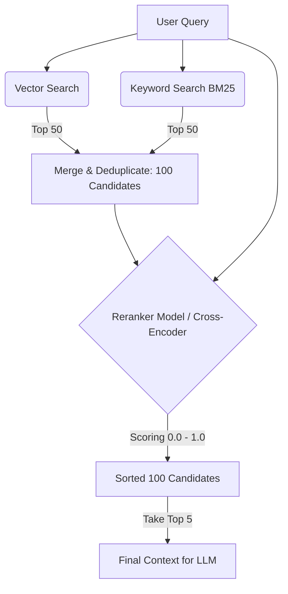

# Tái sắp xếp kết quả - Reranking

## Summary

Reranking (Tái sắp xếp kết quả) là giai đoạn thứ hai trong các hệ thống Truy xuất thông tin (Information Retrieval) hiện đại, đặc biệt là trong kiến trúc RAG (Retrieval-Augmented Generation). Sau khi giai đoạn một (Retrieval) truy xuất ra một tập hợp lớn các tài liệu có khả năng liên quan với tốc độ nhanh, Reranking sử dụng một mô hình trí tuệ nhân tạo (Reranker) chậm hơn nhưng thông minh hơn để chấm điểm và sắp xếp lại tập hợp này, đẩy các tài liệu thực sự liên quan nhất lên trên cùng. 

---

## Definition

**Reranking** là kỹ thuật cải thiện thứ hạng (ranking) của một danh sách tài liệu ứng viên. 

Thay vì tin tưởng hoàn toàn vào điểm số của hệ thống Vector Database (Cosine Similarity) hay Keyword Search (BM25) trả về ban đầu, Reranking lấy Top-K (ví dụ: 100 tài liệu) từ các hệ thống trên, truyền toàn bộ cặp `(Câu hỏi, Tài liệu)` vào một mô hình Học sâu (Deep Learning) chuyên biệt để tính toán lại điểm liên quan (Relevance Score) một cách chính xác tuyệt đối, sau đó sắp xếp giảm dần và chỉ giữ lại Top-N (ví dụ: 5 tài liệu) để hiển thị cho người dùng hoặc đưa vào LLM.

---

## Why it exists

Hệ thống tìm kiếm luôn phải đối mặt với bài toán đánh đổi giữa **Tốc độ (Speed)** và **Độ chính xác sâu (Deep Semantic Precision)**.

* Nếu dùng mô hình cực kỳ thông minh để đọc từng tài liệu trong số 1 tỷ tài liệu và so sánh với câu hỏi, bạn sẽ mất vài ngày để có kết quả tìm kiếm.
* Nếu dùng Vector Database (Bi-Encoder) hoặc BM25, bạn có kết quả trong 10ms, nhưng các hệ thống này "nhìn" văn bản rất nông. Chúng có thể trả về các tài liệu chứa từ khóa đúng, hoặc có vector gần giống, nhưng ngữ cảnh thực sự bị sai lệch. 

Reranking ra đời như một **bước lọc tinh**. Nó giải quyết vấn đề này bằng mô hình **Retrieval 2 giai đoạn (Two-stage Retrieval)**:
* *Giai đoạn 1 (Lọc thô)*: Dùng Vector DB lấy nhanh 100 tài liệu (Recall cao).
* *Giai đoạn 2 (Lọc tinh)*: Dùng Reranking đọc kỹ 100 tài liệu đó để sắp xếp lại (Precision cao). Vì chỉ đọc 100 tài liệu, tốc độ vẫn đảm bảo dưới 100ms.

---

## Core idea

Cốt lõi của Reranking là sự dịch chuyển từ việc so sánh khoảng cách hình học đơn thuần (Vector Distance) sang so sánh mức độ giao thoa ngữ nghĩa (Semantic Attention).

Trong giai đoạn 1, câu hỏi và tài liệu không bao giờ "nhìn thấy" nhau cho đến khi thành vector (Bi-encoder). 
Trong giai đoạn Reranking, câu hỏi và tài liệu được nối lại với nhau và đưa vào cùng một mạng Nơ-ron (Cross-encoder). Các từ trong câu hỏi có thể trực tiếp "tương tác" (attention) với các từ trong tài liệu, giúp mô hình hiểu được chính xác rằng "Apple" trong câu hỏi đang nói về công ty công nghệ chứ không phải quả táo, từ đó cho điểm Relevance cao.

---

## How it works

Quy trình hoạt động của hệ thống RAG có Reranking:

1. **User Query**: Người dùng hỏi "Làm sao để cấu hình VPN?".
2. **First-stage Retrieval**: 
   * Vector Search lấy 50 tài liệu.
   * Keyword Search (BM25) lấy 50 tài liệu.
   * Gom lại thành tập hợp 100 tài liệu ứng viên (Candidate pool).
3. **Reranking**:
   * Hệ thống gọi API của mô hình Reranker (ví dụ: `Cohere Rerank`, `BGE-Reranker`).
   * Gửi danh sách: `Query` + `[Doc 1, Doc 2, ..., Doc 100]`.
   * Mô hình chấm điểm từng cặp `(Query, Doc_i)` từ $0.0 \rightarrow 1.0$.
4. **Sorting**: Sắp xếp 100 tài liệu theo điểm Reranker giảm dần.
5. **Truncation**: Chỉ lấy Top 5 tài liệu đứng đầu.
6. **Generation**: Nhồi 5 tài liệu này vào Prompt cho LLM (GPT-4) để sinh câu trả lời cuối cùng.

---

## Architecture / Flow

---

## Best practices

* **Số lượng tài liệu đưa vào Reranking (K)**: Không đưa quá nhiều. K tối ưu thường là từ $50$ đến $150$. Nếu $K = 1000$, Reranker sẽ chạy rất chậm và tiêu tốn nhiều tài nguyên GPU/API.
* **Hybrid Search là bạn thân của Reranking**: Đừng chỉ Rerank kết quả của Vector Search. Hãy Rerank tập hợp gộp (Union) của cả Vector Search và Keyword Search. Reranker sẽ tự biết cách đánh giá xem tài liệu nào (dù tìm bằng từ khóa hay ngữ nghĩa) thực sự tốt nhất.
* **Đừng nhồi tất cả vào LLM**: Tránh việc ném cả 50 tài liệu vào LLM "mặc kệ nó tự tìm". Việc này gây lãng phí token khổng lồ và làm LLM bị "Lost in the middle" (quên thông tin ở giữa). Reranker rẻ và nhanh hơn LLM rất nhiều trong việc lọc tài liệu.

---

## Trade-offs

### Ưu điểm
* **Tăng vọt chất lượng RAG**: Cải thiện chỉ số Precision@K và NDCG một cách đáng kinh ngạc chỉ bằng việc thêm 1 dòng code gọi API Reranker.
* **Sửa lỗi cho Vector Search**: Vector Search thường thất bại thảm hại khi người dùng tìm kiếm mã lỗi (error codes) hoặc tên riêng, Reranker sẽ kéo lại độ chính xác cho các trường hợp này.

### Nhược điểm
* **Tăng độ trễ (Latency)**: Reranking yêu cầu mô hình phải tính toán trực tiếp lúc người dùng đặt câu hỏi. Nó sẽ cộng thêm từ 50ms - 200ms vào tổng thời gian phản hồi.
* **Tốn thêm chi phí Compute**: Chạy Reranker tốn CPU/GPU (nếu tự host) hoặc tốn tiền gọi API (như của Cohere/Jina).

---

## When to use

* Hệ thống RAG doanh nghiệp yêu cầu độ chính xác cao nhất có thể.
* Khi kết quả của Vector Search thường xuyên trả về các tài liệu "nghe có vẻ giống" nhưng thực chất nội dung không đáp ứng được câu hỏi.
* Các hệ thống E-commerce tìm kiếm sản phẩm cần sắp xếp lại kết quả không chỉ theo ngữ nghĩa mà còn theo điểm cá nhân hóa (Personalized Reranking).

## When not to use

* Các ứng dụng yêu cầu độ trễ cực thấp (Ultra-low latency < 20ms) như tìm kiếm Autocomplete/Suggest khi đang gõ.
* Khi dữ liệu của bạn quá đơn giản và Vector Search / BM25 cơ bản đã trả về kết quả chính xác 100%.

---

## Related concepts

* [Reranker (Mô hình)](/concepts/reranker)
* [Vector Database](/concepts/vector-store)
* [NDCG](/concepts/ndcg)
* [Recall](/concepts/recall)

---

## Interview questions

### 1. Tại sao không dùng luôn Reranker cho toàn bộ cơ sở dữ liệu thay vì phải qua Vector DB lấy Top 100 trước?
* **Người phỏng vấn muốn kiểm tra**: Hiểu biết về độ phức tạp tính toán (Time Complexity) và System Design.
* **Gợi ý trả lời (Strong Answer)**:
  * Vì Reranker (Cross-encoder) cực kỳ đắt đỏ về mặt tính toán. Nó phải nhận vào TỔNG hợp của (Câu hỏi + Tài liệu) để chạy qua hàng tỷ tham số Transformer. Nếu database có 1 triệu tài liệu, ta phải chạy suy luận mạng Nơ-ron 1 triệu lần cho MỖI câu hỏi. Tốc độ sẽ tính bằng giờ.
  * Vector DB (Bi-encoder) đã tính toán trước vector của 1 triệu tài liệu (Offline). Khi truy vấn, nó chỉ tính khoảng cách Cosine (phép nhân ma trận đơn giản) mất vài ms. Do đó, ta phải dùng Vector DB làm phễu lọc thô để giảm số lượng ứng viên xuống 100, rồi mới dùng Reranker đắt tiền để lọc tinh.

### 2. Sự khác biệt giữa Reranking và RAG (Retrieval-Augmented Generation) là gì?
* **Người phỏng vấn muốn kiểm tra**: Khả năng phân biệt các bước trong pipeline AI.
* **Gợi ý trả lời (Strong Answer)**:
  * RAG là một kiến trúc hệ thống tổng thể gồm 2 phần: Retrieval (Tìm kiếm) và Generation (Sinh văn bản).
  * Reranking chỉ là một "bước tối ưu hóa" nằm bên trong cục Retrieval của RAG. Nó nằm giữa bước truy xuất ban đầu và bước nhồi prompt vào LLM. Reranking không "sinh ra" văn bản mới, nó chỉ sắp xếp lại các văn bản đã có.

### 3. Có thể dùng chính LLM (như GPT-4) làm Reranker được không?
* **Người phỏng vấn muốn kiểm tra**: Tư duy thực tiễn và hiểu biết về LLM-as-a-Judge.
* **Gợi ý trả lời (Strong Answer)**:
  * Có thể. Phương pháp này gọi là "LLM as a Reranker" (ví dụ: Prompt LLM chấm điểm từng tài liệu).
  * *Nhược điểm*: Cực kỳ đắt đỏ, tốn token, chậm và có thể gặp lỗi phân tích JSON nếu LLM trả về sai format.
  * *Thực tế*: Không ai dùng LLM lớn để Rerank trong production. Người ta dùng các mô hình Reranker chuyên biệt (cỡ nhỏ, khoảng 200M - 2B tham số) được huấn luyện riêng biệt bằng hàm loss phân loại/xếp hạng, giúp chạy nhanh gấp hàng chục lần và rẻ hơn rất nhiều mà chất lượng xếp hạng tương đương.

---

## English summary

Reranking is the crucial second stage in modern two-stage Information Retrieval and RAG pipelines. After a fast but coarse first-stage retrieval (e.g., Vector Search or BM25) fetches a broad candidate pool of documents (high recall), a Reranker model evaluates the exact query-document pairs to compute highly accurate semantic relevance scores. It then reorders the candidates, surfacing the most relevant documents to the top (high precision) before feeding them into an LLM. While it adds a slight latency overhead, Reranking dramatically improves the final answer quality by overcoming the shallow matching limitations of standalone vector embeddings.
