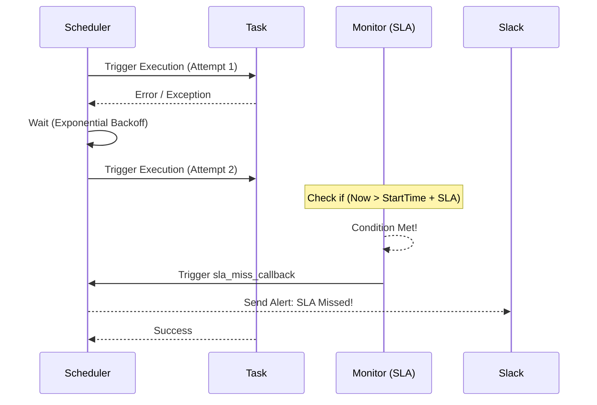

# Retries và SLA - Tự phục hồi và Cam kết dịch vụ

## Summary

Trong Data Engineering, mạng máy tính là không đáng tin cậy. Dữ liệu bên thứ 3 có thể bị chậm, API có thể quá tải 503, và Server có thể khởi động lại. Một Data Pipeline bền bỉ không thể sụp đổ chỉ vì một lỗi mạng gián đoạn 3 giây. **Retries (Cơ chế thử lại)** là "kháng sinh" giúp hệ thống tự chữa lành các lỗi tạm thời (transient errors) mà không cần con người can thiệp. Đồng thời, **SLA (Service Level Agreement)** là công cụ cảnh báo (monitoring) để đảm bảo dù hệ thống có tự khắc phục hay chạy chậm, kết quả dữ liệu vẫn phải được giao đúng hạn cho bộ phận kinh doanh.

---

## Definition

* **Retries (Thử lại)**: Là cơ chế cấu hình ở mức độ Tác vụ (Task). Khi một Task thất bại do sinh ra Exception, Orchestrator sẽ không lập tức đánh dấu chết (Failed). Nó sẽ đợi một khoảng thời gian (Retry Delay) và cấp phát chạy lại từ đầu. Việc này lặp lại cho đến khi Task thành công hoặc chạm giới hạn `max_retries`.
* **SLA (Service Level Agreement - Cam kết thời gian dịch vụ)**: Là một ngưỡng thời gian cứng (ví dụ: "Phải xong trước 7:00 AM"). Nếu một Task hoặc toàn bộ DAG không hoàn tất thành công trong khung thời gian này, hệ thống sẽ KHÔNG dừng luồng, nhưng sẽ sinh ra một sự kiện (Event) gửi email/slack cảnh báo "Vi phạm SLA" cho đội kỹ sư.

---

## Why it exists

Thử nghiệm: Bạn gọi API lấy dữ liệu quảng cáo từ Facebook vào 2:00 sáng.
* **Không có Retries**: Đúng 2:00 sáng máy chủ Facebook bị nghẽn mạng mất 5 giây, trả về lỗi HTTP 504. Tác vụ thất bại. Toàn bộ chuỗi Pipeline bị dừng. Kỹ sư trực ca phải thức dậy lúc 2h15, nhấn nút "Rerun" (chạy lại) trên giao diện. Nó chạy xanh mượt vì mạng đã có lại. Kỹ sư bực tức đi ngủ tiếp. 
* **Sự xuất hiện của Retries**: Kỹ sư thiết lập tự động chạy lại 3 lần. Các lỗi "vớ vẩn" về kết nối tự động được dọn dẹp. Con người chỉ bị gọi dậy khi server đối tác thực sự chết.
* **Sự xuất hiện của SLA**: Công ty yêu cầu Dashboard doanh thu phải có số lúc 8h sáng để GĐ họp. Hệ thống có Retries, nhưng do đối tác lỗi nặng, task chạy thất bại rồi thử lại đến 20 lần, tốn mất 6 tiếng. Cuối cùng task "Thành công" lúc 9h sáng. Nhưng sếp đã nổi giận vì 8h mở Dashboard trắng trơn. SLA sinh ra để cảnh báo lúc 8h00: "Luồng vẫn đang chạy/lỗi, có nguy cơ trễ hẹn", giúp kỹ sư chủ động thông báo cho Business thay vì đợi sếp phàn nàn.

---

## Core idea

Ý tưởng của kiến trúc tự phục hồi xoay quanh 2 thành phần bổ trợ cho nhau: **Khắc phục chủ động (Retries)** và **Giám sát thụ động (SLA/Timeouts)**.

Để cơ chế Retries hiệu quả, nó thường sử dụng nguyên lý **Exponential Backoff (Thử lại theo cấp số nhân)**. Đừng dồn dập hỏi lại Server bị lỗi mỗi 1 giây một lần (điều này giống như hành vi DDOS làm server chết hẳn). Hãy thử lại sau 1 phút, nếu lỗi thử lại sau 5 phút, nếu lỗi thử lại sau 30 phút, tạo không gian cho hạ tầng phục hồi.

---

## How it works (Theo Airflow)



1. **Vòng đời Task với Retries**:
   * Task chạy lần 1 $\rightarrow$ Gặp lỗi Exception.
   * Cấu hình có `retries=3`. Trạng thái chuyển thành `UP_FOR_RETRY` (chứ không phải FAILED).
   * Scheduler đếm thời gian bằng với `retry_delay`.
   * Hết giờ, Scheduler đưa Task về trạng thái `Scheduled` và chạy lại.
   * Nếu chạy 4 lần (1 thật + 3 retry) đều văng lỗi. Đánh dấu `FAILED`, gửi mail báo tử.

2. **Cơ chế quét SLA**:
   * Scheduler có một luồng ngầm chạy quét định kỳ các Task có cấu hình SLA.
   * Nếu thời điểm hiện tại $>$ (Thời gian kích hoạt DAG Run + `SLA timedelta`).
   * Nó kiểm tra xem Task đó đã ở trạng thái `SUCCESS` chưa? Nếu chưa (bất kể đang chạy, hay đang retry), nó bắn trigger hàm `sla_miss_callback` để gọi API gửi tin nhắn Slack cảnh báo "SLA Miss".
   * Task vẫn cứ chạy bình thường, SLA không can thiệp luồng.

---

## Practical example

Ví dụ định nghĩa DAG trên Airflow kết hợp Retries Exponential Backoff và SLA:

```python
from datetime import datetime, timedelta
from airflow import DAG
from airflow.operators.python import PythonOperator
from utils.slack import send_sla_miss_alert # Hàm tự viết gửi slack

# Khai báo biến mặc định áp dụng cho mọi tasks
default_args = {
    'owner': 'data_eng',
    'start_date': datetime(2026, 6, 1),
    
    # 1. Cấu hình RETRIES
    'retries': 3,                           # Thử lại tối đa 3 lần
    'retry_delay': timedelta(minutes=1),    # Chờ 1 phút trước lần thử đầu
    'retry_exponential_backoff': True,      # Lần sau sẽ chờ lâu hơn: 1m -> 2m -> 4m...
    'max_retry_delay': timedelta(hours=1),  # Nhưng không bao giờ chờ quá 1 tiếng
    
    # 2. Cấu hình SLA
    'sla': timedelta(hours=2),              # Phải hoàn thành tác vụ trong 2 giờ kể từ khi DAG Start
}

with DAG(
    dag_id='mission_critical_pipeline',
    default_args=default_args,
    schedule_interval='@daily',
    sla_miss_callback=send_sla_miss_alert   # Hàm gọi khi vi phạm SLA
) as dag:

    # Nếu task này sập mạng tạm thời, nó sẽ tự lặp lại tối đa 3 lần.
    # Nếu sau 2 giờ mà chưa ra chữ SUCCESS (do bị retry quá lâu), Slack sẽ reo!
    run_important_model = PythonOperator(
        task_id='train_ai_model',
        python_callable=lambda: print("Training..."),
        execution_timeout=timedelta(hours=1) # (Tùy chọn) Bắt buộc cắt nếu 1 lần chạy quá 1h
    )
```

---

## Best practices

* **Idempotency (Tính Lũy đẳng) là điều kiện tiên quyết**: Đừng BẬT Retries nếu Task của bạn không lũy đẳng. Ví dụ: Task chạy lệnh `INSERT` vào bảng SQL mà không có Key (Khoá chính). Nếu nó bị lỗi kết nối mạng ở phút cuối (dữ liệu đã ghi nhưng chưa báo Success), Retry chạy lại sẽ ném thêm 1 đống dữ liệu nữa vào bảng, sinh ra trùng lặp (Duplicates). Phải thiết kế Task dạng Upsert (Merge) trước khi cho phép tự động thử lại.
* **Luôn dùng Exponential Backoff cho các API Calls**: Tránh hiệu ứng "Thundering Herd" (Bầy đàn ầm ĩ) làm sập hệ thống nội bộ do hàng loạt Task cùng retry dồn dập cùng 1 giây.
* **Tách biệt SLA và Execution Timeout**: 
  * `SLA`: Cảnh báo chậm tiến độ tổng thể (không làm chết task). 
  * `Execution Timeout`: Công tắc ngắt cầu dao điện. Nếu một task SQL bị kẹt (Lock) không bao giờ kết thúc, timeout sẽ giết chết process đó ở phút thứ 60 để giải phóng Worker, sinh ra lỗi, rồi kích hoạt Retries. Hãy luôn kết hợp cả 2.

---

## Common mistakes

* **Nhầm lẫn SLA từ lúc Task chạy**: Trong Airflow, tham số `sla` tính giờ từ lúc **DAG Run bắt đầu**, chứ KHÔNG phải tính từ lúc bản thân cái Task đó bắt đầu được đẩy vào Queue. Rất nhiều người nhầm, đặt SLA cho Task cuối cùng là 30 phút, nhưng luồng đầu mất 1 tiếng $\rightarrow$ Task cuối luôn luôn báo SLA Miss ngay khi mới bắt đầu.
* **Over-retrying (Lạm dụng thử lại)**: Đặt `retries = 100` để khỏi phải bảo trì hệ thống. Hậu quả là Database đổi mật khẩu bị lỗi Authentication, hệ thống vứt 100 task vào vòng lặp Retry treo chết mọi tài nguyên Worker trong vô vọng, thay vì báo lỗi Failed ngay để người xử lý.

---

## Trade-offs

### Cơ chế Retries
* **Ưu điểm**: Giảm tới 90% các cảnh báo rác (False alarms) ban đêm do lỗi mạng hoặc timeout ngắn hạn, giúp Data Engineers ngủ ngon.
* **Nhược điểm**: Che giấu các căn bệnh mãn tính của hạ tầng (Infrastructure masking). Ví dụ: Data Warehouse bị quá tải, cứ query là rớt mạng. Retries liên tục che giấu việc này, tạo ảo giác mọi thứ ổn cho đến khi hệ thống sập hoàn toàn.

### SLA Monitoring
* **Ưu điểm**: Xây dựng niềm tin với Business (Stakeholders), chủ động thông báo rủi ro báo cáo chậm trước khi họ kịp nhìn thấy.
* **Nhược điểm**: Khá khó khăn để bảo trì các mốc thời gian SLA khi lượng dữ liệu phình to dần (Data Growth). Hôm nay chạy hết 1 tiếng, năm sau chạy hết 2 tiếng là bình thường. Kỹ sư phải liên tục cập nhật ngưỡng SLA.

---

## When to use

* **Retries**: Bắt buộc phải có cho MỌI Data Pipeline kết nối Internet hoặc gọi API/Database bên ngoài.
* **SLA**: Áp dụng cho các bảng báo cáo quan trọng nhất cuối phễu dữ liệu (Core Data Marts), các mô hình thanh toán (Billing) có cam kết hợp đồng với khách hàng.

## When not to use

* Tắt Retries (set `retries = 0`) cho các tác vụ Gửi Email hoặc Bắn Slack cảnh báo. Bạn không muốn nhận 5 cái email lặp lại cùng một nội dung báo cáo thành công nếu SMTP server chập chờn.
* KHÔNG dùng Retries cho các đoạn code chưa Lũy đẳng (Non-idempotent) để tránh làm rác Data Warehouse.

---

## Related concepts

* [Task Dependency](/concepts/task-dependency)
* [Apache Airflow](/concepts/apache-airflow)

---

## Interview questions

### 1. Sự khác nhau giữa `retries`, `execution_timeout`, và `SLA` là gì?
* **Người phỏng vấn muốn kiểm tra**: Khái niệm về Error Handling và Time Management.
* **Gợi ý trả lời (Strong Answer)**: 
  * `retries`: Chỉ kích hoạt KHI và CHỈ KHI task bị crash ném ra Exception (Lỗi), nó khởi động lại task đó.
  * `execution_timeout`: Ngắt điện (Kill) một task đang chạy rề rà vô tận, ép nó phải chết văng ra Exception (Từ đó có thể kích hoạt Retries). Nó thay đổi trạng thái luồng.
  * `SLA`: Là mốc thời gian tĩnh để so sánh. Khi thời gian chạy vượt ngưỡng, nó chỉ đơn giản là chạy một hàm Python phụ (như bắn tin nhắn) mà KHÔNG can thiệp, không giết, không đổi trạng thái của cái Task đang chạy.

### 2. Tại sao lại cần Exponential Backoff (Cấp số nhân) khi cấu hình Retries?
* **Người phỏng vấn muốn kiểm tra**: Tư duy về thiết kế hệ thống phân tán chịu tải (Resilience).
* **Gợi ý trả lời (Strong Answer)**: Thường các lỗi cần retry là do server đích bị quá tải (Overload). Nếu Airflow cấu hình retry ngay lập tức liên tục mỗi giây, nó sẽ gửi hàng loạt request tấn công nhồi vào cái server đang ngắc ngoải đó (gọi là Retry Storm), đánh sập hoàn toàn hạ tầng đối tác. Exponential Backoff kéo giãn thời gian giữa các lần thử (1m, 2m, 4m, 8m), tạo không gian nghỉ ngơi (breathing room) để server bên kia khởi động lại hoặc tự hồi phục.

### 3. Nếu bạn thiết kế một Task chèn dữ liệu (INSERT) từ File vào bảng DB. Khi Task đó được Retry do đứt kết nối, làm thế nào để đảm bảo không bị double data?
* **Người phỏng vấn muốn kiểm tra**: Khái niệm Idempotency (Lũy đẳng) kinh điển.
* **Gợi ý trả lời (Strong Answer)**: Không bao giờ dùng lệnh `INSERT INTO` thuần túy. Ta phải thiết kế luồng sao cho Idempotent (Chạy N lần giống 1 lần). Có 2 cách: (1) Cách Merge/Upsert: Định nghĩa Primary Key, sử dụng cú pháp `INSERT ... ON CONFLICT DO UPDATE` (Postgres) hoặc `MERGE` (Snowflake). (2) Cách Delete-Write: Dùng toán tử tiền xử lý xóa trước dữ liệu của đúng phiên chạy đó `DELETE FROM table WHERE date = '{{ ds }}'`, sau đó mới `INSERT` cái mới. 

### 4. SLA trong Airflow tính thời gian từ lúc nào? 
* **Người phỏng vấn muốn kiểm tra**: Kinh nghiệm sử dụng Airflow thực tế (Gotcha question).
* **Gợi ý trả lời (Strong Answer)**: SLA trong Airflow được tính từ thời điểm DAG Run BẮT ĐẦU kích hoạt (Execution time + Schedule interval), chứ không phải tính từ thời điểm Task cụ thể đó bắt đầu chạy. Vì vậy, SLA của một Task cuối nguồn phải bao gồm cả tổng thời gian chạy mong đợi của các Task đứng trước nó cộng lại.

### 5. Sensor task có nên dùng Retries để kiểm tra liên tục không?
* **Người phỏng vấn muốn kiểm tra**: Nhầm lẫn giữa 2 khái niệm chờ đợi.
* **Gợi ý trả lời (Strong Answer)**: Không nên. Việc hỏi liên tục (Polling) là công việc của cấu hình `poke_interval` và `timeout` bên trong nội bộ Sensor. Nếu bạn thiết lập `retries` cho Sensor, hệ thống sẽ hiểu là: Cảm biến chờ đến hết thời gian timeout, BỊ LỖI FAILED chết hoàn toàn, sau đó Airflow khởi tạo lại cái Sensor đó từ đầu. Điều này là lạm dụng Retry làm cơ chế chờ. Thay vào đó, hãy để Sensor làm đúng việc của nó bằng cách cấu hình Mode Reschedule và Timeout hợp lý.

---

## References

1. **Airflow Official Documentation** - SLA and Timeout.
2. **Google Cloud Architecture Center** - Implementing retries with exponential backoff.

---

## English summary

In Data Orchestration, **Retries** and **SLA (Service Level Agreements)** are fundamental pillars for building resilient and transparent data pipelines. Network partitions and external API hiccups are inevitable; retries automatically re-trigger failed tasks without human intervention, effectively mitigating transient errors. Utilizing an "Exponential Backoff" strategy during retries prevents accidental DDoS-ing of struggling source systems. Meanwhile, an SLA is a passive monitoring threshold that alerts stakeholders if a process (or entire DAG) fails to complete by a critical business deadline. Crucially, before enabling retries, engineers must guarantee that every task is idempotent (e.g., using UPSERT operations) to prevent data duplication when a half-finished process is re-executed.
