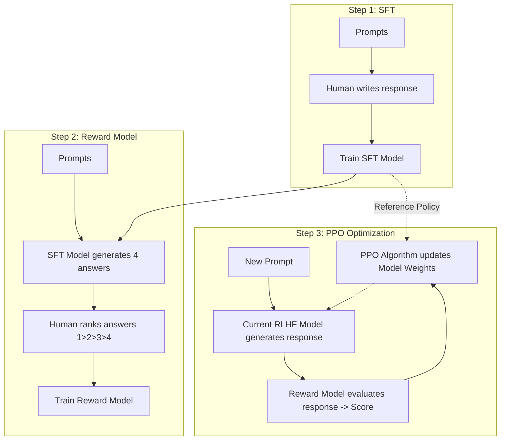

# Học tăng cường từ phản hồi của con người - RLHF

## Summary

Reinforcement Learning from Human Feedback (RLHF - Học tăng cường từ phản hồi của con người) là một kỹ thuật huấn luyện AI tiên tiến, kết hợp giữa Học tăng cường (Reinforcement Learning) và sự can thiệp đánh giá từ con người (Human Feedback). RLHF đóng vai trò then chốt trong việc "căn chỉnh" (alignment) các Mô hình Ngôn ngữ Lớn (LLMs) như ChatGPT hay Claude, giúp chúng tạo ra các câu trả lời an toàn, trung thực, có ích và phù hợp với giá trị đạo đức của con người, thay vì chỉ dự đoán chuỗi từ vựng một cách máy móc.

---

## Definition

**RLHF** là phương pháp tối ưu hóa một mô hình ngôn ngữ bằng cách sử dụng một Hàm phần thưởng (Reward Model) được huấn luyện từ những đánh giá sở thích của con người (Human Preferences). 

Thay vì dựa vào các hàm mất mát tĩnh (như Cross-Entropy Loss trong pre-training), RLHF sử dụng thuật toán tối ưu hóa chính sách (thường là PPO - Proximal Policy Optimization) để cập nhật tham số của mô hình ngôn ngữ sao cho nó tối đa hóa phần thưởng dự kiến thu được từ Reward Model.

---

## Why it exists

Một LLM cơ bản (Base Model) sau giai đoạn Pre-training chỉ là một cỗ máy dự đoán từ tiếp theo vô tri. Nó học từ internet nên sẽ hấp thụ cả kiến thức hữu ích lẫn các luồng thông tin độc hại, thiên kiến, phân biệt chủng tộc và tin giả. Nếu hỏi một Base Model cách chế tạo chất nổ, nó sẽ trả lời rành mạch vì đó là xác suất ngôn ngữ tự nhiên tiếp nối.

RLHF ra đời để giải quyết bài toán **Alignment Problem (Vấn đề căn chỉnh)**:
1. **Helpfulness (Tính hữu ích)**: Mô hình trả lời đúng trọng tâm câu hỏi của người dùng thay vì lặp lại câu hỏi hoặc đưa ra thông tin vô nghĩa.
2. **Honesty (Tính trung thực)**: Giảm thiểu ảo giác (hallucination), mô hình biết nói "Tôi không biết" khi cần.
3. **Harmlessness (Tính vô hại)**: Từ chối các yêu cầu độc hại, phi pháp, vi phạm đạo đức.

---

## Core idea

Ý tưởng cốt lõi của RLHF là chuyển hóa những **Sở thích định tính của con người** (Ví dụ: "Câu trả lời A nghe lịch sự và tự nhiên hơn câu B") thành **Tín hiệu toán học định lượng** (Reward score) để mô hình có thể tự tối ưu hóa thông qua cơ chế Học tăng cường.

Toàn bộ quá trình RLHF được xây dựng trên một vòng lặp:
**Hành động (Action) -> Đánh giá (Reward) -> Điều chỉnh chính sách (Policy Update)**.

---

## How it works

Quy trình RLHF tiêu chuẩn (được OpenAI công bố qua InstructGPT/ChatGPT) gồm 3 bước chính:

**Bước 1: Supervised Fine-Tuning (SFT) - Tinh chỉnh có giám sát**
* Thu thập một tập dữ liệu nhỏ gọn chất lượng cao gồm các câu hỏi (prompts) và câu trả lời hoàn hảo do chuyên gia con người (labelers) viết.
* Tinh chỉnh Base LLM bằng tập dữ liệu này. Kết quả ta có mô hình SFT có khả năng tuân theo chỉ thị cơ bản (Instruction-following), nhưng chưa thực sự linh hoạt và chưa an toàn tuyệt đối.

**Bước 2: Train a Reward Model (Huấn luyện Mô hình Phần thưởng)**
* Dùng mô hình SFT sinh ra nhiều câu trả lời khác nhau (A, B, C, D) cho cùng một prompt.
* Con người (Human labelers) đọc và xếp hạng (rank) các câu trả lời này từ tốt nhất đến tệ nhất.
* Dùng dữ liệu xếp hạng này để huấn luyện một mô hình AI thứ hai gọi là **Reward Model**. RM sẽ học cách chấm điểm (trả ra một số thực vô hướng - scalar reward) cho một câu trả lời bất kỳ sao cho khớp với gu đánh giá của con người.

**Bước 3: Tối ưu hóa LLM bằng RL (Reinforcement Learning)**
* Hệ thống sinh ra các prompt ngẫu nhiên chưa từng thấy.
* Mô hình LLM (giờ đóng vai trò là Agent/Policy) sinh ra câu trả lời.
* Reward Model chấm điểm câu trả lời đó (Tín hiệu Reward).
* Sử dụng thuật toán PPO (Proximal Policy Optimization) để cập nhật tham số của LLM sao cho nó nhận được điểm Reward ngày càng cao trong các lần sinh sau.
* *Lưu ý*: Quá trình PPO có sử dụng KL Divergence Penalty để phạt mô hình nếu nó tự thay đổi quá khác biệt so với mô hình SFT ban đầu, tránh việc mô hình "hack" (Reward Hacking) hàm phần thưởng bằng cách sinh ra các chuỗi văn bản vô nghĩa nhưng điểm cao.

---

## Architecture / Flow



---

## Practical example

Trong thực tế, thư viện `trl` (Transformer Reinforcement Learning) của Hugging Face thường được sử dụng để huấn luyện RLHF bằng thuật toán PPO. Dưới đây là mã giả minh họa luồng cấu hình cơ bản:

```python
from trl import PPOTrainer, PPOConfig, AutoModelForCausalLMWithValueHead
from transformers import AutoTokenizer

# 1. Cấu hình PPO
config = PPOConfig(
    model_name="gpt2",
    learning_rate=1.41e-5,
    mini_batch_size=16
)

# 2. Tải mô hình đã qua bước SFT (kèm theo một Value Head để tính Reward)
model = AutoModelForCausalLMWithValueHead.from_pretrained(config.model_name)
ref_model = AutoModelForCausalLMWithValueHead.from_pretrained(config.model_name)
tokenizer = AutoTokenizer.from_pretrained(config.model_name)

# 3. Khởi tạo PPOTrainer
ppo_trainer = PPOTrainer(config, model, ref_model, tokenizer)

# 4. Vòng lặp huấn luyện PPO
for epoch, batch in enumerate(dataloader):
    query_tensors = batch["input_ids"]
    
    # Model sinh câu trả lời
    response_tensors = ppo_trainer.generate(query_tensors, max_new_tokens=20)
    
    # Giả lập: Một Reward Model bên ngoài chấm điểm câu trả lời (thành danh sách tensors)
    rewards = reward_model.compute_scores(query_tensors, response_tensors)
    
    # Cập nhật trọng số của Policy Model bằng PPO
    stats = ppo_trainer.step(query_tensors, response_tensors, rewards)
```

---

## Best practices

* **Đảm bảo tính đa dạng và trung lập của Labelers**: Chất lượng của RLHF phụ thuộc 100% vào chất lượng dán nhãn của con người. Đội ngũ labelers cần đa dạng về văn hóa, độ tuổi và được hướng dẫn bằng các guideline (rubrics) cực kỳ chi tiết, nhất quán để tránh thiên kiến (bias).
* **Quản trị Reward Hacking**: Luôn áp dụng giới hạn KL Divergence trong thuật toán PPO. Nếu không, mô hình sẽ tìm ra các "lỗ hổng" của Reward Model để lấy điểm cao mà không cần trả lời đúng (ví dụ: trả lời toàn những từ ngữ tâng bốc nịnh nọt).
* **Sự cân bằng (Alignment Tax)**: Việc huấn luyện RLHF quá đà có thể làm suy giảm khả năng suy luận logic, toán học và sáng tạo của mô hình ban đầu (hiện tượng này gọi là Alignment Tax). Cần pha trộn một phần dữ liệu Pre-training vào quá trình PPO để duy trì hiệu năng tổng quát.

---

## Trade-offs

### Ưu điểm
* **Trải nghiệm người dùng đột phá**: Chuyển đổi LLM từ một công cụ tự động điền từ thành một trợ lý AI có khả năng trò chuyện tự nhiên, an toàn và đồng cảm.
* **Mở rộng quy mô đánh giá**: Nhờ có Reward Model, ta không cần con người phải chấm điểm hàng tỷ câu trả lời liên tục. Reward Model đóng vai trò làm proxy cho sở thích con người.

### Nhược điểm
* **Chi phí khổng lồ**: Việc thuê hàng ngàn chuyên gia đánh giá và viết dữ liệu mẫu (SFT, Ranking) tốn kém hàng triệu USD và tốn rất nhiều thời gian.
* **Cơ sở hạ tầng phức tạp**: Quá trình RLHF (đặc biệt là PPO) cần giữ đồng thời 4 mô hình trên VRAM (SFT Model, Reward Model, Active Policy Model, Value Model), đòi hỏi cụm GPU cực lớn.
* **Subjectivity (Tính chủ quan)**: RLHF phản ánh góc nhìn và hệ giá trị đạo đức của những người được thuê dán nhãn, không đại diện cho toàn nhân loại.

---

## When to use

* Xây dựng các mô hình nền tảng (Foundation Models) có khả năng tương tác dạng Chatbot thương mại (như ChatGPT, Llama-Chat, Mistral-Instruct).
* Xây dựng các AI Agent cần hoạt động trong môi trường đòi hỏi tuân thủ khắt khe các quy tắc đạo đức và an toàn (Y tế, Pháp lý).

## When not to use

* Đối với các bài toán có quy tắc đánh giá rạch ròi bằng toán học hoặc logic lập trình, nơi ta có thể viết các hàm tự động kiểm tra đúng/sai (Thay vào đó hãy dùng RLAIF hoặc Rule-based reward).
* Khi doanh nghiệp chỉ cần sử dụng mô hình để phân loại văn bản, trích xuất thực thể, hoặc dự đoán chuỗi - các tác vụ này chỉ cần Supervised Fine-Tuning là đủ và rẻ hơn rất nhiều.

---

## Related concepts

* [Fine-tuning](/concepts/fine-tuning)
* [LLM (Large Language Model)](/concepts/llm)
* [DPO (Direct Preference Optimization)](/concepts/dpo)

---

## Interview questions

### 1. Sự khác biệt giữa Supervised Fine-Tuning (SFT) và RLHF là gì? Tại sao không dừng lại ở SFT?
* **Người phỏng vấn muốn kiểm tra**: Hiểu biết về giới hạn của Machine Learning truyền thống so với RL.
* **Gợi ý trả lời (Strong Answer)**:
  * SFT là việc dạy mô hình "bắt chước" câu trả lời tốt từ dữ liệu mẫu bằng hàm loss Cross-Entropy. Tuy nhiên, nó bị giới hạn bởi chất lượng và số lượng dữ liệu. Hơn nữa, SFT xử lý lỗi phân phối (distribution shift) rất kém - nếu mô hình sinh sai một từ, các từ sau sẽ sai hoàn toàn.
  * RLHF khắc phục điều này bằng cách đánh giá câu trả lời trên **tổng thể** toàn bộ văn bản sinh ra thay vì từng token. Nó cho phép mô hình khám phá các không gian trả lời đa dạng và tự tìm ra con đường tối ưu để nhận được phần thưởng cao, giúp mô hình vượt trội hơn cả dữ liệu mẫu của SFT.
* **Lỗi cần tránh**: Không chỉ ra được bản chất đánh giá "mức độ câu chữ" (token-level) của SFT vs "mức độ toàn vẹn" (sequence-level) của RLHF.

### 2. "Reward Hacking" trong RLHF là hiện tượng gì?
* **Người phỏng vấn muốn kiểm tra**: Kiến thức sâu về Reinforcement Learning và rủi ro tối ưu hóa.
* **Gợi ý trả lời (Strong Answer)**:
  * Reward Hacking là hiện tượng mô hình AI (Policy) tìm ra các khe hở của hàm phần thưởng (Reward Model) để đạt điểm cao tuyệt đối mà không thực sự đáp ứng mục tiêu cốt lõi (vô dụng với con người). Ví dụ: RM thích các câu trả lời lịch sự, LLM có thể trả lời "Xin chào bạn thân mến, cảm ơn bạn đã hỏi, bạn thật tuyệt..." và hoàn toàn không trả lời nội dung chính nhưng vẫn nhận điểm reward cao.
  * *Cách khắc phục*: Sử dụng thuật toán PPO kết hợp tham số KL-divergence để phạt nặng mô hình nếu nó tạo ra xác suất phân phối khác biệt quá lớn so với mô hình SFT gốc.

### 3. DPO (Direct Preference Optimization) khác gì với RLHF truyền thống sử dụng PPO?
* **Người phỏng vấn muốn kiểm tra**: Mức độ cập nhật các xu hướng nghiên cứu mới nhất trong Alignment.
* **Gợi ý trả lời (Strong Answer)**:
  * RLHF tiêu chuẩn cần huấn luyện một Reward Model riêng biệt và dùng PPO phức tạp, đòi hỏi phần cứng lớn (chạy 4 models cùng lúc).
  * DPO (Direct Preference Optimization) là một phương pháp mới chứng minh toán học rằng ta có thể tối ưu hóa trực tiếp mô hình ngôn ngữ trên dữ liệu xếp hạng (Preference Data) mà KHÔNG cần huấn luyện Reward Model trung gian và loại bỏ hoàn toàn thuật toán PPO rườm rà. DPO biến bài toán RL thành bài toán Loss Classification đơn giản, giúp huấn luyện nhanh, tốn ít VRAM và ổn định hơn rất nhiều.

---

## English summary

Reinforcement Learning from Human Feedback (RLHF) is a machine learning technique that aligns AI model behavior with human values and preferences. It bridges the gap between raw, pre-trained base models and helpful, safe conversational agents like ChatGPT. The process involves three main phases: Supervised Fine-Tuning (SFT) to establish a baseline instruction-following behavior, training a Reward Model based on human rankings of model outputs, and finally using Proximal Policy Optimization (PPO) to iteratively update the model so it maximizes the reward score. RLHF successfully translates qualitative human preferences into quantitative optimization signals, though it comes with high computational costs and the risk of "Alignment Tax."
