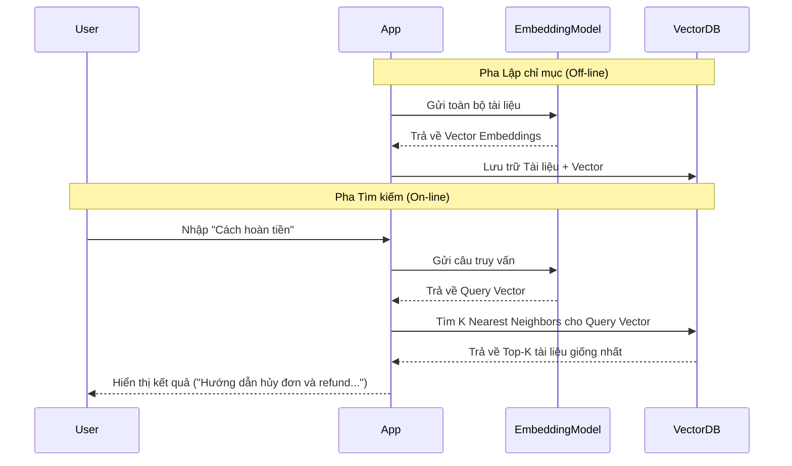

# Tìm kiếm ngữ nghĩa - Semantic Search

## Summary

Tìm kiếm ngữ nghĩa (Semantic Search) là công nghệ tìm kiếm dựa trên ý nghĩa và bối cảnh của câu truy vấn (query) thay vì chỉ khớp chính xác các từ khóa (lexical/keyword search). Bằng cách chuyển đổi cả câu truy vấn và dữ liệu thành các vectơ nhúng (embeddings) và so sánh khoảng cách giữa chúng trong không gian đa chiều, Semantic Search có thể tìm ra các kết quả phù hợp ngay cả khi chúng không chia sẻ bất kỳ từ vựng nào với câu truy vấn.

---

## Definition

**Semantic Search** là kỹ thuật truy xuất thông tin (Information Retrieval) ứng dụng Xử lý ngôn ngữ tự nhiên (NLP) và Machine Learning để hiểu được "ý định" (intent) thực sự của người dùng. Kỹ thuật này ánh xạ truy vấn và tài liệu vào cùng một không gian hình học thông qua Embedding Models. Kết quả tìm kiếm được trả về dựa trên độ tương đồng hình học (Nearest Neighbor Search) thay vì đếm tần suất xuất hiện của từ khóa (như thuật toán BM25 hay TF-IDF).

---

## Why it exists

Hệ thống tìm kiếm truyền thống (Keyword Search / Lexical Search) như ElasticSearch cơ bản hay Google cũ gặp phải 3 vấn đề lớn:
1. **Từ đồng nghĩa (Synonyms)**: Nếu người dùng tìm "xe hơi", hệ thống keyword sẽ bỏ lỡ các bài viết chỉ dùng từ "ô tô".
2. **Từ đa nghĩa (Polysemy)**: Tìm "apple" có thể ra quả táo hoặc công ty Apple, keyword search không phân biệt được nếu không có bối cảnh.
3. **Lỗi chính tả / Cách diễn đạt khác**: "Cách làm bánh pizza ngon" và "Hướng dẫn nướng pizza tại nhà" có chung ý nghĩa nhưng rất ít từ khóa trùng lặp.

Semantic Search ra đời để giải quyết các khiếm khuyết này bằng cách so sánh **ý nghĩa** thay vì so sánh **ký tự**.

---

## Core idea

* **Embeddings làm cốt lõi**: Mọi thứ (văn bản, hình ảnh, câu hỏi) đều được dịch ra một ngôn ngữ chung là Vectơ (các chuỗi số).
* **Đo lường khoảng cách**: Sự tương đồng về ngữ nghĩa được quy đổi thành sự gần gũi về khoảng cách toán học (thường là Cosine Similarity hoặc Dot Product). Điểm Cosine càng gần 1, hai đoạn văn bản càng giống nhau về mặt ý nghĩa.
* **Không phân biệt ngôn ngữ (Cross-lingual)**: Nếu dùng mô hình nhúng đa ngữ, câu hỏi bằng tiếng Việt vẫn có thể tìm trúng đoạn văn bản tiếng Anh nếu chúng mang cùng một ngữ nghĩa.

---

## How it works

Hệ thống Semantic Search hoạt động qua 2 pha (Phases) chính:

**Pha 1: Lập chỉ mục (Indexing)**
1. Thu thập toàn bộ tài liệu (documents) trong cơ sở dữ liệu.
2. Cắt tài liệu thành các đoạn nhỏ (Chunking).
3. Đưa các đoạn này qua mô hình nhúng (Embedding Model) để tạo ra các Vectơ.
4. Lưu trữ các Vectơ này vào một Vector Database (ví dụ: Milvus, Pinecone).

**Pha 2: Tìm kiếm (Querying)**
1. Người dùng nhập câu hỏi: "Làm sao để hủy đơn hàng?"
2. Câu hỏi đi qua **cùng một mô hình nhúng** ở Pha 1, biến thành Vectơ truy vấn (Query Vector).
3. Vector Database thực hiện so sánh Query Vector với hàng triệu Document Vectors để tìm ra Top-K vectơ có khoảng cách gần nhất (thường dùng thuật toán Approximate Nearest Neighbor - ANN như HNSW).
4. Trả về văn bản gốc tương ứng với Top-K vectơ đó cho người dùng.

---

## Architecture / Flow



---

## Practical example

Mô phỏng bằng Python sử dụng `FAISS` (thư viện tìm kiếm vector của Meta) và `sentence-transformers`:

```python
import faiss
from sentence_transformers import SentenceTransformer

# 1. Khởi tạo model và dữ liệu
model = SentenceTransformer('all-MiniLM-L6-v2')
documents = ["The cat is sleeping", "I love eating pizza", "Car engine is broken"]

# 2. Sinh embeddings và đưa vào FAISS Index
doc_embeddings = model.encode(documents)
d = doc_embeddings.shape[1] # Số chiều vector (384)
index = faiss.IndexFlatL2(d)
index.add(doc_embeddings)

# 3. Tìm kiếm
query = "A kitten is resting"
query_vector = model.encode([query])

# Tìm 1 kết quả gần nhất (k=1)
distances, indices = index.search(query_vector, k=1)

print(f"Câu hỏi: {query}")
print(f"Tài liệu khớp nhất: {documents[indices[0][0]]}") 
# Kết quả: "The cat is sleeping" dù không có từ nào giống nhau.
```

---

## Best practices

* **Kết hợp Tìm kiếm lai (Hybrid Search)**: Đừng vứt bỏ Keyword Search (BM25). Keyword search cực giỏi ở việc tìm tên riêng, mã lỗi, số ID. Hãy dùng Hybrid Search (Kết hợp điểm của Semantic Search và Keyword Search thông qua thuật toán RRF - Reciprocal Rank Fusion) để có kết quả tốt nhất.
* **Asymmetric Models cho QA**: Nếu hệ thống của bạn là Hỏi-Đáp (câu hỏi ngắn, tài liệu dài), hãy dùng các mô hình nhúng Asymmetric (như MSMARCO) thay vì Symmetric.
* **Chunking hợp lý**: Không nhúng cả một cuốn sách thành 1 vectơ vì ý nghĩa sẽ bị loãng. Hãy cắt thành từng đoạn 256-512 tokens trước khi nhúng.

---

## Common mistakes

* **Quên chuẩn hóa (Normalize) Vector**: Nếu mô hình tối ưu theo Cosine Similarity, hãy chuẩn hóa L2 cho các vectơ trước khi đưa vào Vector DB, khi đó có thể dùng Dot Product để tăng tốc độ tìm kiếm mà vẫn đảm bảo độ chính xác.
* **Dùng Semantic Search cho tìm mã sản phẩm**: Tìm mã "IPHONE-15-PRO" bằng Semantic Search thường cho kết quả tệ hơn rất nhiều so với dùng ElasticSearch (Keyword match).

---

## Trade-offs

### Ưu điểm
* Hiểu được ý định người dùng dù sai chính tả hay dùng từ đồng nghĩa.
* Cải thiện rõ rệt UX cho hệ thống tìm kiếm nội bộ, FAQ.
* Đóng vai trò là "Bộ nhớ dài hạn" xuất sắc nhất cho mô hình Retrieval-Augmented Generation (RAG).

### Nhược điểm
* **Độ trễ (Latency)**: Phải chạy mô hình Deep Learning lúc truy vấn nên thời gian trả về kết quả chậm hơn so với Keyword search truyền thống.
* **Tài nguyên**: Yêu cầu máy chủ có GPU để tối ưu tốc độ sinh embedding, và RAM lớn để chạy Vector DB.

---

## When to use

* Xây dựng hệ thống RAG (Retrieval-Augmented Generation) cho LLM.
* Hệ thống tìm kiếm tài liệu nội bộ, Knowledge Base, FAQ.
* Hệ thống gợi ý bài viết liên quan (Recommender Systems).

## When not to use

* Tìm kiếm log hệ thống, mã lỗi, số điện thoại, ID giao dịch.
* Ứng dụng web siêu nhỏ không có đủ tài nguyên để duy trì Embedding Model và Vector Database.

---

## Related concepts

* [Vectơ nhúng (Embeddings)](/concepts/embeddings)
* [Phân tách văn bản (Chunking)](/concepts/chunking)
* [Vector Database](/concepts/vector-database)

---

## Interview questions

### 1. Phân biệt Semantic Search và Keyword (Lexical) Search. Giải pháp Hybrid Search giải quyết vấn đề gì?
* **Người phỏng vấn muốn kiểm tra**: Hiểu biết tổng quan về các thế hệ công cụ tìm kiếm.
* **Gợi ý trả lời (Strong Answer)**: Keyword search (như BM25) đếm tần suất xuất hiện ký tự, cực kỳ nhạy bén với từ khóa hiếm, tên riêng, mã số nhưng mù tịt về từ đồng nghĩa. Semantic Search dùng embeddings để hiểu ngữ nghĩa, giỏi tìm ý tưởng tương đồng nhưng lại hay "ảo giác" khi cần tìm chính xác 100% một mã số nào đó. Hybrid Search kết hợp cả hai: chạy đồng thời truy vấn qua BM25 và Vector DB, sau đó hợp nhất bảng xếp hạng (thường dùng RRF - Reciprocal Rank Fusion) để lấy được điểm mạnh của cả hai phương pháp, đây là chuẩn mực thiết kế RAG hiện tại.

### 2. Thuật toán ANN (Approximate Nearest Neighbor) đóng vai trò gì trong Semantic Search ở quy mô lớn?
* **Người phỏng vấn muốn kiểm tra**: Kiến thức kỹ thuật sâu về cách Vector DB mở rộng quy mô.
* **Gợi ý trả lời (Strong Answer)**: Khi CSDL có hàng chục triệu vectơ, việc tính khoảng cách (KNN - K-Nearest Neighbors) từ query vector đến *từng* vector trong CSDL là $O(N)$, tốn quá nhiều thời gian và không thể đáp ứng realtime. Thuật toán ANN (như HNSW - Hierarchical Navigable Small World, hoặc IVF) hi sinh một lượng nhỏ độ chính xác (không cam kết tìm ra 100% vector gần nhất) để tổ chức dữ liệu thành đồ thị hoặc cụm, giúp giảm độ phức tạp tìm kiếm xuống $O(\log N)$, từ đó mang lại tốc độ phản hồi tính bằng mili-giây.

---

## References

1. **Information Retrieval: Implementing and Evaluating Search Engines** - Stefan Büttcher.
2. **Dense Passage Retrieval for Open-Domain Question Answering** - Karpukhin et al. (2020).

---

## English summary

Semantic Search is an information retrieval technique that goes beyond traditional keyword matching (lexical search) by understanding the contextual meaning and intent of a query. It utilizes Embedding Models to map both queries and documents into a shared high-dimensional vector space. Search results are generated by finding the nearest neighbors (using Cosine Similarity or Dot Product) via Approximate Nearest Neighbor (ANN) algorithms in a Vector Database. While highly effective at handling synonyms, paraphrasing, and cross-lingual queries, it is computationally expensive and less accurate for exact keyword matches like IDs, making Hybrid Search (Semantic + Lexical) the industry standard.
