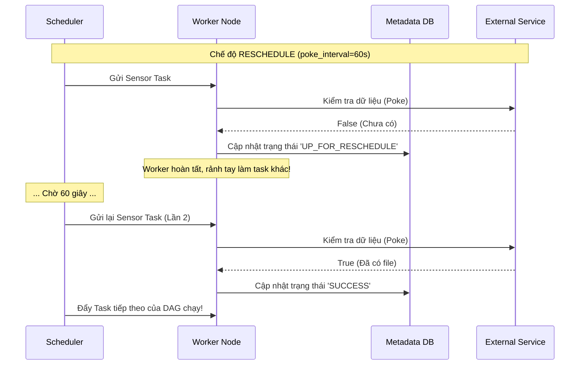

# Sensors - Tác vụ cảm biến chờ đợi

## Summary

Trong hệ thống điều phối (Orchestration) như Apache Airflow, đôi khi việc kích hoạt một luồng dữ liệu không dựa trên đồng hồ thời gian cứng nhắc, mà dựa trên sự sẵn sàng của một sự kiện bên ngoài (Ví dụ: Chờ đối tác upload file `.csv` lên S3, chờ một API trả về mã trạng thái `200`). **Sensors** (Tác vụ cảm biến) được sinh ra để giải quyết chính xác bài toán này. Chúng là một loại Operator đặc biệt, được thiết kế để liên tục theo dõi, kiểm tra (polling) một điều kiện nhất định và chỉ cho phép luồng công việc (DAG) tiếp tục chạy khi điều kiện đó được thỏa mãn.

---

## Definition

**Sensor** là một lớp con (Subclass) của Operator. Khác với Operator thông thường thực thi một công việc tĩnh rồi kết thúc ngay, Sensor có một vòng đời duy nhất: **Chờ đợi (Wait)**.

Nó hoạt động theo cơ chế Vòng lặp kiểm tra (Polling loop):
1. Đánh giá một biểu thức điều kiện (trả về True hoặc False).
2. Nếu `False`: Ngủ (sleep) một khoảng thời gian ngắn (ví dụ 60 giây). Sau đó lặp lại bước 1.
3. Nếu `True`: Kết thúc trạng thái `Running` bằng `Success` và nhả khóa (lock) để các Downstream Tasks chạy tiếp.

---

## Why it exists

Thử thách thường gặp trong Data Engineering: Bạn thỏa thuận với đối tác rằng họ sẽ gửi file dữ liệu vào S3 lúc 1h sáng. Bạn đặt lịch DAG chạy lúc `01:05`. Nhưng có hôm đối tác trễ, file đến lúc `01:30`.
* Nếu dùng BashOperator thuần túy: Nó chạy lúc 01:05, không thấy file, lập tức văng lỗi thất bại (Failed). Bạn phải tự vào bấm chạy lại bằng tay.
* Nếu dùng BashOperator kèm vòng lặp `while/sleep` trong Python: Tác vụ sẽ "treo" (hold) mãi mãi một Worker Slot (giữ tài nguyên của hệ thống) trong suốt 30 phút chờ đợi, làm lãng phí RAM/CPU vô ích.
* Dùng **S3KeySensor**: Nó được sinh ra với cơ chế quản lý trạng thái chờ đợi ưu việt, biết cách kiểm tra, biết cách nhả tài nguyên, biết khi nào hết hạn (timeout).

---

## Core idea

Sensors cung cấp một cách thanh lịch để biến các hệ thống dựa trên lịch trình tĩnh (Time-based scheduling) có khả năng tiệm cận với việc điều phối hướng sự kiện (Event-driven Orchestration). 

Các thông số cốt lõi định nghĩa vòng lặp của một Sensor bao gồm:
* `poke_interval`: Khoảng thời gian (giây) giữa mỗi lần "thức dậy" kiểm tra.
* `timeout`: Tổng thời gian tối đa được phép chờ đợi trước khi bỏ cuộc và ném ra cờ thất bại (hoặc skip).
* `mode`: Cơ chế chờ đợi (Cực kỳ quan trọng: `poke` hoặc `reschedule`).

---

## How it works (Poke vs Reschedule)

Cách Sensor ngốn tài nguyên hệ thống (Worker Slots) phụ thuộc hoàn toàn vào thông số `mode`:

1. **Chế độ `poke` (Mặc định)**:
   * **Cách hoạt động**: Worker nhận tác vụ $\rightarrow$ Chạy kiểm tra (False) $\rightarrow$ Lệnh cho luồng (thread) ngủ trong `poke_interval` $\rightarrow$ Thức dậy kiểm tra tiếp.
   * **Vấn đề**: Tác vụ này **giữ nguyên Worker Slot** trong toàn bộ quá trình ngủ. Hệ thống có 10 slots mà có 10 Sensors đang chạy ở mode poke, toàn bộ Airflow sẽ bị tê liệt (Deadlock), không có tác vụ nào khác chạy được. 
   * **Khi nào dùng**: Chỉ dùng khi khoảng thời gian chờ dự kiến rất ngắn (vài chục giây).

2. **Chế độ `reschedule`**:
   * **Cách hoạt động**: Worker nhận tác vụ $\rightarrow$ Chạy kiểm tra (False) $\rightarrow$ Sensor **ngay lập tức tự ngắt (thả Worker Slot ra)**, đổi trạng thái thành `UP_FOR_RESCHEDULE` và trả quyền điều khiển về cho Scheduler. 
   * Khi hết thời gian `poke_interval`, Scheduler bốc task này ném lại vào Worker (có thể là một Worker Node khác) để kiểm tra lần 2.
   * **Lợi ích**: Tiết kiệm tài nguyên tuyệt đối. 100 Sensors chờ đợi cũng không chiếm một Slot Worker nào.
   * **Khi nào dùng**: Dùng khi thời gian chờ dự kiến lâu (nhiều phút, hàng giờ).

---

## Architecture / Flow



---

## Practical example

Ví dụ Airflow chờ một tệp tin xuất hiện trên AWS S3 Bucket, kiểm tra mỗi 5 phút, nếu sau 2 tiếng không thấy thì báo lỗi:

```python
from airflow import DAG
from airflow.providers.amazon.aws.sensors.s3 import S3KeySensor
from airflow.operators.empty import EmptyOperator
from datetime import datetime, timedelta

with DAG(dag_id="wait_for_partner_data", start_date=datetime(2026, 6, 1)) as dag:

    # Khởi tạo Sensor
    wait_for_file = S3KeySensor(
        task_id="check_s3_file_exists",
        bucket_key="s3://partner-data-bucket/daily_dump/{{ ds }}/data.csv",
        aws_conn_id="aws_default",
        
        # Cấu hình Vòng lặp
        poke_interval=60 * 5,        # Đợi 5 phút giữa các lần kiểm tra
        timeout=60 * 60 * 2,         # Tổng thời gian tối đa: 2 giờ
        mode="reschedule",           # CỰC KỲ QUAN TRỌNG: Thả Worker trong lúc đợi
        soft_fail=True               # Nếu hết 2h (timeout), đánh dấu Skipped thay vì Failed
    )

    process_data = EmptyOperator(task_id="process_data")

    # Mối quan hệ: Chỉ process khi tệp đã tồn tại
    wait_for_file >> process_data
```

Các Sensor thông dụng khác:
* `ExternalTaskSensor`: Đợi một Task trong một DAG KHÁC hoàn thành. Rất hữu ích để liên kết nhiều DAG.
* `SqlSensor`: Chạy lệnh `SELECT COUNT(1)`. Nếu đếm $>0$ thì cho qua.
* `HttpSensor`: Gọi API, chờ nhận Response Code `200`.

---

## Best practices

* **LUÔN LUÔN dùng `mode='reschedule'`**: Trừ khi bạn chắc chắn việc chờ đợi chỉ tính bằng giây. Nếu không, kiến trúc Sensor sẽ nhanh chóng đánh sập hệ thống (Deadlock) vì cạn kiệt Worker Slots.
* **Thay thế Sensor bằng Deferrable Operators (Async/Await)**: Ở các bản Airflow hiện đại (2.2+), bạn nên dùng Deferrable Operators. Nó dùng kiến trúc bất đồng bộ (Asynchronous) của Python (`asyncio`) và chạy trên một tiến trình riêng gọi là `Triggerer`. Nó tiết kiệm RAM còn hơn cả mode `reschedule` (không phải liên tục khởi động lại task trên worker).
* **Luôn thiết lập Timeout hợp lý**: Mặc định timeout của Sensor là 7 ngày! Nếu bạn quên set, Sensor sẽ nằm kẹt ở trạng thái Reschedule nguyên một tuần, tích tụ hàng trăm task ma trên UI. Hãy set timeout sát với SLA nghiệp vụ (ví dụ 3 giờ).

---

## Common mistakes

* **Sensor Deadlock (Bế tắc cảm biến)**: Sử dụng mode `poke`, có 16 task slots. Lịch chạy 16 DAGs đồng thời, tạo ra 16 Sensors đang Poke ngủ chờ file. Tất cả 16 Slots bị chiếm dụng hoàn toàn. Các Task tải file thực sự (đáng lẽ tạo ra file để Sensor check) bị kẹt trong Queue vì không còn Slot để chạy. Cả hệ thống đứng hình vĩnh viễn (Deadlock) cho đến khi Timeout bị kích hoạt.
* **Lỗi tham chiếu ExternalTaskSensor**: Dùng `ExternalTaskSensor` để chờ DAG khác, nhưng không đồng bộ được "Execution Date". Sensor chỉ mặc định kiểm tra Task của DAG B có TRÙNG `execution_date` với DAG A hay không. Nếu hai DAG lệch giờ lập lịch, Sensor sẽ báo lỗi mãi mãi. Cần dùng cấu hình `execution_date_fn` để ánh xạ mốc thời gian.

---

## Trade-offs

### Ưu điểm
* Mở khóa khả năng Event-driven một phần cho kiến trúc Batch Scheduler.
* Dễ sử dụng, được xây dựng sẵn hàng chục Sensors kết nối thẳng vào Cloud providers.

### Nhược điểm
* **Trì hoãn giả tạo (Polling Latency)**: Bản chất của Sensor vẫn là Polling (hỏi liên tục). Nếu file đến lúc phút thứ 1, mà `poke_interval` là 5 phút, thì ở phút thứ 5 hệ thống mới nhận ra và chạy tiếp. Nó không thể là "Real-time" như Push model (Event-driven xịn như AWS Lambda).
* Tốn tài nguyên điều phối (Scheduler Overhead) khi dùng `reschedule` do việc ném task ra/vào Database lặp đi lặp lại hàng trăm lần.

---

## When to use

* Chờ dữ liệu bên ngoài từ đối tác FTP, S3, API.
* Thiết lập phụ thuộc liên-DAG (Inter-DAG Dependencies) khi bạn chia nhỏ Mega-DAG thành nhiều Sub-DAGs. DAG B dùng ExternalTaskSensor đợi DAG A tải Staging xong thì mới chạy dbt models.

## When not to use

* Khi hệ thống nguồn có khả năng "Push" (đẩy thông báo sự kiện). Thay vì dùng Airflow tạo Sensor hỏi liên tục 24/7, hãy thiết lập một AWS Lambda (kích hoạt bởi S3 ObjectCreated) gõ thẳng vào `REST API của Airflow` để Trigger DAG ngay tức thì. Mô hình Push luôn ưu việt hơn Polling.

---

## Related concepts

* [Apache Airflow](/concepts/apache-airflow)
* [Orchestration](/concepts/orchestration)
* [Task Dependency](/concepts/task-dependency)

---

## Interview questions

### 1. Sự khác biệt giữa `mode="poke"` và `mode="reschedule"` trong Airflow Sensor là gì?
* **Người phỏng vấn muốn kiểm tra**: Hiểu biết sống còn để thiết kế hệ thống Airflow chống ngập tài nguyên.
* **Gợi ý trả lời (Strong Answer)**: Chế độ `poke` (mặc định) khi chờ đợi (sleep) vẫn sẽ khóa (hold) chặt một Worker Slot của hệ thống, điều này tốt cho các task chờ cực ngắn (vài giây), nhưng gây cạn kiệt tài nguyên (Deadlock) nếu chờ lâu. Chế độ `reschedule` thông minh hơn, khi kiểm tra thấy điều kiện chưa thỏa mãn, nó lập tức giải phóng Worker Slot, ném trạng thái tác vụ ngược lại cho Database, và nhờ Scheduler hẹn giờ gọi lại sau `poke_interval`. Reschedule tiết kiệm tài nguyên tuyệt đối cho các cảm biến chờ hàng giờ liền.
* **Lỗi cần tránh**: Trả lời mơ hồ không nhắc đến từ khóa "Worker Slot".

### 2. Sensor Deadlock (Bế tắc hệ thống do Sensor) xảy ra như thế nào?
* **Người phỏng vấn muốn kiểm tra**: Kinh nghiệm gỡ rối (Troubleshooting) khi hệ thống sập.
* **Gợi ý trả lời (Strong Answer)**: Deadlock xảy ra khi số lượng Sensor (chạy bằng mode `poke`) được sinh ra cùng lúc LỚN HƠN hoặc BẰNG tổng số Worker Slots khả dụng của toàn bộ cluster Airflow. Lúc này, toàn bộ công nhân của hệ thống đều đang đứng "Ngủ" chờ đợi. Không còn công nhân nào rảnh rỗi để thực thi các tác vụ tạo ra dữ liệu (nhằm giải phóng Sensor). Hệ thống đứng cứng ngắc cho đến khi Timeout xảy ra. Cách phòng ngừa là đổi sang mode `reschedule` hoặc áp dụng Sensor Pool (giới hạn số lượng Sensor được chạy tối đa).

### 3. Deferrable Operators (hay Async Sensors) giải quyết nhược điểm gì của Reschedule Sensors?
* **Người phỏng vấn muốn kiểm tra**: Kiến thức cập nhật về phiên bản Airflow mới (2.2+).
* **Gợi ý trả lời (Strong Answer)**: Tuy `reschedule` không giữ Worker, nhưng mỗi lần nó thức dậy kiểm tra (ví dụ mỗi phút), Scheduler lại tốn công đẩy nó vào Queue, Worker mất thời gian cấp phát container, load thư viện Python, chỉ để chạy hàm kiểm tra trong 0.1 giây rồi tắt. Nó gây ra chi phí quản lý (Overhead) DB cực lớn. Kiến trúc Async/Deferrable chuyển phần việc "chờ đợi" cho một tiến trình trung tâm gọi là `Triggerer` viết bằng `asyncio`. Một Triggerer duy nhất dùng luồng bất đồng bộ có thể gánh hàng trăm ngàn tác vụ chờ I/O mạng cùng lúc với chi phí phần cứng gần bằng không, loại bỏ hoàn toàn gánh nặng cấp phát lại task của Reschedule.

### 4. Thông số `soft_fail=True` dùng để làm gì trong Sensor?
* **Người phỏng vấn muốn kiểm tra**: Xử lý logic nghiệp vụ ngoại lệ.
* **Gợi ý trả lời (Strong Answer)**: Mặc định, nếu Sensor chờ hết thời gian `timeout` mà điều kiện vẫn False, nó sẽ đánh dấu là Failed (lỗi màu đỏ), làm các Downstream bị hủy, sinh ra cảnh báo gửi mail đến trực ban. Đôi khi, việc file không xuất hiện là bình thường (ví dụ hôm nay là ngày lễ, không có giao dịch). Thiết lập `soft_fail=True` làm cho Sensor khi timeout sẽ đổi màu sang Skipped (màu hồng). Các task phía sau tự động bị skip gọn gàng mà không tạo ra bất kỳ cảnh báo lỗi giả (False Alarm) nào làm phiền kỹ sư.

### 5. Tại sao ExternalTaskSensor thường hay thất bại dù DAG nguồn đã chạy thành công?
* **Người phỏng vấn muốn kiểm tra**: Hiểu sâu về khái niệm thời gian thực thi (Execution Date Alignment).
* **Gợi ý trả lời (Strong Answer)**: ExternalTaskSensor dùng Execution Date làm khóa liên kết. Mặc định, DAG B (Sensor) kỳ vọng DAG A (Mục tiêu) có *chính xác cùng một mốc Execution Date (đến từng mili-giây)*. Nếu DAG A lịch `@daily` kích hoạt lúc 00:00, nhưng DAG B lịch `0 1 * * *` kích hoạt lúc 01:00. Sensor của DAG B sẽ tìm kiếm Task thành công lúc 01:00 của DAG A và dĩ nhiên không thấy, dẫn đến Fail. Để khắc phục, ta phải dùng tham số `execution_delta` hoặc `execution_date_fn` trong Sensor để trừ lùi 1 giờ, ép Sensor nhìn đúng mốc 00:00 của DAG A.

---

## References

1. **Airflow Official Documentation** - Sensors & Deferrable Operators.
2. **Astronomer Guides** - Airflow Sensors overview.

---

## English summary

In Apache Airflow, **Sensors** are a specialized subclass of Operators designed to continuously poll for an external event (e.g., a file landing in an S3 bucket or an API endpoint returning data) before allowing the downstream DAG to proceed. Crucially, sensors must be configured properly using the `mode` parameter. Using the default `poke` mode blocks an execution worker slot entirely while sleeping, which can quickly lead to cluster deadlock. Using `reschedule` mode frees the worker slot between checks, drastically saving resources for long-running waits. Modern Airflow pushes this further with Deferrable (Async) Operators, using asynchronous Python to handle thousands of idle waits on a single thread without overloading the scheduler database.
