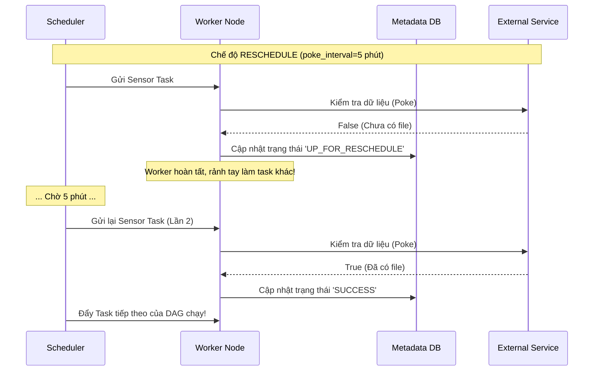

# Sensors - Tác vụ cảm biến chờ đợi

Trong công việc của một Data Engineer, việc lập lịch chạy job dựa trên thời gian cứng nhắc (ví dụ: cứ đúng 1 giờ sáng là chạy) thường tiềm ẩn rất nhiều rủi ro. Thực tế, luồng dữ liệu của bạn thường phụ thuộc vào các yếu tố ngoại cảnh: chờ đối tác tải file báo cáo lên AWS S3, chờ hệ thống CRM xuất dữ liệu xong, hoặc chờ một API bên thứ ba phản hồi thành công. 

Nếu hệ thống nguồn bị chậm trễ, pipeline của bạn chắc chắn sẽ sập vì không tìm thấy dữ liệu. Để giải quyết bài toán "chờ đợi" này một cách thông minh, các công cụ điều phối (Orchestration) như Apache Airflow đã cung cấp một tính năng cực kỳ hữu ích: **Sensors (Tác vụ cảm biến)**.

## Sensors là gì? Người lính gác cổng cho các luồng dữ liệu

Nói một cách đơn giản, **Sensor** là một loại Operator đặc biệt trong Airflow nhưng có vòng đời duy nhất: **Chờ đợi (Wait)**. Thay vì thực thi một tác vụ tính toán rồi kết thúc ngay, Sensor đóng vai trò như một người lính gác cổng. Nó liên tục kiểm tra một điều kiện cụ thể (quá trình này gọi là *polling*) và chỉ cho phép các tác vụ tiếp theo (downstream tasks) chạy khi điều kiện đó được thỏa mãn (trả về `True`).

Quy trình kiểm tra diễn ra theo vòng lặp:
1. Sensor "thức dậy" và kiểm tra điều kiện (Ví dụ: File đã có trên S3 chưa?).
2. Nếu chưa có (`False`): Nó sẽ đi ngủ một lát (khoảng thời gian do bạn cấu hình). Sau đó lặp lại bước 1.
3. Nếu đã có (`True`): Sensor báo trạng thái thành công (`Success`) và nhường đường cho các tác vụ tiếp theo hoạt động.

## Tại sao chúng ta cần Sensors?

Hãy tưởng tượng bạn thỏa thuận với đối tác rằng họ sẽ gửi file dữ liệu vào lúc 1h sáng. Bạn đặt lịch DAG chạy lúc `01:05`. Nhưng thực tế, có hôm đối tác gặp sự cố và file chỉ đến lúc `01:30`.

* **Nếu dùng Operator thông thường (như BashOperator)**: Lúc 01:05, tác vụ chạy kiểm tra, không thấy file, pipeline lập tức báo lỗi đỏ (`Failed`). Bạn sẽ bị đánh thức lúc nửa đêm và phải bấm chạy lại bằng tay.
* **Nếu tự viết vòng lặp `while/sleep` trong Python**: Tác vụ sẽ "treo" và giữ chặt tài nguyên của Worker Slot trong suốt 30 phút chờ đợi. Nếu hệ thống có nhiều DAG cùng chờ như vậy, toàn bộ hạ tầng sẽ bị nghẽn vì không còn chỗ cho các tác vụ thực sự xử lý dữ liệu.
* **Dùng Sensors chuyên dụng (ví dụ: S3KeySensor)**: Hệ thống được tích hợp sẵn khả năng quản lý trạng thái chờ đợi, biết cách tự động giải phóng tài nguyên khi ngủ, và biết khi nào nên bỏ cuộc nếu quá thời gian chờ (timeout).

## Poke vs Reschedule: Cuộc chiến tối ưu tài nguyên

Cách Sensor tiêu thụ tài nguyên của hệ thống phụ thuộc hoàn toàn vào chế độ (mode) hoạt động mà bạn cấu hình:

### 1. Chế độ `poke` (Mặc định)
* **Cơ chế**: Worker nhận task $\rightarrow$ Kiểm tra điều kiện $\rightarrow$ Nếu chưa đạt, Sensor bắt luồng xử lý (thread) ngủ trong khoảng thời gian `poke_interval` $\rightarrow$ Thức dậy kiểm tra tiếp.
* **Vấn đề**: Trong suốt thời gian ngủ, Sensor **giữ khư khư Worker Slot**. Nếu cluster của bạn chỉ giới hạn 10 task chạy đồng thời mà có 10 Sensors đang chạy ở chế độ `poke` để chờ file, toàn bộ hệ thống Airflow sẽ rơi vào trạng thái bế tắc (**Deadlock**). Không một task nào khác có thể bắt đầu chạy.
* **Lời khuyên**: Chỉ dùng `poke` khi bạn chắc chắn thời gian chờ đợi cực kỳ ngắn (vài chục giây).

### 2. Chế độ `reschedule`
* **Cơ chế**: Worker nhận task $\rightarrow$ Kiểm tra điều kiện $\rightarrow$ Nếu chưa đạt, Sensor **ngay lập tức giải phóng Worker Slot**, chuyển trạng thái của mình thành `UP_FOR_RESCHEDULE` và trả quyền kiểm soát lại cho Scheduler. 
* Khi hết thời gian chờ (`poke_interval`), Scheduler sẽ bốc task này nạp lại vào hàng đợi để một Worker rảnh rỗi kiểm tra lần tiếp theo.
* **Lợi ích**: Tiết kiệm tài nguyên tối đa. Bạn có thể treo hàng trăm Sensors chờ đợi mà không làm nghẽn hệ thống.
* **Lời khuyên**: Luôn ưu tiên dùng `reschedule` cho các tác vụ chờ đợi lâu (vài phút đến vài giờ).

### Luồng hoạt động của chế độ Reschedule:



## Ví dụ thực tế: Thiết lập S3KeySensor trong Airflow

Dưới đây là một ví dụ thực tế cấu hình một Sensor chờ đợi file báo cáo từ đối tác xuất hiện trên AWS S3. Hệ thống sẽ kiểm tra mỗi 5 phút, nếu sau 2 tiếng vẫn không thấy file thì sẽ tự động bỏ qua (skip) thay vì báo lỗi đỏ:

```python
from airflow import DAG
from airflow.providers.amazon.aws.sensors.s3 import S3KeySensor
from airflow.operators.empty import EmptyOperator
from datetime import datetime, timedelta

with DAG(dag_id="wait_for_partner_data", start_date=datetime(2026, 6, 1)) as dag:

    # Khởi tạo Sensor chờ file
    wait_for_file = S3KeySensor(
        task_id="check_s3_file_exists",
        bucket_key="s3://partner-data-bucket/daily_dump/{{ ds }}/data.csv",
        aws_conn_id="aws_default",
        
        # Cấu hình vòng lặp chờ đợi
        poke_interval=60 * 5,        # Chờ 5 phút giữa mỗi lần kiểm tra
        timeout=60 * 60 * 2,         # Giới hạn thời gian chờ tối đa: 2 giờ
        mode="reschedule",           # TỐI ƯU: Giải phóng worker trong lúc đợi
        soft_fail=True               # Nếu quá 2h, chuyển sang Skipped thay vì Failed
    )

    process_data = EmptyOperator(task_id="process_data")

    # Mối quan hệ: Chỉ xử lý khi tệp đã tồn tại
    wait_for_file >> process_data
```

Bên cạnh kiểm tra file, Airflow còn cung cấp rất nhiều loại Sensor tiện ích khác:
* `ExternalTaskSensor`: Chờ một tác vụ ở một DAG **khác** hoàn thành xong rồi mới chạy. Rất thích hợp để liên kết các luồng dữ liệu độc lập.
* `SqlSensor`: Chạy một câu lệnh SQL (ví dụ: `SELECT COUNT(1) FROM staging_table`). Nếu kết quả trả về lớn hơn 0 thì coi như thành công.
* `HttpSensor`: Gọi một API endpoint và chờ cho đến khi nhận được mã phản hồi `200 OK`.

## Những kinh nghiệm xương máu khi làm việc với Sensors

* **Luôn thiết lập Timeout hợp lý**: Mặc định, timeout của Sensor trong Airflow là... 7 ngày! Nếu bạn không cấu hình, một Sensor bị kẹt có thể chạy hoài trong một tuần, làm nghẽn hàng loạt tài nguyên quản lý. Hãy đặt timeout sát với yêu cầu nghiệp vụ thực tế (ví dụ: 2 đến 3 tiếng).
* **Sử dụng `soft_fail=True` khi cần thiết**: Đôi khi việc không có dữ liệu là bình thường (ví dụ: ngày lễ hệ thống không phát sinh giao dịch). Đặt `soft_fail=True` giúp Sensor khi bị quá giờ (timeout) sẽ đổi sang màu hồng (`Skipped`) thay vì báo lỗi đỏ (`Failed`), giúp bạn không bị làm phiền bởi những cảnh báo ảo.
* **Nâng cấp lên Deferrable Operators (Async Sensors)**: Nếu bạn dùng các phiên bản Airflow mới (2.2+), hãy tìm hiểu **Deferrable Operators**. Thay vì tạo ra các task chạy đi chạy lại trên Worker, Deferrable Operators sử dụng thư viện lập trình bất đồng bộ (`asyncio`) để đẩy toàn bộ tác vụ chờ đợi vào một tiến trình siêu nhẹ gọi là `Triggerer`. Một Triggerer có thể gánh hàng ngàn luồng chờ với chi phí CPU/RAM gần như bằng không.
* **Hạn chế Polling bằng cách chuyển sang mô hình Push**: Bản chất của Sensor là đi hỏi liên tục (Polling), dẫn đến độ trễ (ví dụ: file đến ở phút thứ 1 nhưng đến phút thứ 5 Sensor mới kiểm tra). Nếu có thể, hãy chuyển sang mô hình đẩy (Push): Cấu hình một sự kiện trên AWS S3 (S3 Event Notification) kích hoạt một AWS Lambda, gõ trực tiếp vào REST API của Airflow để kích hoạt DAG ngay lập tức khi file vừa cập bến.

## Khái niệm liên quan

* [Apache Airflow](/concepts/apache-airflow): Nền tảng điều phối dữ liệu mã nguồn mở.
* [Orchestration](/concepts/orchestration): Quy trình tự động hóa các luồng công việc.
* [Task Dependency](/concepts/task-dependency): Thiết lập sự phụ thuộc giữa các tác vụ.

## Góc phỏng vấn: Vượt qua các câu hỏi hóc búa về Sensors

### 1. Phân biệt cơ chế hoạt động của `mode="poke"` và `mode="reschedule"`.
* **Gợi ý trả lời**: 
  * Chế độ `poke` giữ nguyên Worker Slot trong suốt toàn bộ chu kỳ sống của Sensor (kể cả lúc nó đang sleep). Cách này chỉ phù hợp cho các task chờ cực ngắn (dưới 1 phút).
  * Chế độ `reschedule` sau khi kiểm tra thấy điều kiện chưa đạt sẽ lập tức giải phóng Worker Slot, cập nhật trạng thái tác vụ lên database và kết thúc phiên chạy hiện tại. Khi hết thời gian giãn cách (`poke_interval`), Scheduler sẽ kích hoạt và phân bổ Sensor chạy lại. Đây là cách tối ưu để tránh tình trạng cạn kiệt tài nguyên của hệ thống Airflow khi phải chờ đợi lâu.

### 2. Sensor Deadlock là gì? Làm cách nào để phát hiện và phòng tránh?
* **Gợi ý trả lời**: Sensor Deadlock xảy ra khi số lượng Sensor chạy ở chế độ `poke` hoạt động đồng thời lớn hơn hoặc bằng tổng số Worker Slots khả dụng của hệ thống Airflow. Lúc này, toàn bộ worker đều bị chiếm dụng bởi các Sensor đang ngủ chờ đợi. Hệ thống rơi vào trạng thái bế tắc vì không còn worker nào rảnh để chạy các task sinh ra dữ liệu (thứ giúp giải phóng Sensor).
  Để phòng tránh, chúng ta có thể:
  1. Chuyển tất cả Sensors sang chế độ `reschedule` hoặc sử dụng Deferrable Operators.
  2. Gom nhóm các Sensors vào một `Pool` riêng biệt và giới hạn số lượng chạy đồng thời nhỏ hơn dung lượng của hệ thống.

### 3. Tại sao ExternalTaskSensor thường xuyên bị kẹt ở trạng thái chờ mặc dù DAG mục tiêu đã chạy thành công?
* **Gợi ý trả lời**: Nguyên nhân phổ biến nhất là do sự không đồng nhất về **Execution Date (Logical Date)**. Mặc định, `ExternalTaskSensor` yêu cầu DAG đích phải có thời điểm chạy (`logical_date`) trùng khớp chính xác từng mili-giây với DAG hiện tại. 
  Nếu hai DAG được lập lịch chạy lệch giờ nhau (ví dụ: DAG nguồn chạy lúc 0h, DAG đích chạy lúc 1h), Sensor sẽ không thể tìm thấy phiên bản thành công của DAG nguồn. Để xử lý, ta cần định cấu hình tham số `execution_delta` hoặc truyền một hàm logic vào `execution_date_fn` để dịch chuyển thời gian đối chiếu của Sensor về đúng mốc chạy của DAG nguồn.

## Tài liệu tham khảo

1. **Airflow Official Documentation** - Sensors & Deferrable Operators.
2. **Astronomer Guides** - Airflow Sensors overview.

## English Summary

In Apache Airflow, **Sensors** are a specialized subclass of Operators designed to continuously poll for an external event (e.g., a file landing in an S3 bucket or an API endpoint returning data) before allowing the downstream DAG to proceed. Crucially, sensors must be configured properly using the `mode` parameter. Using the default `poke` mode blocks an execution worker slot entirely while sleeping, which can quickly lead to cluster deadlock. Using `reschedule` mode frees the worker slot between checks, drastically saving resources for long-running waits. Modern Airflow pushes this further with Deferrable (Async) Operators, using asynchronous Python to handle thousands of idle waits on a single thread without overloading the scheduler database.
