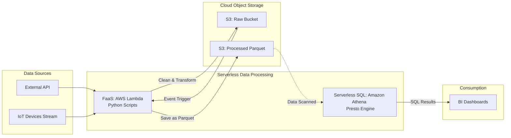

# Xử lý dữ liệu không máy chủ - Serverless Data Processing

Trước đây, khi bắt tay vào một dự án phân tích dữ liệu lớn, việc đầu tiên bạn phải làm là dự toán xem mình cần mua bao nhiêu máy chủ vật lý, hoặc thuê bao nhiêu máy ảo trên mây. Sau đó là hàng chuỗi ngày cấu hình hệ điều hành, cài đặt mạng, phân bổ RAM, CPU. 

Nhưng ngày nay, nhờ có sự phát triển của điện toán đám mây, các Data Engineer đã có thể bỏ qua toàn bộ những bước phức tạp đó để tập trung hoàn toàn vào việc viết code hoặc câu lệnh SQL. Mô hình này được gọi là **Serverless Data Processing (Xử lý dữ liệu không máy chủ)**.

## Serverless là gì? Khi máy chủ trở nên "vô hình"

Cần phải làm rõ một điều: **Serverless** không có nghĩa là không có máy chủ. Dữ liệu của bạn vẫn được xử lý trên những dàn máy chủ vật lý khổng lồ đặt tại các trung tâm dữ liệu của AWS, Google hay Microsoft. Bản chất của Serverless ở đây là **sự trừu tượng hóa (abstraction)** – hạ tầng máy chủ đã được ẩn đi hoàn toàn đối với bạn.

Một công cụ xử lý dữ liệu được coi là Serverless thực sự khi đáp ứng đủ 3 tiêu chuẩn vàng:
1. **Không cần cấp phát trước (Zero Provisioning)**: Bạn không cần lựa chọn cấu hình máy chủ, số lượng node hay dung lượng RAM/CPU từ trước khi chạy.
2. **Tự động co giãn (Auto-Scaling)**: Hệ thống tự động huy động hàng nghìn CPU ngay khi bạn chạy một truy vấn cực lớn, và lập tức thu hồi về $0$ (Scale to zero) khi chạy xong.
3. **Trả tiền theo mức sử dụng thực tế (Pay-as-you-go)**: Bạn không phải trả tiền thuê máy theo giờ. Chi phí chỉ được tính dựa trên dung lượng dữ liệu bị quét qua (Data Scanned), số lượng giao dịch, hoặc số giây tính toán thực tế. Khi bạn không chạy truy vấn nào, chi phí tính toán bằng $0$.

## Tại sao mô hình Serverless ra đời? Giải bài toán "nuôi xe buýt riêng"

Trước khi có Serverless, việc thiết lập một Data Pipeline (như cài cụm Hadoop hoặc thuê máy chủ ảo AWS EC2) giống như việc bạn phải bỏ tiền mua một chiếc xe buýt riêng chỉ để đi làm hàng ngày:

* **Bài toán dự báo năng lực (Capacity Planning)**: Bạn phải đau đầu đoán trước dung lượng dữ liệu trong tương lai. Nếu ước lượng quá thấp, hệ thống sẽ sập trong các ngày sự kiện mua sắm lớn. Nếu ước lượng quá cao, dàn máy chủ đắt đỏ sẽ ngồi chơi xơi nước và ngốn của doanh nghiệp hàng ngàn USD mỗi tháng.
* **Gánh nặng vận hành (Operational Overhead)**: Thay vì tập trung viết logic xử lý dữ liệu (ETL/ELT), các Data Engineer phải dành tới một nửa thời gian làm công việc của quản trị hệ thống: vá lỗi bảo mật hệ điều hành, nâng cấp ổ cứng, sửa lỗi mạng, hoặc thay thế các ổ đĩa bị hỏng.

Mô hình Serverless xuất hiện tương tự như dịch vụ gọi xe công nghệ. Bạn chỉ gọi xe khi có nhu cầu di chuyển. Bạn có thể chọn xe nhỏ hoặc xe tải tùy lượng hành lý (dữ liệu). Hãng xe tự lo xăng cộ và bảo dưỡng. Đến nơi, bạn thanh toán đúng số tiền của cuốc xe đó rồi bước xuống, không cần bận tâm gì thêm.

## Nguyên lý cốt lõi: Khi tính toán và lưu trữ "ly dị"

Bí quyết giúp Serverless Data Processing có sức mạnh mở rộng kinh ngạc chính là **Sự phân tách hoàn toàn giữa Lưu trữ và Tính toán (Decoupling of Storage and Compute)**.

* **Lớp lưu trữ (Storage)**: Dữ liệu được lưu trữ vĩnh viễn ở các dịch vụ lưu trữ đối tượng siêu rẻ và bền bỉ (như Amazon S3 hay Google Cloud Storage).
* **Lớp tính toán (Compute)**: Các máy chủ tính toán nằm lơ lửng trên đám mây và chỉ hoạt động theo sự kiện (Event-driven). Khi có file mới được thả vào S3 hoặc khi bạn nhấn nút "Run" trên dashboard, hệ thống Serverless mới khởi động, lấy code của bạn ra xử lý, đọc ghi dữ liệu trên lớp lưu trữ, rồi tự giải phóng.

## Các dạng công cụ Serverless Data Processing phổ biến

Trong thực tế, bạn sẽ thường gặp hai loại công cụ Serverless chính:

### 1. Function-as-a-Service (FaaS) cho các luồng xử lý hướng sự kiện (Event-driven)
*Tiêu biểu: AWS Lambda, Google Cloud Functions.*
Bạn viết một hàm Python (ví dụ: đọc file JSON, trích xuất thông tin và chuyển đổi thành CSV). Bạn cấu hình: *"Mỗi khi có file mới rơi vào S3 Raw Bucket, hãy gọi hàm này"*. Nếu có 1 file đến, 1 hàm chạy. Nếu có 1,000 file đến cùng lúc, đám mây tự động nhân bản 1,000 hàm chạy song song để giải quyết lập tức.

### 2. Serverless SQL Engines cho phân tích Dữ liệu Lớn (Big Data Analytics)
*Tiêu biểu: Google BigQuery, Amazon Athena.*
Bạn chỉ cần viết một câu lệnh SQL phức tạp trên giao diện web và ấn Run. Ở phía sau, nhà cung cấp đám mây tự động huy động hàng nghìn CPU nhàn rỗi để quét song song hàng tỷ dòng dữ liệu, trả kết quả cho bạn sau vài giây và chỉ thu phí dựa trên lượng Terabytes dữ liệu mà câu SQL đó quét qua.



## So sánh thực tế: Bài toán xử lý 500GB log

Hãy tưởng tượng bạn cần đếm số lượng người dùng truy cập theo từng quốc gia từ 500GB log lưu trên Amazon S3.

### Hướng đi truyền thống (Non-Serverless)
Bạn phải lên AWS tạo một cụm máy ảo EMR (Elastic MapReduce) gồm 1 node chính và 5 node phụ. Bạn phải chờ khoảng 15 phút để các máy ảo khởi động xong rồi mới submit job Spark lên chạy. Khi job chạy xong sau 30 phút, **nếu bạn quên tắt cụm máy ảo**, chúng sẽ tiếp tục chạy vô ích suốt ngày nghỉ cuối tuần và gửi cho bạn một hóa đơn trị giá 500 USD.

### Hướng đi Serverless (Dùng Amazon Athena)
Bạn chỉ cần mở giao diện Athena và gõ trực tiếp câu lệnh SQL:
```sql
SELECT country, COUNT(*) as visits 
FROM s3_web_logs_table 
GROUP BY country;
```
Nhấn Run. Chờ khoảng 10 giây để nhận kết quả. Chi phí bạn phải trả là đúng 2.5 USD (vì đơn giá của Athena là 5 USD cho mỗi Terabyte dữ liệu được quét qua). Xong việc, bạn không cần bận tâm tắt máy hay dọn dẹp gì cả.

## Nghệ thuật kiểm soát chi phí và tối ưu hóa hệ thống Serverless

Mặc dù Serverless mang lại sự tiện lợi tối đa, nó cũng đi kèm với một số cạm bẫy mà bạn cần lưu ý:

* **Cảnh giác với "hóa đơn sốc"**: Vì Serverless tự co giãn quá tốt, một câu lệnh SQL tồi (ví dụ: gõ `SELECT *` trên một bảng dữ liệu 100 Petabyte không được phân vùng trên BigQuery) có thể đốt cháy thẻ tín dụng của bạn hàng ngàn USD chỉ trong vài chục giây. Luôn thiết lập hạn mức chi phí (Billing Alerts / Quotas) cho từng người dùng.
* **Tối ưu hóa định dạng lưu trữ**: Vì các công cụ Serverless SQL tính phí dựa trên lượng dữ liệu quét qua, hãy luôn lưu trữ dữ liệu dưới dạng cột (Columnar Formats như Parquet hoặc ORC) và chia phân vùng (Partitioning) hợp lý. Kỹ thuật này giúp giảm lượng dữ liệu quét từ hàng Terabyte xuống vài Megabyte, tiết kiệm đến 99% chi phí.
* **Tránh các tác vụ chạy quá lâu (Long-running tasks)**: Các dịch vụ FaaS như AWS Lambda luôn có giới hạn thời gian chạy tối đa (thường là 15 phút). Đừng dùng Lambda để huấn luyện các mô hình Machine Learning chạy mất nhiều tiếng đồng hồ. Thay vào đó, hãy dùng các dịch vụ Container chuyên dụng (AWS ECS hoặc AWS Batch).
* **Khởi động lạnh (Cold Starts)**: Khi không có yêu cầu nào trong thời gian dài, hệ thống Serverless sẽ tự giải phóng hoàn toàn máy chủ xử lý. Đến khi request mới xuất hiện, hệ thống cần vài giây để dựng lại môi trường. Nếu ứng dụng của bạn yêu cầu độ trễ cực thấp (dưới 10ms), mô hình Serverless có thể không phải là lựa chọn tối ưu.
* **Quá tải kết nối (Database Connection Exhaustion)**: Nếu bạn khởi chạy 10,000 hàm Lambda song song để chèn dữ liệu trực tiếp vào một cơ sở dữ liệu quan hệ (như MySQL), số lượng kết nối khổng lồ này sẽ ngay lập tức làm sập MySQL. Hãy sử dụng hàng đợi (như SQS hoặc Kafka) để làm bộ đệm điều tiết tải.

| Tiêu chí | Máy ảo truyền thống (EC2 / VM) | Xử lý Serverless (Lambda / Athena) |
| :--- | :--- | :--- |
| **Cấp phát** | Chọn cấu hình và bật máy trước | Tự động phân bổ tức thì |
| **Cách tính phí** | Thuê theo giờ/tháng cố định | Tính theo thực tế xử lý / dữ liệu quét |
| **Vận hành** | Phải tự vá lỗi OS, quản trị hệ thống | Không cần vận hành hạ tầng (No Ops) |
| **Phù hợp** | Job chạy liên tục 24/7, ML training | Job chạy gián đoạn, Event-driven, Ad-hoc query |

## Các khái niệm liên quan

* [Google BigQuery](/concepts/google-bigquery): Kho dữ liệu Serverless hiệu năng cao của Google.
* [Cloud Object Storage](/concepts/cloud-storage): Dịch vụ lưu trữ đối tượng trên mây.
* **Định dạng dữ liệu dạng cột (Columnar Data)**: Tiêu biểu như Parquet, ORC.

## Góc phỏng vấn: Chinh phục Serverless

### 1. Tại sao nói "Serverless Data Warehouse" (như BigQuery) tính tiền dựa trên lượng dữ liệu được quét (Data scanned) thay vì lượng dữ liệu được trả về (Data returned)?
* **Gợi ý trả lời**: Để trả về kết quả cuối cùng (thậm chí chỉ là 1 dòng tổng doanh thu), hệ thống Serverless phải huy động hàng loạt node tính toán ở phía sau để đọc (I/O) và xử lý một lượng dữ liệu thô khổng lồ. Tài nguyên phần cứng thực sự tiêu hao (CPU, điện năng, băng thông mạng nội bộ) nằm ở khâu quét dữ liệu. Vì vậy, việc viết một câu lệnh `SELECT * FROM table LIMIT 10` vẫn sẽ tính phí quét trên toàn bộ bảng dữ liệu nếu bảng đó không được phân vùng hợp lý, bởi vì công cụ cần quét qua dữ liệu trước khi thực hiện bộ lọc `LIMIT`.

### 2. Sự khác biệt cơ bản giữa việc chạy mã Python trên máy ảo EC2 và trên AWS Lambda là gì?
* **Gợi ý trả lời**: 
  * **AWS EC2** là một máy ảo chuyên dụng, chạy liên tục cho đến khi bạn tắt nó đi. Bạn có toàn quyền truy cập hệ điều hành (SSH), tự cài đặt Python, thư viện và tự cấu hình mở rộng. Chi phí tính theo giờ chạy máy, phù hợp cho các tác vụ tính toán dài hạn hoặc liên tục 24/7.
  * **AWS Lambda** là dịch vụ FaaS (Function-as-a-Service). Nó tự động dựng môi trường lên trong vài mili-giây khi có sự kiện kích hoạt, chạy đoạn code tối đa trong 15 phút rồi tự biến mất. Chi phí tính theo số mili-giây chạy thực tế. Nó là dịch vụ không lưu trạng thái (stateless) và bạn không thể can thiệp vào hệ điều hành bên dưới.

## Tài liệu tham khảo

1. **Google Cloud Serverless Computing** - Khái niệm cơ bản từ nhà cung cấp.
2. **AWS Lambda Documentation** - The Serverless architecture paradigm.
3. **Designing Data-Intensive Applications** - Martin Kleppmann (Lý thuyết về sự phát triển của hệ thống phân tán).

## English Summary

Serverless Data Processing is a cloud computing paradigm where the cloud provider dynamically manages the allocation and provisioning of servers, completely abstracting the infrastructure layer away from data engineers. Characterized by zero provisioning, infinite auto-scaling, and pay-as-you-go pricing (costing nothing when idle), it allows teams to focus entirely on business logic (via SQL or Python scripts) rather than operations. By fundamentally decoupling compute from storage, tools like AWS Lambda (for event-driven FaaS) and Google BigQuery/Amazon Athena (for serverless SQL querying) empower ad-hoc Big Data analytics. However, to avoid "bill shock" from unbounded scalable computing, engineers must strictly enforce cost quotas and leverage partitioned, columnar storage formats.
