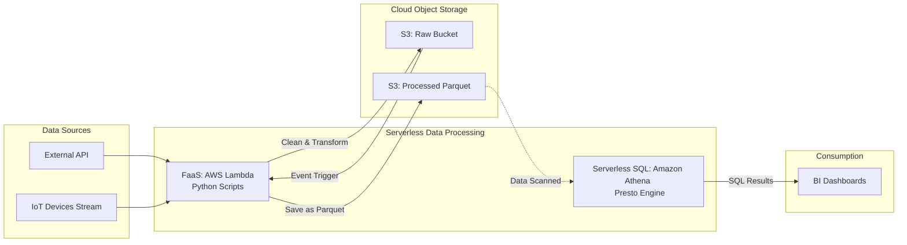

# Xử lý dữ liệu không máy chủ - Serverless Data Processing

## Summary

Xử lý dữ liệu không máy chủ (Serverless Data Processing) là một mô hình kiến trúc đám mây trong đó nhà cung cấp dịch vụ (Cloud Provider) tự động phân bổ, quản lý, mở rộng (scale) và bảo trì toàn bộ tài nguyên máy chủ vật lý ở hậu trường. Đối với các kỹ sư dữ liệu (Data Engineers), "Serverless" có nghĩa là họ chỉ cần viết code hoặc câu lệnh SQL, sau đó gửi cho hệ thống thực thi và chỉ trả tiền chính xác cho số giây hoặc dung lượng xử lý, hoàn toàn giải phóng họ khỏi việc phải quan tâm đến hệ điều hành, RAM, CPU hay mạng lưới.

---

## Definition

**Serverless** không có nghĩa là "không có máy chủ". Máy chủ vẫn tồn tại trong các trung tâm dữ liệu khổng lồ của AWS, Google, hay Microsoft. Khái niệm này ám chỉ việc "ẩn đi (abstract away)" khái niệm máy chủ đối với người dùng cuối.

Để một công cụ được coi là Serverless Data Processing thực sự, nó phải thỏa mãn 3 tiêu chí:
1. **Zero Provisioning (Không cấp phát trước)**: Không cần phải chọn loại cấu hình máy (tạo bao nhiêu node, mỗi node bao nhiêu RAM/CPU).
2. **Auto-Scaling (Tự động co giãn)**: Hệ thống tự động huy động từ 0 đến 1000 máy chủ ngay khi bạn gửi một truy vấn phức tạp, và thu hồi lại về 0 ngay lập tức khi chạy xong (Scale to zero).
3. **Pay-as-you-go (Trả tiền theo mức sử dụng thực tế)**: Không tính phí theo giờ thuê máy chủ. Phí được tính theo Gigabyte dữ liệu được quét, số lượng giao dịch, hoặc thời gian thực thi tính bằng mili-giây. Khi bạn không chạy truy vấn nào, chi phí tính toán (compute) bằng $0.

---

## Why it exists

Trước khi có Serverless, việc xây dựng một Data Pipeline (Ví dụ: Hadoop cluster cục bộ hoặc thuê máy chủ ảo AWS EC2) giống như việc mua một chiếc xe buýt riêng để đi làm:
1. **Capacity Planning (Hoạch định công suất)**: Bạn phải đoán trước mình cần bao nhiêu máy chủ. Nếu mua quá ít, hệ thống sập vào ngày Sale lớn. Nếu mua quá nhiều, máy chủ ngồi không lãng phí hàng ngàn USD mỗi tháng.
2. **Operational Overhead (Gánh nặng vận hành)**: Kỹ sư dữ liệu thay vì tập trung viết logic lấy dữ liệu (ETL), lại phải tốn 50% thời gian làm các việc của một System Admin: vá lỗi bảo mật OS (patching), nâng cấp RAM, cấu hình mạng, xử lý ổ đĩa bị bad sector.

Serverless sinh ra giống như việc bạn gọi xe Uber. Bạn chỉ gọi xe khi cần đi (gửi truy vấn), có thể gọi một chiếc xe nhỏ hoặc một chiếc xe tải, tài xế (Cloud Provider) tự lo xăng xe và bảo dưỡng, đến đích bạn trả đúng tiền cuốc xe đó và đi xuống.

---

## Core idea

Ý tưởng cốt lõi làm nên sức mạnh của Serverless Data Processing là **Sự phân tách hoàn toàn giữa Lưu trữ và Tính toán (Decoupling of Storage and Compute)**.

* Dữ liệu của bạn được lưu trữ vĩnh viễn ở một lớp lưu trữ tĩnh siêu rẻ (Cloud Object Storage như Amazon S3 hoặc Google Cloud Storage).
* Máy chủ Tính toán (Compute Engine) là một lớp riêng biệt nằm lơ lửng trên đám mây (Cloud).
* Khi một sự kiện (Event) xảy ra (ví dụ: một file mới vừa thả vào S3, hoặc người dùng ấn nút "Chạy Report"), hệ thống Serverless mới tỉnh dậy, kéo mã nguồn của bạn ra, kết nối vào S3 để xử lý dữ liệu, ghi kết quả ra, rồi tự hủy.

---

## How it works

Có 2 kiểu công cụ Serverless Data Processing phổ biến:

**1. Function-as-a-Service (FaaS) cho xử lý dòng chảy sự kiện (Event-driven):**
Ví dụ: AWS Lambda, Google Cloud Functions.
* Cách hoạt động: Viết 1 đoạn code Python (ví dụ: giải nén file JSON và đổi thành CSV). Cấu hình: "Cứ khi nào có file rơi vào thư mục Raw trên S3, tự động gọi đoạn code này". Nếu 1 file rơi vào, 1 hàm chạy. Nếu 100 file rơi vào cùng lúc, AWS tự động sinh ra 100 hàm chạy song song.

**2. Serverless SQL Engines cho phân tích Dữ liệu Lớn (Big Data):**
Ví dụ: Google BigQuery, Amazon Athena.
* Cách hoạt động: Bạn gõ một câu lệnh `SELECT SUM(revenue) FROM petabytes_table`. Bạn ấn Run. Ở hậu trường, Google tự động huy động hàng nghìn CPU nhàn rỗi trong data center của họ để quét song song hàng tỷ dòng dữ liệu, trả về kết quả cho bạn trong 5 giây, và thu của bạn đúng 5 USD (phí quét 1 Terabyte).

---

## Architecture / Flow



---

## Practical example

Xét bài toán: Bạn cần phân tích 500GB log truy cập web đang lưu trên Amazon S3 để đếm số lượng truy cập theo từng quốc gia.

**Không có Serverless (Ví dụ dùng Hadoop/Spark trên EC2):**
1. Lên AWS tạo 1 cụm EMR (Elastic MapReduce) với 1 Master node và 5 Worker nodes. (Chờ 15 phút để boot máy).
2. Submit job Spark. (Chờ 30 phút chạy xong).
3. **Quên tắt cụm máy**. (Máy chạy suốt cuối tuần, mất 500 USD).

**Với Serverless (Dùng Amazon Athena):**
1. Mở giao diện AWS Athena.
2. Viết câu SQL trực tiếp trỏ vào thư mục S3:
   ```sql
   SELECT country, COUNT(*) as visits 
   FROM s3_web_logs_table 
   GROUP BY country;
   ```
3. Ấn Run. Đợi 10 giây.
4. Trả kết quả. Hệ thống thu đúng 2.5 USD (giá Athena là $5 / Terabyte quét qua). Kết thúc.

---

## Best practices

* **Quản lý giới hạn chi phí (Cost Controls/Quotas)**: Vì Serverless tự động mở rộng (Auto-scale) cực mạnh, một câu lệnh SQL tồi (như gõ sai `SELECT *` quét toàn bộ bảng 100 Petabytes trên BigQuery) có thể đốt cháy thẻ tín dụng của bạn vài nghìn USD chỉ trong 10 giây. Phải thiết lập ngưỡng cảnh báo hóa đơn (Billing Alerts) và thiết lập Quota (Quét tối đa 1TB/người dùng/ngày).
* **Tối ưu hóa dữ liệu lưu trữ (Columnar Formats)**: Các hệ thống Serverless SQL (như Athena, BigQuery) tính phí dựa trên **lượng dữ liệu quét (Data Scanned)**. Hãy lưu dữ liệu bằng định dạng cột (Parquet/ORC) và chia phân vùng (Partition theo ngày/tháng). Khi truy vấn, Engine sẽ bỏ qua các file không liên quan (Partition Pruning), giảm lượng data scanned từ 1TB xuống còn 1GB (tiết kiệm 99% tiền).
* **Tránh các tác vụ chạy quá lâu (Long-running tasks)**: Các FaaS như AWS Lambda thường có giới hạn thời gian chạy tối đa (ví dụ 15 phút). Không dùng Lambda cho các quá trình đào tạo Machine Learning mất 5 tiếng, hãy dùng Container Services (AWS ECS/Batch).

---

## Common mistakes

* **Cold Starts (Khởi động lạnh)**: Serverless tự "ngủ" khi không dùng. Khi một request mới tới sau một thời gian dài, Cloud cần vài giây để khởi tạo môi trường (Cold start). Nếu ứng dụng của bạn yêu cầu độ trễ cố định dưới 10 mili-giây (ví dụ Hệ thống giao dịch chứng khoán tần suất cao), Serverless là lựa chọn sai lầm.
* **Kết nối cơ sở dữ liệu truyền thống (DB Connections exhaustion)**: Nếu bạn dùng 10,000 hàm Lambda (chạy song song) để chèn dữ liệu thẳng vào một Database MySQL nhỏ bé (chỉ chịu được 100 connections), Lambda sẽ ngay lập tức làm chết đứng MySQL. Serverless cực kỳ mạnh, nên các hệ thống đích (Downstream) phải đủ sức hứng chịu lượng "sóng thần" đó (ví dụ dùng SQS/Kafka để hứng).

---

## Trade-offs

### Ưu điểm
* Giải phóng kỹ sư khỏi công việc vận hành (No Ops), tập trung 100% vào logic nghiệp vụ kinh doanh.
* Chi phí khởi điểm (TCO) gần như bằng không, rất lý tưởng cho các Startup hoặc các dự án thử nghiệm (PoC) chạy gián đoạn (Spiky workloads).
* Mở rộng theo chiều ngang vô hạn (Infinite horizontal scaling) mà không cần cấu hình.

### Nhược điểm
* **Hiệu ứng khóa chặt nhà cung cấp (Vendor Lock-in)**: Mã nguồn viết riêng cho AWS Lambda rất khó bê nguyên sang Google Cloud Functions.
* **Khó dự báo chi phí (Unpredictable Pricing)**: Tháng này quét 1TB mất 5$, tháng sau lượng người dùng tăng đột biến quét 100TB mất 500$. (Trái ngược với việc thuê 1 server vật lý cố định 100$ dù chạy ít hay nhiều).
* Khó gỡ lỗi (Debugging) vì bạn không thể chui vào hệ điều hành (SSH) để xem các tiến trình đang chạy.

---

## When to use

* Các Data Pipelines dạng hướng sự kiện (Event-driven ETL) tải dữ liệu lắt nhắt liên tục trong ngày.
* Khi đội ngũ Data quá mỏng, không có DevOps/SysAdmin chuyên trách.
* Phân tích Dữ liệu Lớn theo lô (Ad-hoc Analytics) thỉnh thoảng mới chạy, nhưng khi chạy lại yêu cầu sức mạnh xử lý cực khủng.

## When not to use

* Tính toán liên tục 24/7 (Ví dụ: Chạy model Streaming cố định dòng dữ liệu lúc nào cũng cao). Trong trường hợp này, thuê một cụm máy ảo EC2 dài hạn (Reserved Instances) sẽ rẻ hơn nhiều so với Pay-as-you-go của Serverless.
* Hệ thống yêu cầu độ trễ mạng siêu thấp và tính kiểm soát OS tuyệt đối (Low-latency trading).

---

## Related concepts

* [Google BigQuery](/concepts/google-bigquery)
* [Cloud Object Storage](/concepts/cloud-storage)
* [Định dạng dữ liệu cột - Columnar Data Formats](/concepts/columnar-formats)

---

## Interview questions

### 1. Tại sao nói "Serverless Data Warehouse" (như BigQuery) tính tiền dựa trên lượng dữ liệu được quét (Data scanned) thay vì lượng dữ liệu được trả về (Data returned)?
* **Người phỏng vấn muốn kiểm tra**: Hiểu biết sâu về cơ chế tính phí đám mây và tối ưu hóa SQL.
* **Gợi ý trả lời**: Để trả về kết quả cuối cùng (có khi chỉ là 1 dòng tổng doanh thu), các hệ thống Serverless buộc phải đọc (I/O) và xử lý toàn bộ dữ liệu ở phần phụ trợ (Backend compute nodes). Tài nguyên thực sự bị tiêu hao (Điện năng, Mạng, CPU) nằm ở giai đoạn Quét Dữ liệu, chứ không phải ở băng thông trả về giao diện. Do đó, viết câu lệnh `SELECT * FROM table LIMIT 10` vẫn sẽ tính phí quét toàn bảng (vì nó scan tất cả rồi mới limit), trừ khi bảng được phân vùng (partitioned).

### 2. Sự khác nhau giữa việc chạy mã Python trên máy ảo EC2 và trên AWS Lambda là gì?
* **Người phỏng vấn muốn kiểm tra**: Khả năng phân biệt hai kiến trúc điện toán cơ bản.
* **Gợi ý trả lời**:
  * EC2: Máy ảo chuyên dụng, chạy liên tục 24/7 cho đến khi bạn tắt. Phải tự cài OS, Python, tự cấu hình scaling. Tính tiền theo giờ/giây bật máy. Tốt cho long-running jobs.
  * Lambda: Hàm thực thi dạng sự kiện (Serverless FaaS). Tự động boot môi trường lên trong mili-giây, chạy code tối đa 15 phút rồi tự hủy. Tự động nhân bản hàng nghìn instance. Tính tiền theo số mili-giây thực thi. Không có quyền truy cập OS, không lưu trạng thái (Stateless).

---

## References

1. **Google Cloud Serverless Computing** - Khái niệm cơ bản từ nhà cung cấp.
2. **AWS Lambda Documentation** - The Serverless architecture paradigm.
3. **Designing Data-Intensive Applications** - Martin Kleppmann (Lý thuyết về sự phát triển của hệ thống phân tán).

---

## English summary

Serverless Data Processing is a cloud computing paradigm where the cloud provider dynamically manages the allocation and provisioning of servers, completely abstracting the infrastructure layer away from data engineers. Characterized by zero provisioning, infinite auto-scaling, and pay-as-you-go pricing (costing nothing when idle), it allows teams to focus entirely on business logic (via SQL or Python scripts) rather than operations. By fundamentally decoupling compute from storage, tools like AWS Lambda (for event-driven FaaS) and Google BigQuery/Amazon Athena (for serverless SQL querying) empower ad-hoc Big Data analytics. However, to avoid "bill shock" from unbounded scalable computing, engineers must strictly enforce cost quotas and leverage partitioned, columnar storage formats.
