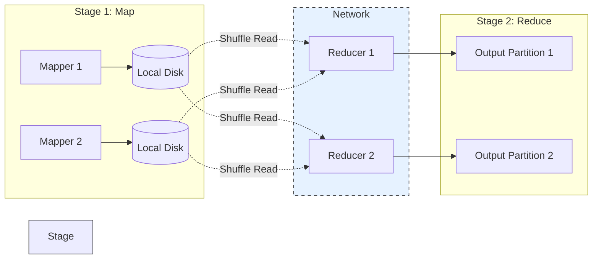

# Shuffle trong Spark

Nếu đã từng làm việc với Apache Spark để xử lý dữ liệu lớn, chắc hẳn bạn đã không dưới một lần gặp phải tình trạng job chạy cực kỳ chậm, thậm chí báo lỗi hết bộ nhớ (Out of Memory - OOM). Khi mở giao diện Spark UI để kiểm tra, bạn nhận thấy một lượng dữ liệu khổng lồ đang được luân chuyển và hệ thống bị nghẽn tại một bước có tên là **Shuffle**. 

Vậy Shuffle thực chất là gì? Tại sao nó lại là "kẻ thù số một" đối với hiệu năng của Spark, và làm cách nào để chúng ta chung sống hòa bình cũng như tối ưu hóa nó?

## Shuffle là gì? Nút thắt cổ chai lớn nhất trong tính toán phân tán

Trong một hệ thống tính toán phân tán như Apache Spark, dữ liệu được chia nhỏ thành nhiều phần gọi là các **phân vùng (Partitions)** và phân tán trên nhiều máy tính khác nhau (Worker Nodes) để xử lý song song. 

**Shuffle (Xáo trộn)** là quá trình phân phối lại và luân chuyển vật lý dữ liệu này giữa các máy tính trong toàn mạng lưới. Quá trình này bắt buộc phải diễn ra khi bạn thực hiện các thao tác yêu cầu tổng hợp dữ liệu từ nhiều phân vùng khác nhau về một mối, ví dụ như gom nhóm (grouping), nối bảng (joining), hoặc sắp xếp (sorting).

Vì phải ghi chép dữ liệu xuống ổ đĩa, nén và giải nén dữ liệu, rồi truyền tải hàng gigabyte đến terabyte thông qua mạng nội bộ, Shuffle ngốn một lượng lớn tài nguyên CPU, I/O đĩa cứng và băng thông mạng. Đây chính là lý do Shuffle thường trở thành điểm nghẽn hiệu năng tồi tệ nhất trong các ứng dụng Big Data.

## Tại sao Shuffle lại xuất hiện? Phụ thuộc hẹp vs Phụ thuộc rộng

Để hiểu tại sao Shuffle là không thể tránh khỏi, chúng ta cần nhìn vào cách Spark tổ chức các tác vụ dựa trên sự phụ thuộc dữ liệu (Dependencies):

* **Phụ thuộc hẹp (Narrow Dependency)**: Mỗi phân vùng dữ liệu ở bảng cha chỉ cung cấp dữ liệu cho tối đa một phân vùng ở bảng con. Các phép toán như `map()`, `filter()` hoạt động theo cơ chế này. Nhờ tính chất dữ liệu tại chỗ (Data Locality), Spark có thể xử lý dữ liệu ngay trên RAM/ổ đĩa nội bộ của từng máy mà không cần gửi dữ liệu đi đâu cả. Tác vụ này cực kỳ nhanh.
* **Phụ thuộc rộng (Wide Dependency)**: Một phân vùng dữ liệu ở bảng cha sẽ bị bẻ gãy để chia sẻ cho nhiều phân vùng ở bảng con. Khi bạn chạy các câu lệnh như `GROUP BY`, `JOIN`, hay `ORDER BY`, Spark bắt buộc phải dồn tất cả các bản ghi có chung một thuộc tính (ví dụ: chung `customer_id` hoặc chung `country`) về cùng một máy tính vật lý để thực hiện tính toán thu gom (Aggregation). Quá trình dồn dữ liệu liên máy tính này chính là Shuffle.

## Cơ chế hoạt động: Shuffle Write và Shuffle Read

Quá trình Shuffle chia tách các tác vụ của Spark thành các giai đoạn vật lý (Stages) độc lập và diễn ra qua hai pha chính:



### Pha 1: Shuffle Write (Tại các máy gửi - Mappers)
1. Các Executor đang giữ dữ liệu gốc duyệt qua từng dòng dữ liệu và tính mã băm (Hash) của cột Khóa (ví dụ: `Hash(customer_id) % num_partitions`).
2. Dữ liệu được tạm thời gom vào bộ nhớ đệm (buffer) trên RAM.
3. Khi bộ đệm đầy, dữ liệu được tuần tự hóa (Serialize), nén (Compress) và **ghi xuống đĩa cứng vật lý cục bộ (Local Disk)** của Worker Node thành các tệp tin Shuffle. 
   *(Lưu ý: Dù Spark nổi tiếng là tính toán trên bộ nhớ RAM, riêng với Shuffle, Spark bắt buộc phải ghi xuống đĩa để tránh cạn kiệt RAM và đảm bảo có thể khôi phục lại dữ liệu nếu có máy tính nào đó bị sập giữa chừng).*

### Pha 2: Shuffle Read (Tại các máy nhận - Reducers)
1. Các Executor phụ trách Stage tiếp theo sẽ gửi yêu cầu qua mạng TCP/IP để "kéo" (Fetch) các phân vùng dữ liệu tương ứng với mã băm của chúng từ tất cả các máy gửi về.
2. Dữ liệu tải về sẽ được giải nén, giải tuần tự (Deserialize) và nạp lên RAM để tiến hành các phép tính toán gom nhóm hay nối bảng cuối cùng.

## Ví dụ thực tế: Đoạn code đơn giản kích hoạt hàng tỷ byte di chuyển

Hãy xem một đoạn code PySpark rất phổ biến dưới đây:

```python
# 1. Đọc 10GB file log máy chủ từ S3, tự động chia thành các partitions nội bộ
logs_df = spark.read.text("s3://server-logs/") 

# 2. Trích xuất địa chỉ IP từ log (Narrow Dependency - chạy cực nhanh)
ip_df = logs_df.withColumn("ip", extract_ip_func("value"))

# 3. Gom nhóm theo IP để đếm số lượt truy cập (Wide Dependency -> Kích hoạt SHUFFLE)
# Mặc định Spark sẽ tạo ra 200 phân vùng shuffle cho bước này
ip_count = ip_df.groupBy("ip").count()

# 4. Ghi kết quả ra ngoài
ip_count.write.parquet("s3://output/")
```

Tại bước `groupBy("ip")`, Spark buộc phải chuyển dữ liệu của tất cả các dòng có chung IP về cùng một Executor. Nếu file log chứa hàng triệu IP khác nhau, mạng lưới LAN nội bộ của cụm máy chủ sẽ phải hoạt động hết công suất để chuyển giao dữ liệu qua lại.

## Bí kíp tối ưu hóa và giảm thiểu tác động của Shuffle

Là một Data Engineer, mục tiêu tối thượng khi tối ưu hóa Spark là **hạn chế tối đa dung lượng dữ liệu phải Shuffle qua mạng**. Dưới đây là các kỹ thuật thực tế:

* **Điều chỉnh số lượng phân vùng hợp lý (`spark.sql.shuffle.partitions`)**: Mặc định cấu hình này là 200. 
  * Nếu dữ liệu của bạn siêu lớn (ví dụ: 5TB), chia thành 200 phần nghĩa là mỗi phân vùng nặng tới 25GB, chắc chắn sẽ gây ra lỗi tràn bộ nhớ (OOM). 
  * Nếu dữ liệu của bạn siêu nhỏ (ví dụ: 50MB), chia thành 200 phần sẽ tạo ra 200 task siêu nhỏ, khiến Spark mất nhiều thời gian quản lý (Overhead) hơn là tính toán.
  * *Quy tắc chung*: Hãy cấu hình số lượng phân vùng gấp 2 đến 3 lần tổng số CPU Core khả dụng của toàn bộ cụm máy chủ.
* **Lọc dữ liệu càng sớm càng tốt (Filter Early)**: Hãy áp dụng các bộ lọc `filter()` hoặc loại bỏ các cột không cần thiết bằng `select()` trước khi thực hiện các lệnh Join hay GroupBy. Dữ liệu càng ít thì lượng thông tin phải bay qua mạng càng giảm.
* **Sử dụng Broadcast Join**: Khi thực hiện nối (Join) một bảng lớn (Fact Table) với một bảng danh mục nhỏ (Dimension Table - ví dụ dưới 10MB), hãy dùng hàm `broadcast()`. Spark sẽ sao chép bảng nhỏ gửi đến từng Executor. Nhờ đó, việc Join diễn ra cục bộ (Narrow Dependency) mà không cần phải thực hiện Shuffle bảng lớn.
* **Tránh `groupByKey` trên RDD**: Nếu bạn làm việc với RDD API cấp thấp, hãy dùng `reduceByKey` thay vì `groupByKey`. Lệnh `reduceByKey` thực hiện việc cộng gộp tạm thời ngay tại máy cục bộ trước khi gửi qua mạng (Map-side combine), giúp giảm tới 90% lượng dữ liệu truyền tải.

| Đặc điểm | Phụ thuộc hẹp (Narrow Dependency) | Phụ thuộc rộng (Wide Dependency) |
| :--- | :--- | :--- |
| **Cơ chế** | Xử lý dữ liệu tại chỗ (Data Locality) | Luân chuyển dữ liệu qua mạng (Shuffle) |
| **Tác vụ tiêu biểu** | `map`, `filter`, `union` | `groupBy`, `join`, `distinct`, `orderBy` |
| **Hiệu năng** | Cực kỳ nhanh, độ trễ thấp | Chậm, tốn I/O đĩa cứng và băng thông mạng |

## Khái niệm liên quan

* [Data Skew](/concepts/data-skew): Hiện tượng lệch phân phối dữ liệu trong các phân vùng.
* [Spark Partitions](/concepts/spark-partition): Các phân mảnh dữ liệu của Spark.
* [Spark Joins](/concepts/spark-joins): Các kỹ thuật nối bảng dữ liệu.

## Góc phỏng vấn: Chinh phục chủ đề Shuffle trong Spark

### 1. Shuffle trong Spark là gì và tại sao nó lại được coi là điểm nghẽn hiệu năng lớn nhất?
* **Gợi ý trả lời**: Shuffle là quá trình phân phối lại dữ liệu giữa các phân vùng trên toàn cụm máy chủ, xảy ra khi thực hiện các phép toán có phụ thuộc rộng (Wide Dependency) như `join` hay `groupBy`. 
  Nó là điểm nghẽn hiệu năng lớn nhất vì ba lý do:
  1. **I/O ổ đĩa**: Hệ thống phải ghi kết quả trung gian (Shuffle Write) xuống đĩa cứng của worker để đảm bảo an toàn dữ liệu.
  2. **Truyền tải mạng (Network I/O)**: Quá trình Shuffle Read đòi hỏi kéo dữ liệu qua giao thức mạng TCP/IP giữa các node, dễ gây tắc nghẽn băng thông.
  3. **Tài nguyên tính toán**: Quá trình tuần tự hóa/giải tuần tự (Serialization/Deserialization) và nén dữ liệu ngốn rất nhiều tài nguyên CPU.

### 2. Sự khác biệt giữa `groupByKey` và `reduceByKey` trong Spark RDD là gì?
* **Gợi ý trả lời**: 
  * `groupByKey` sẽ thu thập tất cả các cặp khóa - giá trị và gửi nguyên bản toàn bộ dữ liệu thô qua mạng về các reducer để gom nhóm. Điều này gây tải cực nặng cho mạng và dễ làm tràn bộ nhớ.
  * `reduceByKey` thông minh hơn nhờ cơ chế gom nhóm cục bộ tại chỗ (Map-side combine). Nó sẽ thực hiện phép tính gộp (ví dụ: cộng tổng) trên từng máy trước, sau đó chỉ gửi kết quả trung gian đã thu gọn qua mạng. Nhờ vậy, dung lượng truyền tải giảm đi đáng kể, giúp tăng tốc độ xử lý rõ rệt.

### 3. Làm thế nào để loại bỏ hoàn toàn quá trình Shuffle khi thực hiện phép Join giữa hai bảng?
* **Gợi ý trả lời**: Chúng ta có thể loại bỏ Shuffle bằng cách sử dụng **Broadcast Hash Join (Map-side Join)**. Khi một trong hai bảng có kích thước đủ nhỏ (mặc định dưới 10MB và có thể cấu hình tăng lên), Spark sẽ sao chép toàn bộ bảng nhỏ này gửi đến bộ nhớ RAM của tất cả các Executor chứa phân vùng của bảng lớn. Quá trình Join lúc này sẽ diễn ra hoàn toàn cục bộ trên từng máy mà không cần phải thực hiện Shuffle phân phối lại bảng dữ liệu lớn qua mạng.

## Tài liệu tham khảo

1. **High Performance Spark** - Holden Karau, Rachel Warren (Chương về Understanding and Managing Shuffles).
2. Spark Architecture và quá trình sinh Logical Plan.

## English Summary

Shuffle in Apache Spark is the physically intensive mechanism of redistributing data across a cluster of nodes. Triggered by operations exhibiting "wide dependencies" such as joins, aggregations (`groupBy`), and global sorting, shuffling involves data serialization, local disk writing (Shuffle Write), and extensive network data fetching (Shuffle Read). Because it bottlenecks CPU, disk I/O, and network bandwidth, minimizing the frequency and data volume of shuffles—through filtering, map-side combining, or broadcast joins—is the cornerstone of Spark performance tuning.
