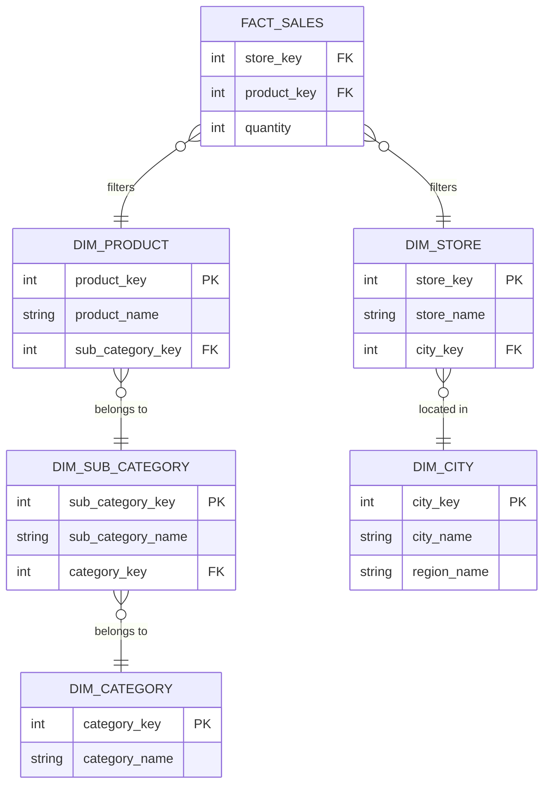

# Lược đồ bông tuyết - Snowflake Schema

## Summary

Snowflake Schema (Lược đồ bông tuyết) là một biến thể và mở rộng của kiến trúc Star Schema (Lược đồ hình sao) trong mô hình hóa dữ liệu đa chiều (Dimensional Modeling). Sự khác biệt cốt lõi nằm ở chỗ: trong Snowflake Schema, các bảng chiều (Dimension Tables) được **chuẩn hóa (normalized)** thành các bảng phân cấp nhỏ hơn, chi tiết hơn. Khi vẽ sơ đồ ERD, các bảng kết nối chằng chịt tỏa ra từ trung tâm tạo thành hình dáng giống như một bông tuyết. Kiến trúc này giúp tiết kiệm không gian lưu trữ và duy trì tính toàn vẹn dữ liệu cực tốt, nhưng đánh đổi bằng việc suy giảm hiệu năng truy vấn phân tích.

---

## Definition

**Snowflake Schema** là một mô hình thiết kế Data Warehouse bao gồm:
1. **Một Fact Table ở trung tâm**: Giữ chức năng y hệt như Star Schema (lưu trữ khóa ngoại và các chỉ số đo lường).
2. **Nhiều Dimension Tables phân cấp**: Các bảng Dimension không lưu toàn bộ thuộc tính mà tách các thuộc tính có tính phân cấp (hierarchy) thành các bảng tra cứu phụ (lookup tables) và liên kết với nhau bằng khóa ngoại (Foreign Key).

Ví dụ: Thay vì bảng `dim_product` chứa cả cột `CategoryName` và `BrandName`, Snowflake Schema sẽ tách chúng ra thành bảng `dim_category` và `dim_brand`, sau đó `dim_product` chỉ lưu khóa `category_id` và `brand_id`.

---

## Why it exists

Snowflake Schema tồn tại để giải quyết hai vấn đề nhức nhối của Star Schema khi xử lý các bảng Dimension quá lớn:
1. **Lãng phí dung lượng lưu trữ (Storage Cost)**: Việc phi chuẩn hóa (denormalization) trong Star Schema khiến chuỗi văn bản bị lặp lại hàng triệu lần (ví dụ chữ "Electronics" được lưu ở mọi dòng sản phẩm thuộc danh mục này).
2. **Khó khăn trong việc bảo trì (Data Anomalies)**: Nếu cần đổi tên danh mục "Electronics" thành "Consumer Electronics", hệ thống ETL của Star Schema phải rà soát và UPDATE hàng vạn dòng. Trong Snowflake, chỉ cần UPDATE đúng 1 dòng duy nhất trong bảng `dim_category`.

Snowflake Schema áp dụng triết lý chuẩn hóa (thường là 3NF) một phần vào kho dữ liệu phân tích để tạo sự toàn vẹn.

---

## Core idea

Ý tưởng chính của lược đồ bông tuyết là **tách các thuộc tính phân cấp (hierarchies) ra khỏi bảng dimension gốc**.

Sự phân cấp rất thường thấy trong dữ liệu kinh doanh:
* Địa lý: Quốc gia $\rightarrow$ Tỉnh/Bang $\rightarrow$ Thành phố $\rightarrow$ Cửa hàng.
* Sản phẩm: Nhóm ngành $\rightarrow$ Danh mục $\rightarrow$ Phân loại con $\rightarrow$ Sản phẩm chi tiết.

Thay vì nhồi nhét toàn bộ các cấp này vào một bảng dài thòng (dẫn tới lặp dữ liệu), Snowflake tách chúng ra. Cấp độ dưới (ví dụ: Thành phố) sẽ liên kết lên cấp độ trên (ví dụ: Quốc gia) thông qua khóa ngoại.

---

## How it works

Khi một Business User muốn tính doanh thu của một "Nhóm ngành" trên Snowflake Schema:
1. Truy vấn bắt đầu từ `fact_sales`.
2. Hệ thống thực hiện phép JOIN từ `fact_sales` sang `dim_product`.
3. Nhận thấy `dim_product` chỉ có ID danh mục, hệ thống phải thực hiện thêm phép JOIN thứ hai từ `dim_product` sang `dim_category`.
4. Sau đó phải thực hiện thêm phép JOIN thứ ba từ `dim_category` sang `dim_department` để lấy tên "Nhóm ngành".
5. Cuối cùng, Database Engine áp dụng bộ lọc và cộng dồn doanh thu.

Quá trình này tốn nhiều tài nguyên CPU hơn đáng kể so với thao tác 1 bước của Star Schema.

---

## Architecture / Flow

Dưới đây là mô phỏng ERD của Snowflake Schema:



*Nhìn vào sơ đồ, cấu trúc phân nhánh nhiều tầng giống hệt một bông tuyết. Việc truy vấn từ bảng ngoài cùng (Category) vào Fact Table bắt buộc phải băng qua cầu nối (Sub Category, Product).*

---

## Practical example

Xét câu SQL truy vấn tổng doanh thu theo tên Danh mục Sản phẩm (Category):

**Trên Star Schema (Phi chuẩn hóa - Chỉ cần 1 JOIN):**
```sql
SELECT p.category_name, SUM(f.revenue)
FROM fact_sales f
JOIN dim_product p ON f.product_key = p.product_key
GROUP BY p.category_name;
```

**Trên Snowflake Schema (Đã chuẩn hóa - Cần 3 JOIN liên tiếp):**
```sql
SELECT c.category_name, SUM(f.revenue)
FROM fact_sales f
JOIN dim_product p ON f.product_key = p.product_key
JOIN dim_sub_category sc ON p.sub_category_key = sc.sub_category_key
JOIN dim_category c ON sc.category_key = c.category_key
GROUP BY c.category_name;
```
Sự gia tăng số lượng phép JOIN làm tăng độ phức tạp cho người viết SQL và giảm thiểu hiệu năng đọc của máy chủ.

---

## Best practices

Mặc dù Kimball (người tạo ra Dimensional Modeling) khuyên nên tránh Snowflake Schema nếu có thể, trong thực tế vẫn có những "Snowflake hợp lý":
* **Trường hợp Monster Dimensions**: Nếu một bảng `dim_customer` có 500 triệu khách hàng, và phần demographic (nhân khẩu học) của họ thay đổi liên tục, việc tách phần thông tin demographic thành một bảng Outrigger (bảng phụ) kết nối với `dim_customer` là một dạng Snowflake tốt để dễ quản trị.
* **Thiết kế Views**: Để che giấu sự phức tạp của Snowflake Schema với người dùng cuối, hãy xây dựng các Database Views ảo. View này thực hiện JOIN sẵn các bảng phân cấp lại với nhau, tạo ra một Star Schema ảo cho công cụ BI kết nối vào.
* **Không Snowflake quá 2-3 cấp**: Đừng bẻ nhỏ dữ liệu quá mức (như tới 4-5 cấp phân nhánh). Lúc đó hiệu năng của Data Warehouse sẽ sụp đổ.

---

## Common mistakes

* **Mặc định thiết kế kiểu Snowflake do thói quen OLTP**: Các kỹ sư phần mềm (Backend Developers) quen với việc chuẩn hóa 3NF thường vô tình áp dụng luôn cách thiết kế này khi xây dựng kho dữ liệu báo cáo, tạo ra một mớ bòng bong Snowflake không chủ đích.
* **Tạo Snowflake cho các bảng nhỏ**: Việc chia cắt một bảng `dim_store` chỉ có 1,000 cửa hàng thành bảng `dim_city`, `dim_state`, `dim_country` là hoàn toàn thừa thãi. Dung lượng tiết kiệm được không đáng bao nhiêu so với tài nguyên CPU bị lãng phí do JOIN.

---

## Trade-offs

### Ưu điểm
* **Dung lượng lưu trữ nhỏ**: Bằng cách giảm thiểu sự lặp lại dữ liệu (redundancy), nó tiết kiệm đáng kể không gian đĩa (rất quan trọng trong thập niên 90-2000 khi đĩa cứng đắt đỏ).
* **Cập nhật nhanh và an toàn (Maintenance)**: Sửa đổi cấu trúc phân cấp (ví dụ: chuyển 1 tỉnh sang vùng quản lý khác) chỉ cần tác động lên 1 record ở bảng Dimension bậc cao, không cần cập nhật hàng loạt.
* **Dễ dàng tải dữ liệu (ETL)**: Đôi khi việc ánh xạ dữ liệu trực tiếp từ các hệ thống OLTP 3NF vào Snowflake Schema dễ dàng hơn so với việc bẻ phẳng chúng ra Star Schema.

### Nhược điểm
* **Hiệu năng truy vấn kém (Query Performance)**: Việc phải thực hiện Multiple JOINs để tổng hợp báo cáo làm chậm quá trình lấy dữ liệu.
* **Khó sử dụng cho Business Users (Usability)**: Sơ đồ chằng chịt hàng chục bảng gây bối rối cho người dùng không am hiểu kỹ thuật khi họ muốn kéo-thả làm dashboard tự phục vụ (Self-service BI).
* **Không tối ưu cho công cụ BI**: Các công cụ như PowerBI hoạt động tối ưu nhất trên Star Schema; việc sử dụng Snowflake có thể làm chậm DAX Engine đáng kể.

---

## When to use

* Bảng Dimension có dung lượng siêu khổng lồ (vài chục GB đến vài trăm GB) và việc dư thừa dữ liệu gây ảnh hưởng nghiêm trọng đến chi phí lưu trữ hoặc RAM.
* Data Warehouse của doanh nghiệp được xây dựng trên một nền tảng RDBMS có sức mạnh tính toán JOIN cực khỏe nhưng có giới hạn ngặt nghèo về mặt lưu trữ đĩa.
* Yêu cầu cập nhật cấu trúc dữ liệu liên tục theo chiều hướng phân cấp và hệ thống ETL không đủ sức update hàng loạt.

## When not to use

* Với 90% các dự án Data Marts và hệ thống phục vụ Data Visualization / Dashboarding thông thường (Nên dùng Star Schema).
* Lưu trữ dữ liệu trên nền tảng Cloud hiện đại (BigQuery, Snowflake DB, Redshift) nơi lưu trữ cột (columnar storage) giải quyết cực tốt bài toán nén chuỗi lặp lại, khiến cho việc tiết kiệm dung lượng của Snowflake Schema trở nên vô nghĩa.

---

## Related concepts

* [Star Schema](/concepts/star-schema)
* [Dimensional Modeling](/concepts/dimensional-modeling)
* [Outrigger Dimension](#)
* Third Normal Form (3NF)

---

## Interview questions

### 1. Hãy phân tích sự đánh đổi (Trade-off) quan trọng nhất giữa Star Schema và Snowflake Schema.
* **Người phỏng vấn muốn kiểm tra**: Khả năng phân tích hệ thống: Storage vs Compute, Performance vs Maintenance.
* **Gợi ý trả lời**: Sự đánh đổi cốt lõi nằm ở **Chuẩn hóa (Normalization)**. 
  * Star Schema chọn việc phi chuẩn hóa: Chấp nhận dư thừa dữ liệu (tốn Storage) và khó bảo trì/cập nhật dữ liệu hàng loạt, nhưng đổi lại nó có số lượng JOIN tối thiểu nên truy vấn lấy dữ liệu cực kỳ nhanh (tối ưu Compute), cộng thêm sự thân thiện với End-User.
  * Snowflake Schema làm ngược lại: Nó chuẩn hóa các bảng phân cấp để đảm bảo tính toàn vẹn và tối ưu không gian ổ đĩa (Storage), bảo trì cực nhàn vì không bị lặp dữ liệu. Tuy nhiên, cái giá phải trả là sự bùng nổ các phép JOIN liên hoàn, làm suy giảm hiệu suất Compute trầm trọng và gây bối rối cho người phân tích.
  * *Kết luận*: Ở thời đại Cloud hiện tại (Storage rẻ bèo, Compute đắt đỏ), Star Schema thường là người chiến thắng tuyệt đối.

### 2. Định dạng lưu trữ dạng cột (Columnar Storage) của các Data Warehouse hiện đại đã ảnh hưởng thế nào đến tính hữu dụng của Snowflake Schema?
* **Người phỏng vấn muốn kiểm tra**: Kiến thức nâng cao về File formats và Data Lakes.
* **Gợi ý trả lời**: Các Database dạng cột (như BigQuery) hoặc định dạng file Parquet sử dụng các thuật toán nén như Dictionary Encoding và Run-Length Encoding. Nhờ đó, nếu một bảng Star Schema lặp lại chữ "Electronics" 1 triệu lần, nó không thực sự lưu 1 triệu lần trên ổ đĩa; nó chỉ lưu một từ điển ánh xạ mã số ID nhỏ xíu. Việc này đã xóa bỏ hoàn toàn ưu thế "tiết kiệm dung lượng" vốn là vũ khí lớn nhất của Snowflake Schema. Do đó, trong kiến trúc hiện đại, Snowflake Schema ngày càng ít được sử dụng.

---

## References

1. **The Data Warehouse Toolkit** - Ralph Kimball (Lập luận vì sao Kimball không thích Snowflake Schema).
2. **Fundamentals of Data Engineering** - Joe Reis.
3. **Designing Data-Intensive Applications** - Martin Kleppmann (Giải thích về Column Compression và ảnh hưởng tới Data Warehousing).

---

## English summary

A Snowflake Schema is an extension of the Star Schema where the dimension tables are highly normalized into multiple related tables, forming a hierarchical, snowflake-like structure. While this normalization eliminates data redundancy, saves storage space, and simplifies maintenance when categorical hierarchy data changes, it severely impacts query performance due to the necessity of complex, multi-table joins. In modern data architecture, where storage is inexpensive and analytical databases heavily utilize columnar compression, the storage benefits of the Snowflake Schema are largely negated, making the Star Schema the preferred choice for performance and business-user simplicity.
