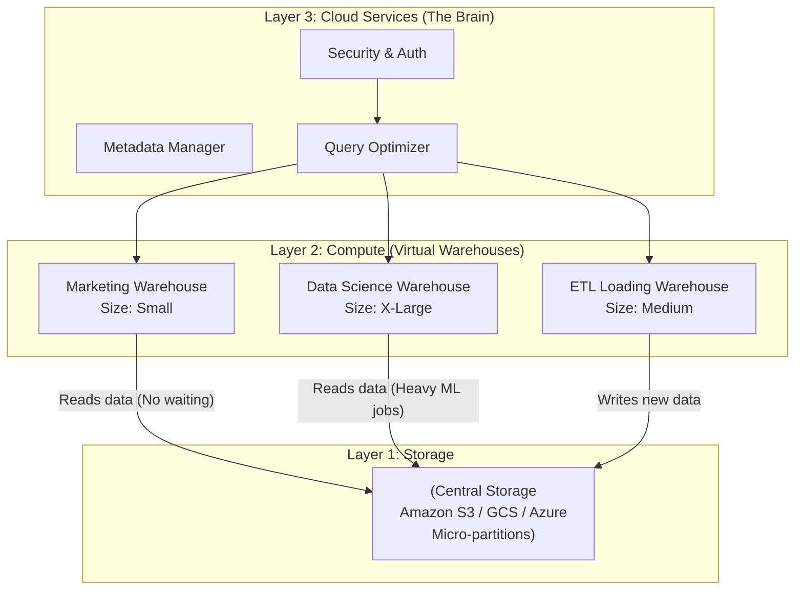

# Snowflake Data Cloud

## Summary

Snowflake là một nền tảng dữ liệu đám mây (Cloud Data Platform) được xây dựng hoàn toàn từ đầu cho môi trường Cloud (Cloud-native). Không giống như các nền tảng Data Warehouse thế hệ cũ được bê từ hệ thống on-premise lên mây, Snowflake thiết kế một kiến trúc ba lớp cực kỳ độc đáo giúp **tách rời hoàn toàn Lưu trữ (Storage) và Tính toán (Compute)**. Khả năng mở rộng đa cụm (Multi-cluster) cùng tính năng chia sẻ dữ liệu an toàn xuyên tổ chức (Secure Data Sharing) đã biến Snowflake trở thành hệ sinh thái dữ liệu phổ biến nhất trên thị trường hiện nay.

---

## Definition

Được thành lập vào năm 2012, **Snowflake** cung cấp giải pháp Kho dữ liệu (Data Warehouse), Hồ dữ liệu (Data Lake) và Chia sẻ dữ liệu (Data Exchange) dưới dạng Dịch vụ phần mềm hoàn chỉnh (SaaS - Software as a Service).

* **Zero-management**: Giống như BigQuery, người dùng Snowflake không cần cài đặt phần mềm, cấu hình máy chủ vật lý hay nâng cấp hệ điều hành.
* **Agnostic (Trung lập mây)**: Khác biệt lớn nhất của Snowflake là nó có thể chạy trên CẢ BA nền tảng đám mây lớn nhất: AWS, Google Cloud (GCP) và Microsoft Azure. Khách hàng không bị trói buộc (Vendor Lock-in) vào cơ sở hạ tầng của một hãng duy nhất.

---

## Why it exists

Những Data Warehouse thế hệ đầu tiên trên Cloud (như Amazon Redshift đời đầu) thường ghép chung CPU (Compute) và Ổ cứng (Storage) vào một cỗ máy (Node).
* Nếu bạn hết dung lượng lưu trữ, bạn phải mua thêm Node mới. Điều này vô tình mua thừa luôn cả năng lực tính toán CPU mà bạn không cần. (Lãng phí tiền).
* Nếu team Marketing và team Data Science cùng chạy những truy vấn nặng vào một lúc trên cùng hệ thống, tranh chấp tài nguyên (Resource Contention) xảy ra. Báo cáo của sếp bị đơ vì team Data Science đang chạy một model tính toán phức tạp.

Snowflake ra đời để đập bỏ giới hạn này: Cất toàn bộ ổ cứng ra một chỗ (rẻ và chung), chia máy tính (CPU) ra nhiều khu độc lập. Team nào xài máy tính team đó, nhưng tất cả cùng nhìn vào một kho dữ liệu trung tâm, giải quyết triệt để sự lãng phí và tranh chấp.

---

## Core idea: Kiến trúc 3 lớp (Three-Layer Architecture)

Snowflake khác biệt với toàn bộ thế giới nhờ kiến trúc phân tầng rõ rệt:

1. **Lớp Lưu trữ Tập trung (Centralized Storage Layer)**: Dữ liệu đưa vào Snowflake tự động được chia nhỏ thành các tệp tin nén định dạng cột gọi là **Micro-partitions** và đẩy xuống Cloud Object Storage (như Amazon S3, Azure Blob). Lớp này có khả năng mở rộng vô hạn và giá lưu trữ cực rẻ.
2. **Lớp Tính toán Độc lập (Multi-cluster Compute Layer)**: Snowflake tạo ra các cụm máy chủ ảo gọi là **Virtual Warehouses**. Mỗi phòng ban có thể có một Virtual Warehouse riêng. Các warehouse này dùng chung lớp lưu trữ, nhưng CPU/RAM của chúng bị cô lập hoàn toàn. Chúng không bao giờ tranh giành tài nguyên của nhau.
3. **Lớp Dịch vụ Đám mây (Cloud Services Layer)**: Đóng vai trò là "bộ não" kiểm soát mọi thứ: Xác thực đăng nhập (Authentication), Phân tích tối ưu câu lệnh SQL (Query Optimizer), Quản lý metadata, Cấp quyền (Access Control) và Quản lý giao dịch (Transaction management). Lớp này liên kết các Virtual Warehouses rời rạc thành một thể thống nhất.

---

## How it works (Tính năng Nổi bật)

Ngoài kiến trúc, Snowflake dẫn đầu thị trường nhờ các tính năng độc bản (Out-of-the-box):

**1. Auto-Suspend & Auto-Resume (Bật tắt tự động)**
Virtual Warehouse tính tiền theo từng giây sử dụng. Bạn có thể cấu hình: Nếu không có ai truy vấn trong 1 phút, tự động tắt máy chủ (Suspend -> 0$). Khi có người dùng truy vấn gửi tới, máy tự động bật lên (Resume) chỉ trong vài mili-giây.

**2. Zero-Copy Cloning (Nhân bản không tốn đĩa)**
Bạn muốn copy một bảng dữ liệu Production 10TB sang môi trường Dev để test? Thay vì tốn hàng giờ copy và trả gấp đôi tiền lưu trữ, lệnh `CLONE` của Snowflake hoàn thành trong 1 giây. Nó chỉ nhân bản "Metadata" (con trỏ) trỏ vào cùng một file lưu trữ vật lý ban đầu. Việc test trên bản Clone hoàn toàn không ảnh hưởng đến Production.

**3. Time Travel (Du hành thời gian)**
Ai đó lỡ tay `DROP TABLE` hoặc `DELETE` mất 1 triệu dòng dữ liệu? Không cần xin team DevOps khôi phục bản Backup từ hôm qua. Snowflake cho phép bạn "quay ngược thời gian" bằng lệnh SQL đơn giản (`SELECT * FROM table AT (timestamp)`) để lấy lại dữ liệu nguyên vẹn tối đa 90 ngày trước đó.

**4. Secure Data Sharing (Chia sẻ dữ liệu)**
Doanh nghiệp có thể chia sẻ trực tiếp các bảng dữ liệu cho đối tác/nhà cung cấp bên ngoài (bên kia cũng dùng Snowflake) mà không cần phải dùng FTP xuất file CSV hay dựng API rườm rà. Dữ liệu chia sẻ không bị copy ra làm hai bản, đảm bảo Real-time.

---

## Architecture / Flow



*Trong sơ đồ này, tác vụ tải dữ liệu (ETL) nặng nề đang chạy ở VW3 không hề làm chậm báo cáo của team Marketing đang truy vấn qua VW1.*

---

## Practical example

Mô phỏng sức mạnh của Snowflake với tác vụ bảo trì và vận hành hằng ngày:

**Bài toán**: Khôi phục lại dữ liệu bị xóa nhầm bởi Data Analyst.

Lúc 10:00 sáng, một nhân viên chạy nhầm lệnh:
```sql
DELETE FROM production.customers WHERE status = 'active'; -- Xóa mất toàn bộ khách hàng!
```

Ở các hệ thống truyền thống, bạn phải báo động đỏ (SEV-1), làm việc với SysAdmin để tìm bản sao lưu (Backup) đêm qua, tốn hàng giờ để khôi phục, và mất trắng dữ liệu sinh ra từ sáng đến 10:00.

**Trong Snowflake**, Data Engineer xử lý trong 1 phút bằng Time Travel:
```sql
-- Tạo lại bảng khách hàng với trạng thái dữ liệu lúc 09:59 phút (trước khi bị xóa)
CREATE TABLE customers_restored AS
SELECT * FROM production.customers AT(TIMESTAMP => '2026-06-07 09:59:00 -0700'::timestamp_tz);

-- Swap bảng cũ và bảng phục hồi
ALTER TABLE production.customers SWAP WITH customers_restored;
```
Sự cố được giải quyết mà không cần tải file backup nào.

---

## Best practices

* **Định cỡ Virtual Warehouse hợp lý (Sizing)**: Đừng cấp T-shirt size `X-Large` cho một báo cáo nhỏ. Sử dụng tính năng **Multi-cluster Warehouses** (Auto-scale out) thay vì Scale up. Nếu số lượng câu lệnh SQL gửi đến dồn dập trong cùng một lúc, Snowflake có thể tự động sinh ra Cụm Warehouse số 2, số 3 chạy song song để giải quyết tắc nghẽn, và tự tắt khi hết việc.
* **Theo dõi chặt chẽ Credit (Quản trị chi phí)**: Snowflake tính tiền bằng đồng tiền ảo nội bộ gọi là "Snowflake Credits". Một Warehouse size X-Large sẽ ngốn số Credit/giờ gấp 16 lần size X-Small. Phải cấu hình Resource Monitors (Giám sát tài nguyên) để tự động TẮT hệ thống (Suspend) khi ngân sách tháng chạm mức 90%, ngăn chặn hóa đơn khổng lồ do một vòng lặp code bị lỗi.
* **Để Snowflake tự quản lý (Trust the micro-partitions)**: Đừng cố tạo Index (Snowflake không có Index), đừng mất thời gian cấu hình Partitions thủ công như các DB khác. Dữ liệu khi nạp vào sẽ tự động được chia thành các file siêu nhỏ `50MB - 500MB` (Micro-partitions). Snowflake tự quản lý metadata (Min/Max của từng file) để nhảy tới đích cực nhanh. Bạn chỉ cần chú trọng cách nạp dữ liệu (Clustering keys cho bảng quá lớn).

---

## Common mistakes

* **Quên bật Auto-Suspend**: Tạo một Virtual Warehouse để test tính năng, nhưng quên cấu hình Auto-suspend. Trở lại vào thứ Hai tuần sau và phát hiện máy ảo đã chạy suốt 48 tiếng cuối tuần mà không làm gì, tốn bay hàng ngàn đô la.
* **Sử dụng Snowflake như hệ thống OLTP**: Snowflake là hệ thống OLAP thiết kế cho phân tích lô lớn (Bulk loading). Nếu bạn thiết kế một ứng dụng Web (Backend) và gọi lệnh `INSERT INTO` vào Snowflake cho mỗi lần người dùng click chuột (Single row insert), hệ thống sẽ bị chậm và sinh ra hàng triệu micro-partitions rác làm phình to Metadata layer. Phải nạp dữ liệu theo lô (Batch) hoặc dùng dịch vụ Snowpipe.

---

## Trade-offs

### Ưu điểm
* **Dễ sử dụng nhất trên thị trường**: Gần như không cần cấu hình hạ tầng. Giao diện thân thiện. Trải nghiệm người dùng cực tốt.
* Khả năng làm việc đa nền tảng Cloud, thích hợp cho doanh nghiệp có chiến lược Multi-cloud (dùng cả AWS và Azure).
* Tính chia sẻ dữ liệu (Data Sharing) mở ra nền kinh tế dữ liệu (Data Monetization), nơi các công ty có thể bán dữ liệu của mình trên Snowflake Marketplace trực tiếp.

### Nhược điểm
* **Chi phí cao và khó đoán định**: Dù kiến trúc rất thông minh, Snowflake bị mang tiếng là một dịch vụ xa xỉ (Premium). Nếu không có đội ngũ DataOps quản trị chi phí (FinOps) chặt chẽ, chi phí Compute sẽ tăng theo cấp số nhân không kiểm soát.
* Chậm áp dụng các công nghệ mã nguồn mở (Open-source integration) hơn các đối thủ như Databricks. Định dạng Micro-partitions là định dạng đóng (độc quyền), khác với Data Lakehouse dùng Parquet/Iceberg mở.

---

## When to use

* Là lựa chọn "mặc định" tốt nhất cho hầu hết các công ty muốn hiện đại hóa dữ liệu (Data Modernization) chuyển từ hệ thống on-premise cũ kỹ (SQL Server, Oracle) lên mây một cách nhanh nhất.
* Môi trường có nhiều phòng ban, nhiều nhu cầu tính toán khác nhau, muốn chấm dứt tình trạng tranh chấp tài nguyên (Resource Contention).

## When not to use

* Với các luồng công việc Streaming thời gian thực có độ trễ dưới 1 giây (Sub-second streaming).
* Nếu doanh nghiệp sử dụng 100% hệ sinh thái phần mềm mã nguồn mở (Open Source) và muốn hoàn toàn làm chủ định dạng dữ liệu vật lý (Data Lakehouse/Apache Iceberg). Databricks có thể phù hợp hơn.

---

## Related concepts

* [Google BigQuery](/concepts/google-bigquery)
* [Amazon Redshift](/concepts/amazon-redshift)
* Data Lakehouse
* [OLAP vs OLTP](/concepts/olap)

---

## Interview questions

### 1. Nêu sự khác biệt cốt lõi giữa kiến trúc của Snowflake và các Data Warehouse thế hệ cũ (như Amazon Redshift đời đầu)?
* **Người phỏng vấn muốn kiểm tra**: Kiến trúc Cloud Data Warehouse và khái niệm Decoupled Architecture.
* **Gợi ý trả lời**: Các DWH cũ dùng kiến trúc Share-Nothing (Tính toán và Lưu trữ dính chặt vào nhau trong một cụm server). Nếu muốn tăng dung lượng lưu trữ, phải mua thêm cả CPU dù không cần tính toán thêm, và gây ra tranh chấp tài nguyên. Snowflake dùng kiến trúc Tách rời (Decoupled/Multi-cluster Shared Data architecture). Một trung tâm lưu trữ Cloud duy nhất (Storage) nhưng có thể kết nối với nhiều cụm máy tính ảo (Virtual Warehouses) hoạt động hoàn toàn độc lập, cho phép scale-up và scale-down tự do.

### 2. Micro-partition trong Snowflake hoạt động như thế nào và tại sao Snowflake không cần sử dụng Index?
* **Người phỏng vấn muốn kiểm tra**: Hiểu biết sâu sắc về cấu trúc vật lý của hệ thống.
* **Gợi ý trả lời**: Khi nạp dữ liệu, Snowflake tự động cắt thành các Micro-partition siêu nhỏ, nén theo dạng cột. Ở lớp Cloud Services (Metadata), Snowflake lưu lại giá trị MIN và MAX của từng cột trong mỗi micro-partition đó. Khi câu truy vấn tìm kiếm `WHERE age > 30`, lớp Metadata sẽ lướt qua bảng thống kê, tìm ra ngay những file nào KHÔNG thể chứa giá trị > 30 và nhảy qua (bỏ qua) chúng hoàn toàn (Partition Pruning). Vì metadata scan quá nhanh, hệ thống không cần tạo Index thủ công tốn thời gian như RDBMS truyền thống.

### 3. Bạn sẽ tối ưu chi phí (Cost optimization) cho Snowflake như thế nào nếu hóa đơn tháng này đột nhiên tăng gấp đôi?
* **Người phỏng vấn muốn kiểm tra**: Kỹ năng FinOps và quản trị ngân sách Data Engineering.
* **Gợi ý trả lời**:
  1. Kiểm tra cấu hình **Auto-suspend** của tất cả Virtual Warehouses. Đảm bảo chúng hạ xuống 1 phút thay vì 5-10 phút.
  2. Bật **Resource Monitors** để set cảnh báo hoặc tự ngắt (suspend) khi ngân sách tuần/tháng bị quá giới hạn.
  3. Kiểm tra xem có Warehouse nào đang bị cấu hình over-provision (VD: Dùng X-Large cho query vài giây). Chuyển về size X-Small và bật tính năng Multi-cluster (Scale-out) để giải quyết concurrent queries thay vì Scale-up.
  4. Tránh dùng `SELECT *` và sử dụng lệnh `MERGE` cho các luồng cập nhật dữ liệu để tối thiểu hóa thời gian tính toán.

---

## References

1. **Snowflake Documentation** - Snowflake Architecture.
2. **Snowflake: A Cloud Enterprise Data Warehouse** - Dageville et al. (Paper báo cáo học thuật gốc trình bày kiến trúc Snowflake tại SIGMOD 2016).
3. **The Data Warehouse Toolkit** - Ralph Kimball (Lý thuyết nền tảng mà Snowflake thực thi rất xuất sắc).

---

## English summary

Snowflake Data Cloud is a globally prominent, cloud-native Enterprise Data Warehouse (EDW) delivered as a SaaS platform across AWS, Azure, and Google Cloud. Its revolutionary three-layer architecture permanently separates centralized storage (relying on proprietary micro-partitions) from scalable compute (Virtual Warehouses), and is managed by a central Cloud Services layer. This design eradicates resource contention, enabling different teams to run heavy queries simultaneously without affecting each other. With zero management overhead and powerful features like Time Travel, Zero-copy Cloning, and Secure Data Sharing, Snowflake dramatically simplifies data engineering, though its dynamic, credit-based pricing model requires rigorous FinOps monitoring (like auto-suspend and resource limits) to prevent runaway costs.
