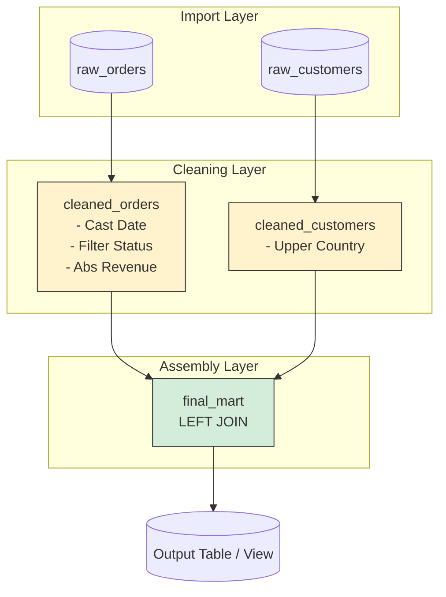

# SQL Transformation - Biến đổi dữ liệu bằng SQL

## Summary

**SQL Transformation** là quá trình lấy dữ liệu thô (Raw Data) đã được lưu trữ trong Database/Data Warehouse, và sử dụng ngôn ngữ truy vấn có cấu trúc (SQL) để làm sạch, định dạng, kết hợp và tính toán lại, tạo ra các tập dữ liệu mang giá trị nghiệp vụ (Business-ready Data) sẵn sàng cho việc phân tích. Sự trỗi dậy của các siêu máy tính Cloud Data Warehouse (Snowflake, BigQuery) đã đưa SQL trở lại vị trí "ngôn ngữ mẹ đẻ" thống trị toàn bộ mảng chuyển đổi dữ liệu, vượt qua các framework lập trình phức tạp.

---

## Definition

Trong kiến trúc đường ống dữ liệu, **Transformation (Biến đổi)** là chữ "T" trong thuật ngữ ETL/ELT.
Nó bao gồm các thao tác:
* **Cleaning (Làm sạch)**: Bỏ dữ liệu rác, xử lý giá trị NULL, loại bỏ dòng trùng lặp (Deduplication).
* **Casting (Ép kiểu)**: Chuyển chuỗi chữ số thành INT, chuyển chuỗi định dạng Âu sang định dạng Date chuẩn.
* **Joining (Hợp nhất)**: Nối dữ liệu phân mảnh từ nhiều bảng khác nhau (Ví dụ: nối Bảng Đơn Hàng với Bảng Khách Hàng).
* **Aggregating (Gom nhóm)**: Tính tổng doanh thu theo tháng, tính trung bình chi tiêu.

**SQL Transformation** đơn giản là việc sử dụng các lệnh DDL (Data Definition Language) và DML (Data Manipulation Language) thuần túy của ngôn ngữ SQL để thực thi toàn bộ các thao tác trên trực tiếp bên trong kho dữ liệu.

---

## Why it exists

Thập kỷ trước, trong thời kỳ Hadoop và Big Data (ETL Model), mọi người nghĩ SQL đã chết. SQL bị cho là không thể mở rộng (not scalable). Quá trình Transformation lúc đó được thực thi trên các máy chủ ngoài kho dữ liệu bằng Python, Java, hoặc Scala (MapReduce/Spark). Điều này đòi hỏi đội ngũ Data Engineer phải cực kỳ giỏi lập trình. Data Analysts không thể chạm tay vào logic dữ liệu.

Nhưng từ năm 2016 trở đi, các Cloud Data Warehouse (BigQuery, Snowflake) chứng minh chúng có thể gánh vác hàng Petabytes dữ liệu bằng câu lệnh SQL với tốc độ chớp mắt. Mô hình chuyển sang **ELT** (Extract, Load, TỐI ƯU HÓA RỒI MỚI Transform).
SQL Transformation tồn tại mạnh mẽ vì 3 lý do:
1. **Dân chủ hóa dữ liệu**: Ai học phân tích dữ liệu cũng biết SQL. Hàng triệu Data Analysts giờ đây có thể tự viết pipeline chuyển đổi.
2. **Không tốn chi phí di chuyển dữ liệu**: Tại sao phải mất công copy hàng triệu dòng dữ liệu từ DB ra một máy chủ Python riêng để tính toán, rồi lại copy ngược lại? SQL Transformation đẩy code logic xuống thẳng ổ cứng chứa dữ liệu (Push-down compute).
3. **Hiệu năng kinh hoàng**: Engine SQL của các CSDL đám mây được tối ưu sâu ở mức độ phần cứng (Vectorized Processing), chạy các phép JOIN trên tỷ dòng dữ liệu mượt mà hơn tự code Python.

---

## Core idea

Ý tưởng của quá trình SQL Transformation là viết ra một chuỗi các câu lệnh `CREATE TABLE ... AS SELECT ...` (CTAS) hoặc `CREATE VIEW ... AS SELECT ...`.

Một luồng làm việc điển hình không bao giờ "xào nấu" tất cả trong một cú SQL duy nhất. Nó áp dụng quy trình chia để trị:
* **Tầng 1 (Raw $\rightarrow$ Staging)**: Câu lệnh SQL chỉ làm nhiệm vụ dọn dẹp nhẹ (đổi tên cột cho chuẩn Snake_case, ép lại kiểu ngày tháng).
* **Tầng 2 (Staging $\rightarrow$ Intermediate)**: Câu lệnh SQL sử dụng các Window Functions phức tạp để tính toán các logic kế toán/tài chính.
* **Tầng 3 (Intermediate $\rightarrow$ Marts)**: Câu lệnh SQL `JOIN` các bảng trung gian lại, gom nhóm (`GROUP BY`) tạo ra khối dữ liệu đa chiều (Dimensional Model) cuối cùng.

Công cụ [dbt (data build tool)](/concepts/dbt) được sinh ra chính là để quản lý cấu trúc chia tầng này.

---

## How it works

Quy trình áp dụng SQL Transformation chuẩn:

1. **Khám phá (Explore)**: Analyst viết các lệnh `SELECT` nháp trên console để hiểu độ móp méo (anomalies) của dữ liệu thô (ví dụ: phát hiện cột `price` đôi khi bị âm).
2. **Viết Logic (Query Authoring)**: Sử dụng các Common Table Expressions (`WITH` clauses) để chia nhỏ logic thành từng khối dễ đọc.
3. **Vật chất hóa (Materialization)**: Bọc logic SQL lại bằng các lệnh tạo cấu trúc hạ tầng. Nếu dữ liệu nhỏ, biến thành View. Nếu dữ liệu lớn cần truy xuất nhanh, biến thành Table tĩnh.
4. **Kiểm thử (Assertion/Test)**: Dùng chính SQL để viết kiểm thử: `SELECT COUNT(*) FROM table WHERE price < 0`. Nếu trả về số khác 0, nghĩa là logic biến đổi ở bước 2 bị thủng.

---

## Architecture / Flow (CTE Pattern)

Một pattern cực kỳ phổ biến và chuẩn mực trong viết SQL Transformation là CTE (Common Table Expression), nó thay thế hoàn toàn sub-queries lồng nhau.



```sql
-- Pattern chuẩn mực Analytics Engineering (Sử dụng CTE)

WITH 
-- 1. Khai báo nguồn dữ liệu đầu vào (Import layer)
raw_orders AS (
    SELECT * FROM my_db.raw_schema.sales_orders
),

raw_customers AS (
    SELECT * FROM my_db.raw_schema.customers
),

-- 2. Tầng làm sạch độc lập (Cleaning layer)
cleaned_orders AS (
    SELECT
        order_id,
        customer_id,
        CAST(order_date AS DATE) AS order_date,
        ABS(revenue) AS revenue -- Sửa lỗi âm tiền
    FROM raw_orders
    WHERE status != 'cancelled'
),

cleaned_customers AS (
    SELECT
        customer_id,
        UPPER(country) AS country_code
    FROM raw_customers
),

-- 3. Tầng hội tụ nghiệp vụ (Final Assembly)
final_mart AS (
    SELECT
        o.order_id,
        c.country_code,
        o.order_date,
        o.revenue
    FROM cleaned_orders o
    LEFT JOIN cleaned_customers c 
        ON o.customer_id = c.customer_id
)

-- 4. Bắn dữ liệu ra
SELECT * FROM final_mart;
```

---

## Best practices

* **Tránh Sub-queries lồng nhau, hãy dùng `WITH` (CTEs)**: Viết Sub-queries (`SELECT * FROM (SELECT * FROM (SELECT ...))`) khiến code phải đọc từ trong ra ngoài, cực kỳ đau não khi review. CTEs cho phép đọc code tuyến tính từ trên xuống dưới hệt như đọc từng đoạn văn bản.
* **Quy ước đặt tên (Naming Conventions)**: Mã SQL transformation cần chuẩn mực. Tên biến phải đồng nhất. Hãy quy ước dùng `_id` làm khóa, `_at` làm timestamp, `is_` làm boolean (VD: `is_active`, `created_at`).
* **Sử dụng Window Functions**: Đây là vũ khí mạnh nhất của SQL hiện đại. Để xử lý loại bỏ dòng trùng lặp (Deduplication) lấy dòng mới nhất, đừng dùng tự JOIN với hàm MAX(). Hãy dùng hàm `ROW_NUMBER() OVER(PARTITION BY id ORDER BY updated_at DESC)`.
* **Tránh SELECT \***: Luôn chỉ định đích danh từng cột trong tầng cuối cùng để kiểm soát chặt chẽ schema, tránh việc hệ thống nguồn thêm 1 cột rác làm hỏng toàn bộ báo cáo sau này.

---

## Common mistakes

* **Quên xử lý Fan-out khi JOIN**: Vấn đề nguy hiểm nhất của SQL. Bạn có bảng Đơn Hàng 100 dòng. Bạn `LEFT JOIN` với bảng Lịch Sử Khách Hàng (1 khách hàng có 2 dòng lịch sử thay đổi). Sau khi JOIN, bảng Đơn Hàng phình lên 150 dòng (Fan-out). Khi hàm `SUM(revenue)` được gọi, doanh thu bị nhân đôi nhân ba một cách thầm lặng, gây hậu quả nghiêm trọng về tài chính. (Cần phải gom nhóm deduplicate bảng bên phải trước khi JOIN).
* **Làm ngập bộ nhớ mạng (Data Shuffling)**: Cố gắng `ORDER BY` toàn bộ dữ liệu 1 tỷ dòng trên Cloud Data Warehouse mà không có giới hạn `LIMIT`. Hành động này bắt toàn bộ Cluster phải trao đổi dữ liệu với nhau qua mạng để xếp hạng, vừa tốn tiền vừa rất chậm. (Chỉ dùng `ORDER BY` ở đầu ra phục vụ hiển thị, không dùng trong các bước trung gian).

---

## Trade-offs

### Ưu điểm của SQL Transformation
* **Đường cong học tập thấp**: Dễ tuyển dụng, dễ học, ai cũng tiếp cận được.
* **Minh bạch hóa logic (Transparent logic)**: Mã SQL thường tự bản thân nó đã là tài liệu. Một câu SQL dễ review và phát hiện lỗi business hơn một đoạn code Python dùng Pandas.
* Tận dụng sức mạnh phần cứng vô hạn của Data Warehouse hiện đại.

### Nhược điểm (Khi nào SQL bị đuối sức)
* **Xử lý cấu trúc phức tạp**: SQL rất tệ trong việc thao tác với các mảng (Arrays) hoặc JSON có độ lồng ghép siêu sâu (Deeply nested JSON). Lệnh SQL để unnest 3 cấp độ mảng sẽ nhìn như một ma trận rối rắm.
* **Xử lý Machine Learning**: Không thể dùng SQL để viết thuật toán huấn luyện AI (Dù BQML có hỗ trợ nhưng rất giới hạn).
* **Thiếu khái niệm OOP (Hướng đối tượng)**: Việc tái sử dụng code SQL thuần rất khó (phải lặp đi lặp lại hàm logic). Tuy nhiên dbt Jinja Macros đã giải quyết được nhược điểm này.

---

## When to use

* Với 90% nhu cầu biến đổi dữ liệu định dạng bảng (Tabular/Relational Data) truyền thống từ các hệ thống OLTP (CRM, ERP) để đưa vào Data Warehouse.
* Các bài toán cần chuyển logic nghiệp vụ tài chính/kế toán cho bộ phận Data Analyst tự xây dựng và quản lý (Analytics Engineering).

## When not to use

* Xử lý file ảnh, âm thanh, NLP văn bản tự do (Dùng Python).
* Xử lý dữ liệu Streaming có độ trễ mili-giây (Dùng Flink, Java).
* Khi dữ liệu có kích thước vượt quá bộ nhớ tính toán của Data Warehouse và cần xử lý song song siêu lớn ở mức Cụm máy chủ chuyên biệt ngoài kho (như Spark EMR).

---

## Related concepts

* [dbt (data build tool)](/concepts/dbt)
* [Data Warehouse](/concepts/data-warehouse)
* [OLAP](/concepts/olap)

---

## Interview questions

### 1. Sự khác biệt kiến trúc giữa ETL và ELT là gì? Tại sao Cloud Data Warehouse lại thúc đẩy xu hướng ELT?
* **Người phỏng vấn muốn kiểm tra**: Tầm nhìn về lịch sử kiến trúc hạ tầng Dữ liệu.
* **Gợi ý trả lời (Strong Answer)**: ETL truyền thống yêu cầu một máy chủ ở giữa chuyên dụng để thực hiện T (Transform) như dùng Python/Spark. Việc này tốn kém phí truyền tải mạng và yêu cầu 2 hệ thống tính toán riêng biệt. ELT khai thác sức mạnh "độc quyền" của Cloud Data Warehouse (như Snowflake, BigQuery) – những cỗ máy có khả năng tính toán chớp nhoáng rẻ tiền dựa trên lưu trữ dạng Cột (Columnar storage). Thay vì đẩy dữ liệu ra ngoài, ta Extract & Load dữ liệu thô thẳng vào kho, sau đó tận dụng SQL Engine nội bộ siêu mạnh của chính kho đó để Transform (SQL Transformation).

### 2. Kỹ thuật chống "Fan-out" (nhân bản dữ liệu) khi thực hiện LEFT JOIN trong SQL là gì?
* **Người phỏng vấn muốn kiểm tra**: Kinh nghiệm xử lý Data Anomaly kinh điển.
* **Gợi ý trả lời (Strong Answer)**: Khi làm LEFT JOIN Bảng A sang Bảng B, nếu khóa JOIN bên Bảng B không phải là Unique (có dữ liệu trùng lặp), dòng của Bảng A sẽ bị nhân bản, gây sai lệch tổng (ví dụ Sum Revenue). Kỹ thuật chống lại là phải xử lý Bảng B TRƯỚC KHI join. Sử dụng CTE gom nhóm (`GROUP BY` primary_key) hoặc dùng Window Function `ROW_NUMBER() OVER(PARTITION BY primary_key ORDER BY updated_at DESC) = 1` để lọc ra duy nhất 1 phiên bản mới nhất của Bảng B, đảm bảo tính chất 1-1 trước khi thực hiện LEFT JOIN.

### 3. Tại sao trong môi trường Data Warehouse, việc sử dụng CTEs (mệnh đề `WITH`) lại được khuyến khích hơn Sub-queries truyền thống?
* **Người phỏng vấn muốn kiểm tra**: Kỹ năng viết Clean Code SQL (Analytics Engineering Standard).
* **Gợi ý trả lời (Strong Answer)**: Có hai lý do lớn. Thứ nhất là Độ thẩm mỹ (Readability): Sub-queries khiến logic bị lồng từ trong ra ngoài rất khó đọc và khó debug; CTEs giúp đọc logic tuần tự từ trên xuống dưới theo chuẩn đường ống. Thứ hai là Khả năng tái sử dụng: Nếu một khối logic dữ liệu cần được tham chiếu (JOIN) 2 lần trong một truy vấn, với Sub-queries ta phải viết lặp lại code 2 lần. Với CTE, ta định nghĩa 1 lần và gọi bảng CTE ảo đó 2 lần. Hơn nữa, các Data Warehouse hiện đại tối ưu hóa (Optimizer) cho CTE cực tốt.

### 4. Bảng Dimensional Model yêu cầu tạo ra các ID giả (Surrogate Keys). Làm thế nào để tự tạo ra một ID duy nhất trên toàn cụm phân tán bằng SQL?
* **Người phỏng vấn muốn kiểm tra**: Khái niệm Data Vault / Dimensional Modeling trong môi trường không hỗ trợ Auto-Increment.
* **Gợi ý trả lời (Strong Answer)**: Trong các hệ thống phân tán khổng lồ, việc tạo chuỗi ID tự tăng (`AUTO_INCREMENT` 1,2,3) là nút thắt cổ chai cực tệ vì các Node phải đồng bộ với nhau. Phương pháp chuẩn là băm chuỗi (Hashing). Ta kết hợp các khóa tự nhiên (Natural Keys) tạo thành một chuỗi, sau đó dùng các hàm Hash như `MD5()`, `SHA256()`. Ví dụ trên dbt có macro `{{ dbt_utils.generate_surrogate_key(['customer_id', 'country']) }}`. Cách này giúp sinh ra ID khóa chính 32-ký tự độc nhất ở bất kỳ máy chủ song song nào mà không cần giao tiếp đồng bộ.

### 5. Dữ liệu của bạn là tập bản ghi sự kiện có cột `status` và `changed_at`. Bạn muốn tính xem mỗi status (VD: 'Pending') đã tồn tại trong bao nhiêu giây trước khi chuyển sang status khác. SQL nào giải quyết được?
* **Người phỏng vấn muốn kiểm tra**: Kỹ năng Window Functions chuyên sâu.
* **Gợi ý trả lời (Strong Answer)**: Cần sử dụng hàm dịch chuyển dòng `LEAD()` của Window Function. Lệnh SQL sẽ như sau: Lấy `LEAD(changed_at) OVER(PARTITION BY order_id ORDER BY changed_at ASC)`. Hàm này sẽ ngó xuống dòng ngay phía dưới trong cùng một đơn hàng và "bốc" thời gian thay đổi của dòng dưới kéo lên ghép vào dòng hiện tại làm `next_changed_at`. Cuối cùng chỉ cần dùng hàm `DATEDIFF(seconds, changed_at, next_changed_at)` là ra được khoảng thời gian duy trì trạng thái. Logic này không thể làm được bằng GROUP BY thông thường.

---

## References

1. **dbt Labs Blog** - What is Analytics Engineering?
2. **Data Pipelines Pocket Reference** - James Densmore.
3. **The Data Warehouse Toolkit** - Ralph Kimball.

---

## English summary

**SQL Transformation** is the process of applying Data Manipulation Language (DML) logic via SQL to clean, standardize, join, and aggregate raw data residing directly inside a Data Warehouse. Driven by the massive computational capabilities of modern cloud columnar engines (like Snowflake and BigQuery), the industry has shifted from ETL to ELT, repositioning SQL as the dominant programming language for data transformations. Utilizing features like Common Table Expressions (CTEs) for modularity and Window Functions for complex event handling, SQL Transformation enables data analysts (Analytics Engineers) to democratize pipeline development while maintaining software engineering rigor through tools like dbt.
