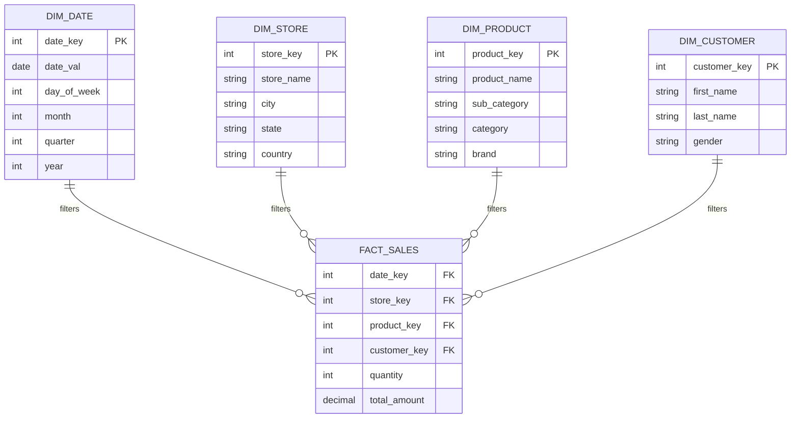

# Lược đồ hình sao - Star Schema

## Summary

Star Schema (Lược đồ hình sao) là kiến trúc cơ sở dữ liệu phổ biến và quan trọng nhất trong thiết kế Data Warehouse theo phương pháp Dimensional Modeling. Nó được gọi là "lược đồ hình sao" vì sơ đồ quan hệ của nó có hình dạng giống một ngôi sao: một bảng sự kiện (Fact Table) lưu trữ dữ liệu số liệu nằm ở trung tâm, bao quanh và liên kết trực tiếp với các bảng chiều (Dimension Tables) chứa dữ liệu mô tả. Nhờ cấu trúc phi chuẩn hóa và đơn giản này, Star Schema tối ưu hóa tuyệt đối tốc độ truy vấn phân tích và cực kỳ thân thiện với các công cụ Business Intelligence (BI).

---

## Definition

**Star Schema** là một dạng mô hình dữ liệu đa chiều (Dimensional Model) đơn giản nhất. Đặc điểm kỹ thuật nhận diện Star Schema là:
1. **Fact Table ở giữa**: Bảng trung tâm chứa các chỉ số đo lường (revenue, quantity) và các khóa ngoại (Foreign Keys).
2. **Dimension Tables xung quanh**: Bảng Dimension liên kết trực tiếp với Fact Table thông qua các khóa (thường là Surrogate Keys). 
3. **Mức độ chuẩn hóa**: Bảng Dimension trong Star Schema bị **phi chuẩn hóa (denormalized)**. Tức là không có bảng con nào liên kết thêm vào bảng Dimension. (Ví dụ: Bảng Product chứa luôn cả cột SubCategory và Category, thay vì tách ra làm 3 bảng).

---

## Why it exists

Trong cơ sở dữ liệu truyền thống (OLTP), để lấy được doanh thu của một Cửa hàng thuộc Khu vực Miền Nam bán Sản phẩm thuộc Danh mục Đồ gia dụng, hệ thống phải thực hiện (JOIN) qua 5-6 bảng liên tiếp. Quá trình JOIN nhiều bảng lớn là tác vụ "giết chết" hiệu năng của bất kỳ cơ sở dữ liệu quan hệ nào.

Star Schema ra đời để bẻ gãy sự phụ thuộc vòng vèo đó. Bằng cách gộp tất cả thuộc tính mô tả vào một bảng Dimension duy nhất và gắn trực tiếp vào Fact Table, thao tác truy vấn dữ liệu từ 6 phép JOIN được giảm xuống chỉ còn 2 phép JOIN. Điều này mang lại tốc độ phản hồi tính bằng giây cho các báo cáo dữ liệu khổng lồ.

---

## Core idea

Nguyên lý của Star Schema là sự đánh đổi (Trade-off): **Chấp nhận dư thừa dữ liệu để lấy tốc độ**.

Vì bảng Dimension bị phi chuẩn hóa, dữ liệu sẽ lặp lại. Giả sử ta có 1 triệu sản phẩm, trong đó 100,000 sản phẩm thuộc danh mục "Điện thoại". Chữ "Điện thoại" sẽ bị lưu lặp lại 100,000 lần trên ổ đĩa. 

Trong tư duy OLTP 3NF, đây là điều cấm kỵ. Nhưng trong tư duy OLAP của Data Warehouse:
* Giá ổ cứng lưu trữ rất rẻ. Dư thừa vài Megabyte/Gigabyte text không phải là vấn đề lớn.
* Tốc độ truy xuất báo cáo (CPU & Memory) mới là thứ đắt đỏ.
Do đó, Star Schema là giải pháp tối ưu nhất cho bài toán phân tích dữ liệu lớn.

---

## How it works

Khi một công cụ BI (như PowerBI hoặc Tableau) thực thi một truy vấn trên Star Schema:
1. Công cụ BI chọn các cột từ **Dimension Tables** (Ví dụ: `dim_date.year`, `dim_store.region`).
2. Công cụ BI chọn phép tính tổng hợp trên **Fact Table** (Ví dụ: `SUM(fact_sales.revenue)`).
3. Database engine sẽ lấy các bộ lọc từ Dimension, tham chiếu khóa `date_key` và `store_key` sang Fact Table, lọc ra các record tương ứng và cộng dồn doanh thu lại. Cơ chế này được gọi là **Star-join optimization**.

---

## Architecture / Flow

Dưới đây là mô phỏng ERD (Entity Relationship Diagram) của một Star Schema điển hình:



*Nhìn vào sơ đồ, ta thấy rõ cấu trúc tập trung: Tất cả các quan hệ đều là 1-Nhiều (1-to-Many) xuất phát từ Dimension trỏ thẳng vào Fact Table, không có nhánh phụ nào tỏa ra từ Dimension.*

---

## Practical example

Xét một truy vấn cần tìm "Tổng doanh thu bán các sản phẩm Apple tại cửa hàng khu vực Hà Nội trong năm 2026".

**Câu SQL trên Star Schema:**
```sql
SELECT 
    d.month,
    SUM(f.total_amount) AS revenue
FROM fact_sales f
JOIN dim_date d ON f.date_key = d.date_key
JOIN dim_store s ON f.store_key = s.store_key
JOIN dim_product p ON f.product_key = p.product_key
WHERE 
    d.year = 2026
    AND s.city = 'Hà Nội'
    AND p.brand = 'Apple'
GROUP BY 
    d.month
ORDER BY 
    d.month;
```
Câu lệnh trên rất trực quan. Optimizer của Database có thể dễ dàng lọc dữ liệu trên 3 bảng Dimension riêng biệt trước, lấy ra các `key` thỏa mãn điều kiện, và cuối cùng quét qua bảng `fact_sales` cực lớn để tính tổng một cách vô cùng hiệu quả.

---

## Best practices

* **Mọi bảng Dimension phải liên kết thẳng tới Fact**: Tuyệt đối không thiết kế các bảng trung gian (Bridge tables) giữa Dimension và Fact trừ khi bạn đang giải quyết bài toán quan hệ Nhiều-Nhiều (Many-to-Many).
* **Định nghĩa Grain rõ ràng**: Mỗi dòng trong bảng Fact phải cùng một mức độ chi tiết (grain). Nếu bảng `fact_sales` lưu dòng chi tiết sản phẩm, không được insert các dòng tổng hóa đơn vào bảng này.
* **Sử dụng Surrogate Key làm khóa chính**: Dùng kiểu dữ liệu số nguyên (INT/BIGINT) cho các khóa PK/FK. Không dùng chuỗi văn bản (VARCHAR) làm khóa liên kết giữa Fact và Dimension vì sẽ làm chậm quá trình JOIN và tốn dung lượng Fact Table.
* **Tạo "Conformed Dimensions"**: Thiết kế các Dimension có thể dùng chung. `dim_date` nên được dùng bởi cả `fact_sales` và `fact_inventory` để các báo cáo có thể đối chiếu (drill-across) cùng một mốc thời gian.

---

## Common mistakes

* **Quá tham lam đưa text vào Fact Table**: Đưa luôn cột `product_name` hay `customer_email` vào bảng `fact_sales` vì "tiện". Việc này làm bảng Fact (vốn có hàng tỷ dòng) phình to khủng khiếp. Dữ liệu văn bản phải được đẩy ra Dimension.
* **Snowflaking vô tình**: Cảm thấy khó chịu với việc trùng lặp dữ liệu trong `dim_product` (Ví dụ cột Category lặp lại), Data Engineer quyết định tách nó thành bảng `dim_category`. Lúc này Lược đồ hình sao đã bị phá vỡ và trở thành Snowflake Schema, làm chậm truy vấn.
* **Sử dụng NULL trong Fact Table FK**: Nếu một sản phẩm không có ngày kết thúc bảo hành, việc để `NULL` ở cột `warranty_date_key` sẽ làm lỗi các phép INNER JOIN. Hãy trỏ nó về `date_key = -1` (với ý nghĩa "Không áp dụng").

---

## Trade-offs

### Ưu điểm
* **Hiệu năng xuất sắc**: Số lượng JOIN ít nhất, đường dẫn thực thi SQL ngắn nhất.
* **Dễ hiểu (Usability)**: Người dùng nghiệp vụ (Business Users) dễ dàng hình dung cấu trúc dữ liệu để tự kéo-thả (drag-and-drop) báo cáo trên các công cụ BI.
* **Được tối ưu bởi phần mềm**: Tableau, PowerBI, Looker, dbt đều coi Star Schema là chuẩn thiết kế tự nhiên và tối ưu hóa tốt nhất cho nó.

### Nhược điểm
* **Redundancy (Dư thừa dữ liệu)**: Lưu trữ các chuỗi văn bản lặp đi lặp lại nhiều lần ở các bảng Dimension.
* **Maintenance Complexity**: Nếu thông tin phân cấp thay đổi (ví dụ: công ty tổ chức lại cấu trúc phòng ban), hệ thống ETL phải quét và Update hàng loạt dòng trong bảng Dimension liên quan (cần xử lý khéo léo qua SCD).

---

## When to use

* Star Schema là **lựa chọn mặc định (default choice)** cho 99% các dự án xây dựng Data Warehouse, Data Mart hoặc Semantic Layer.
* Bắt buộc sử dụng khi xây dựng model cho các công cụ BI hiện đại như PowerBI (DAX engine được thiết kế riêng biệt để chạy trên Star Schema).

## When not to use

* Khi xây dựng Core Enterprise Data Warehouse tập trung theo triết lý Inmon (yêu cầu chuẩn hóa 3NF tuyệt đối).
* Trong các ứng dụng Web/App giao dịch (OLTP) cần ghi nhận dữ liệu liên tục và toàn vẹn.

---

## Related concepts

* [Dimensional Modeling](/concepts/dimensional-modeling)
* [Snowflake Schema](/concepts/snowflake-schema)
* [Fact Table](/concepts/fact-table)
* [Dimension Table](/concepts/dimension-table)

---

## Interview questions

### 1. Tại sao Star Schema thường cho tốc độ truy vấn nhanh hơn Snowflake Schema?
* **Người phỏng vấn muốn kiểm tra**: Hiểu biết sâu về cơ chế thực thi SQL và đánh đổi của chuẩn hóa.
* **Gợi ý trả lời**: Star Schema lưu giữ các bảng Dimension ở trạng thái phi chuẩn hóa (denormalized), điều này có nghĩa là mọi thuộc tính ngữ cảnh đều nằm gọn trong một bảng duy nhất. Khi query báo cáo, ta chỉ cần JOIN từ Fact trực tiếp ra Dimension tương ứng (1 lần JOIN). Ngược lại, Snowflake Schema băm nhỏ Dimension ra thành nhiều bảng phân cấp. Khi query, database engine buộc phải thực hiện chuỗi các phép JOIN liên hoàn (Fact $\rightarrow$ Product $\rightarrow$ SubCategory $\rightarrow$ Category). Các phép JOIN vật lý là tác vụ tốn kém CPU và RAM nhất của Database. Do đó, lược bớt JOIN trong Star Schema sẽ đem lại tốc độ nhanh hơn hẳn.

### 2. Nếu bảng Dimension của bạn có 100 triệu dòng và việc phi chuẩn hóa Star Schema gây tốn hàng trăm GB ổ cứng, bạn sẽ làm gì?
* **Người phỏng vấn muốn kiểm tra**: Tư duy linh hoạt trong thực tế, không rập khuôn lý thuyết.
* **Gợi ý trả lời**: Mặc dù Star Schema là lý tưởng, nhưng nếu ta gặp trường hợp bảng Dimension khổng lồ (Monster Dimension) và sự trùng lặp dữ liệu phân cấp làm phình to ổ đĩa vượt quá chi phí cho phép, ta có thể áp dụng chiến lược kết hợp (Hybrid approach). Tại những nhánh Dimension quá lớn đó, ta chủ động phân chuẩn hóa (normalize) chúng thành Snowflake Schema để tiết kiệm ổ cứng và dễ duy trì (maintenance). Các nhánh Dimension nhỏ còn lại vẫn giữ nguyên dạng Star Schema. Kỹ thuật Data Engineering là tìm điểm cân bằng giữa Performance và Cost.

---

## References

1. **The Data Warehouse Toolkit** - Ralph Kimball (Phân tích chi tiết tại sao Star Schema là chuẩn mực).
2. **Microsoft Documentation: Understand star schema and the importance for Power BI**.
3. **Data Warehouse Systems: Design and Implementation** - Alejandro Vaisman.

---

## English summary

A Star Schema is the quintessential database architecture in dimensional modeling, characterized by a central Fact Table containing quantitative metrics (facts) linked directly to multiple denormalized Dimension Tables containing descriptive attributes. It earns its name from its visual resemblance to a star. By intentionally denormalizing the dimension tables (allowing data redundancy), the Star Schema minimizes complex table joins, thereby delivering lightning-fast query performance for OLAP workloads. Its intuitive structure makes it the "gold standard" for Data Marts and modern Business Intelligence tools, trading inexpensive disk space for expensive compute speed and user accessibility.
