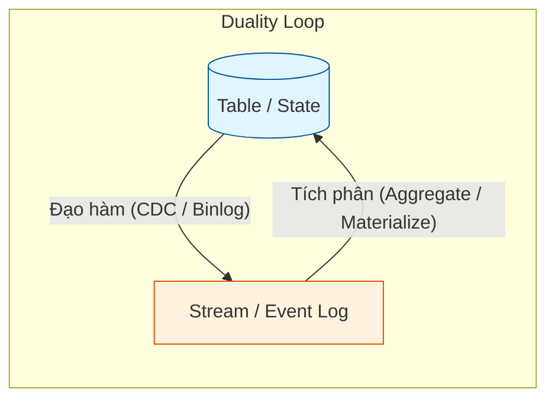

# Stream-Table Duality - Tính lưỡng tính Dòng - Bảng

## Summary

**Stream-Table Duality** (Tính lưỡng tính dòng - bảng) là một nguyên lý toán học cốt lõi trong hệ thống phân tán và cơ sở dữ liệu hiện đại. Nguyên lý này phát biểu rằng: **Bất kỳ một Luồng dữ liệu (Stream) nào cũng có thể được xem như một Bảng (Table), và bất kỳ Bảng nào cũng có thể được chuyển hóa thành một Luồng**. Sự liên kết này là nền tảng để xây dựng các công nghệ như Apache Kafka Streams, Flink SQL và các hệ thống Change Data Capture (CDC).

---

## Definition

* **Stream (Luồng)**: Là một chuỗi các sự kiện vô hạn xảy ra theo thời gian. Mỗi sự kiện ghi nhận một *sự thay đổi* (Change). Luồng biểu diễn dữ liệu đang chuyển động (Data in motion).
* **Table (Bảng)**: Là trạng thái (State) tập hợp của các khóa (keys) và giá trị mới nhất của chúng tại một thời điểm nhất định. Bảng biểu diễn dữ liệu ở trạng thái nghỉ (Data at rest).

**Tính lưỡng tính** có nghĩa là:
1. **Stream as a Table**: Nếu bạn gom nhóm (aggregate) hoặc phát lại toàn bộ lịch sử các sự kiện trong một Stream, kết quả cuối cùng bạn thu được chính là một Table (Trạng thái hiện tại).
2. **Table as a Stream**: Nếu bạn theo dõi và ghi lại mọi thao tác thêm, sửa, xóa (INSERT, UPDATE, DELETE) thực hiện trên một Table theo thời gian, bạn sẽ tạo ra một Stream.

---

## Why it exists

Trong quá khứ, kỹ sư xử lý dữ liệu Batch bằng Table (Database, Hadoop) và xử lý dữ liệu Real-time bằng Stream (Storm, Kafka). Hai thế giới này hoàn toàn tách biệt, sử dụng ngôn ngữ và công cụ khác nhau.
Việc phát hiện và ứng dụng nguyên lý Duality giúp hợp nhất hai thế giới này lại. Bằng cách hiểu rằng Table chỉ là "bức ảnh chụp tạm thời" của một Stream, các hệ thống như Flink hay ksqlDB cho phép người dùng viết các câu lệnh SQL truyền thống (vốn dĩ dành cho Table) để chạy trực tiếp trên các Stream vận động không ngừng.

---

## Core idea

Ý tưởng cốt lõi dựa trên một phương trình đơn giản được vay mượn từ vật lý / vi tích phân:

$$ Table = \int Stream $$
(Bảng là tích phân/tổng hợp của tất cả các sự kiện thay đổi trong luồng).

$$ Stream = \frac{d}{dt} Table $$
(Luồng là đạo hàm/sự thay đổi của Bảng theo thời gian).

Tương tự như trong trò chơi cờ vua: 
* **Table**: Vị trí các quân cờ trên bàn cờ lúc này.
* **Stream**: Cuốn sổ ghi chép lịch sử từng nước đi từ đầu ván. 
Bạn có thể nhìn bàn cờ để biết trạng thái (Table), hoặc có thể lấy một bàn cờ trống, đọc cuốn sổ (Stream) và đi lại từng bước để tái tạo chính xác trạng thái đó.

---

## How it works

1. **Từ Stream ra Table (Changelog Aggregation)**:
   * Hệ thống nhận một luồng sự kiện: `[+A(10), +B(5), -A(2), +A(5)]`
   * Nó duy trì một bộ nhớ nội bộ (State). Khi duyệt qua luồng trên, State cập nhật: 
     * Khóa A: 10 - 2 + 5 = 13.
     * Khóa B: 5.
   * Kết quả là một Bảng: `{A: 13, B: 5}`.

2. **Từ Table ra Stream (Change Data Capture - CDC)**:
   * Bạn có bảng User trong MySQL. Cột `status` của User X là `active`.
   * Lệnh SQL: `UPDATE users SET status = 'inactive' WHERE id = 'X';`
   * Database sinh ra một dòng nhật ký (Binlog): `"User X changed from active to inactive"`.
   * Gửi dòng này vào Kafka $\rightarrow$ Ta có một Stream các thay đổi.

---

## Architecture / Flow



---

## Practical example

Sử dụng ksqlDB (trên nền Apache Kafka) để thấy rõ tính lưỡng tính:

**1. Tạo một Stream (Lịch sử giao dịch):**
```sql
CREATE STREAM transactions (
    account_id VARCHAR,
    amount INT
) WITH (kafka_topic='txns', value_format='json');
```
*Stream chỉ chứa các sự kiện: [id: 1, amount: 100], [id: 1, amount: 50], [id: 2, amount: 200]*

**2. Chuyển Stream thành Table (Tổng số dư hiện tại):**
```sql
CREATE TABLE account_balances AS
SELECT 
    account_id, 
    SUM(amount) AS current_balance
FROM transactions
GROUP BY account_id;
```
*Bảng lưu trữ trạng thái hiện tại: {id: 1, balance: 150}, {id: 2, balance: 200}*

Mỗi khi có một message mới rơi vào luồng `transactions`, bảng `account_balances` tự động cập nhật giá trị tĩnh. Bảng này thực chất là một **Materialized View** (Khung nhìn vật lý) của luồng.

---

## Best practices

* **Lưu ý vòng đời của Stream vs Table**: Stream thường lớn vô hạn và lưu trữ dạng chuỗi (append-only) trên đĩa (như Kafka). Table lại cần truy xuất ngẫu nhiên (random access) và thường lưu trong bộ nhớ RAM hoặc Key-Value Store (RocksDB). Khi thiết kế pipeline, hãy cấu hình giới hạn thời gian lưu trữ (retention) phù hợp cho từng loại.
* **Sử dụng Compaction cho Table**: Trong Kafka, nếu một Topic đóng vai trò là Table (ví dụ topic lưu thông tin User), hãy cấu hình `cleanup.policy=compact`. Kafka sẽ tự động xóa các trạng thái cũ và chỉ giữ lại trạng thái mới nhất cho mỗi Key, giúp tiết kiệm đĩa cứng và tăng tốc độ tái tạo Table.

---

## Common mistakes

* **Quên định nghĩa Primary Key (Khóa chính) cho Table**: Stream không cần khóa chính vì nó là chuỗi sự kiện. Nhưng khi chuyển sang Table, bắt buộc phải có Khóa để hệ thống biết sự kiện tiếp theo sẽ tạo dòng mới (INSERT) hay ghi đè lên dòng cũ (UPDATE). Nếu không định nghĩa đúng Key, Table sẽ bị phình to vô hạn như Stream.
* **Gửi Stream sang Table Database mà không dùng UPSERT**: Khi đọc một luồng CDC để ghi vào Data Warehouse, nếu dùng lệnh `INSERT` thông thường, bạn sẽ ghi lại toàn bộ lịch sử thay đổi. Phải dùng lệnh `MERGE` hoặc `UPSERT` để ép luồng trở về dạng Table đúng nghĩa.

---

## Trade-offs

### Stream
* **Ưu điểm**: Lưu giữ toàn bộ lịch sử (Audit trail), không mất mát thông tin. Có thể tua lại (replay) để phân tích bug.
* **Nhược điểm**: Khó truy vấn nhanh trạng thái hiện tại ("Số dư hiện tại của tài khoản A là bao nhiêu?" yêu cầu phải quét lại toàn bộ lịch sử). Dữ liệu phình to nhanh chóng.

### Table
* **Ưu điểm**: Truy vấn trạng thái hiện tại cực kỳ nhanh chóng (O(1) bằng khóa). Dễ hiểu với người dùng SQL truyền thống.
* **Nhược điểm**: Xóa bỏ các trạng thái trung gian. Không thể biết được người dùng đã thay đổi tên bao nhiêu lần trước khi có cái tên hiện tại, trừ khi thiết kế Table dạng Slowly Changing Dimension.

---

## When to use

* Tư duy **Stream** khi: Cần phân tích xu hướng theo thời gian, phát hiện gian lận (Fraud Detection), lưu trữ log truy cập.
* Tư duy **Table** khi: Cần phục vụ các Dashboard báo cáo hiện trạng (Ví dụ: Bảng xếp hạng doanh số tháng, Số dư tài khoản, Hồ sơ khách hàng hiện tại).

## When not to use

Không áp dụng tính Duality nếu hệ thống nguồn không hỗ trợ CDC (Change Data Capture) chuẩn xác, dẫn đến luồng sinh ra bị thiếu sự kiện UPDATE/DELETE. Khi đó Table phục hồi từ luồng sẽ bị sai lệch hoàn toàn.

---

## Related concepts

* [Windowing](/concepts/windowing)
* [Change Data Capture (CDC)](/concepts/change-data-capture)
* [Apache Kafka](/concepts/apache-kafka)

---

## Interview questions

### 1. Hãy giải thích ngắn gọn nguyên lý Stream-Table Duality.
* **Người phỏng vấn muốn kiểm tra**: Hiểu biết khái niệm kiến trúc.
* **Gợi ý trả lời (Strong Answer)**: Tính lưỡng tính dòng - bảng chỉ ra rằng Luồng (Stream) và Bảng (Table) là hai mặt của cùng một đồng xu. Một Luồng là chuỗi các sự kiện thay đổi theo thời gian, và nếu ta áp dụng (aggregate) toàn bộ các sự kiện đó, ta thu được trạng thái tĩnh tại gọi là Bảng. Ngược lại, nếu ta theo dõi mọi sự thay đổi (INSERT, UPDATE, DELETE) diễn ra trên một Bảng, ta thu được một Luồng (như cơ chế CDC/Binlog).
* **Lỗi cần tránh**: Trả lời mơ hồ rằng "Stream là realtime, Table là batch".

### 2. Sự khác biệt giữa lưu trữ bằng Log (như Kafka) và lưu trữ dạng Table (như MySQL) là gì theo góc nhìn Duality?
* **Người phỏng vấn muốn kiểm tra**: Tư duy về Storage Layout.
* **Gợi ý trả lời (Strong Answer)**: Log trong Kafka là định dạng cấu trúc dữ liệu lưu trữ luồng (Stream) dưới dạng Append-Only (chỉ thêm vào cuối), nó ghi nhận mọi thay đổi của thế giới. Trong khi đó, MySQL Table lưu trữ trạng thái hiện tại (State), nó cho phép Mutable data (Ghi đè - In-place update). Table tối ưu để lấy thông tin điểm (Point-lookup), còn Log tối ưu để phục hồi lịch sử và phát tán thông điệp.

### 3. Change Data Capture (CDC) liên quan như thế nào đến nguyên lý này?
* **Người phỏng vấn muốn kiểm tra**: Ứng dụng lý thuyết vào công nghệ thực tế.
* **Gợi ý trả lời (Strong Answer)**: CDC chính là công cụ thực thi phép toán biến đổi "Table as a Stream". Các database truyền thống ẩn đi luồng sự kiện (chỉ cho phép user nhìn thấy trạng thái Table cuối cùng). Các công cụ CDC như Debezium sẽ đọc các Transaction Log (Binlog/WAL) ẩn bên dưới Database để "trích xuất" ra dòng thời gian của các sự kiện thay đổi và đẩy nó thành một Stream vào Kafka, trả lại bản chất lưỡng tính cho dữ liệu.

### 4. Trong Kafka, Log Compaction là gì và tại sao nó lại quan trọng đối với Stream-Table Duality?
* **Người phỏng vấn muốn kiểm tra**: Hiểu biết cấu hình cụ thể của Kafka phục vụ kiến trúc.
* **Gợi ý trả lời (Strong Answer)**: Log Compaction là chính sách dọn dẹp dữ liệu của Kafka. Thay vì xóa dữ liệu quá hạn theo thời gian (Retention Time), Compaction quét qua Topic và chỉ giữ lại thông điệp mới nhất cho mỗi Key (Xóa các update cũ). Điều này cực kỳ quan trọng vì nó biến một Stream vô hạn trở thành một Table nhỏ gọn. Khi một service mới khởi động và đọc cái compacted topic này, nó sẽ phục hồi lại đúng Bảng trạng thái hiện tại rất nhanh mà không phải đọc hàng tỷ event lịch sử vô dụng.

### 5. Nếu một thông điệp (event) trong Stream không có khóa (Key), ta có thể tạo Table từ nó không?
* **Người phỏng vấn muốn kiểm tra**: Hiểu về tính chất cốt lõi của Table.
* **Gợi ý trả lời (Strong Answer)**: Có thể tạo, nhưng rất hạn chế. Không có Key, mỗi sự kiện sẽ được coi là một thực thể độc lập. Kết quả là ta chỉ có thể thực hiện phép toán INSERT (Appends), bảng sẽ dài ra vô tận giống hệt Stream. Để bảng có thể UPDATE hoặc DELETE (tức là thay đổi trạng thái), ta bắt buộc phải khai báo một Key để hệ thống biết sự kiện mới sẽ tác động đè lên dòng nào trong bảng.

---

## References

1. **Kafka: The Definitive Guide** - Gwen Shapira (Chương 11: Stream Processing - Giải thích rất rõ về Duality).
2. **Confluent Blog** - Streams and Tables in Apache Kafka: A Primer (Bài viết kinh điển của Jay Kreps).
3. **Designing Data-Intensive Applications** - Martin Kleppmann.

---

## English summary

The **Stream-Table Duality** states that streams and tables are two sides of the same coin. A **Stream** represents data in motion (an append-only sequence of immutable events or changes), while a **Table** represents data at rest (the materialized, current state of those changes at a specific point in time). You can create a Table by aggregating a Stream (replaying the events), and you can create a Stream from a Table by capturing all of its mutations (INSERTs, UPDATEs, DELETEs) via Change Data Capture (CDC). This mathematical relationship is the fundamental concept powering modern streaming frameworks like Kafka Streams, Flink, and ksqlDB, allowing developers to query real-time infinite streams using familiar SQL table syntax.
