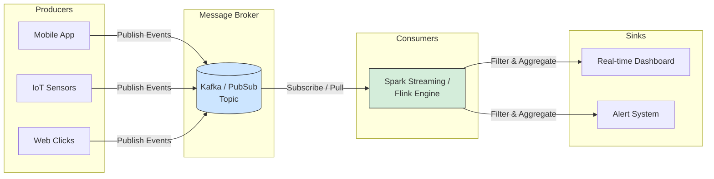

# Xử lý thời gian thực - Streaming Processing

## Summary

Streaming Processing (Xử lý dòng sự kiện) là mô hình xử lý dữ liệu liên tục, không ngừng nghỉ, nơi dữ liệu được tính toán và phản hồi ngay lập tức khi chúng được sinh ra (thường tính bằng phần nghìn giây - millisecond). Khác với Batch Processing phải chờ gom đủ dữ liệu theo cục (hàng giờ/hàng ngày), Streaming Processing cung cấp cho doanh nghiệp cái nhìn "đang xảy ra ở hiện tại" (What is happening right now), từ đó kích hoạt các hành động theo hướng sự kiện (Event-driven).

---

## Definition

**Streaming Processing** là kĩ thuật xử lý các luồng dữ liệu (Data Streams) theo thời gian thực (Real-time) hoặc gần thời gian thực (Near real-time). Luồng dữ liệu là một dãy các sự kiện (Events) vô hạn, không có điểm kết thúc. Ví dụ: dữ liệu cảm biến (IoT), lượt click chuột của người dùng, giao dịch thẻ tín dụng.

Thay vì lưu trữ dữ liệu vào database rồi mới mang ra phân tích, một hệ thống Streaming sẽ tiến hành "đánh chặn" và phân tích dữ liệu ngay trên đường truyền (in-motion).

---

## Why it exists

Trong kỉ nguyên số hiện tại, giá trị của dữ liệu giảm dần theo thời gian.
* Giao dịch quẹt thẻ tín dụng bị đánh cắp: Nếu bạn chờ hệ thống Batch hàng đêm chạy để phát hiện bất thường, ngày hôm sau thẻ đã bị rút sạch tiền. Bạn phải chặn đứng nó **trong 2 giây** sau khi quẹt thẻ.
* Dịch vụ gọi xe (Uber/Grab): Bạn cần biết vị trí của xe đang ở đâu ngay giây này, không phải vị trí của 10 phút trước.
* Đề xuất thương mại điện tử (Tiktok/Shopee): Gợi ý video tiếp theo dựa trên video bạn vừa lướt xem cách đây 3 giây.

Streaming Processing ra đời nhằm giải quyết triệt để tính chóp nhoáng của thông tin, thứ mà công nghệ Batch không bao giờ làm được.

---

## How it works

Hệ thống Streaming hoạt động theo ba chặng (Pub/Sub Model):



1. **Producers (Người sản xuất)**: Các ứng dụng, cảm biến gửi sự kiện (Event) liên tục vào một hệ thống môi giới thông điệp trung tâm.
2. **Message Broker / Event Streaming Platform**: Cốt lõi của hệ thống, thường là Apache Kafka, Amazon Kinesis hoặc Google Pub/Sub. Nó đóng vai trò là ống nước khổng lồ bền bỉ, nhận hàng triệu sự kiện mỗi giây, xếp hàng và giữ chúng không bị rớt mạng.
3. **Consumers / Stream Processing Engine**: Các động cơ xử lý phân tích (Apache Flink, Spark Structured Streaming, Kafka Streams) đọc dữ liệu ra khỏi ống nước. Tại đây, nó làm các tác vụ:
   * **Lọc (Filtering)**: Lọc các giao dịch có nghi ngờ gian lận.
   * **Cửa sổ thời gian (Windowing)**: Cộng tổng doanh thu trong "5 phút qua".
   * Xuất kết quả thẳng vào hệ thống cảnh báo hoặc Dashboard màn hình giám sát.

---

## Practical example

Hệ thống giám sát thẻ tín dụng của một ngân hàng bằng Spark Structured Streaming:

```python
# 1. Khởi tạo kết nối tới ống nước Kafka, lắng nghe "luôn luôn" không dừng
df = spark.readStream \
    .format("kafka") \
    .option("kafka.bootstrap.servers", "host1:9092") \
    .option("subscribe", "credit_card_transactions") \
    .load()

# 2. Xử lý logic Real-time: Tìm kiếm giao dịch trên $10,000 ở ngoại quốc
fraud_alerts = df.filter((col("amount") > 10000) & (col("is_foreign") == True))

# 3. Ghi kết quả ngược lại Kafka (vào một topic Cảnh báo) để App điện thoại nhắn tin cho user.
# Hàm writeStream giúp ứng dụng này chạy như 1 daemon (chạy ẩn mãi mãi)
query = fraud_alerts.writeStream \
    .format("kafka") \
    .option("topic", "fraud_alerts") \
    .start()

query.awaitTermination()
```

---

## Best practices

* **Thiết kế theo kiến trúc Lambda/Kappa**: 
  * Lambda: Chạy song song 1 luồng Batch (tính toán cực chuẩn, chậm) và 1 luồng Streaming (tính toán nhanh, độ trễ thấp). Sau đó hợp nhất kết quả.
  * Kappa: Coi mọi thứ đều là Streaming. Dùng Kafka lưu trữ dài hạn và Flink xử lý cả quá khứ lẫn hiện tại.
* **Xử lý Thời gian trễ (Late Data)**: Trong mạng di động, user click lúc 10:00 nhưng đi vào đường hầm, điện thoại mất mạng tới 10:05 mới gửi sự kiện lên máy chủ. Bạn phải hiểu rõ **Event Time** (thời gian user click) và **Processing Time** (thời gian máy chủ nhận) và sử dụng cơ chế Watermark của hệ thống Stream để bỏ qua hoặc gộp chung dữ liệu trễ hạn.

---

## Common mistakes

* **Quên tính huống khởi động lại (State Management)**: Khi xử lý Streaming đếm tổng số view của video Youtube, hệ thống bỗng dưng sập. Nếu bật lại mà không có Checkpoint (Lưu trữ trạng thái đang tính dở vào đĩa), bộ đếm sẽ trở về 0. Phải luôn quản lý State an toàn (dùng RocksDB hoặc HDFS/S3 cho checkpoint).
* **Quá tải hệ thống đích (Sink Overwhelm)**: Flink có thể xử lý 1 triệu dòng/giây nhưng viết thẳng vào cơ sở dữ liệu MySQL thì MySQL sẽ sập. Cần có thiết kế bộ đệm hoặc Bulk Write (viết lô nhỏ).

---

## Trade-offs

### Ưu điểm
* Độ trễ cực thấp (Low Latency): Phản ứng nhanh nhạy tạo ra lợi thế kinh doanh tuyệt đối.
* Xử lý luồng vô hạn: Không cần bộ nhớ vô hạn vì dữ liệu chảy qua bộ nhớ được giải phóng ngay lập tức.

### Nhược điểm
* **Độ phức tạp khổng lồ**: Khó debug, khó sửa dữ liệu hơn Batch gấp 10 lần. (Trong Batch, nếu sai số liệu, bạn chỉ cần xóa partition rồi chạy lại là xong. Trong Stream, mọi sự kiện cứ chảy qua như dòng sông không thể quay ngược).
* **Đảm bảo Delivery Semantics (Exactly Once)**: Rất đau đầu để giải quyết lỗi "1 thông báo bị tính 2 lần" khi xảy ra đứt mạng.

---

## When to use

* Phát hiện gian lận (Fraud Detection).
* Hệ thống giám sát hệ thống mạng / Máy chủ (Log monitoring).
* Cá nhân hóa Real-time (Đề xuất hàng hóa ngay tại lúc xem).
* Internet of Things (Cảm biến nhiệt độ, xe tự lái).

---

## Related concepts

* [Apache Kafka](/concepts/apache-kafka)
* [Change Data Capture (CDC)](/concepts/change-data-capture)
* [Batch Processing](/concepts/batch-processing)

---

## Interview questions

### 1. Phân biệt rõ sự khác nhau giữa Batch Processing và Stream Processing?
* **Người phỏng vấn muốn kiểm tra**: Tư duy lựa chọn mô hình kiến trúc dữ liệu.
* **Gợi ý trả lời**: 
  * **Batch**: Dữ liệu có giới hạn (Bounded). Xử lý theo đợt lớn định kỳ (Daily/Hourly). Độ trễ cao (hàng giờ). Phù hợp báo cáo tài chính chốt tháng, huấn luyện mô hình học máy.
  * **Stream**: Dữ liệu vô hạn, chảy liên tục (Unbounded). Hệ thống nghe (subscribe) và phản ứng tức thì (Millisecond latency). Dành cho hệ thống cảnh báo, khuyến nghị real-time.

### 2. Sự khác biệt giữa Event Time và Processing Time là gì?
* **Gợi ý trả lời**: Event Time là mốc thời gian sự kiện thực sự được sinh ra tại thiết bị nguồn (ví dụ: Điện thoại user ghi nhận lúc 9:00). Processing Time là thời gian máy chủ Data Engineer nhận được sự kiện đó để xử lý (ví dụ: Điện thoại rớt mạng nên 9:15 máy chủ mới nhận). Xử lý phân tích chuẩn xác phải dựa vào Event Time kết hợp cơ chế Watermark để chờ đợi những dòng "Late Data".

---

## References

* **Streaming Systems** - Tyler Akidau (Google).
* **Designing Data-Intensive Applications** - Martin Kleppmann (Chương Stream Processing).

---

## English summary

Streaming Processing is a computing paradigm designed to process unbounded streams of data continuously and in real-time. In contrast to Batch processing, which handles massive static datasets at scheduled intervals, Streaming engines (like Apache Flink or Spark Structured Streaming) ingest and transform events incrementally as they occur. This architecture is vital for ultra-low latency applications like fraud detection, ride-hailing tracking, and IoT analytics, relying heavily on message brokers like Apache Kafka. A primary challenge in streaming is maintaining fault tolerance (state management) and resolving out-of-order data using Event Time windowing.
