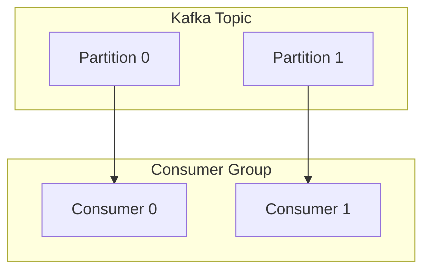

Trong thế giới của các luồng dữ liệu thời gian thực (Streaming Data), Apache Kafka nổi lên như một hệ thống vận chuyển thông điệp vô cùng mạnh mẽ. Để xử lý khối lượng tin nhắn khổng lồ đổ về mỗi giây, Kafka không thể chỉ dựa vào một máy chủ xử lý đơn lẻ. **Consumer Group (Nhóm người tiêu dùng)** chính là cơ chế thông minh giúp Kafka dễ dàng phân chia tải công việc và xử lý song song ở quy mô cực lớn.

## Consumer Group: Giải pháp chia sẻ gánh nặng tiêu thụ dữ liệu của Kafka

Về cơ bản, **Consumer Group** là một tập hợp các tiến trình hoặc ứng dụng khách `(Consumers)` cùng bắt tay hợp tác để đọc và tiêu thụ dữ liệu từ một hoặc nhiều Kafka Topics. 

Khi bạn thiết lập một ứng dụng để đọc dữ liệu từ Kafka, bạn sẽ luôn phải gán cho nó một mã định danh nhóm cụ thể thông qua cấu hình `group.id` (ví dụ: `group.id = "fraud-detection-service"`). 

**Quy tắc tối thượng của Kafka:** Mỗi tin nhắn `(message)` khi gửi vào một phân vùng `(Partition)` của Topic sẽ chỉ được gửi đến duy nhất **MỘT** thành viên Consumer trong cùng một Consumer Group.

Nhờ quy luật này, nếu nhóm xử lý của bạn có 4 máy chủ chạy song song, chúng sẽ tự động san sẻ công việc cho nhau mà không lo ngại việc hai máy đọc trùng dữ liệu của nhau, giúp tối ưu hóa hiệu năng một cách hoàn hảo.

## Tại sao chúng ta cần Consumer Group?

Hãy hình dung một kịch bản thực tế: Topic `web_logs` của bạn đang nhận tới 100.000 tin nhắn mỗi giây từ hệ thống website. Trong khi đó, ứng dụng phân tích dữ liệu viết bằng Python của bạn chỉ có thể xử lý tối đa 10.000 tin nhắn mỗi giây.

Nếu bạn chỉ chạy duy nhất một tiến trình đọc dữ liệu, hệ thống của bạn sẽ nhanh chóng bị quá tải, gây ra hiện tượng trễ `(Consumer Lag)` trầm trọng. Tin nhắn mới đổ vào sẽ bị ùn ứ ngày một nhiều.

Giải pháp tự nhiên nhất là mở rộng hệ thống bằng cách bật thêm 10 ứng dụng Python tương tự chạy trên 10 máy chủ khác nhau. Tuy nhiên, làm thế nào để 10 máy này tự động chia việc với nhau mà không đọc trùng tin nhắn của nhau?

Consumer Group chính là câu trả lời. Bằng cách gán cả 10 máy vào chung một `group.id`, Kafka sẽ đóng vai trò như một vị trọng tài phân xử, phân chia rõ ràng: *"Máy 1 đọc phân vùng 0, Máy 2 đọc phân vùng 1..."*, giúp việc xử lý song song diễn ra cực kỳ trơn tru.

## Quy luật phân phối việc giữa Partitions và Consumers

Cách thức phân công công việc của Consumer Group dựa hoàn toàn vào khái niệm **Partitions (Phân vùng)** của Topic. Kafka sẽ cấp phát quyền đọc dữ liệu dựa trên các kịch bản sau:

* **Kịch bản 1 (Lý tưởng)**: Topic của bạn có 4 Partitions (P0, P1, P2, P3) và Consumer Group của bạn có đúng 4 Consumers chạy song song. Kafka sẽ gán theo tỷ lệ 1-1: `Consumer 1 -> P0`, `Consumer 2 -> P1`, `Consumer 3 -> P2`, `Consumer 4 -> P3`. Công việc được phân phối đều tăm tắp.
* **Kịch bản 2 (Thừa Partitions)**: Topic có 4 Partitions nhưng nhóm chỉ có 2 Consumers (A và B). Kafka sẽ chia `Consumer A -> P0, P1` và `Consumer B -> P2, P3`. Lúc này, mỗi máy sẽ phải gánh gấp đôi lượng công việc.
* **Kịch bản 3 (Thừa Consumers - Cần tránh)**: Topic có 4 Partitions nhưng bạn lại bật tới 5 Consumers. Kafka sẽ chia 4 partitions cho 4 máy đầu tiên. **Consumer thứ 5 sẽ rơi vào trạng thái hoàn toàn nhàn rỗi (Idle)** và không nhận được bất kỳ tin nhắn nào, bởi vì Kafka quy định một partition không bao giờ được chia cho 2 consumers trong cùng một nhóm.

Sơ đồ dưới đây minh họa cách phân bổ dữ liệu của Consumer Group:



Nếu có nhiều Consumer Group khác nhau (ví dụ: một nhóm phục vụ gửi email marketing, một nhóm phục vụ phân tích bảo mật) cùng đăng ký một Topic, mỗi nhóm sẽ hoạt động hoàn toàn độc lập và nhận được một bản sao dữ liệu trọn vẹn của Topic đó mà không ảnh hưởng gì tới nhau.

## Cơ chế tự phục hồi lỗi: Rebalancing (Tái cân bằng nhóm)

Một trong những điểm mạnh nhất của Consumer Group là khả năng chịu lỗi `(Fault tolerance)` tự động cực tốt.

Nếu một máy chủ Consumer trong nhóm bị sập do mất điện hoặc rớt mạng, Kafka (thông qua Group Coordinator) sẽ lập tức phát hiện ra sự bất thường và kích hoạt tiến trình **Rebalance (Tái cân bằng)**:
1. Hệ thống sẽ tạm thời thu hồi các Partitions mà máy bị sập đang quản lý.
2. Tự động chuyển giao các Partitions đó sang cho các máy Consumer còn sống trong nhóm tiếp quản.
3. Quy trình này có thể gây dừng luồng đọc dữ liệu của toàn nhóm trong tích tắc `(Stop-the-world)`, nhưng nó đảm bảo hệ thống tự phục hồi mà không làm mất mát tin nhắn nào.

## Viết mã Python thiết lập Consumer Group thực tế

Dưới đây là ví dụ minh họa cách sử dụng thư viện `confluent_kafka` trong Python để cấu hình một Consumer tham gia vào nhóm `fraud-detection-service`:

```python
from confluent_kafka import Consumer

# Cấu hình tham số cho Consumer
conf = {
    'bootstrap.servers': 'localhost:9092',
    'group.id': 'fraud-detection-service', # Định nghĩa Consumer Group
    'auto.offset.reset': 'earliest'        # Đọc dữ liệu từ đầu nếu là nhóm mới
}

# Khởi tạo instance Consumer
consumer = Consumer(conf)

# Đăng ký lắng nghe Topic 'transactions'
consumer.subscribe(['transactions'])

# Vòng lặp liên tục để nhận dữ liệu (Polling)
try:
    while True:
        msg = consumer.poll(timeout=1.0)
        if msg is None:
            continue
        if msg.error():
            print(f"Lỗi: {msg.error()}")
            continue
            
        print(f"Nhận tin nhắn: {msg.value().decode('utf-8')} từ partition {msg.partition()}")
except KeyboardInterrupt:
    pass
finally:
    # Đóng kết nối an toàn để kích hoạt Rebalance ngay lập tức, nhường partition cho máy khác
    consumer.close()
```

## Cẩm nang vận hành Consumer Group (Best Practices)

* **Thiết kế số lượng Partition dư dả**: Hãy luôn tạo Topic với số lượng Partition lớn ngay từ đầu (ví dụ 30-50 partitions). Số lượng partition chính là giới hạn trần cho khả năng scale-out của bạn sau này. Nếu Topic chỉ có 4 partitions, bạn sẽ không bao giờ có thể chạy quá 4 máy chủ xử lý song song trong một nhóm.
* **Theo dõi chặt chẽ chỉ số Consumer Lag**: Đây là chỉ số sống còn đối với các luồng streaming. Lag biểu thị khoảng cách giữa vị trí tin nhắn mới nhất trong Kafka và vị trí tin nhắn mà ứng dụng của bạn đã xử lý xong. Nếu Lag liên tục tăng vọt, điều đó chứng tỏ ứng dụng của bạn đang quá tải, cần phải tối ưu hóa code hoặc bổ sung thêm máy chủ Consumer vào nhóm.

## Những cạm bẫy "chết người" dễ làm sập luồng dữ liệu

* **Thay đổi Group ID một cách tùy tiện**: Lập trình viên khi chạy thử code ở local thường đặt `group.id = "test-1"`, rồi sau đó sửa đổi thành `"test-2"`. Đối với Kafka, mỗi khi thấy một Group ID mới, nó sẽ coi đó là một hệ thống hoàn toàn mới và gửi lại toàn bộ dữ liệu lịch sử từ đầu `(nếu auto.offset.reset = earliest)`, dễ gây quá tải hệ thống thử nghiệm.
* **Code xử lý nghiệp vụ quá lâu**: Kafka giám sát sức khỏe của Consumer bằng nhịp tim `(heartbeat)`. Nếu Consumer không gọi hàm đọc dữ liệu `.poll()` trong một khoảng thời gian cấu hình (mặc định là 5 phút qua tham số `max.poll.interval.ms`), Kafka sẽ tin rằng máy đó đã chết và kích hoạt Rebalance để đẩy việc sang máy khác. Nếu máy khác nhận dữ liệu đó cũng bị kẹt quá 5 phút, vòng lặp Rebalance vô tận sẽ xảy ra, làm tê liệt toàn bộ hệ thống đọc dữ liệu.

## Sự đánh đổi khi co giãn Consumer Group

### Ưu điểm
* Giúp việc tăng giảm tài nguyên (Scaling) diễn ra cực kỳ đơn giản và tự động. Cần nhanh hơn? Chỉ cần bật thêm máy. Có máy sập? Máy khác tự động gánh.
* Đảm bảo tính nhất quán của dữ liệu.

### Nhược điểm
* Quá trình Rebalance truyền thống khá nặng nề. Mỗi khi có sự thay đổi thành viên trong nhóm, toàn bộ hoạt động đọc dữ liệu sẽ bị ngắt quãng trong giây lát để tính toán lại sơ đồ phân công. Tuy nhiên, ở các phiên bản Kafka hiện đại, cơ chế *Incremental Cooperative Rebalance* đã giúp giảm thiểu tối đa sự ngắt quãng này.

## Khi nào cần ứng dụng?

Bạn bắt buộc phải thiết kế và cấu hình Consumer Group (`group.id`) trong mọi kịch bản xây dựng ứng dụng tiêu thụ dữ liệu từ Kafka, dù là viết code backend thông thường hay sử dụng các framework chuyên dụng như Spark Streaming, Flink hay Kafka Streams.

Góc phỏng vấn: Những câu hỏi thực chiến

### 1. Nếu tôi có một Topic với 4 Partitions, nhưng tôi khởi động 5 tiến trình Consumer trong cùng một Consumer Group. Điều gì sẽ xảy ra?
* **Mục đích câu hỏi**: Kiểm tra mức độ am hiểu về nguyên lý phân phối dữ liệu 1-1 của Kafka.
* **Gợi ý trả lời**:
  * Kafka quy định mỗi partition chỉ được phép giao cho tối đa một Consumer trong cùng một nhóm tại một thời điểm để đảm bảo thứ tự đọc dữ liệu. 
  * Do đó, 4 tiến trình Consumer đầu tiên sẽ được phân bổ đọc 4 partitions tương ứng. Tiến trình Consumer thứ 5 sẽ hoàn toàn nhàn rỗi `(Idle)` và không nhận được bất kỳ tin nhắn nào. Nó sẽ chỉ hoạt động nếu một trong bốn Consumer kia gặp sự cố sập kết nối.

### 2. Sự khác biệt khi ứng dụng A và ứng dụng B cấu hình chung Group ID so với việc cấu hình khác Group ID là gì?
* **Mục đích câu hỏi**: Phân biệt mô hình Message Queue và Publish/Subscribe trong Kafka.
* **Gợi ý trả lời**:
  * *Khai báo chung Group ID*: Hai ứng dụng sẽ hoạt động như một đội để chia sẻ tải (Mô hình Message Queue). Kafka sẽ chia đôi số tin nhắn trong Topic, ứng dụng A nhận một nửa và ứng dụng B nhận một nửa.
  * *Khai báo khác Group ID*: Hai ứng dụng hoạt động hoàn toàn độc lập với các con trỏ ghi nhớ vị trí đọc `(Offset)` riêng biệt. Cả hai ứng dụng đều nhận được một bản sao nguyên vẹn 100% dữ liệu của Topic đó (Mô hình Publish/Subscribe).

## Khái niệm liên quan & Tài liệu tham khảo

**Khái niệm liên quan:**
* [Apache Kafka](/concepts/streaming-processing/apache-kafka/)
* [Kafka Topics & Partitions](/concepts/streaming-processing/kafka-topics-partitions/)

**Tài liệu tham khảo:**
1. [Kafka: The Definitive Guide](https://www.oreilly.com/library/view/kafka-the-definitive/9781492044048/) - Neha Narkhede, Gwen Shapira, and Todd Palino
2. [Designing Data-Intensive Applications](https://www.oreilly.com/library/view/designing-data-intensive-applications/9781491903063/) - Martin Kleppmann

## English Summary

Consumer Groups in Apache Kafka provide the essential mechanism for massively parallelizing data consumption. By assigning multiple consumer instances the same `group.id`, Kafka transparently divides the Topic's Partitions among them, preventing duplicate processing and effectively implementing a load-balancing message queue. Conversely, assigning unique group IDs enables the classic Publish-Subscribe pattern, allowing independent downstream systems (e.g., a real-time alerting engine and a [Data Lake](/concepts/data-lake-lakehouse/data-lake/) backup pipeline) to read the same stream of events at their own pace. Careful tuning of partitions is required, as the number of partitions acts as the hard ceiling on how many consumers can concurrently process data.
