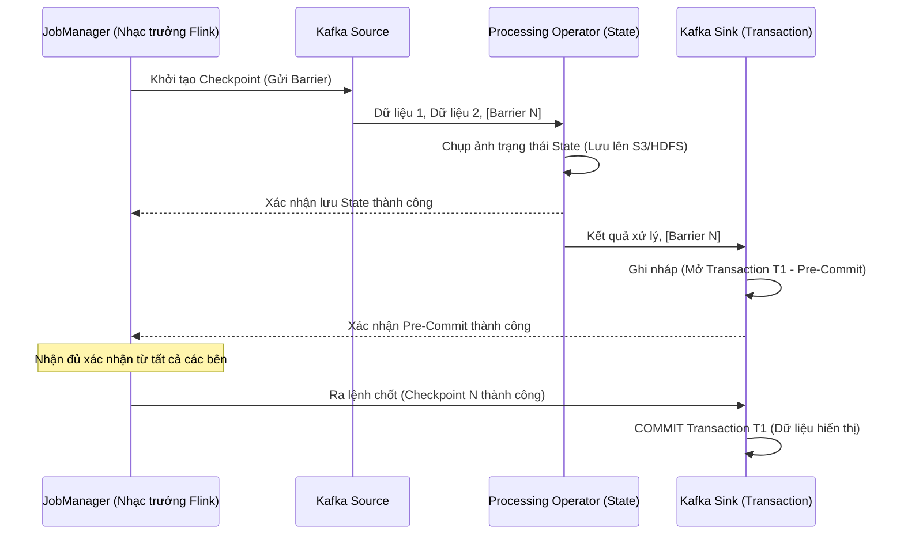

Trong các hệ thống phân tán xử lý dữ liệu lớn, có một thực tế phũ phàng mà các kỹ sư luôn phải đối mặt: **Mọi thứ đều có thể bị sập**. Mạng internet có thể mất kết nối bất ngờ, máy chủ có thể mất điện đột ngột và phần mềm có thể bị crash ở bất kỳ dòng code nào. 

Vậy điều gì sẽ xảy ra với lượng dữ liệu khổng lồ đang bay trên đường truyền khi sự cố ập đến? Làm sao để chúng ta đảm bảo dữ liệu không bị mất đi, và cũng không bị xử lý lặp lại nhiều lần làm sai lệch kết quả cuối cùng? 

Câu trả lời nằm ở **Exactly-Once Semantics (EOS) – Ngữ nghĩa xử lý chính xác một lần**. Đây được coi là "chén thánh" về độ tin cậy trong các hệ thống xử lý dữ liệu luồng (Streaming Processing).

## Khi server sập ở giữa chừng: Số tiền của khách sẽ đi về đâu?

Hãy tưởng tượng bạn đang xây dựng một ứng dụng xử lý giao dịch tài chính hoặc trừ tiền ví điện tử theo thời gian thực. Khách hàng thực hiện nạp 100 USD vào tài khoản.

* Nếu hệ thống của bạn hoạt động theo cơ chế **At-most-once (Tối đa một lần)**: Máy chủ nhận lệnh nạp tiền, bắt đầu xử lý nhưng đột ngột bị sập nguồn trước khi kịp ghi nhận vào cơ sở dữ liệu. Dữ liệu bị mất vĩnh viễn. Khách hàng bị trừ tiền ở thẻ ngân hàng nhưng số dư ví không tăng. Khách hàng sẽ cực kỳ giận dữ.
* Nếu hệ thống hoạt động theo cơ chế **At-least-once (Ít nhất một lần)**: Máy chủ xử lý nạp tiền thành công, nhưng đường truyền mạng bị đứt đúng lúc nó đang gửi phản hồi xác nhận về cho điện thoại của khách. Điện thoại của khách không nhận được phản hồi, tưởng giao dịch bị lỗi nên tự động gửi lại lệnh nạp tiền thêm một lần nữa. Máy chủ nhận lệnh mới và tiếp tục cộng thêm 100 USD. Khách hàng nạp 100 USD nhưng tài khoản được cộng 200 USD. Doanh nghiệp của bạn sẽ nhanh chóng phá sản.

Để giải quyết bài toán cân não này, chúng ta bắt buộc phải có **Exactly-Once Semantics**. Hệ thống phải đảm bảo rằng: Dù lỗi phần cứng hay mất mạng có xảy ra bao nhiêu lần đi chăng nữa, mỗi sự kiện đi vào hệ thống chỉ được phép tác động đến kết quả đầu ra đúng **một lần duy nhất**.

## Ba cấp độ bảo chứng ngữ nghĩa trong truyền tin

Trong lý thuyết thiết kế hệ thống tin nhắn và streaming, chúng ta phân chia thành 3 cấp độ bảo chứng:

1. **At-most-once (Tối đa một lần)**: Gửi tin nhắn đi và quên nó đi. Không có cơ chế gửi lại (retry). Nhanh nhất, tốn ít tài nguyên nhất nhưng dễ mất dữ liệu.
2. **At-least-once (Ít nhất một lần)**: Gửi tin nhắn và chờ xác nhận (ACK). Nếu quá thời hạn không nhận được ACK, hệ thống sẽ gửi lại. Đảm bảo dữ liệu không bao giờ bị mất, nhưng chấp nhận rủi ro dữ liệu bị trùng lặp (duplicate) khi mạng chập chờn.
3. **Exactly-once (Chính xác một lần)**: Cấp độ cao nhất và phức tạp nhất. Đảm bảo dữ liệu không bị mất và hệ thống đích chỉ ghi nhận xử lý đúng một lần duy nhất, triệt tiêu hoàn toàn trùng lặp.

## Công thức để đạt được Exactly-Once: Khi Source, Processor và Sink cùng bắt tay

Có một hiểu lầm phổ biến là: Chỉ cần bật cấu hình Exactly-once trên công cụ xử lý (ví dụ Apache Flink) là toàn bộ hệ thống đã đạt được Exactly-once. 

Thực tế, để đạt được Exactly-once toàn diện từ đầu tới cuối (End-to-End Exactly-Once), cả 3 thành phần trong đường ống dữ liệu phải phối hợp chặt chẽ với nhau:
1. **Nguồn dữ liệu (Source)**: Phải có khả năng phát lại dữ liệu từ một vị trí cụ thể (ví dụ: các Topic của Kafka cho phép đọc lại dữ liệu từ một `offset` cũ).
2. **Bộ xử lý (Processor)**: Phải có khả năng lưu lại trạng thái tính toán tại mỗi thời điểm (State Snapshots / Checkpointing). Nếu gặp sự cố, bộ xử lý sẽ quay ngược (rollback) trạng thái về điểm lưu gần nhất và yêu cầu Source phát lại dữ liệu từ offset tương ứng.
3. **Đích đến (Sink)**: Đây là phần khó nhất. Khi dữ liệu bị phát lại, Sink phải có cơ chế để không ghi trùng lặp dữ liệu vào database đích. Có hai giải pháp cho Sink:
   * **Idempotent Sink (Ghi lũy đẳng)**: Ghi đè dữ liệu theo Khóa chính (Primary Key). Phép toán ghi đè $x=10$ chạy 1 lần hay 10 lần thì giá trị của $x$ vẫn là 10.
   * **Transactional Sink (Giao dịch hai pha - 2PC)**: Chỉ thực sự chốt (commit) dữ liệu vào database đích cùng lúc với thời điểm bộ xử lý lưu checkpoint thành công.

## Giải phẫu cơ chế hoạt động của Apache Flink và Kafka

Sự kết hợp giữa Apache Flink (Processor) và Apache Kafka (Source & Sink) là kiến trúc kinh điển để đạt được Exactly-Once nhờ giao thức **Two-Phase Commit (Giao dịch 2 pha)**:



1. **Pha 1 - Pre-Commit**: Nhạc trưởng `JobManager` của Flink gửi một tín hiệu đặc biệt gọi là **Checkpoint Barrier** xuôi theo luồng dữ liệu. Khi các bộ xử lý nhận được Barrier, chúng dừng xử lý một chút để chụp ảnh lại trạng thái hiện tại (State) và ghi lên bộ lưu trữ bền vững (như S3). Khi Barrier đi tới `Kafka Sink`, Sink này sẽ mở một giao dịch ghi nháp (`Pre-Commit`) dữ liệu lên Kafka. Lúc này dữ liệu đã được ghi nhưng vẫn ở trạng thái ẩn, người dùng cuối chưa thể đọc được.
2. **Pha 2 - Commit**: Khi JobManager nhận được xác nhận từ tất cả các bộ phận đã lưu State và ghi nháp thành công, nó sẽ phát lệnh chính thức: *"Checkpoint thành công, chốt giao dịch!"*. Lúc này, `Kafka Sink` mới thực hiện lệnh `COMMIT` để đưa dữ liệu ra ánh sáng cho mọi người truy cập.

Nếu hệ thống bị sập giữa chừng ở Pha 1, Flink sẽ hủy bỏ (abort) toàn bộ các giao dịch ghi nháp dở dang, khôi phục lại trạng thái cũ từ checkpoint gần nhất và chạy lại luồng xử lý một cách an toàn.

## Thực hành: Cấu hình Exactly-Once trong Java API

Dưới đây là cách bạn kích hoạt ngữ nghĩa xử lý chính xác một lần trong ứng dụng Java chạy trên Apache Flink kết nối với Kafka:

```java
StreamExecutionEnvironment env = StreamExecutionEnvironment.getExecutionEnvironment();

// Kích hoạt cơ chế lưu ảnh trạng thái (Checkpointing) định kỳ mỗi 10 giây ở chế độ EXACTLY_ONCE
env.enableCheckpointing(10000, CheckpointingMode.EXACTLY_ONCE);

KafkaSource<String> source = KafkaSource.<String>builder()
    .setBootstrapServers("broker:9092")
    .setTopics("input-topic")
    .setGroupId("my-group")
    .setValueOnlyDeserializer(new SimpleStringSchema())
    .build();

DataStream<String> stream = env.fromSource(source, WatermarkStrategy.noWatermarks(), "Kafka Source");

// Thực hiện các logic biến đổi dữ liệu...
DataStream<String> result = stream.map(s -> "Processed: " + s);

KafkaSink<String> sink = KafkaSink.<String>builder()
    .setBootstrapServers("broker:9092")
    .setRecordSerializer(KafkaRecordSerializationSchema.builder()
        .setTopic("output-topic")
        .setValueSerializationSchema(new SimpleStringSchema())
        .build()
    )
    // CẤU HÌNH QUAN TRỌNG: Kích hoạt bảo chứng giao dịch Exactly-Once cho đầu ra
    .setDeliveryGuarantee(DeliveryGuarantee.EXACTLY_ONCE)
    .setTransactionalIdPrefix("my-txn-id-prefix-")
    .build();

result.sinkTo(sink);
```

*Lưu ý quan trọng:* Ở phía các ứng dụng đọc dữ liệu từ Kafka đầu ra (Consumer), bạn bắt buộc phải cấu hình thuộc tính `isolation.level = read_committed`. Cấu hình này giúp Consumer chỉ đọc những dữ liệu đã được commit chính thức, bỏ qua các dữ liệu nháp của các giao dịch chưa hoàn tất.

## Giải pháp thay thế thông minh và những lỗi thường gặp

### Giải pháp thay thế bằng Lũy đẳng (Idempotent Sinks)
Việc triển khai giao thức giao dịch hai pha (2PC) rất phức tạp và ảnh hưởng nhiều đến hiệu năng. Nếu hệ thống đích của bạn là các cơ sở dữ liệu hỗ trợ cơ chế ghi đè theo Khóa chính (như Redis, Cassandra, Elasticsearch hoặc các câu lệnh `INSERT ON CONFLICT UPDATE` của SQL), hãy tận dụng tính chất **Lũy đẳng (Idempotency)**. 

Bằng cách thiết kế khóa chính duy nhất cho mỗi bản ghi dữ liệu, bạn chỉ cần Flink chạy ở chế độ **At-least-once** đơn giản. Khi có lỗi và dữ liệu bị gửi lặp lại, database đích sẽ tự động ghi đè lên khóa cũ, giúp kết quả cuối cùng vẫn đạt được tính Exactly-once một cách nhẹ nhàng và hiệu quả.

### Sai lầm dễ mắc phải (Common Mistakes)
* **Gọi API bên ngoài trực tiếp trong luồng xử lý**: Việc thực hiện các cuộc gọi HTTP REST API trực tiếp bên trong hàm `map()` của Flink để xử lý dữ liệu là vô cùng nguy hiểm. Các hệ thống API bên ngoài này nằm ngoài tầm kiểm soát của Flink Checkpoint và giao dịch 2 pha. Nếu luồng dữ liệu bị lỗi và chạy lại, các cuộc gọi API này sẽ bị thực hiện lặp lại, gây ra lỗi nghiêm trọng cho hệ thống bên ngoài.
* **Quên cấu hình isolation level ở Consumer**: Bật Exactly-once ở Flink rất chu đáo nhưng ở ứng dụng Consumer đọc cuối cùng lại quên cấu hình `isolation.level = read_committed`. Consumer sẽ đọc cả các dữ liệu nháp (chưa commit) và gây ra hiện tượng trùng lặp số liệu khi có lỗi xảy ra.

## Được và mất: Cân nhắc giữa Hiệu năng và Độ chính xác

### Điểm cộng (Pros)
* Giúp lập trình viên không cần phải viết các logic loại bỏ trùng lặp dữ liệu (deduplication) phức tạp ở tầng ứng dụng.
* Đảm bảo tính đúng đắn tuyệt đối cho các ứng dụng tài chính, hóa đơn, thanh toán.

### Điểm trừ (Cons)
* **Độ trễ hệ thống tăng cao (Latency Penalty)**: Vì dữ liệu ở Sink phải chờ đợi lệnh commit chính thức từ Checkpoint (thường mất từ vài giây đến vài phút tùy cấu hình), dữ liệu đầu ra sẽ không hiển thị ngay lập tức cho người dùng cuối.
* **Tốn tài nguyên**: Cơ chế chụp ảnh trạng thái liên tục tiêu tốn rất nhiều băng thông mạng và tài nguyên I/O của ổ đĩa.

## Khi nào nên áp dụng?

* Các ứng dụng liên quan đến tiền tệ, tài chính, thanh toán trực tuyến, ví điện tử.
* Hệ thống tính toán chỉ số quảng cáo (AdTech) nơi mỗi lượt click chuột đều ảnh hưởng trực tiếp đến hóa đơn tiền mặt của khách hàng.
* Các hệ thống phân tích dữ liệu lớn yêu cầu độ chính xác tuyệt đối của các chỉ số KPI.

Không cần thiết áp dụng cho các hệ thống giám sát log kỹ thuật thông thường (lệch một vài dòng log không ảnh hưởng tới hoạt động kinh doanh) hoặc các hệ thống cảnh báo IoT cần độ trễ dưới giây (sub-second latency).

## Khái niệm liên quan

* State Management
* [Apache Kafka](/concepts/streaming-processing/apache-kafka/)
* Apache Flink

## Góc phỏng vấn

### 1. Sự khác biệt cốt lõi giữa At-least-once và Exactly-once là gì?
* **Gợi ý trả lời**: At-least-once bảo chứng rằng không có tin nhắn nào bị mất bằng cách gửi lại tin nhắn nếu không nhận được xác nhận (ACK). Tuy nhiên, nếu xảy ra chập chờn mạng, tin nhắn có thể bị ghi nhận nhiều lần gây trùng lặp dữ liệu. Exactly-once nâng cấp hơn bằng cách kết hợp cơ chế lưu trạng thái (State Checkpointing) và giao dịch (Transactions). Dù tin nhắn có bị gửi lại bao nhiêu lần đi chăng nữa, hệ thống đảm bảo tác động của nó lên trạng thái cuối cùng của cơ sở dữ liệu chỉ diễn ra đúng một lần duy nhất, loại bỏ hoàn toàn hiện tượng trùng lặp.

### 2. "End-to-End Exactly-Once" nghĩa là gì và tại sao chỉ cấu hình ở engine xử lý (như Flink) là chưa đủ?
* **Gợi ý trả lời**: "End-to-End Exactly-Once" yêu cầu toàn bộ các mắt xích trong đường ống dữ liệu bao gồm Nguồn (Source) $\rightarrow$ Bộ xử lý (Flink) $\rightarrow$ Đích đến (Sink) phải cùng phối hợp hoạt động. Nếu chúng ta chỉ bật checkpoint trong Flink, Flink chỉ đảm bảo trạng thái tính toán nội bộ của nó là chính xác một lần. Khi Flink ghi dữ liệu ra một database đích không hỗ trợ giao dịch hay ghi đè lũy đẳng, nếu Flink gặp sự cố và chạy lại từ checkpoint cũ, nó sẽ thực hiện ghi lại lượng dữ liệu đó một lần nữa vào database đích, gây ra trùng lặp dữ liệu ở đầu ra. Vì vậy, database đích (Sink) bắt buộc phải hỗ trợ tính lũy đẳng hoặc giao thức giao dịch hai pha (2PC) đồng bộ với Flink.

### 3. Hãy giải thích ngắn gọn cơ chế hoạt động của giao thức Giao dịch hai pha (Two-Phase Commit - 2PC) trong Flink-Kafka.
* **Gợi ý trả lời**: Giao thức 2PC chia quá trình ghi dữ liệu thành hai bước:
  1. **Pha Pre-Commit (Chuẩn bị)**: Trong khi Flink xử lý dữ liệu và tạo checkpoint, Kafka Sink sẽ ghi nháp dữ liệu vào Kafka dưới một mã giao dịch (Transaction ID) tạm thời. Dữ liệu này được lưu nhưng đánh dấu là chưa commit, khiến các consumer thông thường không đọc được.
  2. **Pha Commit (Chốt)**: Sau khi Flink xác nhận đã chụp ảnh trạng thái (State Checkpoint) toàn hệ thống thành công và an toàn lên bộ lưu trữ, JobManager sẽ phát lệnh commit đến Kafka Sink. Sink này lập tức đổi trạng thái của mã giao dịch thành commit, giúp dữ liệu chính thức hiển thị ra ngoài. Nếu có lỗi xảy ra ở pha 1, toàn bộ giao dịch nháp sẽ bị hủy bỏ (abort).

## Tài liệu tham khảo

1. **Designing Data-Intensive Applications** - Martin Kleppmann.
2. **Apache Flink Documentation** - Fault Tolerance Guarantees & Two-Phase Commit.
3. **Kafka The Definitive Guide** - Exactly Once Semantics.

## Tóm tắt bằng tiếng Anh (English Summary)

**Exactly-Once Semantics (EOS)** is the highest message delivery guarantee in distributed streaming systems. It ensures that despite node failures, network partitions, or crashes, every message in the source is processed and affects the final output state exactly one time (no data loss, no duplicates). End-to-End EOS is achieved by combining the processing engine's coordinated state snapshots (like Flink's Checkpointing via the Chandy-Lamport algorithm) with specialized output mechanisms—either an Idempotent Sink (where overwriting the same key yields the same result) or a Transactional Sink employing a Two-Phase Commit (2PC) protocol. While EOS is mandatory for financial and billing applications, it introduces complexity and performance latency trade-offs.
