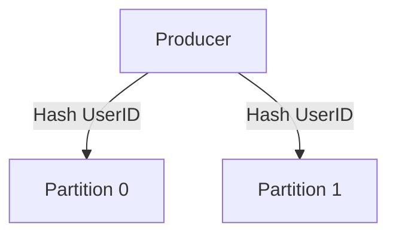

Khi xây dựng các hệ thống xử lý dữ liệu thời gian thực (Real-time Streaming) ở quy mô lớn, Apache Kafka luôn là cái tên được nhắc đến đầu tiên. Sự mạnh mẽ và khả năng chịu tải khủng khiếp của Kafka không đến từ sự ngẫu nhiên. Nó bắt nguồn từ một kiến trúc thiết kế thông minh xoay quanh hai khái niệm cốt lõi: **Topic** (Chủ đề) và **Partition** (Phân vùng). Hãy cùng bóc tách xem chúng là gì và tại sao chúng lại là chìa khóa mở ra thông lượng truyền tải dữ liệu vô hạn của Kafka.

## Topics và Partitions là gì?

* **Topic (Chủ đề)**: Bạn có thể hình dung Topic giống như một "Bảng" (Table) trong cơ sở dữ liệu quan hệ, hoặc một "Thư mục" (Folder) lưu trữ file. Nó là một danh mục logic dùng để phân loại dữ liệu. Các ứng dụng tạo dữ liệu (Producers) sẽ đẩy thông tin vào một Topic cụ thể (ví dụ: `website_clicks`), và các ứng dụng tiêu thụ dữ liệu (Consumers) sẽ đăng ký nhận tin từ Topic đó.
* **Partition (Phân vùng)**: Để tránh việc một Topic quá lớn đè bẹp một máy chủ duy nhất, Kafka chia nhỏ Topic đó một cách vật lý thành nhiều phần độc lập gọi là các Partitions (ví dụ: Partition 0, Partition 1, Partition 2). Mỗi Partition thực chất là một tệp log ghi dữ liệu theo kiểu **chỉ chèn tiếp (Append-only)** và không thể xóa hay sửa đổi giữa chừng. Mỗi máy chủ (Broker) trong cụm Kafka sẽ đảm nhận việc lưu trữ và quản trị một số lượng Partition nhất định.

Bên trong từng Partition, mỗi tin nhắn (Message) khi chui vào sẽ được gán cho một số thứ tự duy nhất tăng dần đều gọi là **Offset** (chỉ số vị trí).

## Tại sao việc chia nhỏ dữ liệu thành các Partition lại cực kỳ quan trọng?

Hãy tưởng tượng một Topic khổng lồ ghi nhận toàn bộ lịch sử tìm kiếm của người dùng trên toàn cầu, với tần suất khoảng 1 triệu tin nhắn mỗi giây. Nếu bạn dồn toàn bộ Topic này vào một máy chủ duy nhất, đĩa cứng của máy chủ đó sẽ bị đầy và băng thông mạng sẽ nghẽn lập tức. Sức mạnh của cả hệ thống Kafka lúc này sẽ bị giới hạn bởi năng lực xử lý của chiếc máy chủ yếu nhất đó.

Giải pháp chia Partition giúp Kafka thoát khỏi giới hạn vật lý này:
* Bằng cách chặt nhỏ Topic đó thành 100 Partitions rải đều trên 100 máy chủ Broker khác nhau, áp lực ghi đĩa và băng thông mạng lập tức được chia đều cho 100 cỗ máy.
* Ở đầu ra, 100 ứng dụng Consumers có thể đồng thời kết nối vào 100 máy chủ này để bốc dữ liệu ra xử lý song song. Nhờ kiến trúc phân tán phân vùng này, Kafka có khả năng mở rộng ngang (Scale-out) gần như vô cực.

## Cách phân phối tin nhắn vào các Partition

Khi một Producer gửi một tin nhắn mới, làm cách nào Kafka quyết định tin nhắn đó sẽ chui vào Partition nào? Câu trả lời nằm ở thuộc tính **Khóa của bản ghi (Message Key)**:

1. **Trường hợp tin nhắn không có khóa (Key = NULL)**: Kafka sẽ áp dụng chiến lược phân phối vòng tròn (Round-robin). Tin nhắn số 1 vào Partition 0, tin số 2 vào Partition 1, tin số 3 vào Partition 2 và tiếp tục xoay vòng.
2. **Trường hợp tin nhắn có khóa (ví dụ Key = `user_id`)**: Kafka sẽ đưa chuỗi khóa này qua thuật toán băm (Murmur2 Hash) để tính toán ra một chỉ số cố định tương ứng với một Partition cụ thể.
   * *Ý nghĩa*: Tất cả các sự kiện phát sinh liên quan đến cùng một người dùng (ví dụ `user_Bob`) sẽ luôn được gom về và xếp hàng tuần tự tại cùng một Partition duy nhất.

### Cam kết về tính thứ tự (Ordering Guarantee)
Một đặc tính vô cùng quan trọng cần lưu ý: **Kafka chỉ bảo đảm thứ tự trước sau của tin nhắn trong nội bộ của CÙNG một Partition**. Kafka hoàn toàn không bảo đảm thứ tự thời gian trên bình diện toàn bộ Topic.

Sơ đồ dưới đây minh họa luồng phân phối dữ liệu dựa trên việc băm khóa người dùng:



Để đảm bảo các sự kiện của một đối tượng cụ thể luôn được xử lý tuần tự, bạn bắt buộc phải truyền `Message Key` tương ứng trong mã nguồn Producer của mình. Dưới đây là ví dụ minh họa bằng Python:

```python
from kafka import KafkaProducer
import json

producer = KafkaProducer(bootstrap_servers='localhost:9092')

# Gửi message với Key để đảm bảo thứ tự trong cùng 1 partition
producer.send(
    topic='page_views',
    key=b'user_Bob', # Khoá quyết định Partition đích
    value=json.dumps({"action": "login"}).encode('utf-8')
)
producer.flush()
```

## Những chỉ dẫn thiết kế "vàng" và sai lầm phổ biến

### Chỉ dẫn "vàng" cho kỹ sư
* **Tính toán số lượng Partition hợp lý ngay từ đầu**: Số lượng Partition giới hạn trực tiếp số lượng Consumers tối đa có thể tham gia xử lý song song trong một nhóm. Công thức tính nhanh thường là: *Tổng thông lượng mong muốn (MB/s) chia cho Tốc độ xử lý của một Consumer đơn lẻ (MB/s)*. Đối với các hệ thống lớn, cấu hình mặc định từ 30 đến 50 partitions cho một Topic là lựa chọn phổ biến.
* **Hạn chế việc tăng số lượng Partition khi hệ thống đang chạy**: Mặc dù Kafka cho phép bạn tăng số lượng Partition sau khi tạo (ví dụ từ 3 lên 5), nhưng bạn tuyệt đối không thể giảm số lượng này. Hơn thế nữa, khi số lượng Partition thay đổi, công thức băm sẽ bị lệch. Tin nhắn của người dùng `user_Bob` trước đó chui vào Partition 1 nay có thể bị chuyển sang Partition 4, phá vỡ hoàn toàn cam kết bảo đảm thứ tự tuần tự của người dùng đó.

### Sai lầm phổ biến dễ mắc phải
* **Quên thiết lập Message Key cho các sự kiện có liên kết logic**: Hãy nghĩ về chuỗi giao dịch ngân hàng: `(T1: Tạo đơn -> T2: Trừ tiền -> T3: Gửi tin nhắn SMS báo biến động số dư)`. Nếu bạn không truyền Key, 3 sự kiện này sẽ bị phân phối vòng tròn vào 3 Partitions khác nhau và được 3 máy chủ Consumer xử lý song song. Do độ trễ mạng, rất có thể hệ thống sẽ gửi SMS cho khách hàng trước khi lệnh trừ tiền thực tế được ghi nhận! Hãy luôn gán `Key = transaction_id` hoặc `customer_id` để ép chúng đi vào cùng một luồng xếp hàng tuần tự.
* **Tạo quá nhiều Partition trên cụm thiết bị nhỏ**: Việc duy trì mỗi Partition đòi hỏi tài nguyên hệ thống để quản lý file descriptor và lưu trữ metadata. Thiết lập hàng trăm ngàn Partition trên một cụm máy chủ cấu hình yếu sẽ nhanh chóng làm sập hệ thống.

## Cân đo đong đếm được và mất (Trade-offs)

### Điểm cộng
* Hỗ trợ xử lý đọc/ghi song song cực kỳ tốt, hiệu năng tăng trưởng tuyến tính theo số lượng phần cứng bổ sung.
* Hỗ trợ cơ chế sao chép (Replication) giúp nâng cao tính sẵn sàng của hệ thống. Ví dụ: Partition 0 nằm trên Broker 1 sẽ có một bản sao dự phòng (Replica) trên Broker 2. Nếu Broker 1 gặp sự cố cháy nổ, Broker 2 sẽ lập tức đứng lên thay thế mà không gây gián đoạn hệ thống.

### Điểm trừ
* Việc không hỗ trợ bảo đảm thứ tự toàn cục (Global Order) trên toàn bộ Topic đòi hỏi các kỹ sư phần mềm phải thiết kế cấu trúc luồng dữ liệu và băm khóa (Hash Routing) thật sự cẩn thận để tránh lỗi logic nghiệp vụ.

## Các khái niệm liên quan

* [Apache Kafka](/concepts/streaming-processing/apache-kafka/)
* [Consumer Groups (Nhóm tiêu thụ dữ liệu)](/concepts/streaming-processing/consumer-groups/)
* [Data Skew (Lệch dữ liệu)](/concepts/batch-processing/data-skew/)

## Góc phỏng vấn: Trả lời tự tin trước nhà tuyển dụng

### 1. Tại sao Apache Kafka lại quyết định chỉ cam kết bảo đảm thứ tự tin nhắn tuần tự trong nội bộ của một Partition thay vì trên toàn bộ Topic?
* **Mục đích câu hỏi**: Đánh giá hiểu biết sâu sắc của ứng viên về các bài toán đánh đổi (trade-offs) khi thiết kế hệ thống phân tán.
* **Gợi ý trả lời**: Nếu Kafka muốn cam kết bảo đảm thứ tự tuần tự tuyệt đối cho toàn bộ hàng triệu tin nhắn mỗi giây trên phạm vi toàn Topic, hệ thống bắt buộc phải điều hướng tất cả tin nhắn đi qua một bộ điều phối trung tâm duy nhất để xếp hàng. Điều này sẽ tiêu diệt hoàn toàn lợi thế phân tán của Kafka và tạo ra một điểm nghẽn cổ chai (bottleneck) nghiêm trọng về mặt hiệu năng. Bằng cách giới hạn tính thứ tự trong nội bộ từng Partition, Kafka có thể phân tán công việc ra hàng ngàn máy chủ, chấp nhận đánh đổi một chút sự phức tạp ở tầng logic ứng dụng để đổi lấy khả năng mở rộng (scalability) băng thông phần cứng vô hạn.

### 2. Giả sử hệ thống Consumer đang đọc dữ liệu từ một Topic thì bị mất điện đột ngột. Khi khởi động lại, làm thế nào Consumer biết mình cần phải đọc tiếp từ đâu để không bị mất mát hoặc trùng lặp dữ liệu?
* **Mục đích câu hỏi**: Kiểm tra hiểu biết của ứng viên về cơ chế quản lý Offset và tính nhất quán dữ liệu của Kafka.
* **Gợi ý trả lời**: Kafka quản lý việc này thông qua khái niệm **Commit Offset**. Khi một Consumer xử lý thành công một tin nhắn, nó sẽ gửi một phản hồi (commit) về cho Kafka để ghi nhận vị trí hiện tại của mình (ví dụ: đã đọc xong Offset 10 của Partition 0). Mốc Offset này được Kafka lưu trữ an toàn trong một Topic hệ thống đặc biệt tên là `__consumer_offsets`. Khi Consumer bị sập và khởi động lại, nó sẽ gửi yêu cầu lên Broker để xin lại mốc Offset đã commit gần nhất của mình, từ đó tiếp tục đọc tin nhắn từ Offset số 11 một cách chính xác mà không sợ bị sót hoặc xử lý lặp lại dữ liệu.

## Tài liệu tham khảo

* **Kafka: The Definitive Guide** - Neha Narkhede (Chương Kafka Internals).
* Confluent: How to choose the number of topics/partitions.

## English Summary

Kafka Topics act as logical categories for streaming messages, while Partitions are the physical core of Kafka's distributed nature. By subdividing a Topic into multiple Partitions spread across various Brokers, Kafka accomplishes massive horizontal scalability and parallel I/O processing. A critical design characteristic is that Kafka guarantees strict message ordering only within a single Partition—not globally across the Topic. Ensuring messages that require sequential processing (e.g., state changes of a specific transaction) land in the same Partition requires assigning a consistent Message Key before publishing.
