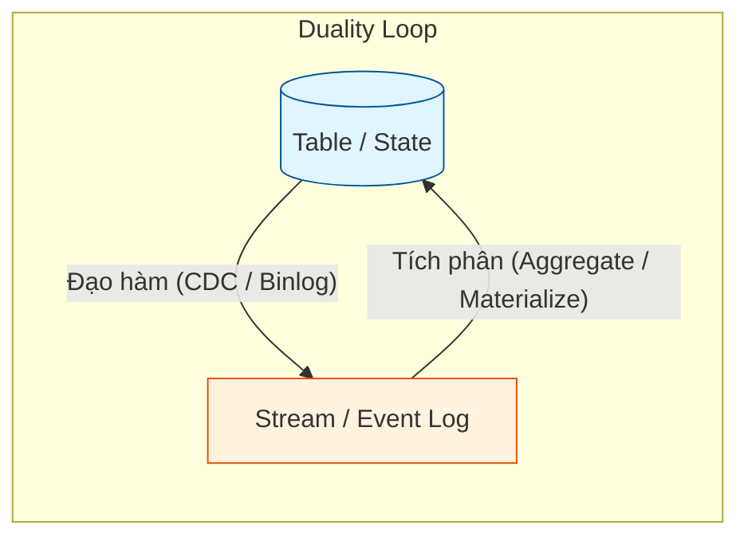

Trong thế giới thiết kế hệ thống phân tán và cơ sở dữ liệu hiện đại, **Stream-Table Duality (Tính lưỡng tính dòng - bảng)** là một nguyên lý toán học cốt lõi đầy thú vị. Nguyên lý này phát biểu một cách đơn giản nhưng cực kỳ mạnh mẽ: **Bất kỳ một luồng dữ liệu động nào (Stream) cũng có thể được cô đọng lại thành một bảng dữ liệu tĩnh (Table), và bất kỳ một bảng tĩnh nào cũng có thể được chuyển hóa thành một luồng dữ liệu biến động liên tục.** 

Hiểu được mối quan hệ mật thiết này là chìa khóa để bạn làm chủ các công nghệ xử lý luồng hiện đại như Apache Kafka Streams, Flink SQL hay các hệ thống trích xuất thay đổi dữ liệu (Change Data Capture - CDC).

## Dòng và Bảng: Chúng thực sự là gì?

Để làm rõ tính lưỡng tính này, trước hết chúng ta cần đặt hai khái niệm này cạnh nhau:

* **Luồng (Stream):** Hãy tưởng tượng một dòng nước chảy không ngừng. Trong kỹ thuật dữ liệu, Stream là một chuỗi các sự kiện (events) vô hạn xảy ra theo dòng thời gian. Mỗi sự kiện ghi lại một *sự thay đổi* duy nhất (Change). Stream đại diện cho dữ liệu đang vận động (**Data in motion**).
* **Bảng (Table):** Ngược lại với dòng nước, Table giống như một hồ nước phẳng lặng. Nó là trạng thái (State) tập hợp của các khóa (keys) và giá trị mới nhất của chúng tại một thời điểm cố định. Table đại diện cho dữ liệu ở trạng thái tĩnh (**Data at rest**).

Mối quan hệ lưỡng tính giữa chúng được thể hiện qua hai chiều:
1. **Biến Luồng thành Bảng (Stream as a Table):** Nếu bạn gom nhóm (aggregate) hoặc phát lại toàn bộ lịch sử các sự kiện trong một Stream từ đầu đến cuối, kết quả cuối cùng bạn thu được chính là trạng thái hiện tại của dữ liệu – tức là một Table.
2. **Biến Bảng thành Luồng (Table as a Stream):** Nếu bạn theo dõi sát sao và ghi lại mọi thao tác thêm mới, sửa đổi hoặc xóa bỏ (`INSERT`, `UPDATE`, `DELETE`) diễn ra trên một Table theo thời gian, bạn sẽ tạo ra một Stream ghi chép các biến động.

## Tại sao chúng ta cần thấu hiểu tính lưỡng tính này?

Trong quá khứ, thế giới kỹ thuật dữ liệu bị chia đôi rõ rệt: một bên xử lý dữ liệu Batch thông qua các bảng tĩnh (như Database, Hadoop), một bên xử lý dữ liệu thời gian thực thông qua các luồng sự kiện (như Storm, Kafka). Hai thế giới này sử dụng các ngôn ngữ, công cụ và lối tư duy hoàn toàn khác biệt.

Việc phát hiện ra nguyên lý Stream-Table Duality đã bắc một cây cầu hợp nhất hai thế giới. Khi hiểu rằng Bảng thực chất chỉ là "bức ảnh chụp tạm thời" tại một khoảnh khắc của một Luồng, các hệ thống như Flink hay ksqlDB đã cho phép lập trình viên viết các câu lệnh SQL truyền thống (vốn dĩ được thiết kế cho các bảng tĩnh) để chạy trực tiếp và trả về kết quả liên tục trên các dòng chảy dữ liệu vô hạn.

## Bản chất toán học và ẩn dụ thực tế

Chúng ta có thể biểu diễn mối quan hệ này bằng hai công thức toán học quen thuộc trong tích phân và đạo hàm:

$$ Table = \int Stream $$
*(Bảng là tích phân - hay sự tổng hợp - của tất cả các sự kiện thay đổi trong luồng).*

$$ Stream = \frac{d}{dt} Table $$
*(Luồng là đạo hàm - hay tốc độ thay đổi - của Bảng theo thời gian).*

Hãy nghĩ về một ván cờ vua để dễ hình dung hơn:
* **Table:** Là vị trí hiện tại của các quân cờ trên bàn cờ. Nó cho biết cục diện ngay lúc này.
* **Stream:** Là cuốn sổ ghi chép từng nước đi của hai kỳ thủ từ đầu trận đấu.

Nếu bạn chỉ có bàn cờ hiện tại (Table), bạn biết ngay thế trận. Nhưng nếu bạn chỉ có cuốn sổ ghi chép (Stream), bạn vẫn có thể lấy một bàn cờ trống ra, đi lại từng nước cờ theo thứ tự trong sổ để tái hiện lại chính xác 100% thế trận hiện tại.

## Kiến trúc và Vòng lặp lưỡng tính

Mối quan hệ qua lại này tạo nên một vòng lặp khép kín trong kiến trúc dữ liệu:


* **Chiều đi lên (Tích phân):** Các sự kiện riêng lẻ trong Log được gom tụ lại để hình thành nên Trạng thái (State Store hoặc Materialized View).
* **Chiều đi xuống (Đạo hàm):** Bất kỳ thay đổi nào trên Database được hệ thống Change Data Capture (CDC) quét qua Transaction Log (như Binlog của MySQL) để phát tán ngược trở lại thành luồng sự kiện.

## Ví dụ thực tế với ksqlDB

Hãy cùng xem ksqlDB (một SQL engine chạy trên Apache Kafka) xử lý tính lưỡng tính này như thế nào:

**1. Khai báo một Stream (đại diện cho luồng giao dịch):**

```sql
CREATE STREAM transactions (
    account_id VARCHAR,
    amount INT
) WITH (kafka_topic='txns', value_format='json');
```
*Stream này sẽ liên tục nhận các sự kiện chuyển tiền dạng: `[id: 1, amount: 100]`, `[id: 1, amount: 50]`, `[id: 2, amount: 200]`...*

**2. Chuyển đổi Stream đó thành một Table (Tổng số dư tài khoản):**

```sql
CREATE TABLE account_balances AS
SELECT 
    account_id, 
    SUM(amount) AS current_balance
FROM transactions
GROUP BY account_id;
```
*Kết quả ta thu được một bảng tĩnh biểu diễn số dư hiện tại: `{id: 1, balance: 150}`, `{id: 2, balance: 200}`.*

Mỗi khi có một giao dịch mới xuất hiện trong luồng `transactions`, bảng `account_balances` sẽ tự động cập nhật giá trị số dư mới nhất. Bảng này thực chất là một **Materialized View** (Khung nhìn vật lý) liên tục được làm mới từ luồng sự kiện gốc.

## Cạm bẫy thiết kế và những Best Practices cần thuộc lòng

### Các nguyên tắc thiết kế tốt (Best Practices)
* **Quản lý vòng đời dữ liệu phù hợp:** Stream có xu hướng phình to vô hạn và được lưu trữ tuần tự (append-only) trên đĩa cứng (như Kafka). Bảng lại cần truy xuất ngẫu nhiên cực nhanh và thường được lưu trữ trong bộ nhớ RAM hoặc Key-Value Store (như RocksDB). Hãy thiết kế thời gian lưu trữ (retention policy) hợp lý cho từng loại để tránh tràn bộ nhớ.
* **Cấu hình [Compaction](/concepts/data-lake-lakehouse/compaction/) cho Table:** Nếu một Kafka Topic được dùng để biểu diễn một Bảng (ví dụ: thông tin cấu hình người dùng), hãy thiết lập thuộc tính `cleanup.policy=compact`. Kafka sẽ tự động dọn dẹp các bản ghi cũ và chỉ giữ lại bản ghi mới nhất cho mỗi Key, giúp tiết kiệm dung lượng đĩa và đẩy nhanh quá trình tái cấu trúc bảng khi khởi động lại dịch vụ.

### Những sai lầm thường gặp (Common Mistakes)
* **Quên định nghĩa Khóa chính (Primary Key) khi tạo Table:** Stream không cần khóa chính vì nó chỉ quan tâm đến các sự kiện độc lập. Nhưng khi chuyển hóa thành Table, bạn bắt buộc phải xác định khóa. Nếu không, hệ thống sẽ không biết sự kiện tiếp theo là chèn mới (`INSERT`) hay cập nhật (`UPDATE`) dữ liệu cũ, dẫn đến việc bảng tĩnh bị phình to vô hạn giống như một Stream.
* **Chèn dữ liệu thô từ Stream vào Database mà không dùng UPSERT:** Khi bạn tiêu thụ một luồng CDC để ghi đè vào [Data Warehouse](/concepts/data-warehouse/data-warehouse/), nếu chỉ dùng lệnh `INSERT` thông thường, bạn sẽ vô tình lưu trữ toàn bộ lịch sử thay đổi của dòng đó. Hãy dùng lệnh `MERGE` hoặc `UPSERT` để ép luồng dữ liệu trở về đúng dạng trạng thái tĩnh của Bảng.

## Đặt hai khái niệm lên bàn cân (Trade-offs)

### Đặc trưng của Stream
* **Ưu điểm:** Lưu trữ trọn vẹn lịch sử thay đổi (Audit trail), không làm mất mát thông tin theo thời gian. Lập trình viên có thể tua lại (replay) luồng để sửa lỗi hoặc chạy các phân tích lịch sử.
* **Nhược điểm:** Rất khó và chậm khi cần truy vấn nhanh trạng thái hiện tại (ví dụ: muốn biết số dư tài khoản lúc này, hệ thống buộc phải quét và cộng dồn lại toàn bộ lịch sử giao dịch từ đầu).

### Đặc trưng của Table
* **Ưu điểm:** Truy vấn trạng thái hiện tại cực kỳ nhanh (độ phức tạp $O(1)$ nếu truy xuất bằng khóa chính). Rất trực quan và quen thuộc với người viết SQL.
* **Nhược điểm:** Xóa bỏ hoàn toàn các trạng thái trung gian. Bạn sẽ không thể biết người dùng đã đổi tên bao nhiêu lần trước khi có cái tên hiện tại, trừ khi bạn chủ động thiết kế thêm các bảng lịch sử phức tạp (như [Slowly Changing Dimension](/concepts/data-warehouse/slowly-changing-dimension/)).

## Khi nào nên dùng tư duy Dòng, khi nào nên dùng tư duy Bảng?

* **Hãy tư duy theo Luồng (Stream) khi:** Bạn cần phân tích hành vi người dùng theo thời gian, xây dựng các hệ thống phát hiện gian lận tài chính (Fraud Detection) dựa trên chuỗi hành động liên tiếp, hoặc thu thập log hệ thống.
* **Hãy tư duy theo Bảng (Table) khi:** Bạn cần xây dựng các Dashboard báo cáo tức thời, hiển thị số dư tài khoản hiện tại, quản lý thông tin hồ sơ khách hàng mới nhất, hoặc lập bảng xếp hạng doanh số.

> [!CAUTION]
> Đừng cố áp dụng tính lưỡng tính này nếu hệ thống nguồn của bạn không hỗ trợ cơ chế Change Data Capture (CDC) chuẩn xác. Nếu luồng sự kiện bị mất mát hoặc thiếu hụt các sự kiện `UPDATE`/`DELETE`, bảng trạng thái được phục hồi từ luồng đó sẽ bị sai lệch hoàn toàn so với thực tế.

## Khái niệm liên quan & Tài liệu tham khảo

**Khái niệm liên quan:**
* [Windowing - Phân mảnh thời gian](/concepts/streaming-processing/windowing/)
* [Change Data Capture (CDC) - Trích xuất thay đổi dữ liệu](/concepts/etl-elt/change-data-capture/)
* [Apache Kafka - Nền tảng luồng sự kiện](/concepts/streaming-processing/apache-kafka/)

**Tài liệu tham khảo:**
1. [Kafka: The Definitive Guide](https://www.oreilly.com/library/view/kafka-the-definitive/9781492044048/) - Gwen Shapira, Todd Palino, Rajini Sivaram, and Krit Gunnala
2. [Confluent Blog: Streams and Tables in Apache Kafka: A Primer](https://www.confluent.io/blog/kafka-streams-tables-primer/)
3. [Designing Data-Intensive Applications](https://www.oreilly.com/library/view/designing-data-intensive-applications/9781491903063/) - Martin Kleppmann

---

## Góc phỏng vấn: Những câu hỏi hóc búa về Stream-Table Duality

### 1. Hãy giải thích ngắn gọn nguyên lý Stream-Table Duality cho một người mới bắt đầu.
**Gợi ý trả lời:**
Nguyên lý này chỉ ra rằng Luồng (Stream) và Bảng (Table) thực chất là hai cách nhìn nhận khác nhau của cùng một tập dữ liệu. Luồng là lịch sử ghi chép tất cả các sự kiện thay đổi xảy ra theo thời gian (dữ liệu động). Bảng là trạng thái tích lũy mới nhất của các thay đổi đó tại một thời điểm (dữ liệu tĩnh). Chúng ta có thể tạo ra Bảng bằng cách phát lại (aggregate) toàn bộ các sự kiện trong Luồng, và ngược lại, tạo ra Luồng bằng cách ghi lại mọi thay đổi (CDC) trên Bảng.

### 2. Sự khác biệt về mặt lưu trữ vật lý (Storage Layout) giữa Log (Kafka) và Table (MySQL) là gì?
**Gợi ý trả lời:**
* **Log (như Kafka):** Được thiết kế theo cơ chế append-only (chỉ viết thêm vào cuối file), bất biến (immutable). Nó tối ưu cho việc ghi tuần tự liên tục và phát tán sự kiện (publish/subscribe) cũng như tua lại lịch sử.
* **Table (như MySQL):** Được thiết kế để cho phép ghi đè (mutable). Nó lưu trữ trạng thái cuối cùng của bản ghi và sử dụng các cấu trúc chỉ mục (như B-Tree) để tối ưu hóa việc tìm kiếm và truy xuất ngẫu nhiên theo khóa chính (Point-lookup) với tốc độ nhanh nhất.

### 3. Change Data Capture (CDC) đóng vai trò gì trong nguyên lý này?
**Gợi ý trả lời:**
CDC đóng vai trò là cầu nối chuyển đổi từ "Bảng sang Luồng" (Table as a Stream). Thông thường, các cơ sở dữ liệu quan hệ chỉ cho người dùng nhìn thấy trạng thái tĩnh của Bảng và ẩn đi lịch sử thay đổi bên dưới. Các công cụ CDC (như Debezium) sẽ đọc trực tiếp Transaction Log (Binlog của MySQL hoặc WAL của PostgreSQL) để trích xuất ra các sự kiện thay đổi dưới dạng luồng dữ liệu thời gian thực và đẩy vào hệ thống như Kafka, trả lại bản chất lưỡng tính tự nhiên cho dữ liệu.

### 4. Log Compaction trong Kafka hoạt động thế nào và tại sao nó lại quan trọng đối với Stream-Table Duality?
**Gợi ý trả lời:**
Log Compaction là một chính sách dọn dẹp dữ liệu của Kafka. Thay vì xóa bỏ dữ liệu dựa trên thời gian (Retention time), Kafka sẽ quét qua topic và chỉ giữ lại thông điệp mới nhất cho mỗi Khóa (Key), loại bỏ các cập nhật cũ hơn. 

Điều này cực kỳ quan trọng vì nó biến một Stream sự kiện có dung lượng vô hạn thành một Bảng trạng thái gọn nhẹ. Khi một dịch vụ mới khởi chạy, nó chỉ cần đọc các bản ghi đã được compact để nhanh chóng khôi phục lại trạng thái hiện tại của Bảng mà không phải tốn thời gian xử lý hàng tỷ sự kiện lịch sử không còn giá trị.

### 5. Nếu các sự kiện trong Stream không có Khóa (Key), chúng ta có thể chuyển hóa nó thành Table được không?
**Gợi ý trả lời:**
Về lý thuyết là có thể, nhưng việc sử dụng sẽ bị giới hạn nghiêm trọng. Nếu không có Khóa, hệ thống sẽ coi mỗi sự kiện là một thực thể độc lập và duy nhất. Khi chuyển thành Bảng, chúng ta chỉ có thể thực hiện thao tác chèn thêm (`INSERT`), khiến bảng phình to liên tục giống hệt như Stream. Để Bảng có thể thực hiện các thao tác cập nhật (`UPDATE`) hoặc xóa (`DELETE`) dữ liệu cũ, bắt buộc các sự kiện trong Stream phải đi kèm với một Khóa định danh để hệ thống biết sự kiện mới sẽ tác động đè lên bản ghi nào.

---

## English summary

The **Stream-Table Duality** states that streams and tables are two sides of the same coin. A **Stream** represents data in motion (an append-only sequence of immutable events or changes), while a **Table** represents data at rest (the materialized, current state of those changes at a specific point in time). You can create a Table by aggregating a Stream (replaying the events), and you can create a Stream from a Table by capturing all of its mutations (INSERTs, UPDATEs, DELETEs) via Change Data Capture (CDC). This mathematical relationship is the fundamental concept powering modern streaming frameworks like Kafka Streams, Flink, and ksqlDB, allowing developers to query real-time infinite streams using familiar SQL table syntax.