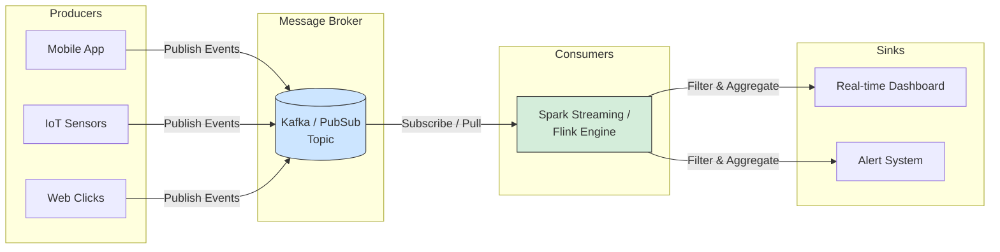

Hãy tưởng tượng dữ liệu trong doanh nghiệp của bạn giống như một dòng sông chảy xiết không ngừng nghỉ. Thay vì chờ đến cuối ngày, khi dòng sông tạm lắng xuống để bạn múc từng xô nước lớn về phân tích (mô hình Batch Processing), bạn quyết định đặt một hệ thống cảm biến và bộ lọc thông minh ngay trên dòng chảy đó để phân tích, tính toán và phản hồi tức thì với từng giọt nước đi qua (thường chỉ mất vài phần nghìn giây). Đó chính là bản chất của **Streaming Processing (Xử lý dòng sự kiện)**. 

Phương pháp này mang đến cho doanh nghiệp khả năng thấu hiểu những gì "đang thực sự xảy ra ở hiện tại" (What is happening right now), từ đó kích hoạt các hành động tức thì theo hướng sự kiện (Event-driven).

## Streaming Processing là gì? Khi dữ liệu chuyển động liên tục

**Streaming Processing** là kỹ thuật xử lý các luồng dữ liệu (Data Streams) theo thời gian thực (Real-time) hoặc gần thời gian thực (Near real-time). Trong thế giới số, luồng dữ liệu là một chuỗi các sự kiện (Events) vô hạn, chảy liên tục và không bao giờ có điểm kết thúc. Ví dụ dễ thấy nhất là dữ liệu từ các cảm biến thông minh (IoT), lịch sử click chuột của người dùng trên trang web, hay các giao dịch quẹt thẻ tín dụng trên toàn cầu.

Thay vì lưu trữ toàn bộ dữ liệu vào một cơ sở dữ liệu cồng kềnh rồi mới lôi ra chạy các câu lệnh SQL phân tích, một hệ thống Streaming sẽ tiến hành "đánh chặn" và xử lý dữ liệu ngay trên đường truyền khi chúng đang di chuyển (Data in motion).

## Tại sao thời gian thực lại quyết định sự sống còn của doanh nghiệp?

Trong nền kinh tế số hiện nay, giá trị của thông tin giảm dần theo từng giây. 
* **Giao dịch quẹt thẻ tín dụng bị đánh cắp:** Nếu hệ thống của bạn đợi đến nửa đêm mới chạy Batch để quét và phát hiện các giao dịch đáng ngờ, thì lúc đó thẻ của khách hàng đã bị kẻ gian rút sạch tiền. Bạn bắt buộc phải phát hiện và chặn đứng giao dịch đó **trong vòng 2 giây** kể từ khi thẻ được quẹt.
* **Dịch vụ gọi xe công nghệ (Uber, Grab):** Bạn cần biết vị trí thực tế của tài xế ngay tại giây này để điều phối xe và tính giá động, chứ không phải vị trí của họ cách đây 10 phút.
* **Gợi ý nội dung (TikTok, Shopee):** Hệ thống cần gợi ý video hoặc sản phẩm tiếp theo dựa trên những gì bạn vừa lướt xem cách đây đúng 3 giây, để giữ chân bạn ở lại ứng dụng lâu nhất có thể.

Streaming Processing ra đời nhằm giải quyết bài toán về tính "chớp nhoáng" của thông tin – điều mà các hệ thống xử lý theo lô (Batch Processing) truyền thống không bao giờ có thể đáp ứng được.

## Một hệ thống Streaming vận hành như thế nào?

Hầu hết các hệ thống Streaming Processing hiện đại đều hoạt động theo mô hình Pub/Sub (Publish/Subscribe) gồm ba chặng chính:


1. **Producers (Người phát dữ liệu):** Các ứng dụng điện thoại, thiết bị cảm biến hoặc trình duyệt web liên tục gửi các sự kiện (Events) vào một hệ thống môi giới thông điệp trung tâm.
2. **Message Broker / Event Streaming Platform (Hệ thống môi giới):** Đây là "đường ống dẫn nước" khổng lồ và cực kỳ bền bỉ. Những cái tên nổi bật như Apache Kafka, Amazon Kinesis hay Google Pub/Sub đóng vai trò tiếp nhận hàng triệu sự kiện mỗi giây, xếp hàng và lưu trữ chúng an toàn mà không sợ mất mát dữ liệu do mất kết nối mạng.
3. **Consumers / Stream Processing Engine (Bộ xử lý):** Đây là các công cụ phân tích mạnh mẽ như Apache Flink, Spark Structured Streaming hay Kafka Streams. Chúng liên tục đọc dữ liệu ra khỏi đường ống và thực hiện các thao tác:
   * **Lọc dữ liệu (Filtering):** Lọc ra các giao dịch có dấu hiệu bất thường.
   * **Tính toán theo cửa sổ thời gian (Windowing):** Cộng tổng doanh thu phát sinh trong "5 phút qua".
   * **Đầu ra (Sink):** Đẩy kết quả đã xử lý trực tiếp lên màn hình giám sát (Dashboard) hoặc kích hoạt hệ thống cảnh báo tức thì.

## Ví dụ thực tế: Cảnh báo gian lận bằng Spark Structured Streaming

Dưới đây là một đoạn code Python minh họa cách một ngân hàng xây dựng hệ thống giám sát và phát hiện gian lận thẻ tín dụng bằng Spark Structured Streaming:
```python
# 1. Kết nối tới Kafka và lắng nghe luồng sự kiện liên tục
df = spark.readStream \
    .format("kafka") \
    .option("kafka.bootstrap.servers", "host1:9092") \
    .option("subscribe", "credit_card_transactions") \
    .load()

# 2. Xử lý logic thời gian thực: Phát hiện các giao dịch trên $10,000 thực hiện ở nước ngoài
fraud_alerts = df.filter((col("amount") > 10000) & (col("is_foreign") == True))

# 3. Ghi kết quả về một topic Kafka khác (fraud_alerts) để kích hoạt SMS/Notification gửi tới user
# Hàm writeStream giúp ứng dụng này chạy như một daemon ẩn suốt đời
query = fraud_alerts.writeStream \
    .format("kafka") \
    .option("topic", "fraud_alerts") \
    .start()

query.awaitTermination()
```

## Những nguyên tắc thiết kế tốt và sai lầm dễ mắc phải

### Nguyên tắc thiết kế tốt (Best Practices)
* **Lựa chọn kiến trúc phù hợp (Lambda vs Kappa):**
  * **Kiến trúc Lambda:** Chạy song song cả luồng Batch (tính toán chính xác tuyệt đối nhưng chậm) và luồng Streaming (tính toán nhanh, độ trễ thấp). Sau đó kết hợp dữ liệu từ hai luồng này ở tầng hiển thị.
  * **Kiến trúc Kappa:** Đơn giản hóa bằng cách coi mọi thứ đều là Streaming. Sử dụng Kafka làm nơi lưu trữ dữ liệu lịch sử lâu dài và dùng Flink để xử lý cả dữ liệu quá khứ lẫn dữ liệu hiện tại khi cần.
* **Xử lý dữ liệu đến trễ (Late Data):** Trong thực tế, một người dùng click vào app lúc 10:00 nhưng đi vào đường hầm mất sóng, đến 10:05 điện thoại mới gửi được sự kiện lên server. Bạn cần phân biệt rõ **Event Time** (thời điểm sự kiện thực sự xảy ra trên thiết bị của user) và **Processing Time** (thời điểm hệ thống nhận được sự kiện đó). Sử dụng cơ chế Watermark của các công cụ Streaming để thiết lập khoảng thời gian chờ đợi hợp lý cho những dữ liệu đến trễ này.

### Những sai lầm kinh điển (Common Mistakes)
* **Bỏ qua quản lý trạng thái khi khởi động lại (State Management):** Giả sử bạn đang chạy một ứng dụng đếm lượt xem video trực tiếp trên YouTube. Đột nhiên hệ thống bị sập. Nếu bạn không cấu hình cơ chế Checkpoint (lưu trạng thái đang tính dở xuống đĩa), khi hệ thống khởi động lại, bộ đếm sẽ quay về con số 0. Hãy luôn lưu trữ trạng thái an toàn bằng cách cấu hình checkpoint trên RocksDB hoặc HDFS/S3.
* **Gây quá tải cho hệ thống đích (Sink Overwhelm):** Bộ xử lý Flink của bạn có thể tính toán nhanh như chớp với tốc độ 1 triệu dòng/giây, nhưng nếu bạn ghi thẳng kết quả này vào một cơ sở dữ liệu quan hệ truyền thống như MySQL, MySQL chắc chắn sẽ sập do quá tải. Hãy sử dụng bộ đệm (Buffer) hoặc cơ chế ghi theo lô nhỏ (Bulk Write) để bảo vệ hệ thống đích.

## Những đánh đổi khó nhằn khi theo đuổi Real-time

### Ưu điểm
* **Độ trễ cực thấp (Low Latency):** Phản ứng ngay lập tức mang lại ưu thế cạnh tranh vượt trội cho doanh nghiệp.
* **Xử lý luồng vô hạn:** Dữ liệu chảy qua bộ nhớ được xử lý và giải phóng ngay, giúp hệ thống không cần một dung lượng RAM khổng lồ để lưu trữ dữ liệu thô.

### Nhược điểm
* **Độ phức tạp kỹ thuật rất cao:** Việc gỡ lỗi (debug) và sửa đổi logic dữ liệu khó hơn Batch gấp 10 lần. Với Batch, nếu tính toán sai, bạn chỉ cần xóa vùng dữ liệu đó và chạy lại. Với Streaming, dữ liệu giống như dòng sông đã chảy qua thì không thể quay ngược dòng, việc chỉnh sửa đòi hỏi các kỹ thuật tái xử lý (replay) rất phức tạp.
* **Đảm bảo tính chính xác (Exactly Once):** Xử lý lỗi mất kết nối mạng để đảm bảo mỗi thông điệp chỉ được tính đúng một lần (không bị trùng lặp, không bị bỏ sót) là một trong những bài toán hóc búa nhất của hệ thống phân tán.

## Khi nào nên dấn thân vào Streaming và khi nào nên từ chối?

**Nên chọn Streaming khi:**
* Bạn xây dựng các hệ thống phát hiện gian lận giao dịch tài chính.
* Cần giám sát hoạt động của máy chủ, hệ thống mạng (Log monitoring/Alerting).
* Cá nhân hóa trải nghiệm người dùng ngay lập tức (gợi ý sản phẩm, video).
* Xử lý dữ liệu từ thiết bị IoT, cảm biến, hoặc xe tự lái.

**Nên tránh Streaming khi:**
* Bạn chỉ cần các báo cáo tài chính chốt tháng, báo cáo thuế, hoặc các thống kê định kỳ không đòi hỏi tính thời gian thực.
* Logic nghiệp vụ thay đổi quá thường xuyên và bạn cần liên tục chạy lại (re-run) dữ liệu lịch sử trên quy mô lớn.
* Đội ngũ kỹ thuật chưa có nhiều kinh nghiệm vận hành các hệ thống phân tán phức tạp như Kafka hay Flink.

## Khái niệm liên quan & Tài liệu tham khảo

**Khái niệm liên quan:**
* [Apache Kafka - Nền tảng luồng sự kiện](/concepts/streaming-processing/apache-kafka/)
* [Change Data Capture (CDC) - Trích xuất thay đổi dữ liệu](/concepts/etl-elt/change-data-capture/)
* [Batch Processing - Xử lý theo lô](/concepts/batch-processing/batch-processing/)

**Tài liệu tham khảo:**
1. [Streaming Systems](https://www.oreilly.com/library/view/streaming-systems/9781491983812/) - Tyler Akidau, Slava Chernyak, and Reuven Lax
2. [Designing Data-Intensive Applications](https://www.oreilly.com/library/view/designing-data-intensive-applications/9781491903063/) - Martin Kleppmann

---

## Góc phỏng vấn: Câu hỏi thường gặp

### 1. Hãy phân biệt sự khác nhau cốt lõi giữa Batch Processing và Stream Processing.
**Gợi ý trả lời:**
* **Batch Processing (Xử lý theo lô):** Xử lý tập dữ liệu có giới hạn (Bounded). Dữ liệu được thu thập và gom lại thành những gói lớn rồi mới chạy tính toán định kỳ (theo giờ, theo ngày). Độ trễ cao nhưng đảm bảo tính toán chính xác trên quy mô lớn và dễ triển khai, debug.
* **Stream Processing (Xử lý dòng sự kiện):** Xử lý tập dữ liệu vô hạn, liên tục (Unbounded). Hệ thống tiếp nhận và xử lý từng sự kiện ngay khi chúng vừa được sinh ra. Độ trễ cực thấp (tính bằng mili-giây) nhưng đòi hỏi kiến trúc phức tạp để quản lý trạng thái và xử lý dữ liệu lỗi/trễ.

### 2. Sự khác biệt giữa Event Time và Processing Time là gì? Tại sao điều này lại quan trọng?
**Gợi ý trả lời:**
* **Event Time:** Là thời điểm sự kiện thực sự được sinh ra tại thiết bị gốc (ví dụ: người dùng click vào nút mua hàng trên điện thoại lúc 9:00).
* **Processing Time:** Là thời điểm sự kiện đó được đưa tới hệ thống xử lý để tính toán (ví dụ: do mất sóng điện thoại, đến 9:15 máy chủ mới nhận được sự kiện đó).
* **Tầm quan trọng:** Trong phân tích dữ liệu, việc tính toán chính xác bắt buộc phải dựa trên Event Time (thời gian thực tế xảy ra sự kiện). Nếu dựa vào Processing Time, các phân tích thống kê theo khung giờ sẽ bị sai lệch nghiêm trọng do độ trễ truyền dẫn mạng. Chúng ta phải kết hợp Event Time với cơ chế Watermark để xử lý các dữ liệu đến muộn này.

---

## English summary

Streaming Processing is a computing paradigm designed to process unbounded streams of data continuously and in real-time. In contrast to Batch processing, which handles massive static datasets at scheduled intervals, Streaming engines (like Apache Flink or Spark Structured Streaming) ingest and transform events incrementally as they occur. This architecture is vital for ultra-low latency applications like fraud detection, ride-hailing tracking, and IoT analytics, relying heavily on message brokers like Apache Kafka. A primary challenge in streaming is maintaining fault tolerance (state management) and resolving out-of-order data using Event Time windowing.