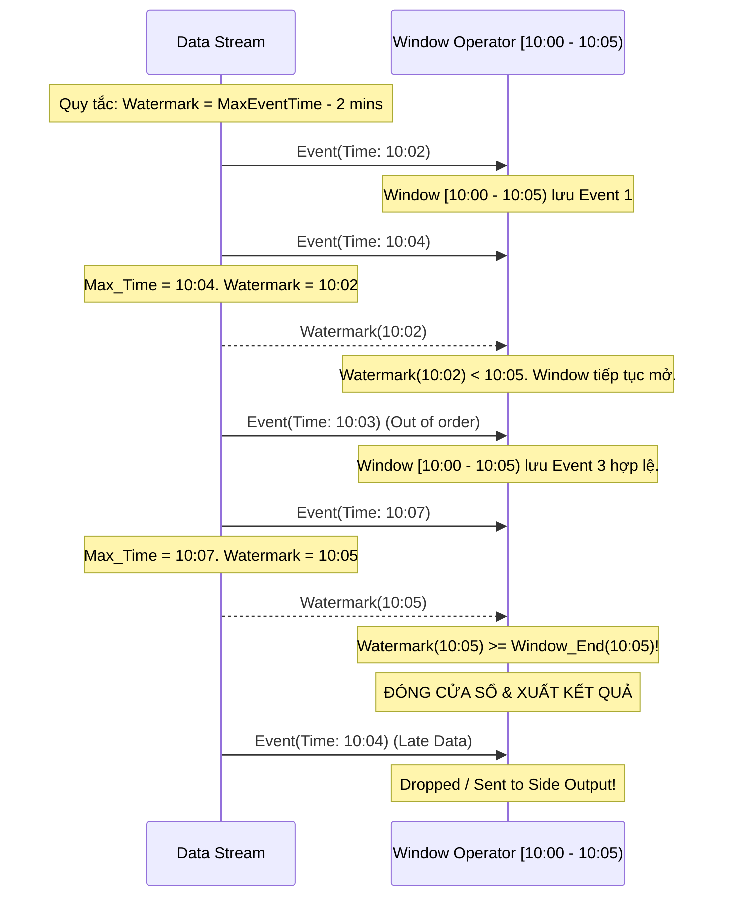

Trong lập trình xử lý luồng dữ liệu (Stream Processing), một trong những thử thách lớn nhất là kiểm soát yếu tố thời gian. Không giống như xử lý theo lô ([Batch Processing](/concepts/batch-processing/batch-processing/)) nơi mọi dữ liệu đã nằm yên vị trong kho, dữ liệu Streaming chảy liên tục và thường xuyên đến lệch giờ, mất trật tự do độ trễ mạng hoặc lỗi kết nối từ các thiết bị ngoại vi. Để giải quyết bài toán này khi sử dụng thời gian xảy ra sự kiện (Event Time), các kỹ sư dữ liệu sử dụng một công cụ vô cùng mạnh mẽ: **Watermark** (Dấu chuẩn thời gian).

---

## Nhịp đập thời gian của dữ liệu: Tại sao chúng ta cần Watermark?

Hãy tưởng tượng bạn đang xây dựng một ứng dụng tính toán doanh thu bán hàng theo từng phút. Cửa sổ thời gian (Window) cần tổng hợp dữ liệu từ `10:00` đến `10:01`. Lúc này, hệ thống của bạn đã nhận được một vài sự kiện có nhãn thời gian `10:02`. Liệu bạn đã có thể "chốt sổ" để xuất kết quả cho phút `10:00 - 10:01` chưa?

Câu trả lời là chưa chắc. Rất có thể có một giao dịch được thực hiện lúc `10:00:45` trên một chiếc điện thoại bị mất sóng, và dữ liệu đó phải mất vài phút mới được gửi tới server của bạn. Nếu hệ thống lập tức đóng cửa sổ và tính toán ngay, kết quả doanh thu sẽ bị thiếu. Nhưng nếu hệ thống cứ đợi vô hạn để bắt đủ mọi sự kiện phát sinh, đường ống dữ liệu sẽ bị tắc nghẽn và không bao giờ xuất ra được kết quả. 

Watermark ra đời để giải quyết thế tiến thoái lưỡng nan này. Nó đóng vai trò như một bộ đếm nhịp logic giúp hệ thống đưa ra quyết định: "Chúng ta sẽ đợi dữ liệu muộn trong một khoảng thời gian hợp lý, sau đó chốt sổ và đi tiếp."

---

## Định nghĩa chính xác: Watermark là gì?

Về mặt kỹ thuật, **Watermark** $W(t)$ là một sự kiện đặc biệt hoặc một tín hiệu ngầm chạy xen kẽ trong luồng dữ liệu, mang giá trị thời gian $t$. Khi hệ thống nhận được Watermark $W(t)$, nó tự hiểu rằng: *“Theo những gì hệ thống ghi nhận, sẽ không còn bất kỳ sự kiện nào có Event Time cũ hơn mốc thời gian $t$ tìm đến nữa.”*

Nói cách khác, Watermark là thước đo sự tiến triển của Event Time so với thời gian xử lý thực tế (Processing Time) trong hệ thống. Nó cho phép hệ thống tự tin đóng các cửa sổ thời gian kết thúc trước mốc $t$ và giải phóng tài nguyên tính toán.

---

## Cơ chế hoạt động: Làm thế nào hệ thống biết lúc nào nên "chốt sổ"?

Ý tưởng cốt lõi của Watermark là chấp nhận một độ trễ cho phép (thường gọi là *Allowed Lateness* hoặc *Bounded Out-Of-Orderness*). 

Hệ thống sẽ liên tục quan sát nhãn thời gian lớn nhất (`max_event_time`) từ các sự kiện mà nó nhận được, sau đó tính toán Watermark dựa trên công thức cơ bản:

$$\text{Watermark} = \text{max\_event\_time} - \text{max\_allowed\_delay}$$

Khi giá trị Watermark tịnh tiến và vượt qua ranh giới kết thúc của một Window, Window đó sẽ chính thức đóng lại để thực hiện các phép toán tổng hợp (aggregations) và xóa dữ liệu tạm thời khỏi bộ nhớ đệm (state). Bất kỳ dữ liệu nào đến sau khi Watermark đã vượt qua Window tương ứng sẽ bị coi là **Late Data** (dữ liệu đến muộn) và sẽ bị xử lý theo các cơ chế xử lý ngoại lệ.

Cụ thể, quy trình này diễn ra như sau:
1. **Phát sinh Watermark**: Dữ liệu đi vào hệ thống qua các nguồn như Kafka hay Kinesis. Nguồn nạp (Source Operator) sẽ sinh ra các Watermark xen kẽ vào luồng dữ liệu.
2. **Lan truyền**: Watermark chảy qua các bước xử lý (Operators) trong đồ thị tính toán (DAG) như những bản ghi dữ liệu bình thường.
3. **Kích hoạt Window**: Cửa sổ thời gian `[10:00, 10:01)` nằm chờ. Khi nhận được Watermark mang giá trị $\ge$ `10:01:00`, toán tử quản lý cửa sổ biết rằng thời gian chờ đợi đã hết.
4. **Đóng sổ và tính toán**: Toán tử chạy các hàm tổng hợp (như SUM, COUNT), đẩy kết quả xuống hạ lưu và dọn dẹp bộ nhớ state.
5. **Xử lý dữ liệu muộn**: Nếu sau đó xuất hiện bản ghi có Event Time là `10:00:30` tìm đến, hệ thống nhận diện đây là dữ liệu quá trễ (vì Watermark hiện tại đã vượt quá `10:01:00`). Bản ghi này sẽ bị loại bỏ hoặc xử lý riêng tùy theo cấu hình.

---

## Trực quan hóa luồng đi của Watermark

Dưới đây là biểu đồ mô tả cách một Watermark với quy tắc trễ 2 phút (`Watermark = MaxEventTime - 2 mins`) di chuyển và kích hoạt cửa sổ thời gian `[10:00 - 10:05)`:


---

## Ví dụ thực tiễn: Cấu hình Watermark trong Apache Flink

Đoạn code Java dưới đây minh họa cách định nghĩa một chiến lược Watermark chấp nhận độ trễ tối đa 5 giây (Bounded out-of-orderness) và cách cấu hình bắt dữ liệu đến muộn (Late Data) trong Apache Flink:
```java
DataStream<MyEvent> stream = ...;

WatermarkStrategy<MyEvent> strategy = WatermarkStrategy
    // Chấp nhận dữ liệu đến trễ tối đa 5 giây so với sự kiện mới nhất
    .<MyEvent>forBoundedOutOfOrderness(Duration.ofSeconds(5))
    // Hàm trích xuất thời gian thực tế của sự kiện
    .withTimestampAssigner((event, timestamp) -> event.getTimestamp());

DataStream<MyEvent> withWatermarks = stream.assignTimestampsAndWatermarks(strategy);

// Định nghĩa Window và Side Output cho Late Data
OutputTag<MyEvent> lateDataTag = new OutputTag<MyEvent>("late-data"){};

SingleOutputStreamOperator<Result> result = withWatermarks
    .keyBy(event -> event.getUserId())
    .window(TumblingEventTimeWindows.of(Time.minutes(1)))
    .allowedLateness(Time.minutes(2)) // Cho phép update kết quả nếu trễ thêm tối đa 2 phút
    .sideOutputLateData(lateDataTag)  // Bắt những dữ liệu trễ hơn cả 2 phút
    .process(new MyWindowFunction());

// Lấy luồng dữ liệu trễ để lưu vào DB/Log
DataStream<MyEvent> lateStream = result.getSideOutput(lateDataTag);
```

---

## Những nguyên tắc thiết kế và Best Practices cần nhớ

* **Không lạm dụng Allowed Lateness quá lớn**: Việc cấu hình thời gian chờ đợi quá dài (ví dụ: chờ 1 tiếng hoặc vài tiếng) bắt buộc hệ thống phải giữ toàn bộ dữ liệu thô của khoảng thời gian đó trong bộ nhớ đệm (State Store). Điều này cực kỳ ngốn RAM hoặc RocksDB và làm chậm tiến trình xử lý chung của ứng dụng.
* **Luôn có phương án dự phòng cho Late Data**: Đừng để hệ thống âm thầm loại bỏ dữ liệu muộn mà không có dấu vết. Hãy chủ động định tuyến các dữ liệu đến trễ này vào các Side Output (như lưu trữ tạm trên Amazon S3, Google [Cloud Storage](/concepts/cloud-data-platform/cloud-storage/) hoặc đẩy vào Kafka Dead Letter Queue) để chạy các job xử lý bù (batch correction) sau này.
* **Cân bằng giữa Độ trễ (Latency) và Độ chính xác (Completeness)**: Đây là bài toán nghiệp vụ. Với các bài toán phát hiện gian lận (Fraud Detection), bạn cần Watermark cực kỳ ngắn để đưa ra quyết định gần như ngay lập tức. Nhưng với bài toán đối soát doanh thu hoặc tính lương, bạn cần cấu hình Watermark đủ rộng để đảm bảo dữ liệu không bị thiếu hụt.

---

## Cạm bẫy thực tế: Những sai lầm dễ khiến hệ thống "đứng hình"

* **Bỏ quên cơ chế rẽ nhánh luồng dữ liệu (Idle Partitions)**: Trong Kafka, dữ liệu được phân chia vào nhiều partition. Mức Watermark tổng thể của một toán tử tính toán sẽ bằng giá trị nhỏ nhất (**MIN**) của Watermark đến từ tất cả các partition nguồn. Nếu một partition đột ngột không có dữ liệu mới (idle), Watermark của partition đó sẽ đứng im, kéo theo Watermark của toàn bộ hệ thống bị treo. Kết quả là không một Window nào được chốt sổ. Bạn cần cấu hình thêm tính năng phát hiện phân vùng rảnh rỗi (ví dụ `withIdleness` trong Flink) để hệ thống tự động bỏ qua các partition này khi tính toán Watermark.
* **Kỳ vọng Watermark xử lý được 100% dữ liệu muộn**: Watermark bản chất là một thuật toán phỏng đoán (heuristic) dựa trên số liệu lịch sử. Trong thực tế, chắc chắn sẽ luôn có những dữ liệu đến cực kỳ muộn do mất kết nối kéo dài. Thiết kế một hệ thống streaming tốt luôn phải đi kèm với cơ chế xử lý ngoại lệ cho Late Data.

---

## Sự đánh đổi không thể né tránh (Trade-offs)

### Điểm mạnh
* Giải quyết triệt để bài toán mất trật tự (out-of-order) của dữ liệu, giúp việc tính toán Event Time trở nên khả thi trong hệ thống phân tán.
* Cung cấp khả năng kiểm soát linh hoạt để nhà phát triển chủ động cân nhắc giữa tốc độ xử lý (độ trễ thấp) và độ chính xác của kết quả.

### Điểm yếu
* Đòi hỏi kinh nghiệm cấu hình và tinh chỉnh các tham số. Nếu đặt thời gian chờ quá ngắn, dữ liệu bị mất nhiều; đặt quá dài, hệ thống sẽ chậm chạp và tốn tài nguyên.
* Tăng độ phức tạp khi lập trình và debug, đặc biệt là khi hệ thống bị treo do luồng Watermark không tịnh tiến.

---

## Khi nào nên dùng và Khi nào không cần?

* **Nên dùng**: Khi bạn thực hiện các phép tính toán gom nhóm (Windowing, Joins, Aggregation) dựa trên nhãn thời gian thực tế của sự kiện (**Event Time**) và nguồn dữ liệu từ thiết bị (IoT, Mobile App...) có độ trễ truyền tải cao.
* **Không cần thiết**: Khi bạn thiết lập hệ thống chạy theo thời gian của server xử lý (**Processing Time**). Hoặc khi pipeline của bạn chỉ thực hiện các biến đổi đơn giản trên từng bản ghi độc lập (Stateless Map/Filter) mà không gom nhóm dữ liệu.

---

## Khái niệm liên quan

* [Event Time & Processing Time](/concepts/streaming-processing/event-time-processing-time/)
* [Windowing](/concepts/streaming-processing/windowing/)
* [Exactly-Once Semantics](/concepts/streaming-processing/exactly-once-semantics/)

---

## Góc phỏng vấn: Trả lời tự tin trước nhà tuyển dụng

### 1. Watermark là gì và tại sao chúng ta cần nó trong stream processing?
* **Gợi ý trả lời**: Watermark là một cơ chế báo hiệu thời gian logic trong hệ thống xử lý luồng, dùng để khẳng định rằng không còn sự kiện nào có nhãn thời gian (Event Time) nhỏ hơn giá trị Watermark tìm đến nữa. Chúng ta cần nó để giải quyết bài toán dữ liệu đến lệch giờ và không theo thứ tự. Nếu không có Watermark, các toán tử gom nhóm thời gian (Window) sẽ không biết khi nào nên đóng cửa sổ để xuất kết quả, dẫn đến việc bộ nhớ bị phình to hoặc trả về kết quả thiếu chính xác.

### 2. Chuyện gì xảy ra nếu Watermark của hệ thống ngừng tăng lên?
* **Gợi ý trả lời**: Nếu Watermark ngừng tịnh tiến, các cửa sổ thời gian đang mở sẽ không bao giờ được kích hoạt để chốt sổ. Điều này khiến kết quả không thể xuất ra hạ lưu, đồng thời bộ nhớ lưu trữ trạng thái (State) của hệ thống sẽ liên tục phình to cho đến khi xảy ra lỗi tràn bộ nhớ (Out of Memory). Nguyên nhân phổ biến nhất là do một partition của nguồn dữ liệu (như Kafka) bị rảnh rỗi (idle). Vì hệ thống tính Watermark tổng bằng giá trị MIN của các partition, một partition đứng im sẽ kéo chân cả hệ thống. Giải pháp là cấu hình cơ chế tự động bỏ qua các partition tạm thời không hoạt động (ví dụ `withIdleness` trong Flink).

### 3. Bạn sẽ xử lý dữ liệu đến muộn (Late Data) sau khi Watermark đã đi qua như thế nào?
* **Gợi ý trả lời**: Thông thường, dữ liệu này sẽ bị hệ thống tự động loại bỏ. Tuy nhiên, để đảm bảo chất lượng dữ liệu trong sản xuất, chúng ta có hai cách xử lý phổ biến: Một là tăng cấu hình `allowedLateness` để hệ thống tạm giữ lại trạng thái cửa sổ thêm một khoảng thời gian và phát ra kết quả cập nhật mới (retraction/update). Hai là chuyển hướng toàn bộ dữ liệu muộn này vào một luồng phụ (Side Output) để lưu trữ và chạy các job xử lý bù định kỳ.

### 4. Thuật toán Bounded-out-of-orderness Watermark hoạt động ra sao?
* **Gợi ý trả lời**: Thuật toán này liên tục theo dõi nhãn thời gian lớn nhất (`Max Event Time`) ghi nhận được từ đầu vào. Giá trị Watermark phát đi sẽ bằng: `Max Event Time - Khoảng trễ cho phép (T)`. Ví dụ, nếu cấu hình khoảng trễ là 5 giây: khi nhận sự kiện lúc `10:00:15`, Watermark phát ra sẽ là `10:00:10`. Nếu sự kiện tiếp theo đến có thời gian `10:00:12` (đến muộn), giá trị `Max Event Time` vẫn giữ nguyên là `10:00:15` nên Watermark không đổi. Điều này tạo ra một khoảng đệm thời gian chạy tịnh tiến theo dữ liệu để chờ đợi các bản ghi đến muộn.

### 5. Sự đánh đổi giữa việc đặt độ trễ Watermark lớn và nhỏ là gì?
* **Gợi ý trả lời**: 
  * Đặt độ trễ nhỏ (ví dụ 1 giây): Kết quả được xuất ra cực kỳ nhanh (độ trễ thấp), tiết kiệm tài nguyên bộ nhớ. Nhưng bù lại, tỷ lệ dữ liệu bị đánh dấu là đến muộn và bị loại bỏ sẽ rất cao, gây ảnh hưởng đến tính chính xác.
  * Đặt độ trễ lớn (ví dụ 1 giờ): Đảm bảo bắt được hầu hết dữ liệu đến muộn, kết quả có độ chính xác rất cao. Tuy nhiên, hệ thống sẽ phản hồi chậm hơn (phải đợi 1 giờ mới có kết quả đầu tiên) và đòi hỏi hạ tầng phần cứng lớn hơn nhiều để duy trì trạng thái của các cửa sổ trong thời gian chờ đợi.

---

## Tài liệu tham khảo

1. [Streaming Systems](https://www.oreilly.com/library/view/streaming-systems/9781491983812/) - Tyler Akidau, Slava Chernyak, and Reuven Lax
2. [Apache Flink Documentation - Generating Watermarks](https://nightlies.apache.org/flink/flink-docs-stable/docs/dev/datastream/event-time/generating_watermarks/)

---

## English Summary

A **Watermark** is a crucial mechanism in stream processing when dealing with Event Time. It acts as a metric of progress in logical time, signaling to the system that "no events with a timestamp older than the watermark will arrive anymore." Because network delays cause events to arrive out-of-order, operators like Time Windows rely on Watermarks to know when it is safe to close a window and emit aggregation results. Configuring the correct Watermark delay involves trading off between system latency (fast answers) and data completeness (correct answers). Late arriving data that passes the watermark threshold can be handled via allowed lateness window extensions or routed to side outputs for dead-letter processing.