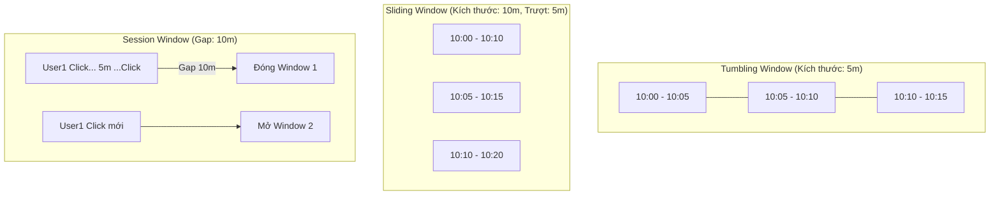

Dữ liệu luồng (Streaming Data) về bản chất là một dòng chảy vô hạn, không có điểm dừng. Việc thực hiện các phép tính toán tổng hợp như đếm số lượng giao dịch hay tính tổng doanh thu trên một tập dữ liệu không bao giờ kết thúc là một thử thách bất khả thi về mặt kỹ thuật. Để giải quyết bài toán này, chúng ta cần một kỹ thuật gọi là **Windowing** (Phân nhóm theo cửa sổ) — phương pháp thông minh giúp "chia nhỏ" dòng thác dữ liệu vô tận thành các khối thời gian hữu hạn để xử lý.

---

## Nghệ thuật "cắt nhỏ" dòng dữ liệu vô hạn: Tại sao cần Windowing?

Bạn không thể viết một câu lệnh SQL kiểu như `SELECT SUM(revenue) FROM real_time_stream` và mong đợi nó trả về kết quả ngay lập tức, đơn giản vì hệ thống không biết bao giờ dữ liệu mới dừng lại để đưa ra con số cuối cùng.

Để có được một kết quả có ý nghĩa, chúng ta buộc phải đặt ra các giới hạn cụ thể cho câu hỏi của mình, ví dụ: *"Tổng doanh thu trong 5 phút vừa qua là bao nhiêu?"* hoặc *"Có bao nhiêu lượt click trong 1 giờ qua?"*. 

Cụm từ "trong 5 phút vừa qua" hay "trong 1 giờ qua" chính là các **Window** (Cửa sổ thời gian). Windowing giúp biến đổi các bài toán xử lý vô hạn thành tập hợp các bài toán xử lý theo lô siêu nhỏ (micro-batches), tạo điều kiện cho các công cụ tính toán phân tán thực thi các phép toán thống kê một cách khả thi và mượt mà.

---

## Bản chất của Windowing

Về mặt định nghĩa, **Windowing** là cơ chế phân chia dữ liệu của một luồng (stream) thành các nhóm logic gọn gàng (buckets / windows) dựa trên một tiêu chí nhất định (phổ biến nhất là Event Time hoặc Processing Time).

Khi mỗi bản ghi dữ liệu (record) đi qua hệ thống, nó sẽ được gán vào một hoặc nhiều cửa sổ tương ứng. Khi một cửa sổ đạt đến điều kiện kết thúc (thường được xác định bởi thời gian vật lý hoặc tín hiệu Watermark), hệ thống sẽ đóng cửa sổ đó lại, thực hiện phép toán logic (như tính tổng, đếm, tìm giá trị trung bình) trên toàn bộ dữ liệu thuộc cửa sổ đó, rồi xuất kết quả ra hạ lưu và giải phóng bộ nhớ.

---

## Ba quân át chủ bài trong thế giới Windowing

Khi làm việc với các hệ thống stream processing hiện đại như Apache Flink, Spark Structured Streaming hay Kafka Streams, bạn sẽ thường xuyên bắt gặp 3 mô hình Windowing cốt lõi sau:

### 1. Tumbling Window (Cửa sổ cố định không chồng lấn)
* **Đặc điểm**: Có kích thước cố định và **không hề chồng lấn** lên nhau.
* **Ví dụ**: Cửa sổ 5 phút: `[10:00 - 10:05)`, `[10:05 - 10:10)`, `[10:10 - 10:15)`. Mỗi sự kiện chỉ thuộc về duy nhất một cửa sổ thời gian. Cửa sổ này thường được dùng để xuất các báo cáo định kỳ (ví dụ: số lượng truy cập mỗi giờ).

### 2. Sliding Window (Cửa sổ trượt)
* **Đặc điểm**: Có kích thước cố định, nhưng có thêm tham số "bước trượt" (slide/hop) nhỏ hơn kích thước cửa sổ. Điều này dẫn đến việc các cửa sổ **chồng lấn** lên nhau.
* **Ví dụ**: Cửa sổ 10 phút, trượt mỗi 5 phút: `[10:00 - 10:10)`, `[10:05 - 10:15)`. Nếu một giao dịch xảy ra lúc `10:06`, nó sẽ nằm trong cả hai cửa sổ này. Đây là lựa chọn lý tưởng cho các bài toán tính toán trung bình động (Moving Average) hoặc giám sát các xu hướng để đưa ra cảnh báo sớm.

### 3. Session Window (Cửa sổ phiên hoạt động)
* **Đặc điểm**: Kích thước **không cố định**, được xác định linh hoạt dựa trên khoảng thời gian không có hoạt động nào phát sinh (Gap / Inactivity).
* **Ví dụ**: Theo dõi hành vi người dùng trên website. Nếu người dùng liên tục click, các sự kiện này sẽ gom chung vào một cửa sổ. Nếu họ dừng tương tác quá 30 phút, cửa sổ hiện tại sẽ đóng lại. Lượt click tiếp theo sau đó sẽ mở ra một Session Window mới.

*(Lưu ý: Bên cạnh 3 loại trên, chúng ta còn có Global Window hoặc Count-based Window — gom nhóm dựa trên số lượng bản ghi thay vì thời gian).*

---

## Trực quan hóa các loại Window



---

## Triển khai thực tế: Hướng dẫn cấu hình trong Apache Flink

Dưới đây là cách sử dụng Java API của Apache Flink để định nghĩa và cấu hình 3 loại cửa sổ thời gian phổ biến:

### 1. Cấu hình Tumbling Window (Tính tổng doanh thu mỗi phút)
```java
stream
    .keyBy(event -> event.getStoreId())
    .window(TumblingEventTimeWindows.of(Time.minutes(1)))
    .sum("revenue");
```

### 2. Cấu hình Sliding Window (Đếm số lượt truy cập URL trong 1 giờ qua, cập nhật kết quả mỗi 10 phút)
```java
stream
    .keyBy(event -> event.getUrl())
    .window(SlidingEventTimeWindows.of(Time.hours(1), Time.minutes(10)))
    .process(new CountAccessFunction());
```

### 3. Cấu hình Session Window (Gom nhóm hành vi người dùng, ngắt phiên nếu không có hoạt động trong 30 phút)
```java
stream
    .keyBy(event -> event.getUserId())
    .window(EventTimeSessionWindows.withGap(Time.minutes(30)))
    .process(new UserBehaviorAnalysisFunction());
```

---

## Kinh nghiệm thực chiến và các Best Practices

Để vận hành hệ thống Windowing ổn định ở quy mô sản xuất, bạn nên lưu ý các điểm sau:

* **Luôn thực hiện `keyBy` trước khi phân cửa sổ**: Hãy chia nhỏ dữ liệu theo khóa (partitioning) trước khi gọi hàm Window. Việc gọi trực tiếp `stream.windowAll()` buộc toàn bộ dữ liệu từ mọi nguồn phải dồn về một nút xử lý duy nhất, làm mất đi khả năng tính toán song song (parallelism) và biến nút này thành điểm nghẽn cổ chai (bottleneck) của toàn bộ hệ thống.
* **Cực kỳ thận trọng với bước trượt (slide step) siêu nhỏ**: Nếu bạn đặt Window kích thước 1 giờ nhưng cấu hình bước trượt là 1 giây, mỗi sự kiện đi vào sẽ phải nhân bản và đưa vào 3,600 cửa sổ khác nhau đang đồng thời mở trong bộ nhớ. Điều này rất dễ gây ra thảm họa bùng nổ trạng thái (State Explosion) làm cạn kiệt RAM.
* **Tận dụng tối đa Incremental Aggregation (Tính toán lũy tiến)**: Nếu nghiệp vụ chỉ yêu cầu các phép toán đơn giản như SUM, MIN, MAX, hãy sử dụng các hàm `ReduceFunction` hoặc `AggregateFunction`. Chúng giúp hệ thống tính gộp dữ liệu dần dần ngay khi bản ghi vừa tới, thay vì phải lưu trữ toàn bộ dữ liệu thô vào bộ nhớ và chỉ tính toán một lần khi cửa sổ đóng (như `ProcessWindowFunction` làm).

---

## Những cạm bẫy dễ khiến hệ thống "bay màu"

* **Lạm dụng `ProcessWindowFunction`**: Việc lưu giữ hàng triệu bản ghi thô trong State Store để chờ đến khi đóng cửa sổ mới tính toán sẽ nhanh chóng "ngốn" sạch bộ nhớ đệm của bạn. Hãy luôn ưu tiên Pre-aggregation bất cứ khi nào có thể.
* **Bỏ qua dữ liệu đến muộn (Late Data)**: Với Event Time Window, khi Watermark đã đi qua ranh giới cửa sổ, cửa sổ đó sẽ đóng lại vĩnh viễn. Nếu không cấu hình thuộc tính `allowedLateness` hoặc định nghĩa Side-output, mọi dữ liệu đến muộn hơn mốc này sẽ bị hệ thống âm thầm loại bỏ.
* **Chi phí xử lý sáp nhập của Session Window**: Cơ chế hoạt động của Session Window là tạo ra các cửa sổ nhỏ cho từng sự kiện và liên tục hợp nhất (merge) chúng lại khi có sự kiện mới nằm xen vào giữa. Quá trình sáp nhập bộ nhớ trạng thái này tiêu tốn rất nhiều tài nguyên CPU, cần được theo dõi kỹ lưỡng trong các hệ thống có lượng tải cao.

---

## Đặt lên bàn cân: Ưu và nhược điểm của từng loại Window

| Loại Window | Điểm mạnh | Điểm yếu |
| :--- | :--- | :--- |
| **Tumbling** | - Hiệu năng cao, tốn ít bộ nhớ.<br>- Các cửa sổ hoàn toàn độc lập.<br>- Dễ thiết kế báo cáo. | - Khó bắt được xu hướng chuyển giao ở ranh giới giữa hai cửa sổ liên tiếp. |
| **Sliding** | - Làm mượt biểu đồ dữ liệu (smoothing).<br>- Tuyệt vời cho các bài toán tính trung bình động và cảnh báo sớm. | - Tốn bộ nhớ và CPU vì dữ liệu bị nhân bản vào nhiều cửa sổ đồng thời. |
| **Session** | - Phản ánh chính xác hành vi tự nhiên của người dùng (User-centric). | - Thuật toán trộn cửa sổ phức tạp, tốn CPU.<br>- Khó dự đoán chính xác thời điểm xuất kết quả. |

---

## Khi nào nên dùng loại Window nào?

* **Tumbling Window**: Phù hợp cho các dashboard thống kê tài chính, doanh thu theo các khung giờ cố định hoặc các tiến trình ETL tải dữ liệu định kỳ vào Data Warehouse.
* **Sliding Window**: Thích hợp cho hệ thống giám sát hạ tầng (ví dụ: cảnh báo nếu CPU của máy chủ vượt quá 90% trong vòng 5 phút qua, kiểm tra lại mỗi 10 giây) hoặc phát hiện gian lận giao dịch (quẹt thẻ quá 5 lần trong vòng 10 phút).
* **Session Window**: Phù hợp cho việc phân tích hành vi người dùng trên ứng dụng/website (Clickstream analysis), đo lường hiệu quả phễu chuyển đổi (Funnel) hoặc theo dõi giỏ hàng mua sắm trực tuyến.
* **Không dùng Window**: Nếu pipeline của bạn chỉ làm nhiệm vụ biến đổi dữ liệu 1-1 đơn giản (như Parse dữ liệu từ JSON sang CSV rồi lưu trực tiếp vào database), hãy xử lý stateless trực tiếp trên từng record thay vì dùng Window.

---

## Các khái niệm liên quan

* [Event Time & Processing Time](/concepts/streaming-processing/event-time-processing-time/)
* [Watermark](/concepts/streaming-processing/watermark/)
* [Stream-Table Duality](/concepts/streaming-processing/stream-table-duality/)

---

## Góc phỏng vấn: Vượt qua các câu hỏi hóc búa

### 1. Phân biệt sự khác nhau giữa Tumbling Window và Sliding Window.
* **Gợi ý trả lời**: 
  Điểm khác biệt cốt lõi nằm ở tính chồng lấn của các cửa sổ thời gian. 
  Tumbling Window là cửa sổ có kích thước cố định và các khoảng thời gian hoàn toàn tách biệt, không chồng lấn lên nhau (mỗi bản ghi chỉ thuộc về duy nhất một cửa sổ). 
  Ngược lại, Sliding Window cũng có kích thước cố định nhưng đi kèm bước trượt (slide) nhỏ hơn kích thước cửa sổ, khiến các cửa sổ chồng lấn lên nhau (một bản ghi có thể nằm trong nhiều cửa sổ cùng lúc). 
  Tumbling Window thường dùng để chốt số liệu báo cáo cố định, còn Sliding Window tối ưu cho việc tính toán trung bình động hoặc thiết lập cảnh báo sớm.

### 2. Session Window hoạt động khác biệt thế nào so với hai loại trên? Làm sao hệ thống biết khi nào cần đóng một Session Window?
* **Gợi ý trả lời**: 
  Session Window không có kích thước thời gian cố định mà biến thiên linh hoạt dựa trên hoạt động thực tế của dữ liệu. 
  Hệ thống sử dụng một tham số gọi là "Inactivity Gap" (khoảng im lặng). Nếu trong khoảng thời gian này không phát sinh thêm bất kỳ sự kiện nào từ cùng một khóa (ví dụ: cùng một tài khoản người dùng), hệ thống sẽ coi như phiên hoạt động đã kết thúc và tiến hành đóng cửa sổ. 
  Về mặt vận hành, hệ thống sẽ gán mỗi sự kiện mới vào một cửa sổ riêng, sau đó thực hiện thuật toán hợp nhất (merge) các cửa sổ lại với nhau nếu khoảng cách giữa chúng nhỏ hơn khoảng Gap cấu hình.

### 3. Tại sao cấu hình một Sliding Window có kích thước 1 ngày và bước trượt 1 giây lại được coi là thảm họa hệ thống?
* **Gợi ý trả lời**: 
  Cấu hình này sẽ dẫn đến lỗi tràn bộ nhớ do bùng nổ trạng thái (State Explosion). 
  Với kích thước 1 ngày (86,400 giây) và bước trượt 1 giây, mỗi một sự kiện đi vào hệ thống sẽ phải phân bổ vào 86,400 cửa sổ khác nhau đang đồng thời mở trong bộ nhớ. Hệ thống sẽ ngay lập tức bị cạn kiệt RAM để duy trì metadata cho các cửa sổ này, đồng thời CPU sẽ bị quá tải do phải quản lý hàng triệu luồng trạng thái song song.

### 4. Nếu cần phát cảnh báo ngay lập tức khi một người dùng nhập sai mật khẩu quá 5 lần trong vòng 10 phút, bạn sẽ thiết kế thế nào?
* **Gợi ý trả lời**: 
  Trường hợp này bắt buộc phải sử dụng Sliding Window với kích thước là 10 phút và bước trượt ngắn (ví dụ: 10 giây hoặc 1 phút), gom nhóm theo khóa là ID người dùng. Cứ mỗi khi cửa sổ trượt, ta thực hiện đếm số lần nhập sai. Nếu con số này $\ge$ 5, ta phát cảnh báo. 
  Không thể dùng Tumbling Window ở đây vì nếu người dùng nhập sai 3 lần ở cuối cửa sổ trước và 2 lần ở đầu cửa sổ sau, Tumbling Window sẽ cắt đôi sự kiện này ra và không kích hoạt cảnh báo, dẫn đến việc bỏ lọt hành vi đáng ngờ.

### 5. Sự khác nhau giữa việc gọi hàm `windowAll()` và `keyBy().window()` trong lập trình Flink là gì?
* **Gợi ý trả lời**: 
  Sự khác biệt nằm ở khả năng tính toán song song và mở rộng hệ thống. 
  Khi dùng `keyBy().window()`, hệ thống sẽ băm (hash) các khóa và chia đều dữ liệu ra các Worker Node khác nhau để xử lý song song độc lập. Điều này giúp tối ưu tài nguyên phần cứng. 
  Ngược lại, `windowAll()` bắt buộc toàn bộ luồng dữ liệu của hệ thống phải đổ về một luồng xử lý (Task) duy nhất trên một máy chủ để gom cửa sổ chung. Việc này phá vỡ kiến trúc tính toán phân tán, gây tắc nghẽn cổ chai và chỉ nên áp dụng trên các tập dữ liệu có quy mô cực kỳ nhỏ.

---

## Tài liệu tham khảo

1. **Streaming Systems** - Tyler Akidau (Chương 2, "Windowing" - Trình bày mô hình cốt lõi của Google Dataflow).
2. **Apache Flink Documentation** - Windows.
3. **Kafka Streams Documentation** - Windowing data.

---

## English Summary

**Windowing** is a core streaming technique used to slice infinite data streams into finite, manageable blocks based on time (or count) so that aggregations and computations can be applied. The three primary types of time-based windows are:
1. **Tumbling Windows**: Fixed size, non-overlapping (e.g., hourly reports).
2. **Sliding Windows**: Fixed size, overlapping (e.g., moving averages, continuous alerting).
3. **Session Windows**: Dynamic size based on user activity gaps, merging events until a period of inactivity occurs (e.g., user behavior analysis).
Properly choosing the window type and configuring its size/slide is critical, as improper configurations (like extremely tiny sliding steps) can lead to catastrophic state memory explosions in the processing engine.
