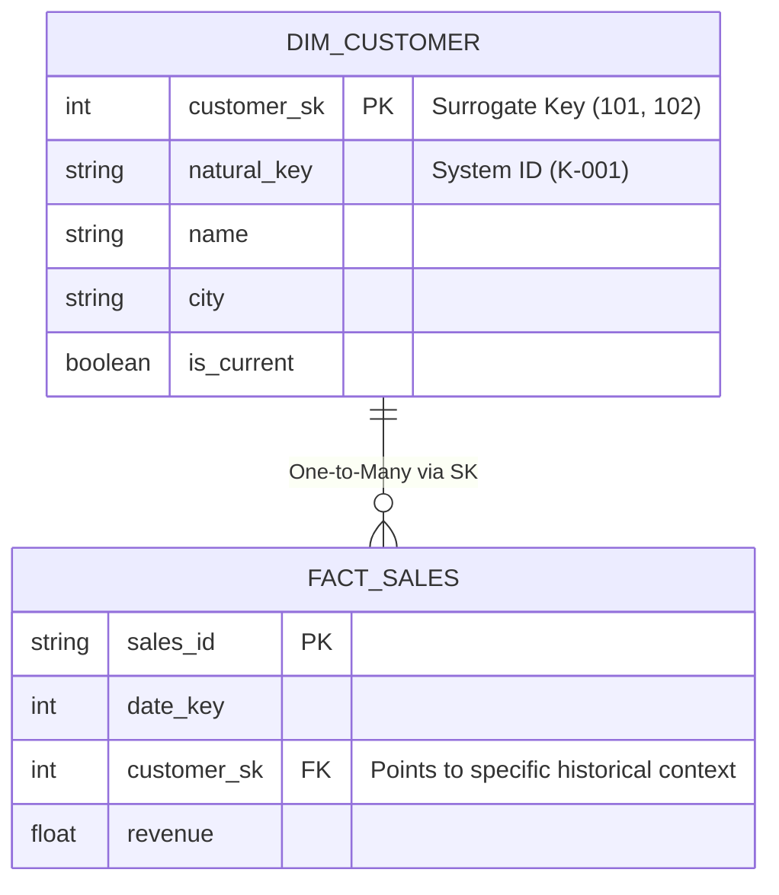

# Khóa thay thế - Surrogate Key: Tấm chứng minh thư riêng của Kho dữ liệu

Trong thiết kế kho dữ liệu (Data Warehouse), **Surrogate Key (Khóa thay thế)** đóng vai trò như một khái niệm kỹ thuật cốt lõi và là một "lớp khiên" bảo vệ hệ thống. Đây là một mã định danh duy nhất (thường là một chuỗi số nguyên tự tăng hoặc mã băm Hash) do chính hệ thống lưu trữ phân tích sinh ra để làm Khóa chính (Primary Key) cho các bảng Dimension (Bảng chiều). 

Đặc điểm lớn nhất của Surrogate Key là nó hoàn toàn vô nghĩa đối với hoạt động kinh doanh (no business logic). Mục đích duy nhất của nó là giúp Data Warehouse độc lập hoàn toàn với các khóa tự nhiên (Natural Keys) – những mã định danh vốn thường xuyên biến động và chứa đầy rủi ro từ các hệ thống vận hành (OLTP).

## Phân biệt Natural Key và Surrogate Key

Để hiểu tại sao chúng ta cần đến Surrogate Key, hãy đặt nó cạnh Natural Key:

* **Natural Key (Khóa tự nhiên / Khóa nghiệp vụ):** Là mã định danh được sinh ra từ các phần mềm ứng dụng để phục vụ trực tiếp cho hoạt động kinh doanh của con người. Ví dụ: Số CMND/CCCD, Mã số sinh viên (`SV-2022-A1`), Mã khách hàng trên CRM (`CUS-00123`).
* **Surrogate Key (Khóa thay thế):** Là một mã định danh (thường là số nguyên tự tăng như `1`, `2`, `3`... hoặc chuỗi mã băm) được tạo ra hoàn toàn tự động bởi quy trình ETL của Data Warehouse. Nó không mang bất kỳ giá trị hay ý nghĩa thực tế nào ngoài việc định danh nội bộ.

Trong mô hình kho dữ liệu (đặc biệt là theo phương pháp của Ralph Kimball), **Surrogate Key luôn luôn được chọn làm Khóa chính (Primary Key) của các bảng Dimension**, và sau đó đóng vai trò làm Khóa ngoại (Foreign Key) trong các bảng Fact (Bảng sự kiện).

## Tại sao chúng ta cần đến lớp khiên Surrogate Key?

Ban đầu, nhiều kỹ sư dữ liệu thường dùng luôn Natural Key của ứng dụng để làm khóa chính cho kho dữ liệu vì sự tiện lợi trước mắt. Thế nhưng, cách làm này sớm muộn gì cũng dẫn tới ba thảm họa kỹ thuật:

1. **Khóa tự nhiên bị thay đổi hoặc tái sử dụng:** Ở một số công ty, mã khách hàng `CUS-123` hôm nay thuộc về anh A. Nhưng 3 năm sau anh A đóng tài khoản, hệ thống CRM lại cấp mã `CUS-123` đó cho chị B. Nếu kho dữ liệu dùng luôn mã này làm khóa chính, toàn bộ lịch sử doanh thu của anh A và chị B sẽ bị gộp chung vào nhau, gây sai lệch báo cáo trầm trọng.
2. **Xung đột khóa khi tích hợp nhiều hệ thống:** Khi công ty mua lại hoặc sáp nhập một doanh nghiệp khác. Hệ thống CRM cũ có mã khách hàng `CUS-100`, hệ thống CRM mới cũng có mã khách hàng `CUS-100` (dù đây là hai người hoàn toàn khác nhau). Việc đưa chung hai nguồn dữ liệu này vào kho dữ liệu sẽ vi phạm lỗi trùng Khóa chính.
3. **Chặn đứng khả năng lưu trữ lịch sử thay đổi (SCD Type 2):** Khi chúng ta cần lưu lại các phiên bản lịch sử của một thực thể (ví dụ: lịch sử chuyển nhà của khách hàng), thực thể đó bắt buộc phải có nhiều dòng trong bảng Dimension. Nếu lấy Natural Key làm khóa chính, bảng sẽ báo lỗi Duplicate Primary Key ngay khi chúng ta cố gắng chèn thêm dòng lịch sử thứ hai cho cùng một khách hàng.

Surrogate Key ra đời như một vị cứu tinh, giúp phân tách hoàn toàn giữa **Thế giới vận hành** (Operational) và **Thế giới phân tích** (Analytical). Hệ thống nguồn có thay đổi, xóa hay tái sử dụng khóa tự nhiên thế nào đi nữa, Data Warehouse vẫn bình yên vô sự nhờ tấm "Chứng minh thư nội bộ" tự cấp này.

## Cơ chế vận hành: Từ hệ thống nguồn vào Kho dữ liệu

Quy trình xử lý Surrogate Key thông qua đường ống ETL diễn ra như sau:
1. Hệ thống nguồn ghi nhận khách hàng mới: `ID = K-001`, `Name = Alice`, `City = Hanoi`.
2. ETL đọc dữ liệu, đối chiếu vào bảng `dim_customer`.
3. Nhận thấy chưa có ai mang mã `K-001`, hệ thống tự động sinh ra một khóa thay thế (ví dụ: SK = `101`) bằng hàm tự tăng hoặc hàm băm.
4. Bảng `dim_customer` ghi nhận: `customer_sk = 101`, `natural_key = K-001`, `name = Alice`, `city = Hanoi`.
5. Khi nạp dữ liệu vào bảng doanh số `fact_sales` và thấy đơn hàng của khách hàng `K-001`, quy trình ETL sẽ thực hiện tra cứu (Lookup) trong bảng Dimension để lấy ra khóa tương ứng là `101` và chèn số `101` này vào bảng Fact dưới dạng khóa ngoại.

## Kiến trúc và Mô phỏng lưu trữ lịch sử (SCD Type 2)

Sơ đồ dưới đây minh họa việc sử dụng Surrogate Key để xử lý lịch sử chuyển nhà của khách hàng Alice (`K-001`):



Bảng Dimension `DIM_CUSTOMER`:
| customer_sk (PK) | natural_key | name | city | is_current |
| :--- | :--- | :--- | :--- | :--- |
| **101** | K-001 | Alice | Hanoi | FALSE |
| **102** | K-001 | Alice | Saigon | **TRUE** |

Bảng Sự kiện `FACT_SALES`:
| sales_id | date_key | **customer_sk** | revenue |
| :--- | :--- | :--- | :--- |
| F-88 | 20251010 | **101** | 500.00 |
| F-89 | 20260607 | **102** | 200.00 |

> [!NOTE]
> Nhờ có hai Surrogate Key khác nhau (`101` và `102`), chúng ta vừa lưu trữ được lịch sử thay đổi của Alice, vừa biết chính xác giao dịch F-88 được thực hiện khi Alice ở Hà Nội, còn giao dịch F-89 diễn ra sau khi cô đã chuyển vào Sài Gòn.

## Xu hướng hiện đại: Sử dụng Khóa băm (Hashed Surrogate Key)

Trong môi trường Cloud Data Warehouse hiện đại (như BigQuery, Snowflake) kết hợp với các công cụ như dbt, việc duy trì các cột số nguyên tự tăng (Auto-increment) truyền thống dễ tạo ra hiện tượng "cổ chai" (bottleneck) về mặt hiệu năng do tính chất xử lý phân tán song song.

Để giải quyết, các kỹ sư dữ liệu hiện nay thường sử dụng hàm băm (Hash functions như `MD5` hoặc `SHA256`) trên khóa tự nhiên để sinh ra Surrogate Key.

Đoạn code dbt dưới đây minh họa việc sinh Surrogate Key bằng mã băm:

```sql
SELECT
    -- Tạo Hashed Surrogate Key bằng hàm MD5
    {{ dbt_utils.generate_surrogate_key(['system_id', 'natural_customer_id']) }} AS customer_sk,
    
    natural_customer_id,
    customer_name,
    city
FROM stg_customers
```

Phương pháp băm giúp các node trong hệ thống phân tán tự tính toán khóa độc lập mà không cần phải giao tiếp đồng bộ để xin cấp số tự tăng từ một máy chủ trung tâm.

## Quy tắc thiết kế và cạm bẫy cần tránh (Best Practices)

* **Tối ưu hóa kiểu dữ liệu:** Trong các kho dữ liệu truyền thống, Surrogate Key nên có kiểu dữ liệu là số nguyên (`INT` - 4 byte hoặc `BIGINT` - 8 byte). Hãy tránh việc sử dụng chuỗi văn bản (`VARCHAR`) dài dòng làm khóa chính, vì nó sẽ làm chậm các phép JOIN và làm phình to bảng Fact chứa hàng tỷ dòng một cách lãng phí.
* **Luôn thiết lập bản ghi mặc định cho trường hợp "Khuyết" (-1):** Hãy luôn chèn sẵn một dòng mặc định vào các bảng Dimension với Surrogate Key bằng `-1`, mô tả là "N/A" hoặc "Chưa xác định". Khi quy trình ETL nạp bảng Fact mà không tìm thấy thông tin khách hàng tương ứng ở bảng Dimension, thay vì để giá trị `NULL` (gây gãy hoặc lỗi các phép JOIN sau này), hãy nhét khóa `-1` vào bảng Fact.
* **Nói không với Khóa thông minh (Smart Keys):** Khóa thông minh là dạng mã có nhồi nhét quy tắc logic kinh doanh (ví dụ: mã `1_01_005` nghĩa là Vùng Bắc - Hà Nội - Khách hàng thứ 5). Thiết kế này là một cạm bẫy lớn vì khi quy định kinh doanh thay đổi, toàn bộ cấu trúc khóa sẽ bị phá vỡ. Khóa của kho dữ liệu bắt buộc phải hoàn toàn vô nghĩa (Dumb Key).

## Những đánh đổi cần cân nhắc

### Điểm mạnh
* **Hiệu năng vượt trội:** JOIN bằng số nguyên luôn nhanh hơn nhiều so với JOIN bằng chuỗi ký tự dài.
* **Độ bền vững cao:** Bảo vệ kho dữ liệu khỏi mọi biến động thay đổi mã, xóa mã, trùng lặp mã từ các hệ thống ứng dụng nguồn khác nhau.
* **Hỗ trợ tuyệt vời cho việc lưu trữ lịch sử:** Mở đường cho việc triển khai kỹ thuật Slowly Changing Dimension (SCD) Type 2.

### Điểm yếu
* **Gia tăng độ phức tạp cho quy trình ETL/ELT:** Hệ thống cần thêm một bước đối chiếu (Lookup) hoặc tính toán hàm băm để dịch từ Natural Key sang Surrogate Key trước khi nạp dữ liệu vào bảng Fact.

## Khi nào nên dùng và Khi nào nên tránh?

**Bắt buộc sử dụng khi:**
* Bạn thiết kế các bảng Dimension theo mô hình Dimensional Modeling (phương pháp Kimball).
* Cần tích hợp dữ liệu từ hai hay nhiều hệ thống nguồn khác nhau về chung một thực thể (ví dụ: gom dữ liệu khách hàng từ cả Salesforce và SAP).

**Nên tránh khi:**
* Bạn đang thiết kế cơ sở dữ liệu cho các ứng dụng vận hành (OLTP). Việc sinh ra một khóa vô nghĩa không giúp ích gì cho các câu truy vấn tìm kiếm trực tiếp trên giao diện của người dùng.
* Đối với bảng ngày tháng (`dim_date`), người ta thường khuyên dùng khóa có cấu trúc dạng số như `20260607` thay vì một số nguyên tự tăng vô nghĩa như `5899`, giúp các Analytics Engineer dễ dàng phân vùng (partition) dữ liệu trực quan hơn.

## Khái niệm liên quan & Tài liệu tham khảo

**Khái niệm liên quan:**
* [Dimension Table - Bảng chiều](/concepts/dimension-table)
* [Slowly Changing Dimension (SCD) - Chiều thay đổi chậm](/concepts/slowly-changing-dimension)
* [Fact Table - Bảng sự kiện](/concepts/fact-table)
* [dbt (Data Build Tool)](/concepts/dbt)

**Tài liệu tham khảo:**
1. **The Data Warehouse Toolkit** - *Ralph Kimball* (Giải thích chi tiết tầm quan trọng của việc bảo vệ kho dữ liệu bằng Surrogate Key).
2. **dbt Developer Blog** - *"Surrogate keys in the modern data stack"*.
3. **Fundamentals of Data Engineering** - *Joe Reis*.

---

## Góc phỏng vấn: Câu hỏi thường gặp

### 1. Nếu tôi có một hệ thống nguồn CRM rất chuẩn mực, các mã ID khách hàng là duy nhất và không bao giờ bị thay đổi hay tái sử dụng. Tôi có thực sự cần đến Surrogate Key khi xây dựng kho dữ liệu không?
**Gợi ý trả lời:**
Câu trả lời là **Vẫn rất cần thiết**. Có hai lý do lớn:
* **Khả năng mở rộng tương lai:** Hệ thống CRM hiện tại có thể rất chuẩn, nhưng trong tương lai công ty có thể mua thêm một phần mềm ERP hoặc sáp nhập với công ty khác. Khi đó, việc xung đột mã ID giữa các hệ thống nguồn chắc chắn sẽ xảy ra.
* **Lưu trữ lịch sử (SCD Type 2):** Hệ thống CRM chỉ lưu trạng thái hiện tại và không bao giờ tạo ra hai dòng cho cùng một khách hàng. Khi đưa vào kho dữ liệu, nếu muốn lưu giữ lịch sử thay đổi thông tin (ví dụ: lịch sử đổi vùng miền của khách hàng), ta bắt buộc phải tạo ra nhiều bản ghi cho khách hàng đó. Để làm được việc này mà không vi phạm quy tắc trùng khóa chính, ta bắt buộc phải sử dụng Surrogate Key.

### 2. Sự khác biệt giữa Surrogate Key kiểu số tự tăng truyền thống và Surrogate Key kiểu chuỗi băm (Hashed Key) là gì? Tại sao các Cloud Data Warehouse lại ưa chuộng kiểu băm?
**Gợi ý trả lời:**
* **Khóa số tự tăng (Auto-increment):** Cần một máy chủ trung tâm quản lý bộ đếm số. Trong hệ thống phân tán song song (MPP), hàng ngàn node ghi dữ liệu cùng lúc sẽ bị tắc nghẽn (bottleneck) vì phải đợi cấp số tuần tự. Ngoài ra, khi load bảng Fact, quy trình ETL bắt buộc phải thực hiện phép JOIN Lookup sang bảng Dimension để lấy khóa, gây tốn tài nguyên.
* **Khóa băm (Hashed Key - như MD5/SHA256):** Các node xử lý có thể tự tính toán độc lập giá trị băm từ khóa tự nhiên mà không cần hỏi ý kiến máy chủ trung tâm. Khi load bảng Fact, ta chỉ cần áp dụng hàm băm trực tiếp lên khóa tự nhiên của nguồn mà không cần thực hiện phép JOIN Lookup đắt đỏ. Đây là kỹ thuật vô cùng tối ưu cho các hệ thống Big Data hiện đại.

---

## English summary

A Surrogate Key is a system-generated, strictly meaningless identifier (typically an auto-incrementing integer or a cryptographic hash) used as the Primary Key for Dimension Tables in a Data Warehouse. It deliberately replaces the Natural Key (the business or application ID) to decouple the analytical environment from the operational one. By generating Surrogate Keys, data engineers protect the warehouse against operational key reassignments, resolve collisions when integrating multiple source systems, guarantee optimized join performance with Fact tables, and crucially, enable the storage of multiple historical snapshots of a single entity (SCD Type 2). In modern distributed cloud architectures, generating surrogate keys via hashing functions is heavily favored over sequential integers to facilitate parallel processing and eliminate lookup bottlenecks.
