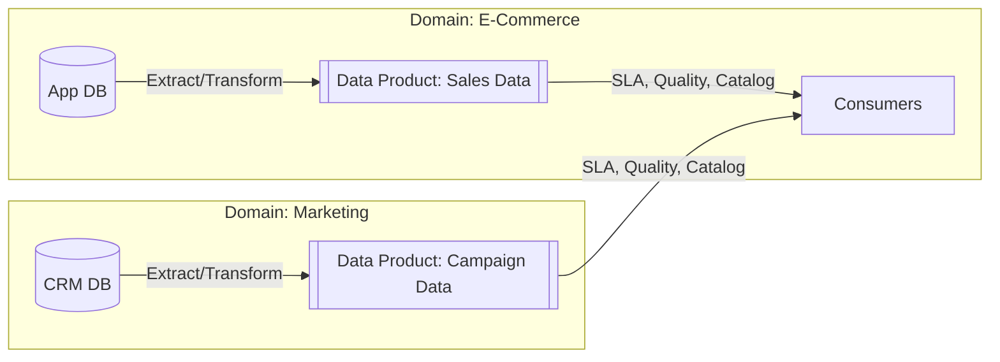
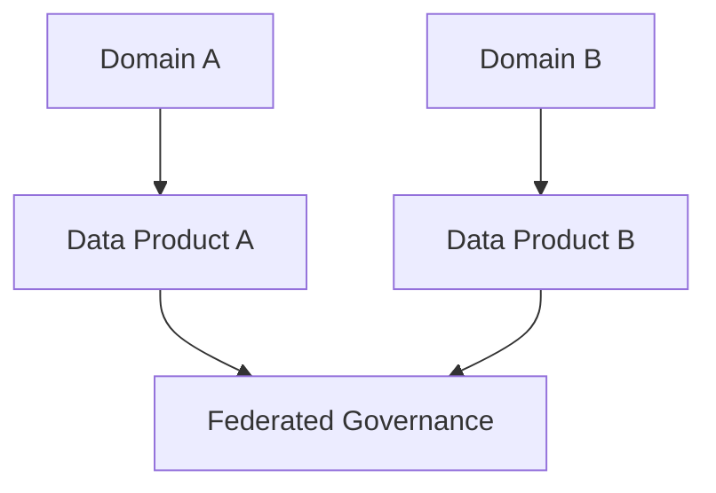

Trong nhiều thập kỷ, giải pháp kinh điển cho mọi bài toán dữ liệu lớn của doanh nghiệp luôn là: gom tất cả về một kho chứa tập trung – cho dù đó là [Data Warehouse](/concepts/data-warehouse/data-warehouse/) hay [Data Lake](/concepts/data-lake-lakehouse/data-lake/). Thế nhưng, khi quy trình kinh doanh ngày càng phức tạp, việc nhồi nhét hàng vạn luồng dữ liệu từ hàng chục phòng ban khác nhau vào một nơi duy nhất đã vô tình tạo ra một "nút thắt cổ chai" nhân lực và công nghệ khủng khiếp.

**Data Mesh** xuất hiện như một làn gió mới, định hình lại toàn bộ cách chúng ta tổ chức con người và hạ tầng kỹ thuật thông qua tư duy phi tập trung (decentralization).

---

## Data Mesh thực chất là gì?

Được giới thiệu lần đầu vào năm 2019 bởi chuyên gia Zhamak Dehghani, **Data Mesh** không phải là một công cụ phần mềm hay một dịch vụ cloud cụ thể, mà là một sự thay đổi mô hình kiến trúc về mặt tổ chức và quy trình quản lý (`Socio-technical paradigm shift`).

Thay vì giao toàn bộ trách nhiệm lưu trữ và xử lý dữ liệu cho một đội ngũ Kỹ sư dữ liệu trung tâm (Data Engineering team), Data Mesh chuyển giao quyền sở hữu dữ liệu về cho chính các bộ phận nghiệp vụ (`domain-oriented teams`) sinh ra chúng (ví dụ: Marketing, Sales, Logistics, Billing). Mỗi phòng ban tự đóng vai trò như một đơn vị độc lập, chịu trách nhiệm biến đổi và đóng gói dữ liệu của mình thành các sản phẩm chất lượng cao để chia sẻ cho toàn doanh nghiệp.

---

## Tại sao chúng ta cần chuyển đổi sang Data Mesh?

Hệ thống lưu trữ tập trung bộc lộ 3 điểm nghẽn lớn khi doanh nghiệp phát triển vượt một ngưỡng quy mô nhất định:

1. **Sự quá tải của đội ngũ trung tâm**: Đội [Data Engineering](/concepts/foundation/data-engineering/) trung tâm phải gánh vác việc xử lý hàng ngàn luồng dữ liệu mà họ không thực sự hiểu sâu về nghiệp vụ kinh doanh thực tế. Họ dễ làm sai lệch ý nghĩa các con số khi viết code biến đổi.
2. **Hiện tượng "Garbage In, Garbage Out"**: Đội Backend phát triển ứng dụng (người tạo ra dữ liệu nguồn) không hề có trách nhiệm đối với chất lượng dữ liệu họ tạo ra. Chỉ cần họ âm thầm đổi tên cột trong database, toàn bộ pipeline phân tích ở hạ nguồn sẽ sập, và đội Data trung tâm lại phải đi dọn dẹp hậu quả.
3. **Giới hạn khả năng mở rộng (Scaling bottleneck)**: Kiến trúc kho dữ liệu nguyên khối (Monolith) ngày càng nặng nề và phức tạp. Mỗi khi có một yêu cầu báo cáo mới, phòng ban nghiệp vụ phải xếp hàng chờ đợi đội Data xử lý trong nhiều tuần, thậm chí nhiều tháng.

Data Mesh tháo gỡ nút thắt này bằng cách áp dụng triết lý Microservices vào thế giới dữ liệu: **"Ai hiểu dữ liệu nhất, người đó tự quản lý và chịu trách nhiệm cho dữ liệu của mình."**

---

## Bốn nguyên tắc trụ cột cấu thành Data Mesh

Kiến trúc Data Mesh hoạt động dựa trên 4 trụ cột chính:

### 1. Quyền sở hữu dữ liệu theo miền (Domain-oriented Data Ownership)
Trách nhiệm xử lý dữ liệu được phân rã về các đội nhóm nghiệp vụ. Đội ngũ Sales sẽ tự thiết kế và làm sạch dữ liệu của Sales. Đội Marketing làm chủ dữ liệu Marketing. Đội Data trung tâm không còn là người dọn rác cho cả công ty.

### 2. Dữ liệu là một Sản phẩm (Data as a Product)
Dữ liệu được chia sẻ ra bên ngoài không phải là các file thô vụn vặt (by-product) mà phải được xem là một Sản phẩm thực thụ. Sản phẩm này phải đảm bảo các cam kết về chất lượng (SLA), có tài liệu hướng dẫn sử dụng rõ ràng và dễ dàng truy vấn.



### 3. Nền tảng dữ liệu tự phục vụ (Self-serve Data Infrastructure)
Để các phòng ban nghiệp vụ không cần giỏi DevOps vẫn có thể tự xây dựng pipeline và lưu trữ dữ liệu, doanh nghiệp cần cung cấp một Nền tảng hạ tầng dùng chung (Platform). Platform này tự động hóa việc khởi tạo máy chủ, thiết lập quyền truy cập hay tạo bảng chỉ qua vài cú click chuột.

### 4. Quản trị tính toán liên kết (Federated Computational Governance)
Để tránh tình trạng mỗi phòng ban tự định nghĩa dữ liệu một kiểu tạo ra các ốc đảo cô lập (Silos), một hội đồng liên kết gồm đại diện của các domain sẽ cùng thống nhất các tiêu chuẩn chung (như cách định dạng ID khách hàng, chính sách bảo mật GDPR). Các tiêu chuẩn này sau đó được hệ thống hóa và áp dụng tự động bởi máy móc trên toàn lưới dữ liệu.

---

## Cách các Data Product kết nối trong Lưới dữ liệu

Hãy tưởng tượng luồng hoạt động trong một hệ thống Data Mesh:


Để hiện thực hóa khái niệm "Dữ liệu như một Sản phẩm", các kỹ sư nghiệp vụ sẽ đính kèm một file khai báo cấu trúc (Descriptor) dạng YAML cùng kho lưu trữ mã nguồn để công bố sản phẩm dữ liệu này lên hệ thống [Data Catalog](/concepts/governance-metadata/data-catalog/) chung của công ty:
```yaml
# data_product_descriptor.yml
name: User_Watch_Time_Dataset
domain: Streaming_Experience
owner: 
  name: "John Doe"
  email: "johndoe@netflix.example.com"
  slack_channel: "#data-streaming-support"
description: "Bảng tổng hợp thời gian xem phim của người dùng theo từng ngày."

dataset:
  platform: snowflake
  database: PRD_STREAMING
  schema: ANALYTICS
  table: user_watch_time_daily

sla:
  freshness: "Tối đa 2 giờ trễ"
  uptime: "99.9%"
```

Khi phòng ban Marketing cần phân tích dữ liệu xem phim của khách hàng để gửi chiến dịch quảng cáo, họ chỉ cần vào Data Catalog tìm kiếm sản phẩm `User_Watch_Time_Dataset`, đọc tài liệu hướng dẫn sử dụng, đăng ký quyền truy cập và tự viết code phân tích mà không cần phải gửi yêu cầu chờ đội Data Engineering xây pipeline giúp.

---

## Kinh nghiệm triển khai thực tế (Best Practices)

* **Ưu tiên thay đổi tư duy văn hóa**: Data Mesh thất bại 90% là do con người, không phải do công nghệ. Cần thuyết phục đội ngũ phát triển phần mềm (Software Engineers) gánh vác thêm trách nhiệm về dữ liệu họ sản sinh, xem dữ liệu là một phần đầu ra chất lượng cao của sản phẩm ứng dụng.
* **Xây dựng hệ thống Data Catalog đồng bộ**: Đây là cổng giao tiếp duy nhất giúp lưới dữ liệu kết nối. Nếu không có catalog hỗ trợ tìm kiếm sản phẩm dữ liệu, lưới dữ liệu sẽ nhanh chóng biến thành những hòn đảo hoang cô lập.
* **Định vị rõ chủ sở hữu (Product Owner)**: Mỗi Data Product khi công bố phải có một cá nhân hoặc một đội ngũ nghiệp vụ chịu trách nhiệm on-call và sửa lỗi trực tiếp khi xảy ra sự cố.

---

## Những sai lầm phổ biến

* **Triển khai quá sớm ở công ty quy mô nhỏ**: Nếu doanh nghiệp của bạn chỉ có dưới 10 kỹ sư dữ liệu và dữ liệu chưa quá phức tạp, việc áp dụng Data Mesh sẽ tạo ra sự cồng kềnh hạ tầng và quy trình kiểm duyệt vô nghĩa (Over-engineering).
* **Phân cấp trách nhiệm nhưng thiếu công cụ hỗ trợ**: Yêu cầu các đội nghiệp vụ tự làm dữ liệu nhưng lại bắt họ phải tự viết code hạ tầng phức tạp. Nền tảng tự phục vụ (Self-serve platform) bắt buộc phải đủ đơn giản, trừu tượng hóa các kỹ thuật DevOps phức tạp để người dùng phổ thông cũng có thể thao tác.
* **Mất kiểm soát tiêu chuẩn chung**: Để các domain tự do phát triển mà không có sự kiểm soát của Federated Governance, dẫn đến việc dữ liệu của phòng Sales sử dụng kiểu định dạng khách hàng hoàn toàn không khớp với phòng Marketing.

---

## Phân tích ưu và nhược điểm (Trade-offs)

### So sánh Centralized Data Team và Decentralized Data Domains

Mô hình Data Mesh đánh dấu sự dịch chuyển từ tư duy quản lý tập trung sang phân tán. Dưới đây là bảng phân tích trade-off chi tiết giữa hai phương pháp tiếp cận này:

| Tiêu chí | Centralized Data Team (Mô hình Tập trung) | Decentralized Data Domains (Data Mesh) |
| :--- | :--- | :--- |
| **Quyền sở hữu (Ownership)** | Đội Data trung tâm (Data Engineering) sở hữu mọi luồng dữ liệu, bất kể nguồn gốc. | Các đội nghiệp vụ (Domain) tự làm chủ và chịu trách nhiệm về dữ liệu họ sinh ra. |
| **Sự thấu hiểu nghiệp vụ** | **Thấp**. Kỹ sư dữ liệu thường thiếu bối cảnh thực tế của từng phòng ban, dễ làm sai lệch ý nghĩa dữ liệu. | **Cao**. Người thao tác với dữ liệu chính là người hiểu rõ nhất logic kinh doanh (Business Logic). |
| **Khả năng mở rộng (Scalability)** | Là nút thắt cổ chai (Bottleneck) khi số lượng nguồn dữ liệu và yêu cầu phân tích ngày càng tăng. | **Dễ dàng mở rộng**. Các miền hoạt động độc lập và có thể scale song song mà không ảnh hưởng tới nhau. |
| **Tiêu chuẩn và Quản trị** | Dễ đồng nhất vì mọi dữ liệu và quy trình đều nằm ở một nơi duy nhất. | Khó khăn hơn, cần cơ chế quản trị liên kết (Federated Governance) để tránh hình thành các ốc đảo dữ liệu (Data Silos). |
| **Chi phí và Hạ tầng** | Tối ưu chi phí hạ tầng ban đầu nhờ sử dụng một kho duy nhất (Single Source of Truth). | Tốn kém và phức tạp khi khởi tạo nền tảng tự phục vụ (Self-serve Platform) cho phép các phòng ban tự xây pipeline. |
| **Tính linh hoạt (Agility)** | Chậm chạp do các phòng ban phải xếp hàng chờ đợi đội Data giải quyết ticket. | Nhanh chóng, các nhóm nghiệp vụ tự chủ vòng đời phát triển và ra mắt Data Product mới. |

### Ưu điểm
* Khả năng mở rộng quy mô dữ liệu và năng lực phân tích gần như không giới hạn.
* Độ chính xác và tin cậy của dữ liệu ở mức cao nhất vì được thiết kế bởi những người hiểu sâu nghiệp vụ nhất.
* Giải phóng kỹ sư dữ liệu khỏi các tác vụ lặp đi lặp lại để tập trung phát triển nền tảng kỹ thuật thông minh.

### Thách thức
* Đòi hỏi sự thay đổi thói quen làm việc cực kỳ khó khăn của toàn bộ đội ngũ phần mềm và vận hành.
* Chi phí xây dựng nền tảng Platform tự phục vụ ban đầu rất phức tạp và tốn kém.

---

## Góc phỏng vấn: Những câu hỏi thường gặp

### 1. Sự khác biệt cốt lõi giữa Data Mesh và Data Fabric là gì?
* **Gợi ý trả lời**:
  * **Data Mesh** tiếp cận bài toán dữ liệu chủ yếu từ góc độ **tổ chức và văn hóa con người**. Nó chia nhỏ quyền sở hữu dữ liệu theo miền nghiệp vụ và coi dữ liệu như sản phẩm phân tán.
  * **[Data Fabric](/concepts/system-architecture/data-fabric/)** ngược lại tiếp cận từ góc độ **công nghệ tự động hóa**. Nó sử dụng Trí tuệ nhân tạo (AI/ML) và Siêu dữ liệu chủ động (Active Metadata) để tự động hóa việc phát hiện, kết nối các nguồn dữ liệu vật lý nằm phân tán lại với nhau thành một lớp lưới ảo hóa thống nhất.
  * *Tóm lại*: Data Mesh giải quyết bài toán bằng cách thay đổi hành vi và phân chia vai trò con người; Data Fabric giải quyết bằng cách áp dụng công nghệ tự động hóa của máy móc.

### 2. Định nghĩa khái niệm "Dữ liệu như một Sản phẩm" (Data as a Product) trong mô hình Data Mesh?
* **Gợi ý trả lời**: Trong mô hình truyền thống, dữ liệu chỉ được xem là "phế phẩm" hoặc sản phẩm phụ sau khi ứng dụng chạy. Việc bóc tách dữ liệu ra sao là việc của đội Data. Khi nâng tầm dữ liệu thành một "Sản phẩm", nó bắt buộc phải hội tụ đủ các tiêu chí: dễ tìm kiếm (Discoverable), có thể định vị rõ ràng (Addressable), tự thân có tài liệu mô tả cấu trúc (Self-describing), đáng tin cậy với các cam kết chất lượng (Trustworthy), và an toàn bảo mật (Secure). Đội ngũ tạo ra sản phẩm dữ liệu có nghĩa vụ phục vụ những phòng ban tiêu thụ dữ liệu khác giống như phục vụ khách hàng của mình.

---

## Tài liệu tham khảo hữu ích
* [Data Mesh: Delivering Data-Driven Value at Scale](https://www.oreilly.com/library/view/data-mesh/9781492092384/) - Zhamak Dehghani
* [MartinFowler.com - How to Move Beyond a Monolithic Data Lake to a Distributed Data Mesh](https://martinfowler.com/articles/data-monolith-to-mesh.html)
* [Thoughtworks - Data Mesh Principles and Logical Architecture](https://www.thoughtworks.com/radar/techniques/data-mesh)
* [Gartner - What Is a Data Mesh, and How Is It Different From a Data Fabric?](https://www.gartner.com/en/documents/3999908)
* [AWS - What is a Data Mesh?](https://aws.amazon.com/what-is/data-mesh/)
* [Databricks - Data Mesh Overview](https://www.databricks.com/glossary/data-mesh)

---

## Tóm tắt bằng tiếng Anh (English Summary)

**Data Mesh** is a decentralized, socio-technical architectural paradigm proposed by Zhamak Dehghani that shifts [data ownership](/concepts/governance-metadata/data-ownership/) from a centralized data team to domain-oriented business teams. Built on four core pillars—domain ownership, data as a product, self-serve data infrastructure, and federated computational governance—it treats data similarly to microservices. This approach resolves the bottleneck of a centralized Data Engineering team, empowering domains that best understand their data to create, maintain, and share high-quality data products across the enterprise.