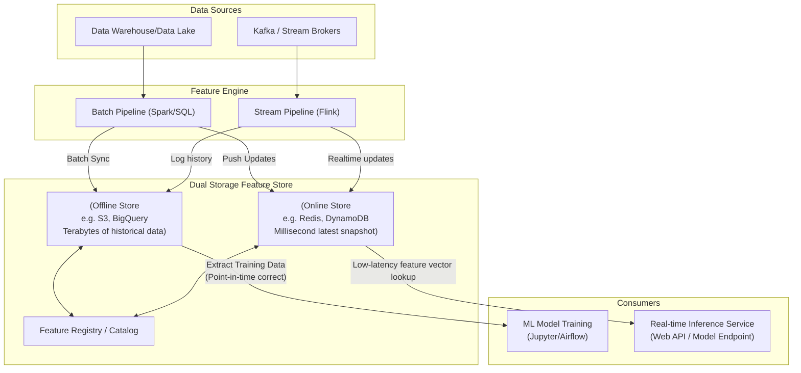

Hãy tưởng tượng bạn là một nhà khoa học dữ liệu (Data Scientist). Bạn vừa dành ra ba tháng miệt mài nghiên cứu, viết code Python/Pandas trên Jupyter Notebook để tính toán ra các đặc trưng (features) cực kỳ đắt giá từ dữ liệu lịch sử như: *"Tần suất mua hàng trung bình trong 7 ngày qua"*, hay *"Số lần click vào quảng cáo của người dùng"*. Mô hình Machine Learning của bạn đạt độ chính xác ấn tượng trên máy tính cá nhân.

Thế nhưng, khi chuyển giao mô hình cho đội ngũ Kỹ sư phần mềm (Software Engineers) để đưa lên chạy thực tế (Production), một "cơn ác mộng" xuất hiện. Đội ngũ kỹ sư phải viết lại toàn bộ logic tính toán đặc trưng kia bằng ngôn ngữ Java hoặc Go để đọc dữ liệu thời gian thực từ database. 

Chỉ cần một sự sai lệch nhỏ trong cách tính toán giữa hai môi trường, mô hình của bạn khi chạy thực tế sẽ cho ra các kết quả sai lệch hoàn toàn. 

Để giải quyết bài toán hóc búa này, khái niệm **Feature Store (Kho đặc trưng)** đã ra đời, đóng vai trò là chiếc cầu nối vững chắc giữa Kỹ thuật dữ liệu ([Data Engineering](/concepts/foundation/data-engineering/)) và Khoa học dữ liệu (Data Science).

## Điểm giao thoa giữa Kỹ sư dữ liệu và Khoa học dữ liệu

Trong thế giới Machine Learning, **Feature (Đặc trưng)** là các thuộc tính độc lập có thể đo lường được dùng làm dữ liệu đầu vào giúp mô hình AI đưa ra dự đoán (ví dụ: tuổi tài khoản, vị trí địa lý, tổng chi tiêu).

**Feature Store** là một tầng quản lý dữ liệu chuyên biệt (Data Management Layer) trong kiến trúc MLOps. Nó tiếp nhận dữ liệu thô từ các kho chứa dữ liệu (Data Warehouse, [Data Lake](/concepts/data-lake-lakehouse/data-lake/)) hoặc các luồng dữ liệu trực tuyến (Kafka), thực hiện biến đổi dữ liệu thông qua các pipeline định sẵn và lưu trữ chúng dưới dạng một danh mục đặc trưng thống nhất. 

Nền tảng này vừa cung cấp dữ liệu lịch sử quy mô lớn phục vụ cho việc huấn luyện mô hình (Offline Training), vừa cung cấp các vectơ đặc trưng với độ trễ tính bằng mili-giây phục vụ cho các ứng dụng dự đoán thời gian thực (Online Serving).

## Những "cơn ác mộng" của việc triển khai Machine Learning

Nếu không có một hệ thống Feature Store tập trung, doanh nghiệp sẽ phải đối mặt với 3 rào cản lớn:

1. **Sự bất đồng bộ Online/Offline (Training-Serving Skew)**: Logic tính toán đặc trưng bị phân mảnh. Môi trường huấn luyện (Offline) dùng một công thức viết bằng Python, còn môi trường phục vụ thực tế (Online) lại dùng một công thức viết bằng SQL hoặc Java. Sự lệch pha về mặt dữ liệu này là nguyên nhân hàng đầu khiến các mô hình AI hoạt động rất tệ khi triển khai thực tế.
2. **Lãng phí tài nguyên và công sức**: Các nhóm phát triển khác nhau trong cùng một công ty thường tự viết lại các pipeline tính toán các đặc trưng giống nhau (ví dụ: "Số bài viết người dùng đã đọc trong 30 ngày"). Việc thiếu cơ chế chia sẻ khiến chi phí điện toán tăng gấp đôi và lãng phí thời gian phát triển.
3. **Rò rỉ dữ liệu lịch sử (Data Leakage / Point-in-time Inconsistency)**: Khi chuẩn bị dữ liệu huấn luyện, lập trình viên rất dễ mắc lỗi "nhìn trước tương lai". Ví dụ, để huấn luyện mô hình dự đoán một khách hàng có nhấp chuột vào quảng cáo lúc 8:00 sáng hôm qua hay không, chúng ta không được phép dùng số dư tài khoản của họ lúc 12:00 trưa hôm qua để làm tính năng đầu vào. Việc ghép dữ liệu không đúng thời điểm (Point-in-time) sẽ khiến mô hình học sai bản chất.

Feature Store giải quyết triệt để những vấn đề này bằng cách cho phép định nghĩa đặc trưng **duy nhất một lần** và tự động đồng bộ hóa phục vụ ở mọi nơi.

## Bản chất kiến trúc kép: Offline vs Online Store

Trọng tâm kiến trúc của một Feature Store (như Feast, Hopsworks hay Tecton) là **Cơ chế lưu trữ kép (Dual Storage Architecture)**:

* **Offline Store (Lưu trữ ngoại tuyến)**: Nơi lưu giữ lượng dữ liệu lịch sử khổng lồ (hàng Terabyte hoặc Petabyte) trên các hệ thống Data Lake (S3, GCS) hoặc Data Warehouse (BigQuery, [Snowflake](/concepts/cloud-data-platform/snowflake/)). Hệ thống này được tối ưu hóa để đọc ghi dữ liệu theo lô (Batch) với tốc độ cao, giúp các nhà khoa học dữ liệu nhanh chóng trích xuất tập dữ liệu lớn phục vụ huấn luyện mô hình.
* **Online Store (Lưu trữ trực tuyến)**: Nơi lưu giữ giá trị đặc trưng **mới nhất** của từng thực thể trên các cơ sở dữ liệu có tốc độ đọc ghi cực nhanh trực tiếp trên bộ nhớ (In-memory) như Redis hoặc DynamoDB. Hệ thống này tối ưu cho việc truy xuất thông tin của một thực thể (ví dụ một User cụ thể) với độ trễ siêu thấp dưới 10 mili-giây khi ứng dụng thực tế gọi API dự đoán.

Đặc biệt, cả hai kho lưu trữ này đều được quản lý đồng bộ bởi một logic nguồn chung, giúp xóa nhòa khoảng cách giữa lúc thử nghiệm và lúc chạy thực tế.

## Quy trình hoạt động của Feature Store

Dưới đây là sơ đồ luồng dữ liệu đi qua một hệ thống Feature Store hoàn chỉnh:



1. **Registry (Đăng ký)**: Kỹ sư dữ liệu viết mã nguồn định nghĩa các đặc trưng và đăng ký lên danh mục Registry trung tâm để mọi người trong công ty có thể tra cứu và tái sử dụng.
2. **Ingestion (Nạp dữ liệu)**: Feature Store chạy các tiến trình ngầm để kéo dữ liệu định kỳ từ Data Warehouse nạp vào Offline Store, đồng thời liên tục lắng nghe luồng dữ liệu từ Kafka để cập nhật tức thời các đặc trưng mới nhất vào Online Store.
3. **Serving (Phục vụ)**:
   * **Offline Serving**: Data Scientist gọi thư viện để kéo dữ liệu huấn luyện. Feature Store tự động thực hiện các phép JOIN ngược thời gian chính xác tuyệt đối để tạo ra tập file huấn luyện sạch sẽ.
   * **Online Serving**: Khi ứng dụng di động của người dùng kích hoạt một tính năng cần AI đưa ra phán đoán, hệ thống backend sẽ gọi API của Feature Store để lấy nhanh vectơ đặc trưng mới nhất của người dùng đó từ Redis chỉ trong vài mili-giây, đưa thẳng vào mô hình ML để nhả ra kết quả dự đoán.

## Ví dụ thực tế: Uber Michelangelo và cách trích xuất dữ liệu với Feast

Tại Uber, hệ thống dự đoán thời gian tài xế đến đón (ETA) cần các đặc trưng biến động liên tục theo từng giây như: *"Mật độ giao thông trung bình trong 10 phút qua tại khu vực"* và *"Số chuyến xe tài xế đã hoàn thành hôm nay"*. 

Để giải quyết bài toán này, Uber đã xây dựng Feature Store nội bộ mang tên Michelangelo. Các Data Scientist của Uber chỉ cần lựa chọn các đặc trưng mong muốn trên giao diện quản trị, hệ thống sẽ tự động lo liệu việc đồng bộ dữ liệu.

Dưới đây là ví dụ minh họa cách một Data Scientist sử dụng Python SDK của công cụ mã nguồn mở **Feast** để thực hiện lấy dữ liệu huấn luyện chính xác theo dòng thời gian (Point-in-time correctness):

```python
import feast
import pandas as pd

# 1. Kết nối với hệ thống Feature Store
fs = feast.FeatureStore(repo_path=".")

# 2. Tập dữ liệu thô ban đầu (chỉ có user_id và thời điểm giao dịch)
orders_df = pd.DataFrame({
    "user_id": [1001, 1002, 1003],
    "event_timestamp": [
        pd.Timestamp("2023-10-01 10:00:00"),
        pd.Timestamp("2023-10-05 15:30:00"),
        pd.Timestamp("2023-10-10 08:15:00")
    ]
})

# 3. Yêu cầu Feature Store "JOIN" thêm các đặc trưng lịch sử chính xác tại thời điểm giao dịch
training_df = fs.get_historical_features(
    entity_df=orders_df,
    features=[
        "driver_hourly_stats:conv_rate",    # Tỷ lệ chuyển đổi
        "driver_hourly_stats:acc_rate"      # Tỷ lệ chấp nhận chuyến xe
    ]
).to_df()

# training_df lúc này sẽ có đầy đủ các cột đặc trưng được khớp thời gian hoàn hảo
print(training_df.head())
```

## Những nguyên tắc vàng khi áp dụng Feature Store

### Nguyên tắc thiết kế (Best Practices)
* **Quản lý đặc trưng như Mã nguồn (Infrastructure as Code)**: Hãy lưu trữ toàn bộ các file định nghĩa đặc trưng trên Git (như GitHub/GitLab). Quy trình duyệt mã nguồn (Pull Request) sẽ là lá chắn đầu tiên giúp phát hiện các lỗi logic dữ liệu trước khi chúng được đưa vào huấn luyện mô hình.
* **Tận dụng Point-in-Time Join tự động**: Hãy chắc chắn công cụ Feature Store của bạn hỗ trợ cơ chế JOIN lùi thời gian tự động (AS OF Join). Việc tự viết các câu lệnh SQL để khớp thời gian thủ công cực kỳ phức tạp và dễ gây ra lỗi tràn bộ nhớ (Out of Memory - OOM).

### Sai lầm dễ mắc phải (Common Mistakes)
* **Áp dụng quá sớm (Premature Optimization)**: Đầu tư xây dựng một hệ thống Feature Store phức tạp khi doanh nghiệp mới chỉ có vài ba mô hình Machine Learning chạy theo lô (Batch) định kỳ mỗi đêm. Feature Store thực sự phát huy tối đa giá trị khi bạn vận hành hệ thống AI đưa ra phán đoán trực tuyến thời gian thực (Real-time).
* **Nhầm lẫn với Data Warehouse**: Feature Store không phải là nơi lưu trữ dữ liệu thô. Bạn không nên đưa tất cả các bảng dữ liệu gốc vào đây. Nó chỉ nên chứa các đặc trưng đã qua xử lý tinh gọn, sẵn sàng nạp trực tiếp vào mô hình AI.

## Được và mất: Cân nhắc mức độ sẵn sàng của doanh nghiệp

### Điểm cộng (Pros)
* Loại bỏ hoàn toàn sự lệch pha dữ liệu giữa huấn luyện và chạy thực tế (Training-Serving Skew).
* Tái sử dụng tối đa tài nguyên đặc trưng giữa các phòng ban, tiết kiệm chi phí tính toán đám mây.
* Tăng tốc quy trình đưa mô hình từ nghiên cứu ra thực tế từ hàng tháng xuống chỉ còn vài ngày.

### Điểm trừ (Cons)
* Cấu trúc hệ thống phức tạp, yêu cầu đội ngũ vận hành có chuyên môn kỹ thuật cao.
* Chi phí hạ tầng lớn do phải duy trì các cơ sở dữ liệu in-memory đắt đỏ cho Online Store để đảm bảo tốc độ phản hồi.

## Khi nào nên áp dụng?

* Doanh nghiệp có đội ngũ dữ liệu lớn với hàng chục mô hình AI cần vận hành song song.
* Các mô hình AI yêu cầu đưa ra phán đoán trực tuyến thời gian thực cho người dùng cuối với độ trễ cực thấp (như hệ thống phát hiện giao dịch gian lận thẻ tín dụng, hệ thống gợi ý bài viết, định giá chuyến xe linh hoạt).

Nếu doanh nghiệp chỉ chạy các tác vụ báo cáo tĩnh (Business Intelligence) hoặc các mô hình dự đoán theo lô định kỳ (Batch Inference), việc sử dụng Data Warehouse kết hợp với các công cụ biến đổi dữ liệu như [dbt](/concepts/transformation-analytics/dbt/) là giải pháp kinh tế và đơn giản hơn nhiều.

## Khái niệm liên quan

* [Data Warehouse](/concepts/data-warehouse/data-warehouse/)
* [Real-time Architecture](/concepts/system-architecture/real-time-architecture/)
* [Lambda Architecture](/concepts/system-architecture/lambda-architecture/)

## Góc phỏng vấn

### 1. Training-Serving Skew là gì và Feature Store giải quyết vấn đề này bằng cách nào?
* **Gợi ý trả lời**: Training-Serving Skew là hiện tượng hiệu năng dự đoán của mô hình Machine Learning bị sụt giảm nghiêm trọng khi đưa lên môi trường thực tế (production) so với lúc thử nghiệm (training). Nguyên nhân chính là do logic tính toán dữ liệu đầu vào bị sai lệch giữa hai môi trường (ví dụ Data Scientist dùng Python để tính toán trên dữ liệu lịch sử, còn kỹ sư backend lại viết lại logic đó bằng Java để đọc dữ liệu real-time). Feature Store giải quyết triệt để vấn đề này bằng cách tạo ra một nguồn chân lý duy nhất (Single Source of Truth). Logic tính toán đặc trưng chỉ cần định nghĩa một lần, công cụ Feature Store sẽ tự động phân phối: nạp dữ liệu lịch sử vào Offline Store phục vụ huấn luyện, và cập nhật dữ liệu mới nhất vào Online Store (như Redis) phục vụ dự đoán thời gian thực.

### 2. Hãy giải thích hiện tượng rò rỉ dữ liệu lịch sử (Data Leakage) khi xây dựng tập dữ liệu huấn luyện và cách Feature Store khắc phục nó.
* **Gợi ý trả lời**: Rò rỉ dữ liệu lịch sử xảy ra khi chúng ta vô tình cung cấp cho mô hình AI các thông tin ở "tương lai" (thời điểm sau khi sự kiện cần dự đoán đã xảy ra) trong quá trình huấn luyện. Ví dụ, để dự báo người dùng có click vào quảng cáo lúc 10h sáng hay không, chúng ta lại sử dụng tổng số lượt xem trang web tính đến 12h trưa của họ. Điều này khiến mô hình đạt độ chính xác 100% khi huấn luyện nhưng lại hoàn toàn mất phương hướng khi chạy thực tế vì lúc 10h sáng hệ thống chưa hề có dữ liệu của lúc 12h trưa. Feature Store khắc phục điều này bằng tính năng Point-in-time Join (hoặc AS OF Join) tự động, đảm bảo rằng mỗi sự kiện lịch sử chỉ được ghép nối chính xác với trạng thái của các đặc trưng tính đến thời điểm ngay trước khi sự kiện đó diễn ra.

## Tài liệu tham khảo

1. [Feast Documentation](https://docs.feast.dev/)
2. [Meet Michelangelo: Uber's Machine Learning Platform](https://www.uber.com/blog/michelangelo-machine-learning-platform/)
3. [Designing Machine Learning Systems](https://www.oreilly.com/library/view/designing-machine-learning/9781098107956/) - Chip Huyen

## Tóm tắt bằng tiếng Anh (English Summary)

A Feature Store is a centralized data management system for Machine Learning. It serves as a dual-layer architectural bridge: an Offline Store (like a Data Warehouse/Lake) optimized for massive [batch processing](/concepts/batch-processing/batch-processing/) to generate training datasets with strict point-in-time correctness, and an Online Store (like an in-memory key-value database) for extremely low-latency feature serving in real-time prediction environments. By using a single source of truth for feature definitions, it eradicates the notorious training-serving skew, prevents data leakage, and enables data scientists to reuse features across the organization, massively accelerating the MLOps lifecycle.
