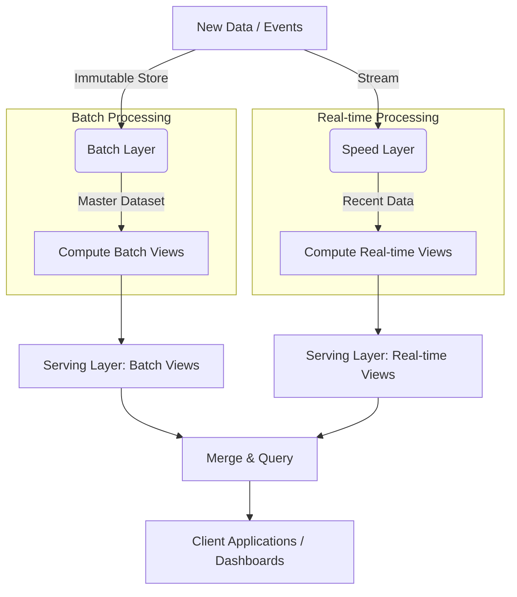

Trong thế giới Big Data, các kỹ sư dữ liệu từng phải đối mặt với một sự đánh đổi nghiệt ngã: 
- Hoặc chọn **hệ thống xử lý theo lô ([Batch Processing](/concepts/batch-processing/batch-processing/))** với độ chính xác tuyệt đối nhưng mất hàng giờ hoặc hàng ngày để ra kết quả.
- Hoặc chọn **hệ thống xử lý thời gian thực (Stream Processing)** với tốc độ tính bằng mili-giây nhưng dễ bị sai sót dữ liệu (như mất event trên đường truyền) và rất khó để chạy các phép tính phức tạp trên toàn bộ lịch sử.

Để giải quyết bài toán hóc búa này, Nathan Marz (cha đẻ của Apache Storm) đã đề xuất **Kiến trúc Lambda (Lambda Architecture)**. Đây là một mô hình thiết kế hệ thống dữ liệu lớn giúp cân bằng hoàn hảo giữa ba yếu tố: độ trễ (latency), thông lượng (throughput) và độ chính xác của dữ liệu.

## Cơ chế hoạt động của Lambda Architecture

Ý tưởng cốt lõi để giải quyết bài toán này nằm ở phương trình đơn giản nhưng mạnh mẽ: 

$$\text{Query} = \text{Function}(\text{All Data})$$

Thay vì cố gắng bắt một hệ thống duy nhất làm tốt cả hai việc (vừa nhanh vừa chính xác tuyệt đối), Lambda chia nhỏ quá trình tính toán thành ba lớp (layers) bổ trợ lẫn nhau:

### 1. Batch Layer (Lớp lô)
Lớp này đóng vai trò là "nguồn chân lý" (Source of Truth) của toàn bộ hệ thống. Nhiệm vụ của nó là lưu trữ dữ liệu thô một cách vĩnh viễn và bất biến (Master Dataset), đồng thời định kỳ tính toán các phép toán phức tạp trên quy mô lớn. 
- **Công nghệ thường dùng**: Hadoop HDFS, AWS S3, [Apache Spark](/concepts/batch-processing/apache-spark/).
- **Đặc điểm**: Đạt độ chính xác 100% nhưng có độ trễ cao (thường chạy định kỳ theo giờ hoặc theo ngày).

### 2. Speed Layer (Lớp tốc độ / Lớp luồng)
Trong khi Batch Layer đang bận rộn xử lý dữ liệu của ngày hôm qua, dữ liệu mới của ngày hôm nay vẫn liên tục đổ về. Speed Layer sẽ nhận nhiệm vụ xử lý ngay lập tức lượng dữ liệu mới này với độ trễ cực thấp.
- **Công nghệ thường dùng**: Apache Flink, Apache Storm, Spark Streaming.
- **Đặc điểm**: Cực kỳ nhanh nhưng chỉ xử lý trên một cửa sổ dữ liệu ngắn hạn (những gì chưa được đưa vào Batch Layer) và có thể chấp nhận sai số nhỏ tạm thời.

### 3. Serving Layer (Lớp phục vụ)
Đây là lớp giao tiếp với người dùng và các ứng dụng. Nó lưu trữ các kết quả đã được tính toán sẵn từ cả Batch Layer (Batch Views) và Speed Layer (Real-time Views).
- **Công nghệ thường dùng**: Apache Cassandra, HBase, Elasticsearch.
- **Đặc điểm**: Khi có yêu cầu truy vấn từ phía client, Serving Layer sẽ nhanh chóng gộp (merge) kết quả chính xác từ Batch View và kết quả tức thời từ Real-time View để trả về một bức tranh toàn diện và mới nhất.

---

## Luồng xử lý dữ liệu trong kiến trúc Lambda

Để hình dung rõ hơn cách dữ liệu di chuyển, chúng ta có sơ đồ kiến trúc tổng quan sau:


---

## Một ví dụ thực tế từ E-commerce

Hãy tưởng tượng bạn đang xây dựng một tính năng gợi ý sản phẩm "Có thể bạn quan tâm" dựa trên lịch sử click chuột của người dùng trên trang thương mại điện tử.

* **Tại Batch Layer**: Hệ thống chạy vào lúc 2 giờ sáng mỗi ngày. Nó sử dụng Spark để phân tích hàng tỷ lượt click chuột tích lũy trong 5 năm của khách hàng A nhằm xây dựng một hồ sơ sở thích sâu sắc và chính xác tuyệt đối. Kết quả này được lưu vào bảng `batch_layer`.
* **Tại Speed Layer**: Trong suốt ngày hôm nay, khách hàng A lướt web và click vào 3 đôi giày chạy bộ của Nike. Spark Streaming ngay lập tức ghi nhận hành vi này và cập nhật điểm sở thích tạm thời với từ khóa "Nike" vào bảng `speed_layer`.
* **Tại Serving Layer**: Lúc 3 giờ chiều, khách hàng A truy cập trang chủ. Ứng dụng web sẽ truy vấn đồng thời cả hồ sơ sở thích dài hạn (từ `batch_layer`) và hành vi nóng hổi trong ngày (từ `speed_layer`), gộp chúng lại để đề xuất ngay các mẫu giày Nike mới nhất. Đến 2 giờ sáng hôm sau, toàn bộ hành vi click trong ngày hôm nay sẽ được gom vào luồng xử lý Batch, và bảng `speed_layer` tạm thời của khách hàng A sẽ được reset để bắt đầu một ngày mới.

Dưới đây là đoạn mã giả minh họa cách lớp Serving gộp dữ liệu từ hai nguồn:
```python
def get_recommendations(user_id):
    # 1. Truy vấn kết quả tính toán chính xác từ Batch Layer (đến 2h sáng hôm nay)
    batch_views = db.query("SELECT recs FROM batch_layer WHERE user = ?", user_id)
    
    # 2. Truy vấn kết quả tạm thời từ Speed Layer (từ 2h sáng đến hiện tại)
    realtime_views = db.query("SELECT recs FROM speed_layer WHERE user = ?", user_id)
    
    # 3. Merge (Hợp nhất) hai luồng kết quả
    final_recommendations = merge_logic(batch_views, realtime_views)
    
    return final_recommendations
```

---

## Điểm cộng, điểm trừ và những bài học xương máu khi vận hành

Kiến trúc Lambda không phải là "viên đạn bạc" giải quyết được mọi thứ mà không đi kèm cái giá của nó.

### Những ưu điểm vượt trội (Pros)
* **Khả năng tự sửa lỗi cực tốt (Fault tolerance)**: Nếu bạn phát hiện ra một lỗi logic trong code streaming của Speed Layer làm sai lệch dữ liệu, bạn không cần hoảng loạn. Chỉ cần sửa lại code, xóa bỏ dữ liệu tạm thời đó và để cho Batch Layer chạy lại (recompute) trên Master Dataset bất biến. Mọi số liệu sẽ chính xác trở lại.
* **Độ tin cậy cao**: Bạn có thể hoàn toàn yên tâm về số liệu lịch sử (vốn đã được kiểm tra kỹ qua Batch) mà vẫn có được tốc độ phản hồi theo thời gian thực cho dữ liệu mới.

### Những nhược điểm phiền toái (Cons)
* **Nợ kỹ thuật lớn (Code duplication)**: Đây là nỗi đau đầu nhất của các Data Engineer. Bạn thường phải duy trì hai bộ mã nguồn chạy cùng một logic nghiệp vụ nhưng trên hai công nghệ khác nhau (ví dụ: viết MapReduce/Spark SQL cho Batch và viết Storm/Flink cho Speed).
* **Độ phức tạp vận hành**: Việc giám sát, bảo trì và đảm bảo tính đồng bộ của hai hệ thống tính toán chạy song song đòi hỏi chi phí hạ tầng lớn và đội ngũ vận hành rất cứng tay.
* **Khó khăn khi gộp dữ liệu**: Việc thiết kế cơ chế merge dữ liệu từ Batch và Real-time ở lớp Serving đôi khi cực kỳ phức tạp tùy thuộc vào thuật toán nghiệp vụ của bạn.

### Kinh nghiệm triển khai thực tế (Best Practices)
* **Giữ dữ liệu Batch bất biến**: Hãy thiết kế kho lưu trữ trung tâm ở chế độ append-only (chỉ thêm mới). Việc không bao giờ thay đổi dữ liệu gốc là chìa khóa để chạy lại (recompute) dữ liệu bất cứ lúc nào.
* **Đồng bộ hóa Logic**: Hãy ưu tiên sử dụng các framework hỗ trợ cả batch và stream xử lý trên cùng một API (như Apache Spark với Structured Streaming hoặc Apache Beam) để tránh việc phải viết code hai lần bằng hai ngôn ngữ khác nhau.
* **Dọn dẹp Speed Layer định kỳ**: Ngay khi dữ liệu của ngày hôm qua đã được xử lý xong bởi Batch Layer và cập nhật vào Serving Layer, hãy lập tức dọn dẹp hoặc reset dữ liệu tương ứng trong Speed Layer để tránh tình trạng tính trùng lặp.

### Những sai lầm phổ biến
* **Áp dụng máy móc (Over-engineering)**: Xây dựng Lambda khi doanh nghiệp thực chất chỉ cần dữ liệu cập nhật sau 24 giờ. Hãy nhớ rằng chi phí vận hành Lambda rất đắt đỏ.
* **Quản lý hai codebase riêng biệt**: Việc để một đội code Batch và một đội độc lập code Streaming sẽ nhanh chóng biến hệ thống thành một mớ hỗn độn khi logic nghiệp vụ thay đổi.

---

## Khi nào nên và không nên chọn Lambda Architecture?

### Nên chọn khi:
* Hệ thống của bạn bắt buộc phải có dashboard thời gian thực nhưng số liệu lịch sử lại yêu cầu độ chính xác tuyệt đối (ví dụ: hệ thống phát hiện gian lận tài chính, hệ thống đấu thầu quảng cáo thời gian thực - Real-time Bidding).
* Khối lượng dữ liệu lịch sử cực lớn (hàng trăm Terabyte hoặc Petabyte) khiến cho việc xử lý lại (reprocessing) hoàn toàn bằng một công nghệ stream là bất khả thi.

### Không nên chọn khi:
* Bạn muốn tối giản hóa kiến trúc và hạn chế tối đa việc trùng lặp logic code. Khi đó, hãy cân nhắc [Kiến trúc Kappa](/concepts/system-architecture/kappa-architecture/).
* Hệ thống chỉ cần dữ liệu cập nhật theo chu kỳ ngày hoặc tuần (chỉ cần Batch Layer là đủ).

---

## Khái niệm liên quan

* [Kappa Architecture](/concepts/system-architecture/kappa-architecture/)
* [Real-time Architecture](/concepts/system-architecture/real-time-architecture/)
* [Event-Driven Architecture](/concepts/system-architecture/event-driven-architecture/)

---

## Góc phỏng vấn: Câu hỏi thường gặp

### 1. Sự khác biệt chính giữa kiến trúc Lambda và kiến trúc Kappa là gì?
* **Mục đích của người phỏng vấn**: Đánh giá tầm nhìn kiến trúc và sự hiểu việc của bạn về lộ trình tiến hóa của các hệ thống Big Data.
* **Gợi ý trả lời**:
  * Điểm khác biệt cốt lõi là số lượng luồng xử lý. **Lambda Architecture** duy trì song song hai luồng xử lý độc lập: Batch Layer (chậm nhưng chính xác trên dữ liệu lịch sử) và Speed Layer (nhanh trên dữ liệu mới). 
  * Ngược lại, **Kappa Architecture** loại bỏ hoàn toàn Batch Layer. Nó coi tất cả dữ liệu (cả quá khứ lẫn hiện tại) là một luồng sự kiện liên tục (stream) và chỉ sử dụng duy nhất một công cụ xử lý luồng (như Apache Flink hoặc Kafka Streams). Điều này giúp loại bỏ hoàn toàn việc trùng lặp logic code và giảm bớt gánh nặng vận hành.

### 2. Làm thế nào để Lambda Architecture xử lý lỗi logic của con người (Human Error) trong code?
* **Mục đích của người phỏng vấn**: Xem bạn có hiểu được giá trị của nguyên lý Master Dataset bất biến hay không.
* **Gợi ý trả lời**:
  * Sức mạnh của Lambda nằm ở tính bất biến của Master Dataset ở tầng lưu trữ. Nếu kỹ sư viết code sai ở Speed Layer làm sai lệch dữ liệu phân tích thời gian thực trong vài ngày qua, chúng ta không cần quá lo lắng.
  * Quy trình khắc phục bao gồm: Sửa lại lỗi logic trong code, deploy bản vá, sau đó kích hoạt Batch Layer quét lại toàn bộ Master Dataset bất biến từ thời điểm xảy ra lỗi để tạo lại các Batch Views chuẩn xác. Khi Batch Views mới được nạp vào Serving Layer, dữ liệu bị lỗi trước đó sẽ tự động được ghi đè bằng kết quả đúng.

---

## Tài liệu tham khảo

1. [Big Data: Principles and best practices of scalable realtime data systems](https://www.manning.com/books/big-data) - Nathan Marz & James Warren
2. [Designing Data-Intensive Applications](https://www.oreilly.com/library/view/designing-data-intensive-applications/9781491903063/) - Martin Kleppmann

---

## English summary

Lambda Architecture is a data-processing architecture designed to handle massive quantities of data by taking advantage of both batch and stream-processing methods. It relies on a robust, append-only Master Dataset. The architecture resolves the latency vs. accuracy trade-off by delegating heavy, highly-accurate historical computations to the Batch Layer, whilst delegating low-latency, real-time approximations to the Speed Layer. Finally, a Serving Layer queries and merges views from both layers to present a complete and up-to-date picture, though it comes at the cost of managing dual processing logic and higher operational complexity.