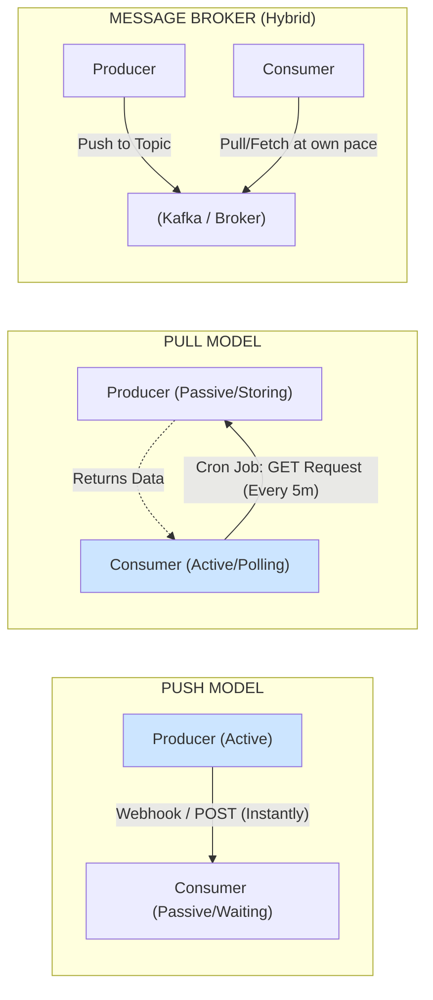

Khi thiết kế một hệ thống phần mềm hoặc xây dựng các đường ống dẫn dữ liệu (data pipelines), một trong những quyết định đầu tiên mà các kỹ sư kiến trúc phải đưa ra là: *Làm thế nào để dữ liệu đi từ điểm A (nơi sản xuất) đến điểm B (nơi tiêu thụ)?* Câu hỏi này dẫn chúng ta đến hai cơ chế truyền tải thông tin kinh điển: **Push (Đẩy)** và **Pull (Kéo)**. Việc quyết định bên nào nắm thế chủ động trong việc di chuyển dữ liệu sẽ quyết định trực tiếp đến độ trễ, khả năng chịu tải và tính bền vững của toàn hệ thống.

## Ai là người chủ động? Định nghĩa về Push và Pull

Điểm khác biệt cốt lõi giữa hai mô hình này nằm ở **quyền kiểm soát luồng dữ liệu (control of flow)**:

* **Mô hình Đẩy (Push Model)**: Nguồn phát dữ liệu (Producer) đóng vai trò chủ động. Ngay khi có một sự kiện hay dữ liệu mới xuất hiện, nó sẽ lập tức đóng gói và "đẩy" thẳng tới hệ thống nhận. Hệ thống nhận (Consumer) ở trạng thái bị động chờ đợi và xử lý bất kỳ lúc nào dữ liệu ập đến. Ví dụ thực tế dễ thấy nhất là tính năng Webhooks của các cổng thanh toán, hoặc thông báo đẩy (Push Notification) trên điện thoại của bạn.
* **Mô hình Kéo (Pull Model)**: Nguồn nhận dữ liệu (Consumer) nắm thế chủ động. Nguồn phát chỉ làm nhiệm vụ lưu trữ dữ liệu một chỗ một cách thụ động. Hệ thống nhận sẽ định kỳ kết nối tới nguồn phát để thăm dò (poll): *"Có thông tin gì mới không? Gửi cho tôi nhé!"*. Ví dụ điển hình là các tiến trình [ETL](/concepts/etl-elt/etl/) chạy định kỳ hoặc các câu lệnh gọi API dạng GET để lấy dữ liệu.

## Cuộc chiến giữa Tức thì (Latency) và Bền bỉ (Stability)

Không có phương thức nào là hoàn hảo cho mọi trường hợp. Mỗi mô hình được sinh ra để ưu tiên giải quyết một bài toán cụ thể:

Mô hình Push là sự lựa chọn tối ưu cho bài toán **thời gian thực (real-time)**. Khi mà mỗi mili-giây trôi qua đều ảnh hưởng đến trải nghiệm người dùng hoặc giá trị giao dịch, hệ thống không thể đủ kiên nhẫn để đợi người nhận chủ động đi gom dữ liệu. 

Tuy nhiên, điểm yếu của Push xuất hiện khi hệ thống nguồn phát ra dữ liệu quá nhanh (ví dụ 10.000 sự kiện/giây) và dồn dập đổ vào một máy chủ nhận nhỏ bé đang quá tải. Để tránh việc người nhận bị "sập" vì ngập lụt dữ liệu, mô hình Pull xuất hiện như một giải pháp cứu cánh. Bằng cách cho phép máy chủ nhận chủ động kéo dữ liệu về theo tốc độ xử lý thực tế của nó (chẳng hạn 10 sự kiện/giây), hệ thống có khả năng tự vệ tự nhiên trước áp lực dữ liệu tăng đột biến (hiện tượng này gọi là Kháng áp suất ngược - **Backpressure**).

## Bản chất hoạt động của hai mô hình

### 1. Mô hình Đẩy (Push) - Tốc độ và Sự phụ thuộc
Trong mô hình Push, nhà phát hành dữ liệu nắm quyền sinh sát về nhịp độ truyền tải. Do đó:
* Bên nhận không cần tốn tài nguyên máy tính (CPU, mạng) để liên tục hỏi thăm xem có dữ liệu mới hay chưa.
* Tuy nhiên, hệ thống nhận bắt buộc phải luôn ở trạng thái trực tuyến (always-on) và phải mở sẵn các cổng kết nối mạng (open ports/firewall) để bên phát có thể bắn dữ liệu vào. Nếu bên nhận gặp sự cố gián đoạn mạng, dữ liệu đang đẩy đi có nguy cơ bị thất lạc vĩnh viễn nếu không có cơ chế lưu đệm hoặc gửi lại (retry) thông minh.

### 2. Mô hình Kéo (Pull) - Tính Tự chủ và An toàn
Trong mô hình Pull, bên nhận tự quyết định vận mệnh của mình:
* Bên nhận có thể tự điều tiết tốc độ (self-pacing), lấy dữ liệu khi rảnh rỗi và tạm dừng khi bận rộn. Điều này giúp ngăn chặn tình trạng tự tấn công từ chối dịch vụ (self-inflicted DDoS).
* Bên phát không cần biết bên nhận là ai và đang ở đâu, chỉ cần trưng bày dữ liệu ra một cổng chung (endpoint). Bên nhận cũng dễ dàng đi xuyên qua các lớp tường lửa bảo mật để xin dữ liệu mà không cần yêu cầu quản trị viên mạng phải mở cổng đón khách lạ.

Hãy hình dung qua một kịch bản đơn giản: Cửa hàng bán lẻ (Hệ thống A) muốn đưa dữ liệu đơn hàng vào Kho dữ liệu (Hệ thống B).
* **Nếu dùng Push**: Hệ thống B mở sẵn một API. Ngay khi khách quét mã thanh toán, Hệ thống A gửi ngay request POST đập thẳng dữ liệu vào hệ thống B. Nếu lúc đó hệ thống B đang bảo trì, đơn hàng có nguy cơ bị mất dấu.
* **Nếu dùng Pull**: Hệ thống A lưu đơn hàng vào database nội bộ. Cứ mỗi 5 phút, Hệ thống B chạy một job tự động kích hoạt, gọi API GET gửi tới Hệ thống A để gom tất cả các đơn hàng phát sinh trong 5 phút vừa qua. Nếu lúc 09:05 hệ thống B bị mất điện, khi có điện lại lúc 09:10 nó vẫn có thể kéo bù dữ liệu cũ về một cách trọn vẹn.

## Mô phỏng luồng giao tiếp dữ liệu

Sơ đồ dưới đây trực quan hóa sự khác biệt về quyền khởi xướng luồng truyền dữ liệu giữa hai cơ chế và cách chúng kết hợp trong mô hình Hybrid:


## Mô hình Hybrid trong thực tế: Tại sao Apache Kafka lại phối hợp cả hai?

Để tận dụng ưu điểm của cả hai thế giới, các kiến trúc sư dữ liệu hiện đại thường thiết kế các hệ thống Hybrid sử dụng Message Broker ở giữa (như [Apache Kafka](/concepts/streaming-processing/apache-kafka/)).

Trong hệ sinh thái Kafka:
* **Từ Producer đến Kafka (Push)**: Các thiết bị IoT hay ứng dụng gửi dữ liệu liên tục lên Kafka theo cơ chế **Push**. Điều này giúp giải phóng dữ liệu nhanh chóng khỏi thiết bị biên (edge devices) mà không cần lo lắng Broker có sẵn sàng nhận hay không, tránh việc nghẽn bộ nhớ tại nguồn.
* **Từ Kafka đến Consumer (Pull)**: Các động cơ xử lý dữ liệu (như Spark Streaming, Flink) hoặc các ứng dụng tiêu thụ sẽ chủ động **Pull (Kéo)** dữ liệu từ Kafka về. Thiết kế này giúp consumer kiểm soát hoàn toàn tải trọng của mình. Nếu lượng dữ liệu đẩy vào Kafka tăng vọt (ví dụ ngày Black Friday), consumer vẫn cứ thong thả kéo dữ liệu về theo đúng công suất tối đa của nó. Kafka đóng vai trò như một hồ chứa khổng lồ giữ hộ phần dữ liệu chưa kịp xử lý mà không làm sập consumer.

Dưới đây là đoạn code Python minh họa cách triển khai cơ chế kết hợp này:
```python
# --- MÔ HÌNH PUSH (Producer chủ động bắn dữ liệu lên Broker ngay khi có sự kiện) ---
producer = KafkaProducer(bootstrap_servers='localhost:9092')

def on_sensor_event(event_data):
    # Phát hiện sự kiện là đẩy đi ngay lập tức
    producer.send('iot_topic', value=event_data)

# --- MÔ HÌNH PULL (Consumer chủ động kéo dữ liệu về theo năng lực xử lý) ---
consumer = KafkaConsumer('iot_topic', bootstrap_servers='localhost:9092')

while True:
    # Chủ động kéo dữ liệu mỗi 100ms
    # Nếu hệ thống phía sau đang nghẽn, ta có thể cho thread ngủ (sleep) rồi mới kéo tiếp (Backpressure)
    records = consumer.poll(timeout_ms=100)
    for record in records:
        process_data(record.value)
```

## Thiết kế hệ thống: Khi nào nên Push, khi nào nên Pull?

### Đánh giá các điểm đánh đổi (Trade-offs)

| Đặc tính | Cơ chế Push (Đẩy) | Cơ chế Pull (Kéo) |
| :--- | :--- | :--- |
| **Độ trễ (Latency)** | Cực kỳ thấp (Gần như ngay lập tức) | Bị ảnh hưởng bởi chu kỳ thăm dò (Polling interval) |
| **Kiểm soát tải** | Kém (Dễ làm nghẽn/sập bên nhận) | Tuyệt vời (Bên nhận tự quyết định nhịp độ xử lý) |
| **Tính chịu lỗi** | Phức tạp (Cần hệ thống retry, queue đệm) | Cao (Chỉ cần lưu vết checkpoint để đọc tiếp) |
| **Tài nguyên mạng** | Tối ưu (Chỉ truyền khi thực sự có dữ liệu) | Hao phí (Gây ra các request trống nếu chưa có data mới) |
| **Độ bảo mật mạng** | Khó hơn (Phải mở cổng tường lửa để đón nhận Push) | Dễ hơn (Bên nhận chủ động ra ngoài Internet lấy data) |

### Những nguyên tắc thiết kế quan trọng
* **Ưu tiên Pull cho luồng Ingestion**: Khi thiết kế các luồng thu thập dữ liệu ([Data Ingestion](/concepts/etl-elt/data-ingestion/)) cho [Data Lake](/concepts/data-lake-lakehouse/data-lake/) hay [Data Warehouse](/concepts/data-warehouse/data-warehouse/), hãy ưu tiên cơ chế Pull. Việc kéo dữ liệu giúp bạn chủ động trong việc lập lịch, xử lý lỗi, chạy lại dữ liệu cũ ([backfill](/concepts/etl-elt/backfill/)) mà không cần can thiệp hay yêu cầu đội phát triển ứng dụng nguồn phải viết lại code.
* **Tự vệ khi dùng Webhook**: Nếu bạn bắt buộc phải cung cấp một cổng API để bên thứ ba push dữ liệu sang (ví dụ nhận trạng thái thanh toán từ Stripe), hãy đảm bảo API đó có tính **Idempotent (lũy đẳng)** để tránh xử lý trùng lặp. Đồng thời, hãy chuyển tiếp ngay dữ liệu nhận được vào một hàng đợi tin nhắn (Message Queue) để trả về phản hồi HTTP nhanh nhất có thể, tránh việc giữ kết nối mạng quá lâu làm cạn kiệt tài nguyên server.
* **Tránh cạm bẫy "Polling Hell"**: Một sai lầm kinh điển khi làm Pull là cấu hình vòng lặp kéo dữ liệu với tần suất quá cao (ví dụ cứ 1 giây quét một bảng database hàng chục triệu dòng để tìm bản ghi mới). Việc này sẽ nhanh chóng vắt kiệt I/O của database và kéo sập ứng dụng.

## Các khái niệm liên quan

* [Event-Driven Architecture](/concepts/system-architecture/event-driven-architecture/)
* [Real-time Architecture](/concepts/system-architecture/real-time-architecture/)
* [Lambda Architecture](/concepts/system-architecture/lambda-architecture/)

## Góc phỏng vấn: Tư duy thiết kế hệ thống phân tán

### 1. Hiện tượng "Backpressure" (Áp suất ngược) là gì? Cơ chế Push hay Pull giúp chúng ta giải quyết vấn đề này tốt hơn?
* **Gợi ý trả lời**: Backpressure là tình trạng hệ thống gửi dữ liệu (Producer) hoạt động nhanh hơn nhiều so với khả năng xử lý của hệ thống nhận (Consumer). Dữ liệu bị dồn ứ sẽ làm tràn bộ nhớ đệm (RAM) và có thể gây sập ứng dụng nhận. 
  Cơ chế **Pull** giải quyết backpressure một cách tự nhiên và hiệu quả nhất. Trong mô hình Pull, Consumer hoàn toàn làm chủ nhịp độ: nó chỉ kéo lượng dữ liệu mà nó chắc chắn xử lý được (ví dụ chỉ lấy 100 bản ghi mỗi đợt). Nếu Producer tạo ra quá nhiều dữ liệu, lượng dữ liệu đó sẽ phải xếp hàng chờ ở các bộ đệm trung gian (như đĩa cứng của Message Broker) thay vì làm ngập lụt bộ nhớ của Consumer.

### 2. Tại sao Apache Kafka lại lựa chọn cơ chế Consumer "Pull" thay vì chủ động "Push" dữ liệu xuống các Consumer như các Message Broker truyền thống (ví dụ RabbitMQ)?
* **Gợi ý trả lời**: Kafka được thiết kế để phân phối dữ liệu cho rất nhiều ứng dụng tiêu thụ (Consumer) khác nhau với năng lực phần cứng và tốc độ xử lý vô cùng đa dạng. Nếu Kafka chọn cơ chế Push, bản thân Broker sẽ phải gánh vác việc theo dõi trạng thái, sức khỏe và tính toán tốc độ đẩy dữ liệu phù hợp cho từng Consumer riêng lẻ. Điều này sẽ làm giảm đáng kể hiệu năng và khả năng mở rộng của Broker. 
  Bằng cách bắt Consumer phải tự đi Pull dữ liệu, Kafka chuyển toàn bộ trách nhiệm theo dõi vị trí đọc (offset) và điều phối nhịp độ xử lý cho Consumer. Nhờ đó, Kafka Broker được giải phóng để tập trung vào nhiệm vụ ghi đĩa siêu tốc và tối ưu hóa I/O, giúp hệ thống đạt được băng thông khổng lồ.

## Tài liệu tham khảo

1. [Designing Data-Intensive Applications](https://www.oreilly.com/library/view/designing-data-intensive-applications/9781491903063/) - Martin Kleppmann
2. [Kafka: The Definitive Guide](https://www.oreilly.com/library/view/kafka-the-definitive/9781492044048/) - Gwen Shapira, Todd Palino, Rajini Sivaram, and Krit Gunnala

## English Summary

Push and Pull delivery models define the locus of control in data transmission. In a Push model, the data producer actively sends information to the consumer the moment it's available, minimizing latency but risking overwhelming the receiver if spikes occur. In a Pull model, the consumer actively queries the producer for new data at its own pace, providing natural flow control and backpressure handling at the cost of potential polling delays and higher network overhead. Modern distributed streaming architectures (like Apache Kafka) often combine both—pushing high-throughput data to an immutable log, while allowing diverse downstream consumers to pull at a sustainable speed.