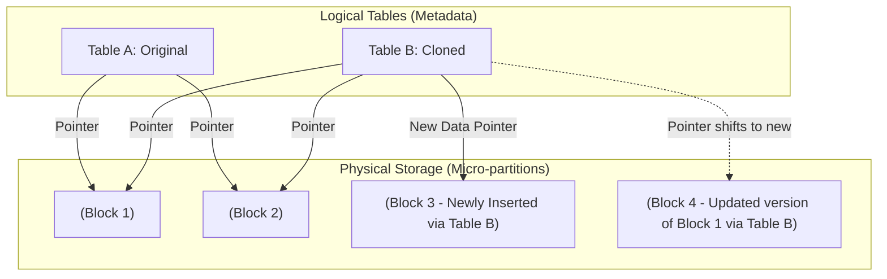

Hãy tưởng tượng bạn đang quản lý một kho dữ liệu (Data Warehouse) khổng lồ lên tới hàng trăm Terabytes trên môi trường Production. Đội ngũ Data Science cần một bản sao y hệt của toàn bộ dữ liệu này để thử nghiệm mô hình học máy mới. Đội ngũ Data Engineer cũng cần một bản sao tương tự để chạy thử nghiệm các pipeline dbt/SQL trước khi deploy bản cập nhật. 

Nếu dùng cách truyền thống, việc sao chép hàng trăm Terabytes dữ liệu sang một môi trường test (như Staging hay Dev) sẽ là một cơn ác mộng DevOps thực sự: bạn sẽ phải chờ đợi hàng giờ, thậm chí hàng ngày để đồng bộ dữ liệu, và hóa đơn lưu trữ (storage cost) của công ty sẽ lập tức tăng gấp đôi hoặc gấp ba. 

Đây chính là lý do **Zero-Copy Cloning** ra đời để làm thay đổi cuộc chơi.

---

## Zero-Copy Cloning là gì?

**Zero-Copy Cloning** (Nhân bản không sao chép) là một tính năng kiến trúc dữ liệu mang tính đột phá trên các Cloud Data Warehouse hiện đại (nổi bật nhất là Snowflake). Nó cho phép bạn tạo ra một bản sao hoàn chỉnh của cơ sở dữ liệu, schema hoặc chỉ một bảng duy nhất trong tích tắc (chỉ mất vài giây), bất kể dữ liệu đó lớn cỡ nào, mà không cần tạo ra bất kỳ bản sao vật lý nào của dữ liệu đó trên ổ đĩa. Do đó, bạn không tốn thêm bất kỳ chi phí lưu trữ ban đầu nào.

---

## Bản chất kiến trúc: Tại sao có thể nhân bản Petabytes dữ liệu trong 1 giây?

Trong các cơ sở dữ liệu truyền thống, khi bạn chạy câu lệnh `CREATE TABLE table_copy AS SELECT * FROM original_table`, hệ thống sẽ phải quét toàn bộ dữ liệu vật lý trên ổ đĩa, sau đó ghi một bản sao mới hoàn toàn xuống vị trí khác. Quá trình này ngốn rất nhiều tài nguyên tính toán (compute) và dung lượng ổ cứng.

Zero-Copy Cloning thay đổi hoàn toàn cách làm này bằng cách tách biệt giữa tầng tính toán (Compute) và tầng dữ liệu vật lý (Storage), đồng thời tận dụng tối đa sức mạnh của **siêu dữ liệu (Metadata)** và **hệ thống tệp tin bất biến (Immutable Filesystem)**.

* **Dữ liệu bất biến (Immutable)**: Trong các kho dữ liệu hiện đại như Snowflake, các tệp dữ liệu lưu trữ vật lý dưới đĩa (thường gọi là Micro-partitions) không bao giờ bị chỉnh sửa trực tiếp. Khi bạn cập nhật (`UPDATE`) hoặc xóa (`DELETE`) một dòng dữ liệu, hệ thống không sửa file cũ mà sẽ ghi một file mới chứa trạng thái đã thay đổi, sau đó cập nhật lại bản đồ siêu dữ liệu để trỏ đến file mới này.
* **Cơ chế Copy-on-Write (Sao chép khi ghi)**: Nhờ tính chất bất biến trên, bảng gốc và bảng nhân bản (clone) hoàn toàn có thể dùng chung một tập hợp các file dữ liệu vật lý mà không sợ bên nào ghi đè làm hỏng dữ liệu của bên kia. Khi bạn tạo một bản clone, hệ thống chỉ sao chép các con trỏ (pointers) trong cấu trúc cây siêu dữ liệu để trỏ về cùng các khối dữ liệu vật lý hiện có. Vì vậy, thao tác clone thực chất chỉ là một thao tác siêu dữ liệu (metadata operation) cực kỳ nhẹ nhàng và diễn ra trong tích tắc.

Chỉ khi bạn bắt đầu thực hiện các thao tác ghi dữ liệu (UPDATE, DELETE, INSERT) trên bảng clone, hệ thống mới bắt đầu sinh ra các file dữ liệu vật lý mới riêng biệt cho bảng clone đó. Bạn chỉ phải trả tiền cho phần dữ liệu khác biệt (diverged data) này.

---

## Trực quan hóa cơ chế chia sẻ con trỏ vật lý

Sơ đồ dưới đây mô tả cách hai bảng logic chia sẻ chung các file vật lý và phân tách khi bảng clone (Table B) bắt đầu có sự thay đổi dữ liệu:



---

## Tình huống thực tế: Cứu cảnh cho đội phân tích dữ liệu

Giả sử công ty bạn sở hữu bảng `PROD_DB.SALES.ORDERS` chứa lịch sử đơn hàng khổng lồ lên tới 50 Terabytes. Một bạn Data Analyst mới gia nhập đội ngũ và cần chạy thử một số câu lệnh cập nhật dữ liệu rất phức tạp để làm sạch dữ liệu. Rõ ràng, việc cấp quyền chỉnh sửa trực tiếp trên Production cho người mới là quá mạo hiểm.

Với Zero-Copy Cloning, Trưởng nhóm dữ liệu chỉ cần thực thi một câu lệnh SQL duy nhất:

```sql
CREATE DATABASE SANDBOX_DB CLONE PROD_DB;
GRANT ALL ON DATABASE SANDBOX_DB TO ROLE junior_analyst;
```

Chỉ sau đúng 1 giây, một database độc lập mang tên `SANDBOX_DB` đã sẵn sàng với toàn bộ dữ liệu thật. Bạn Analyst kia có thể thoải mái chạy các lệnh sửa, xóa hay thậm chí xóa sạch bảng (`DROP TABLE`) mà không sợ gây ảnh hưởng đến hệ thống Production đang chạy. Về mặt tài chính, công ty cũng không phải trả thêm một xu chi phí lưu trữ nào cho thao tác nhân bản này cho đến khi dữ liệu trên `SANDBOX_DB` thực sự có biến động.

---

## Kinh nghiệm vàng khi sử dụng trong thực tế

* **Blue/Green Deployment trong quy trình CI/CD**: Hãy tận dụng tính năng này để xây dựng quy trình CI/CD dữ liệu chuẩn mực. Trước khi triển khai một bản cập nhật pipeline lớn hoặc thực hiện di chuyển dữ liệu (Data Migration), hãy clone môi trường Production ra một bản Staging/Test. Hãy chạy thử nghiệm và kiểm chứng chất lượng code trên bản clone đó; nếu mọi thứ hoạt động hoàn hảo, bạn mới tiến hành deploy chính thức trên môi trường Production thật.
* **Đóng băng báo cáo tài chính (Month-End Close Snapshots)**: Trong kế toán và tài chính, số liệu của kỳ báo cáo cũ không được phép thay đổi khi thời gian trôi qua. Bạn có thể tận dụng Zero-Copy Cloning để chụp lại một "Snapshot" tĩnh của Database vào đúng thời khắc chốt sổ (ví dụ: 0h ngày 30 hàng tháng). Đội ngũ tài chính có thể yên tâm làm việc trên bản clone tĩnh này, trong khi các hệ thống vận hành vẫn tiếp tục ghi nhận dữ liệu mới vào cơ sở dữ liệu chính.

---

## Những sai lầm dễ khiến hóa đơn điện toán đám mây tăng vọt

* **Bỏ quên các bản Clone Sandbox**: Mặc dù thao tác clone ban đầu là miễn phí, nhưng theo thời gian, khi dữ liệu trên bảng gốc (Production) có biến động (xóa dữ liệu cũ hoặc nạp thêm dữ liệu mới), các tệp dữ liệu cũ lẽ ra sẽ được tự động xóa hoàn toàn khỏi ổ cứng để tiết kiệm chi phí lưu trữ. Tuy nhiên, nếu bản clone của bạn vẫn tiếp tục tồn tại và trỏ (níu giữ) vào các tệp dữ liệu cũ đó, nhà cung cấp dịch vụ Cloud vẫn tính phí lưu trữ cho các tệp này. Do đó, hãy luôn có quy trình tự động dọn dẹp (Drop) các database Sandbox sau khi kết thúc dự án.
* **Hiểu lầm về phân quyền (Privileges)**: Khi bạn clone một Database, quyền hạn truy cập của người dùng (Grants) trên Database cũ sẽ không tự động được clone sang. Database mới sinh ra sẽ thuộc sở hữu của người thực thi lệnh clone. Bạn cần phải chủ động cấu hình lại quyền truy cập cho những người dùng liên quan.

---

## Ưu và nhược điểm: Có thực sự toàn màu hồng?

### Điểm mạnh
* **Tốc độ vượt trội**: Tạo lập các môi trường thử nghiệm với dữ liệu quy mô lớn ngay lập tức, giải phóng hoàn toàn ách tắc DevOps cho đội ngũ kỹ sư.
* **Tối ưu chi phí tối đa**: Tránh lãng phí dung lượng lưu trữ vật lý khi duy trì nhiều môi trường phát triển (Dev, Staging, QA) song song.

### Điểm yếu
* **Khó khăn trong việc kiểm soát dòng đời lưu trữ**: Hệ thống tính cước sẽ trở nên phức tạp hơn. Bạn sẽ khó nhận biết ngay được chi phí lưu trữ tăng thêm trong tháng là do sự gia tăng dữ liệu thật trên Production hay do có một bản clone cũ đang giữ lại các tệp rác chưa được giải phóng.

---

## Khi nào nên sử dụng (và khi nào không cần)?

* **Nên dùng**: Khi bạn làm việc trên các nền tảng Data Warehouse đám mây có hỗ trợ cơ chế này (Snowflake, BigQuery Table Clones, Delta Lake Shallow Clones) để phục vụ cho các môi trường Test/Dev, chạy CI/CD hoặc cấp môi trường Sandbox độc lập cho đội ngũ Data Science.
* **Không cần thiết**: Khi bạn chỉ muốn sao chép các bảng cấu hình nhỏ (khoảng vài trăm dòng). Việc thực hiện câu lệnh sao chép truyền thống `CREATE TABLE AS` hay `Clone` trong trường hợp này không mang lại sự khác biệt đáng kể nào về mặt chi phí hay hiệu suất.

---

## Các khái niệm liên quan

* [Modern Data Stack](/concepts/system-architecture/modern-data-stack/)
* [Cost Optimization](/concepts/cloud-data-platform/cost-optimization/)
* [Data Warehouse](/concepts/data-warehouse/data-warehouse/)

---

## Góc phỏng vấn: Những câu hỏi thường gặp

### 1. Tại sao thao tác Zero-Copy Cloning lại có thể thực hiện tức thời trên dữ liệu có quy mô Petabyte? Cơ chế vật lý đằng sau nó là gì?
* **Gợi ý trả lời**: 
  Bí quyết nằm ở kiến trúc tách rời giữa Compute (Tính toán) và Storage (Lưu trữ) của các Data Warehouse đám mây hiện đại. 
  Các file dữ liệu vật lý (Micro-partitions) lưu ở tầng lưu trữ là bất biến (immutable). Bảng logic mà người dùng nhìn thấy thực chất chỉ là một cây cấu trúc siêu dữ liệu (metadata) chứa các con trỏ trỏ đến các file vật lý đó. 
  Khi ta chạy lệnh Clone, hệ thống chỉ nhân bản cấu trúc cây con trỏ siêu dữ liệu này (dung lượng chỉ vài Kilobytes) mà không hề thực hiện thao tác đọc hay ghi lại dữ liệu vật lý trên ổ cứng. Do đó, tiến trình này chỉ diễn ra trong vòng 1-2 giây bất kể kích thước bảng.

### 2. Có thực sự Zero-Copy Cloning là "Miễn phí" hoàn toàn không? Khi nào nó bắt đầu làm phát sinh chi phí?
* **Gợi ý trả lời**: 
  Thao tác clone chỉ miễn phí tại thời điểm khởi tạo ban đầu do chưa có sự nhân đôi dữ liệu vật lý. Hóa đơn lưu trữ (Storage cost) sẽ bắt đầu phát sinh trong hai trường hợp:
  * **Trường hợp 1**: Khi bạn thực hiện các thao tác thay đổi dữ liệu (INSERT, UPDATE, DELETE) trên bảng clone. Nhờ cơ chế Copy-on-Write, hệ thống sẽ ghi các file vật lý mới dành riêng cho bảng clone này và bạn sẽ phải trả phí cho phần dung lượng mới sinh ra đó.
  * **Trường hợp 2**: Khi bảng gốc thực hiện xóa dữ liệu cũ. Nếu không có bản clone, các file chứa dữ liệu cũ đó sẽ được hệ thống giải phóng khỏi ổ đĩa để tiết kiệm tiền. Nhưng vì bản clone vẫn đang giữ con trỏ trỏ đến chúng, hệ thống buộc phải duy trì lưu trữ các file này, khiến bạn vẫn phải tiếp tục chi trả phí lưu trữ cho chúng.

---

## Tài liệu tham khảo

1. **Snowflake Documentation** - Understanding Cloning (Zero-Copy).
2. **Google Cloud BigQuery Documentation** - Table Clones (Tính năng tương tự của BigQuery).

---

## English Summary

Zero-Copy Cloning is an advanced feature in modern Cloud Data Warehouses (like Snowflake) that enables instantaneous replication of databases or tables regardless of their size, without duplicating the underlying physical data. By copying only the metadata pointers and relying on an immutable, copy-on-write storage architecture, it provides exact replicas for testing, CI/CD, and data science sandboxing with zero initial storage cost. Extra storage costs are only incurred subsequently as the original and cloned tables diverge through isolated updates or data modifications.
