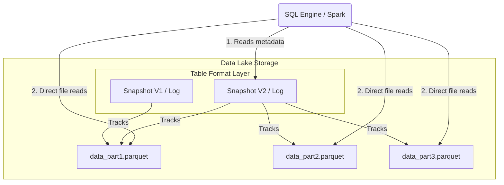

# Table Format

## Summary

Table Format (Định dạng bảng) là một lớp trừu tượng hóa (abstraction layer) giúp tổ chức các tệp tin lưu trữ dữ liệu khổng lồ trong Data Lake (như S3, GCS) thành một bảng logic duy nhất có thể truy vấn bằng SQL. Nó là xương sống của kiến trúc Data Lakehouse, mang lại các tính năng như giao dịch ACID, schema evolution (tiến hóa cấu trúc), và time travel (du hành thời gian), giúp Data Lake hoạt động tin cậy và mạnh mẽ như một Data Warehouse truyền thống.

---

## Definition

**Table Format** là một tập hợp các quy tắc, siêu dữ liệu (metadata) và tệp kê khai (manifests) xác định cách nhiều tệp dữ liệu vật lý (như Parquet, ORC, Avro) được gộp lại, quản lý và trình bày dưới dạng một bảng duy nhất (như trong cơ sở dữ liệu quan hệ) cho các engine tính toán (như Spark, Trino, Flink). 

Cần phân biệt rõ:
* **File Format (Định dạng tệp)**: Chịu trách nhiệm về cấu trúc lưu trữ của dữ liệu thô bên trong một tệp duy nhất (ví dụ: Parquet lưu trữ dữ liệu theo cột, Avro lưu theo dòng).
* **Table Format (Định dạng bảng)**: Chịu trách nhiệm theo dõi tập hợp của hàng ngàn/hàng triệu tệp tin đó, đảm bảo tính nhất quán (ACID), cho biết tệp nào thuộc phiên bản (version) nào của bảng và tệp nào chứa dữ liệu mới nhất.

---

## Why it exists

Ban đầu, Data Lake sử dụng **Apache Hive** như một giải pháp mặc định để quản lý bảng. Hive thực chất chỉ lấy một thư mục (directory) trên Hadoop/S3 và coi mọi file trong thư mục đó là dữ liệu của bảng. Điều này dẫn đến các vấn đề nghiêm trọng khi quy mô tăng cao:
1. **Mất an toàn dữ liệu (Thiếu ACID)**: Nếu hai tác vụ cùng ghi vào thư mục cùng một lúc, dữ liệu sẽ bị hỏng hoặc người đọc sẽ đọc được những phần dữ liệu đang ghi dang dở (dirty reads).
2. **Hiệu suất cực thấp khi quét thư mục**: Việc liệt kê hàng trăm ngàn tệp tin trong bucket S3 (File listing) mất quá nhiều thời gian, làm chậm cả hệ thống trước khi bắt đầu đọc dữ liệu.
3. **Không hỗ trợ thay đổi cấu trúc linh hoạt**: Việc đổi tên cột hoặc đổi kiểu dữ liệu đòi hỏi phải viết lại toàn bộ dữ liệu hoặc gây ra các lỗi không tương thích.

Table Format hiện đại (như Delta Lake, Apache Iceberg, Apache Hudi) ra đời để thay thế phương pháp tiếp cận dựa trên thư mục (directory-based) của Hive, bằng một cách tiếp cận dựa trên metadata (metadata-based).

---

## Core idea

Ý tưởng chính của một Table Format hiện đại là lưu trữ "dữ liệu về dữ liệu" (metadata) cực kỳ chi tiết, giúp engine tính toán biết chính xác cần đọc những tệp nào mà không phải hỏi hệ thống file (filesystem).

1. **Transactional Metadata**: Mọi thay đổi vào bảng tạo ra một "commit" mới (giống như Git). Dữ liệu này được lưu trong nhật ký giao dịch (transaction log) hoặc cây siêu dữ liệu (metadata tree). 
2. **Snapshot Isolation**: Ở mọi thời điểm, người đọc (reader) chỉ đọc dữ liệu ở một snapshot cụ thể (đã commit hoàn tất), không bị ảnh hưởng bởi những tác vụ ghi (writer) đang diễn ra.
3. **File-Level Statistics**: Table Format theo dõi khoảng giá trị (min/max) của từng cột trong từng tệp tin vật lý, nhờ đó có thể bỏ qua việc đọc các tệp không chứa dữ liệu thoả mãn điều kiện `WHERE` (gọi là Data Skipping).

---

## How it works

Dưới đây là cơ chế làm việc cơ bản (lấy cảm hứng từ Delta Lake hoặc Iceberg):
1. Khi có yêu cầu ghi mới vào bảng, engine sẽ ghi các file Parquet chứa dữ liệu mới vào hệ thống lưu trữ (chưa ai thấy).
2. Sau khi ghi thành công, engine sẽ tạo ra một tệp metadata (hoặc thêm bản ghi vào transaction log) ghi nhận rằng: "Đã có thêm 3 file Parquet này thuộc về version 5 của bảng". Bước này diễn ra bằng một Atomic Operation (hoặc thành công toàn bộ, hoặc không gì cả).
3. Khi người dùng query bảng, engine đọc tệp metadata trước. Tệp metadata nói rằng snapshot mới nhất là version 5. Engine lấy danh sách các file Parquet cần thiết từ version 5, lọc bỏ bớt file dựa trên thống kê (min/max), và chỉ đọc những file hợp lệ để trả về kết quả.

---

## Architecture / Flow



---

## Practical example

Mọi người thường làm việc với Table Format mà không nhận ra mình đang sử dụng nó. Khi bạn dùng Spark để ghi dữ liệu bằng định dạng `delta` hay `iceberg`:

```python
# Ví dụ sử dụng Delta Lake format
df.write.format("delta").save("s3://bucket/my_table/")

# Thực hiện cập nhật - điều không thể làm với format Parquet thông thường
from delta.tables import *
deltaTable = DeltaTable.forPath(spark, "s3://bucket/my_table/")
deltaTable.update(
  condition = "id = 5",
  set = { "status": "'shipped'" }
)
```

Ở ví dụ trên, Table Format lo việc tạo ra file Parquet mới cho dòng dữ liệu đã update, và đánh dấu (tombstone) file cũ là không còn hiệu lực trong Transaction Log.

---

## Best practices

* **Lựa chọn Big 3**: Hãy sử dụng một trong ba Table Formats phổ biến nhất hiện nay: **Apache Iceberg** (thiết kế thanh lịch, hỗ trợ nhiều engine tốt nhất), **Delta Lake** (tích hợp tuyệt vời với Spark và hệ sinh thái Databricks), hoặc **Apache Hudi** (mạnh mẽ về CDC và incremental processing).
* **Kết hợp với Catalog**: Sử dụng một Catalog System (như AWS Glue, Hive Metastore, hoặc Nessie) để lưu trữ con trỏ (pointer) đến metadata mới nhất của Table Format, giúp nhiều cụm tính toán có thể làm việc trên cùng một Data Lake dễ dàng.
* **Tối ưu hóa thường xuyên**: Metadata có thể trở nên khổng lồ nếu cập nhật quá nhiều. Hãy lên lịch dọn dẹp (Vacuum) và gom file (Compaction/Optimize) định kỳ.

---

## Common mistakes

* **Nhầm lẫn giữa File Format và Table Format**: Cố gắng truy vấn trực tiếp các file Parquet nằm bên dưới thư mục của Table Format bằng engine không hỗ trợ định dạng này (ví dụ đọc thư mục Hudi bằng Hive mà không có connector). Bạn sẽ nhận được kết quả sai (đọc cả dữ liệu đã bị xóa).
* **Lưu quá nhiều metadata**: Giữ lại toàn bộ lịch sử thay đổi (time travel) vĩnh viễn, dẫn đến việc chi phí lưu trữ tăng vọt và làm chậm quá trình khởi tạo bảng.

---

## Trade-offs

### Ưu điểm
* Giải quyết triệt để các hạn chế của Hive (cung cấp ACID, Upserts, Schema Evolution).
* Tăng tốc độ truy vấn trên Object Storage lên gấp nhiều lần nhờ Metadata Pruning.
* Xóa nhòa ranh giới giữa Data Warehouse và Data Lake (định hình nền tảng Lakehouse).

### Nhược điểm
* **Vendor Lock-in mềm**: Một khi dữ liệu đã được lưu bằng Delta Lake, việc chuyển đổi toàn bộ sang Iceberg cần công cụ chuyển đổi hoặc viết lại metadata. Tuy nhiên, các định dạng hiện nay (như Apache XTable / OneTable) đang nỗ lực giải quyết vấn đề này.
* **Overhead**: Ghi dữ liệu kèm theo việc cập nhật metadata làm giảm nhẹ tốc độ ghi so với việc ghi file thô (raw writes).

---

## When to use

* Bất kỳ khi nào xây dựng một Data Lake hoặc Data Lakehouse hiện đại.
* Khi có nhiều công cụ tính toán khác nhau (Spark, Trino, Flink) cần đọc và ghi trên cùng một tập dữ liệu.
* Khi hệ thống yêu cầu độ tin cậy của dữ liệu cao (ACID) trên kho lưu trữ Object Storage giá rẻ.

## When not to use

* Với các luồng dữ liệu chỉ ghi một lần (write-once), truy vấn một lần và sau đó vứt bỏ hoặc lưu trữ tạm thời, dùng raw Parquet/CSV có thể tiết kiệm một chút hiệu năng.
* Hệ thống RDBMS truyền thống với dữ liệu nhỏ, vì chúng đã có cơ chế quản lý bảng vật lý cục bộ tuyệt vời.

---

## Related concepts

* Data Lakehouse
* [Apache Iceberg](/concepts/apache-iceberg)
* [Delta Lake](/concepts/delta-lake)
* [Apache Hudi](/concepts/apache-hudi)
* [ACID Transactions](/concepts/acid-transactions-on-lake)

---

## Interview questions

### 1. Phân biệt File Format và Table Format trong Data Lake. Lấy ví dụ minh họa.
* **Người phỏng vấn muốn kiểm tra**: Hiểu biết nền tảng về tổ chức lưu trữ trên Data Lake.
* **Gợi ý trả lời (Strong Answer)**: 
  File Format (như Parquet, ORC) định nghĩa cách cấu trúc các byte dữ liệu trong một tệp (tổ chức theo dòng hay theo cột, cách nén ra sao). Table Format (như Delta, Iceberg) là lớp siêu dữ liệu bên trên, có nhiệm vụ "gom" một nhóm các tệp tin này lại thành một bảng logic. Table Format cho biết những tệp nào tạo nên phiên bản hiện tại của bảng, hỗ trợ ACID và lược đồ bảng. Ví dụ: Delta Lake là Table Format, còn dưới nền, nó sử dụng định dạng Parquet làm File Format.

### 2. Table Format giải quyết bài toán "Small Files Problem" như thế nào?
* **Người phỏng vấn muốn kiểm tra**: Khả năng tối ưu hóa Data Lake.
* **Gợi ý trả lời (Strong Answer)**:
  Với cách tiếp cận thư mục truyền thống của Hive, việc có hàng ngàn file nhỏ khiến tác vụ liệt kê file (listing) và mở file (opening) làm hệ thống nghẽn cổ chai. Table Format giải quyết bài toán này qua hai bước:
  1) Nhờ có metadata ghi rõ đường dẫn từng file, engine bỏ qua được bước listing nặng nề.
  2) Các Table Format đều cung cấp tính năng COMPACT hoặc OPTIMIZE, một tác vụ chạy nền lấy hàng ngàn file Parquet nhỏ, gộp chúng lại thành các file Parquet lớn (~128MB-1GB) trong background, và chỉ việc cập nhật siêu dữ liệu để trỏ sang file mới.

---

## References

1. **"Data Engineering with Apache Spark, Delta Lake, and Lakehouse"** - Phân tích kiến trúc Lakehouse.
2. **Apache Iceberg Architecture** (iceberg.apache.org/spec) - Đặc tả kỹ thuật về metadata tree.
3. **Delta Lake: High-Performance ACID Table Storage over Cloud Object Stores** - Bài báo nghiên cứu khoa học của Databricks.

---

## English summary

A Table Format is an abstraction layer that brings relational database functionalities—such as ACID transactions, schema evolution, and time travel—to massive datasets residing in data lakes (like S3 or GCS). Unlike file formats (e.g., Parquet, Avro) that define physical data encoding, a table format (e.g., Apache Iceberg, Delta Lake, Apache Hudi) uses metadata to track which data files comprise a given snapshot of a table. This approach eliminates inefficient file listing operations, ensures data consistency during concurrent read/write operations, and serves as the foundational architecture for the modern Data Lakehouse paradigm.
