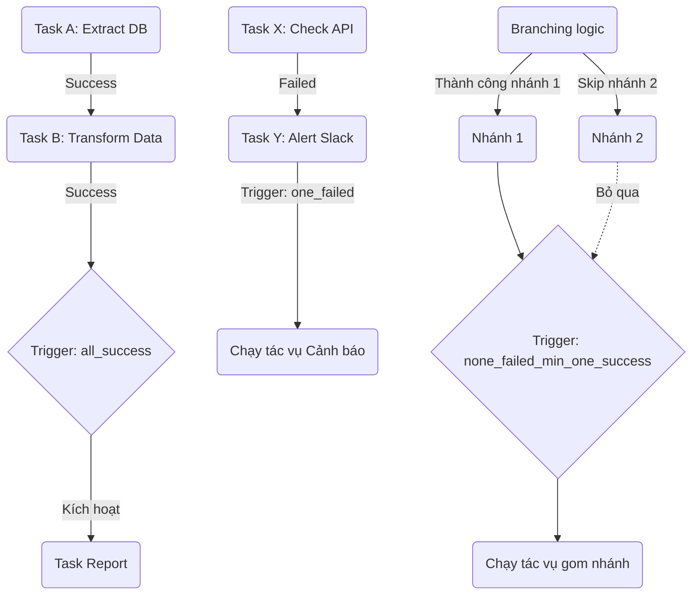

# Task Dependency - Quản lý sự phụ thuộc tác vụ

## Summary

Trong kiến trúc điều phối dữ liệu (Data Orchestration) dựa trên mô hình DAG, **Task Dependency** (Sự phụ thuộc tác vụ) là cơ chế cốt lõi để thiết lập trình tự thực thi (Control Flow). Nó định nghĩa rõ ràng: Tác vụ A phải kết thúc với trạng thái nào thì Tác vụ B mới được phép bắt đầu. Quản lý phụ thuộc tốt không chỉ đảm bảo luồng nghiệp vụ chạy đúng thứ tự, ngăn chặn thảm họa sử dụng dữ liệu rác, mà còn cho phép áp dụng các chiến lược phục hồi lỗi phức tạp bằng các quy tắc kích hoạt (Trigger Rules) nâng cao.

---

## Definition

**Task Dependency** là mối liên kết có hướng giữa hai tác vụ (Nodes) trong một DAG. 
Thuật ngữ chuyên ngành chia làm 2 vai trò:
* **Upstream Task (Tác vụ thượng nguồn / Tác vụ cha)**: Là tác vụ đứng trước, cần phải được thực thi và hoàn tất trước.
* **Downstream Task (Tác vụ hạ nguồn / Tác vụ con)**: Là tác vụ đứng sau, bị khóa và phải chờ đợi kết quả từ Upstream.

Sự phụ thuộc này tạo ra "Cạnh có hướng" (Mũi tên) trong Đồ thị DAG.

---

## Why it exists

Thử hình dung một đường ống dữ liệu (Pipeline) tính toán doanh thu báo cáo cho Ban Giám Đốc cuối ngày:
* Task 1: Tải dữ liệu giao dịch từ API ngân hàng.
* Task 2: Chạy lệnh SQL tính tổng doanh thu.

Nếu không có Task Dependency, công cụ sẽ chạy song song cả 2 tác vụ. Task 2 chạy xong ngay lập tức nhưng ra kết quả là 0 đồng (vì Task 1 chưa tải dữ liệu về kịp). Báo cáo 0 đồng được gửi cho sếp và công ty hoảng loạn.

Task Dependency tồn tại như một "khóa gác cổng". Nó đảm bảo rằng dữ liệu phải được chuẩn bị sẵn sàng và đúng đắn ở bước trước, trước khi bước sau (các phép tính toán tốn kém hoặc báo cáo người dùng) được phép tiêu thụ nó. Nếu bước trước thất bại, bước sau sẽ bị hủy bỏ (Skipped) để bảo vệ tính toàn vẹn.

---

## Core idea

Ý tưởng cốt lõi của Task Dependency không chỉ dừng lại ở quy luật cơ bản: *"A thành công thì B mới chạy"*. Nó mở rộng thành khái niệm **Trigger Rules (Quy tắc kích hoạt)**.

Trigger Rules cho phép lập trình viên định nghĩa các điều kiện rẽ nhánh (Control Flow Logic) phức tạp tại các giao điểm. Một tác vụ Downstream đánh giá trạng thái của TẤT CẢ các tác vụ Upstream của nó để quyết định có chạy hay không. 
Ví dụ:
* Mặc định: Chờ tất cả Upstream báo "Thành công" thì chạy.
* Rẽ nhánh lỗi: Nếu có bất kỳ Upstream nào báo "Thất bại", hãy chạy tôi (để tôi gửi thông báo lỗi lên Slack).
* Bỏ qua lỗi: Dù Upstream có thất bại hay thành công, cứ chạy tôi đi (Clean up data).

---

## How it works (Theo cơ chế Airflow)

1. **Định nghĩa**: Kỹ sư dùng code (Toán tử `>>` trong Airflow) để khai báo A là Upstream của B.
2. **Khởi chạy**: Scheduler đánh giá trạng thái của B. Vì B có phụ thuộc vào A, trạng thái của B bị đánh dấu là `None` (chưa sẵn sàng).
3. **Thay đổi trạng thái**: Khi A chạy xong, nó gửi cờ trạng thái (Success / Failed / Skipped) vào Database.
4. **Kiểm tra Trigger Rule**: Trình Scheduler vòng lại kiểm tra B. Nó áp dụng quy tắc kích hoạt của B (Mặc định là `all_success`) lên kết quả của A.
5. **Ra quyết định**: 
   * Nếu A = Success $\rightarrow$ Quy tắc `all_success` thỏa mãn $\rightarrow$ B chuyển trạng thái thành `Scheduled` và được đẩy đi chạy.
   * Nếu A = Failed $\rightarrow$ Quy tắc `all_success` bị phá vỡ $\rightarrow$ B chuyển trạng thái thành `Upstream_Failed` và dừng lại hoàn toàn.

---

## Architecture / Flow (Trigger Rules)

Biểu đồ sau mô phỏng luồng kiểm soát phụ thuộc với các Trigger Rules khác nhau:



---

## Practical example

Trong Apache Airflow, cách phổ biến nhất để viết Task Dependency là sử dụng **Bitwise shift operators (`>>` và `<<`)**:

```python
from airflow import DAG
from airflow.operators.empty import EmptyOperator
from airflow.utils.trigger_rule import TriggerRule

with DAG(...) as dag:
    t1 = EmptyOperator(task_id='extract')
    t2 = EmptyOperator(task_id='transform')
    t3 = EmptyOperator(task_id='load')
    
    t_alert = EmptyOperator(
        task_id='alert_error',
        trigger_rule=TriggerRule.ONE_FAILED # Chỉ chạy nếu có ít nhất 1 Upstream bị lỗi
    )
    
    t_cleanup = EmptyOperator(
        task_id='cleanup_temp_files',
        trigger_rule=TriggerRule.ALL_DONE  # Chạy bất chấp Upstream thành công hay thất bại
    )

    # 1. Linear Dependency (Tuyến tính)
    t1 >> t2 >> t3
    
    # 2. Rẽ nhánh báo lỗi (Fan-out)
    [t1, t2, t3] >> t_alert  
    # Nếu bất kỳ t1, t2, t3 nào lỗi, t_alert sẽ chạy.
    
    # 3. Gom nhánh dọn dẹp (Fan-in)
    [t3, t_alert] >> t_cleanup
    # t_cleanup đứng cuối cùng gác cổng, chờ mọi thứ kết thúc (xong hoặc lỗi) để xóa file tạm
```
*(Trong các công cụ khác như dbt, dependency được ngầm định tự động qua hàm `{{ ref() }}`)*.

---

## Best practices

* **Giữ dependency đơn giản (KISS)**: Cố gắng duy trì thiết kế tuyến tính (Linear) hoặc Cây đơn giản. Nếu bạn dùng mảng lồng nhau chi chít `[A, B] >> C >> [D, E]` kết hợp nhiều Trigger Rules, khi có một lỗi nhỏ xảy ra ở giữa, việc xác định luồng dữ liệu tiếp theo sẽ chạy thế nào là cực kỳ mệt mỏi.
* **Sử dụng EmptyOperator làm điểm hội tụ (Dummy node)**: Nếu bạn có 5 tasks song song cần hội tụ vào 5 tasks song song khác (Mô hình lưới 5x5 sẽ tạo ra 25 cạnh mũi tên), giao diện sẽ biến thành mớ bòng bong. Hãy tạo một `EmptyOperator` (hoặc DummyOperator) ở giữa làm "trạm trung chuyển": `[T1..T5] >> Dummy >> [T6..T10]`. Nó giảm số lượng kết nối xuống còn 10 cạnh.
* **Dùng Setup/Teardown logic thay vì All_Done**: Ở các phiên bản Airflow mới, sử dụng khái niệm Setup/Teardown tasks giúp hệ thống quản lý việc dọn dẹp rác (Temp files, drop cluster) tự động và báo cáo trạng thái đúng chuẩn hơn là dùng trigger rule `all_done` thô sơ.

---

## Common mistakes

* **Quên thiết lập phụ thuộc**: Tạo 2 Task trong code nhưng quên viết dòng `A >> B`. Hậu quả: Hệ thống chạy song song 2 task cùng lúc phá hỏng logic dữ liệu.
* **Rẽ nhánh và Gom nhánh sai (Branching Trap)**: Airflow có toán tử `BranchPythonOperator` để rẽ nhánh (Nếu là cuối tuần rẽ hướng A, ngày thường rẽ hướng B). Nhánh không được chọn sẽ mang trạng thái `Skipped`. Nếu bạn nối cả A và B vào một Task C ở cuối bằng luật mặc định (`all_success`), Task C sẽ **không bao giờ chạy** vì nó đòi hỏi cả A và B đều báo Success, trong khi thực tế 1 nhánh đã bị Skipped. (Cách sửa: Task C phải dùng Trigger Rule `none_failed_min_one_success`).

---

## Trade-offs

### Cơ chế mặc định (all_success)
* **Ưu điểm**: An toàn tuyệt đối. Luôn chặn đứng thảm họa dữ liệu nếu luồng trên bị đứt.
* **Nhược điểm**: Có tính hiệu ứng domino (Cascading failure). Một task nhỏ xíu (như gửi email) ở đầu luồng bị lỗi mạng sẽ làm hệ thống đánh rớt hàng chục task xử lý lớn quan trọng ở phía dưới. (Cách xử lý: Chuyển task gửi email xuống cuối cùng nhánh phụ).

### Các Trigger Rule phức tạp (all_done, one_failed)
* **Ưu điểm**: Linh hoạt cao, cho phép thiết kế mô hình Exception Handling (bắt lỗi) tinh vi ngay trong Data Pipeline.
* **Nhược điểm**: Khó đọc code. Trạng thái cuối cùng của DAG (DAG Run State) bị ảnh hưởng. Ví dụ: Task lỗi, kích hoạt Task báo lỗi Slack thành công. Do task cuối (Slack) thành công, toàn bộ DAG hiển thị màu Xanh lá (Success), làm lừa mắt kỹ sư trực ca. Cần phải có kỹ năng cấu hình để đánh dấu failed chính xác.

---

## When to use

* Bất cứ khi nào tác vụ sau sử dụng dữ liệu đầu ra, hay dựa vào tác động hạ tầng của tác vụ trước (Ví dụ: Chờ EMR Cluster bật lên xong thì mới Submit job).
* Thiết lập Trigger Rules khi cần dọn dẹp tài nguyên Cloud (Tắt cụm máy chủ ảo) ngay cả khi tác vụ tính toán bị lỗi.

## When not to use

* Với các tác vụ thực thi định kỳ không liên quan đến nhau. Ví dụ: Tải tỷ giá ngoại tệ và Tải thời tiết. Đừng móc chúng vào nhau `A >> B` chỉ để code gọn lại. Hãy tách chúng ra để nếu Tỷ giá lỗi, nó không chặn (block) việc Tải thời tiết.

---

## Related concepts

* [Directed Acyclic Graph (DAG)](/concepts/dag)
* [Apache Airflow](/concepts/apache-airflow)
* [Sensors](/concepts/sensors)

---

## Interview questions

### 1. Ý nghĩa của "Upstream" và "Downstream" trong Task Dependency là gì?
* **Người phỏng vấn muốn kiểm tra**: Nắm vững thuật ngữ giao tiếp chuyên ngành.
* **Gợi ý trả lời (Strong Answer)**: Đây là khái niệm luồng (Flow). Upstream (Thượng nguồn) là các tác vụ cha nằm trước mũi tên, sản xuất ra kết quả hoặc làm điều kiện tiên quyết. Downstream (Hạ nguồn) là các tác vụ con nằm ở đầu nhọn mũi tên, tiêu thụ dữ liệu và bị phụ thuộc vào Upstream. Một tác vụ bị lỗi ở Upstream sẽ gây ra một chuỗi "Upstream_Failed" kéo theo các Downstream bị hủy bỏ để bảo vệ an toàn hệ thống.

### 2. Trong Airflow, Trigger Rule `all_success` (mặc định) hoạt động như thế nào?
* **Người phỏng vấn muốn kiểm tra**: Hiểu biết cơ chế mặc định của Orchestrator.
* **Gợi ý trả lời (Strong Answer)**: Cờ `all_success` yêu cầu TẤT CẢ các tác vụ Upstream trực tiếp của tác vụ hiện tại phải hoàn thành với trạng thái 'Success'. Nếu có bất kỳ Upstream nào bị 'Failed' (thất bại) hoặc 'Skipped' (bỏ qua do rẽ nhánh), tác vụ hiện tại sẽ không được kích hoạt và tự động chuyển sang trạng thái 'Upstream_Failed' (hiển thị màu cam trên UI Airflow).

### 3. Bạn có một DAG rẽ nhánh thành Nhánh A và Nhánh B. Cuối cùng cả A và B hội tụ về Task C. Task C không chạy khi nhánh A bị skip. Lỗi ở đâu?
* **Người phỏng vấn muốn kiểm tra**: Kinh nghiệm giải quyết bug (Troubleshooting) kinh điển của Branching.
* **Gợi ý trả lời (Strong Answer)**: Lỗi nằm ở Trigger Rule mặc định của Task C là `all_success`. Khi rẽ nhánh, Nhánh A bị skip, sinh ra trạng thái Skipped truyền xuống C. Vì `all_success` đòi cả A và B phải Success, việc có một nhánh Skipped làm vỡ quy tắc này, nên C tự động bị Skipped theo. Để sửa, ta phải cấu hình Trigger Rule của Task C thành `none_failed_min_one_success` (Không có ai lỗi, và có ít nhất 1 người thành công).

### 4. Hãy giải thích tại sao sử dụng "Dummy node" (EmptyOperator) lại là best practice khi ánh xạ nhiều task song song?
* **Người phỏng vấn muốn kiểm tra**: Tư duy tối ưu hóa kiến trúc (Optimization & Clean architecture).
* **Gợi ý trả lời (Strong Answer)**: Nếu bạn có 10 Tasks Extract kết nối thẳng tới 10 Tasks Transform dưới dạng All-to-All. Engine phải tính toán $10 \times 10 = 100$ dependency edges (cạnh). Điều này làm rối loạn giao diện UI (thành lưới nhện) và tốn tài nguyên bộ đệm bộ định tuyến (Scheduler DB Overhead). Chèn một Dummy Node ở giữa (10 Extract $\rightarrow$ Dummy $\rightarrow$ 10 Transform) sẽ giảm số cạnh xuống còn $10 + 10 = 20$. Giúp UI cực kỳ gọn gàng, chia hệ thống thành các Checkpoint rõ rệt, dễ theo dõi lỗi cụm hơn.

### 5. Trigger Rule `all_done` thường được ứng dụng trong trường hợp thực tế nào nhất?
* **Người phỏng vấn muốn kiểm tra**: Ứng dụng lý thuyết vào Use case thực tiễn.
* **Gợi ý trả lời (Strong Answer)**: Ứng dụng phổ biến nhất là dọn dẹp tài nguyên (Resource Teardown / Clean up). Ví dụ, tác vụ đầu tiên khởi tạo cụm Spark EMR tốn rất nhiều tiền, ở giữa là tác vụ tính toán. Dù tác vụ tính toán ở giữa thành công hay văng lỗi Exception (Failed), ta cũng PHẢI tắt cụm Spark đi để không bị Cloud provider trừ tiền oan. Tác vụ "Tắt cụm" sẽ được gán `all_done`, đảm bảo nó luôn được chạy như một mệnh đề `finally` trong khối `try-catch` của lập trình thông thường.

---

## References

1. **Apache Airflow Documentation** - Control Flow & Trigger Rules.
2. **Data Pipelines with Apache Airflow** - Bas P. Harenslak.

---

## English summary

In DAG-based data orchestration, **Task Dependency** defines the explicit execution order of operations by establishing parent-child (upstream-downstream) relationships. This control flow mechanism ensures that tasks only fire when their prerequisites are met, safeguarding systems against data corruption resulting from out-of-order execution. Furthermore, orchestrators like Airflow enhance this concept via **Trigger Rules**, which dictate exactly how a downstream task evaluates the statuses of its upstream parents (e.g., waiting for all to succeed, triggering only if one fails for alerting, or running unconditionally for resource teardown), thus enabling sophisticated error handling and branching logic within the pipeline.
