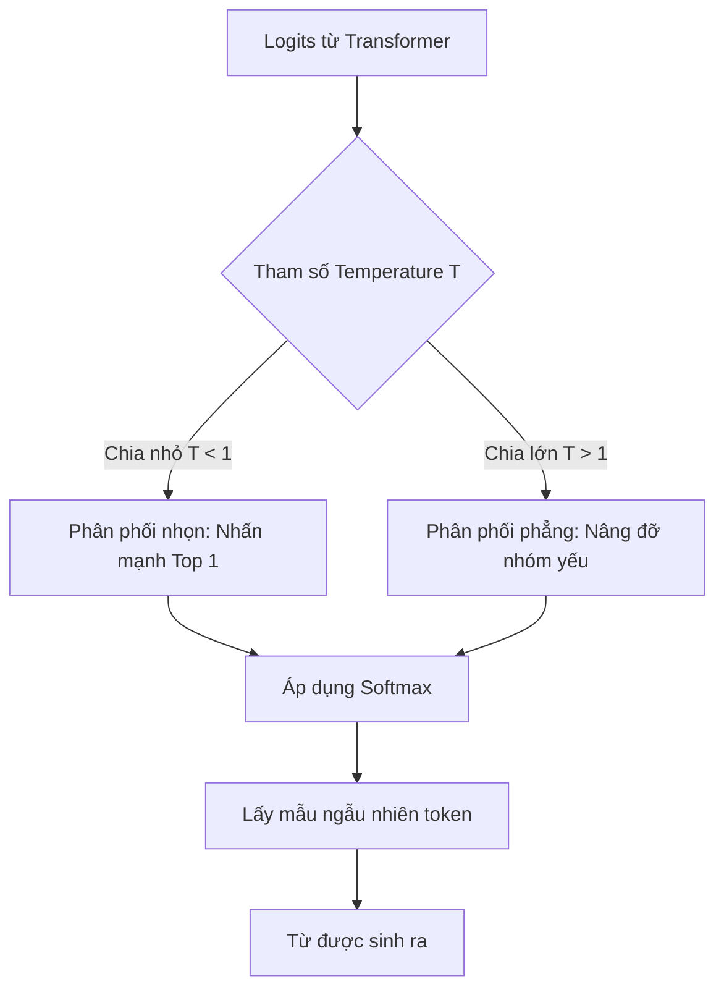

# Nhiệt độ - Temperature

## Summary

Nhiệt độ (Temperature) là một tham số quan trọng trong các Mô hình Ngôn ngữ Lớn (LLM) dùng để điều khiển mức độ ngẫu nhiên và sáng tạo của đoạn văn bản được sinh ra. Bằng cách điều chỉnh hàm toán học trước khi lấy mẫu từ vựng, Temperature xác định xem mô hình sẽ luôn chọn từ an toàn, dễ đoán nhất (Temperature thấp) hay dám chọn những từ ngữ mạo hiểm, độc đáo hơn (Temperature cao).

---

## Definition

Về mặt toán học, **Temperature** ($T$) là một hằng số được chia trực tiếp vào các giá trị đầu ra thô (logits) của lớp mạng nơ-ron cuối cùng trước khi chúng đi qua hàm Softmax để biến thành xác suất phân bố từ vựng. 
* $T = 0$: Mô hình hoàn toàn tất định (Deterministic), luôn chọn từ có xác suất cao nhất.
* $0 < T < 1$: Làm cho phân phối xác suất trở nên "nhọn" hơn. Các từ có khả năng cao sẽ càng cao hơn, các từ thấp sẽ càng thấp đi.
* $T > 1$: Làm cho phân phối xác suất trở nên "phẳng" hơn. Thu hẹp khoảng cách giữa các từ, tạo cơ hội cho các từ hiếm xuất hiện.

---

## Why it exists

LLM thực chất là công cụ dự đoán từ tiếp theo. Nếu đưa cho LLM câu "Bầu trời màu...", nó sẽ có một danh sách xác suất:
* "xanh": 80%
* "đen": 15%
* "đỏ": 4%
* "tím": 1%

Nếu không có Temperature (tương đương $T=0$), mô hình sẽ **luôn luôn** chọn "xanh". Nếu bạn gọi API 100 lần, nó sẽ ra 100 câu y hệt nhau. Điều này rất tốt cho toán học hay lập trình, nhưng vô cùng nhàm chán nếu bạn yêu cầu nó viết thơ hay sáng tác truyện. Temperature ra đời để người dùng chủ động bơm thêm sự "hỗn loạn" (entropy) vào quá trình sinh từ, cho phép mô hình thỉnh thoảng chọn "đen" hoặc "đỏ" để tạo ra sự mới mẻ.

---

## Core idea

* **Temperature = 0 (Tính logic, tất định)**: Không có chỗ cho sự sáng tạo. Phù hợp cho QA (Hỏi đáp dữ liệu thực tế), trích xuất thông tin, viết code, và RAG. Tránh được Ảo giác (Hallucination).
* **Temperature = 0.7 - 1.0 (Cân bằng)**: Chế độ mặc định của hầu hết các chatbot (như ChatGPT). Câu văn tự nhiên, có sự linh hoạt trong dùng từ nhưng không bị mất logic.
* **Temperature > 1.5 (Hỗn loạn)**: Rất sáng tạo, nhưng rủi ro sai ngữ pháp, vô nghĩa hoặc lạc đề cực kỳ cao.

---

## How it works

Dưới đây là công thức Softmax có tích hợp Temperature ($T$):

$$ p_i = \frac{\exp(z_i / T)}{\sum_j \exp(z_j / T)} $$

Trong đó $z_i$ là điểm số thô (logit) của từ vựng $i$.

**Hiệu ứng của phép chia cho $T$:**
Giả sử có 2 từ "A" (điểm thô 2.0) và "B" (điểm thô 1.0).
* Nếu **T = 1** (Bình thường): $e^{2}/(e^2 + e^1) \approx 73\%$, từ B được $27\%$.
* Nếu **T = 0.1** (Lạnh): Điểm thô biến thành 20 và 10. $e^{20} \gg e^{10}$. Tỉ lệ từ A trở thành $\approx 99.99\%$. Mô hình gần như chỉ chọn A.
* Nếu **T = 2** (Nóng): Điểm thô biến thành 1.0 và 0.5. $e^{1.0}/(e^{1.0} + e^{0.5}) \approx 62\%$, từ B được $38\%$. Khoảng cách bị thu hẹp đáng kể, từ B có cơ hội ra sân rất lớn.

---

## Architecture / Flow



---

## Practical example

Sử dụng thư viện OpenAI Python để so sánh:

```python
import openai

prompt = "Con chim bay lượn trên..."

# Yêu cầu tính chính xác cao (T = 0)
resp_cold = openai.ChatCompletion.create(
    model="gpt-3.5-turbo",
    messages=[{"role": "user", "content": prompt}],
    temperature=0.0
)
# Kết quả luôn là: "...bầu trời xanh thẳm."

# Yêu cầu tính sáng tạo (T = 1.2)
resp_hot = openai.ChatCompletion.create(
    model="gpt-3.5-turbo",
    messages=[{"role": "user", "content": prompt}],
    temperature=1.2
)
# Kết quả có thể là: "...mặt nước hồ thu trong vắt" 
# Hoặc: "...những ngọn mây hồng phiêu lãng."
```

---

## Best practices

* **Mặc định với hệ thống RAG**: Luôn set `temperature = 0`. RAG yêu cầu tính chính xác tuyệt đối dựa trên tài liệu được cung cấp. Sự sáng tạo trong RAG chính là định nghĩa của hiện tượng Ảo giác (Hallucinations).
* **Kết hợp Prompting**: Thay vì ép mô hình viết hay bằng cách tăng Temperature lên quá cao (dễ bị vỡ cấu trúc), hãy giữ Temperature ở mức 0.7 và sử dụng Prompt Engineering ("Hãy viết theo giọng điệu thơ mộng, ẩn dụ...") để định hướng sự sáng tạo một cách có kiểm soát.
* **Không dùng chung với Top-p**: Giống như tài liệu [Top-p (Nucleus Sampling)](/concepts/top-p) đề cập, OpenAI khuyến cáo chỉ nên điều chỉnh một trong hai thông số. Chỉnh cả hai sẽ làm kết quả cực kỳ khó đoán.

---

## Common mistakes

* **Kỳ vọng $T=0$ là hoàn toàn giống nhau 100%**: Mặc dù về lý thuyết $T=0$ là tất định (Greedy Decoding), nhưng do bản chất tính toán song song số thực dấu phẩy động (floating-point) trên GPU architecture có sai số siêu nhỏ ở tầng cực thấp, các LLM đôi khi vẫn sinh ra một vài từ khác nhau ở cấu hình $T=0$ trong các câu rất dài. Để ép giống 100%, một số API hỗ trợ thêm tham số `seed`.

---

## Trade-offs

### Ưu điểm
* Thông số trực quan, quyền lực và dễ hiểu nhất để can thiệp vào hành vi của LLM.
* Rất hiệu quả để ép mô hình suy nghĩ logic (khi $T \rightarrow 0$).

### Nhược điểm
* Không kiểm soát được cấu trúc câu. Khi $T$ quá cao, mô hình sẽ sinh ra các đoạn văn chắp vá, ngữ pháp sai lệch, hoặc lặp đi lặp lại những ký tự vô nghĩa.

---

## When to use

* Bắt buộc phải tinh chỉnh trong cấu hình mọi LLM / Prompt.
* $T=0$: Viết mã nguồn, trích xuất JSON, tóm tắt pháp lý, RAG.
* $T=0.7$: Viết email, viết blog, chatbot giao tiếp thông thường.
* $T=1.0+$: Lên ý tưởng (Brainstorming), viết tiểu thuyết giả tưởng.

---

## Related concepts

* [Nucleus Sampling (Top-p)](/concepts/top-p)
* [Token (Đơn vị từ vựng)](/concepts/token)

---

## Interview questions

### 1. Về mặt toán học, chuyện gì xảy ra với phân phối xác suất khi ta đẩy Temperature T tiến tới vô cùng ($T \rightarrow \infty$)?
* **Người phỏng vấn muốn kiểm tra**: Hiểu biết sâu sắc về toán học đằng sau Neural Networks (công thức Softmax).
* **Gợi ý trả lời (Strong Answer)**: Khi $T \rightarrow \infty$, số chia $z_i / T$ sẽ tiến dần tới 0 với mọi $z_i$. Do đó, tử số $\exp(z_i / T)$ sẽ tiến tới $\exp(0) = 1$ cho tất cả các token trong từ điển. Khi áp dụng Softmax, mọi token đều sẽ có xác suất bằng nhau hoàn toàn (Uniform Distribution), tức là xác suất xuất hiện của từ "and" bằng hệt với từ "kangaroo". Việc lấy mẫu lúc này tương đương với Random Sampling hoàn toàn, sinh ra chuỗi ký tự vô nghĩa 100%.

### 2. Trong một ứng dụng RAG (Retrieval-Augmented Generation) phân tích hợp đồng pháp lý, bạn thiết lập tham số Temperature và Top-p như thế nào?
* **Người phỏng vấn muốn kiểm tra**: Khả năng ứng dụng kỹ thuật vào bài toán kinh doanh cụ thể.
* **Gợi ý trả lời (Strong Answer)**: Đối với hợp đồng pháp lý, yêu cầu tiên quyết là "Tính trung thực tuyệt đối" (Faithfulness) và không được phép có bất kỳ ảo giác (hallucination) nào. Em sẽ thiết lập **Temperature = 0**. Ở mức $T=0$, mô hình sử dụng Greedy Decoding (luôn chọn từ xác suất cao nhất), do đó thông số Top-p sẽ mất tác dụng và có thể bỏ qua. Nếu bắt buộc phải giữ Temperature > 0 (ví dụ 0.1 để câu văn mềm mại hơn một chút xíu), em sẽ hạ cực thấp Top-p xuống mức 0.1 để cắt cụt mọi rủi ro mô hình dùng từ vựng ngoài luồng văn bản luật.

---

## References

1. **Deep Learning** - Ian Goodfellow, Yoshua Bengio, Aaron Courville (Chương về Softmax và Sampling).
2. **OpenAI API Reference** - Chat Completions Documentation.

---

## English summary

Temperature is a hyperparameter applied to the logits output of a Large Language Model before the Softmax function, controlling the randomness and creativity of the generated text. A Temperature of 0 equates to greedy decoding (deterministic), which is optimal for coding, structured data extraction, and RAG architectures where factual accuracy is paramount and hallucinations are unacceptable. As Temperature increases (e.g., 0.7 - 1.0), the probability distribution flattens, allowing lower-probability words to be sampled, thereby fostering diverse and creative outputs like poetry or brainstorming. Exceedingly high temperatures result in chaotic, nonsensical text.
