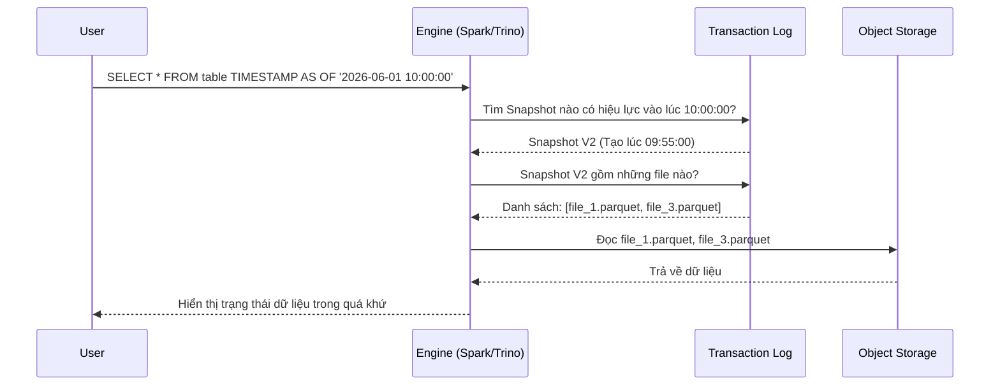

# Time Travel

## Summary

Time Travel (Du hành thời gian) là tính năng cho phép hệ thống dữ liệu (như Data Warehouse hiện đại hoặc Data Lakehouse) truy vấn và xem trạng thái của một bảng tại một mốc thời gian cụ thể hoặc ở một phiên bản (version) trong quá khứ. Đây là một cơ chế cực kỳ hữu ích để phục hồi dữ liệu sau các sự cố thao tác nhầm lẫn, chạy lại các mô hình Machine Learning với cùng một tập dữ liệu gốc, hoặc kiểm toán (audit) sự thay đổi dữ liệu theo thời gian.

---

## Definition

**Time Travel** là quá trình truy cập dữ liệu không chỉ ở trạng thái hiện tại mà còn ở bất kỳ điểm nào trong một cửa sổ lưu giữ lịch sử (retention window) được cấu hình trước. Về bản chất, nó biến cơ sở dữ liệu hoặc bảng dữ liệu từ một kho lưu trữ trạng thái đơn (chỉ chứa hiện tại) thành một hệ thống quản lý phiên bản (version control system giống như Git dành cho dữ liệu).

Tính năng này được hỗ trợ mạnh mẽ bởi các Table Formats (như Delta Lake, Apache Iceberg, Apache Hudi) và các nền tảng Data Warehouse đám mây (như Snowflake, BigQuery).

---

## Why it exists

Trước đây, khi vô tình chạy một câu lệnh `UPDATE` quên mệnh đề `WHERE` hoặc `DELETE` nhầm một tập khách hàng quan trọng, cách duy nhất để phục hồi là:
1. Liên hệ với Database Administrator (DBA).
2. Dừng hệ thống (Downtime).
3. Lấy băng từ / file backup của đêm qua để khôi phục lại (Restore từ Snapshot).
4. Phải chấp nhận mất toàn bộ dữ liệu từ lúc backup đến thời điểm bị lỗi.

Ngoài rủi ro về thao tác, các nhà khoa học dữ liệu (Data Scientists) gặp khó khăn khi muốn tái tạo (reproduce) lại một thí nghiệm Machine Learning. Nếu bảng dữ liệu thay đổi mỗi ngày, việc chạy lại mô hình vào ngày hôm nay sẽ cho ra kết quả khác với chạy vào tuần trước.

Time Travel giải quyết vấn đề này bằng cách cho phép truy cập tức thì (trong vài giây) vào bản sao logic của dữ liệu ở bất kỳ khoảnh khắc nào.

---

## Core idea

Ý tưởng để hệ thống có thể "du hành thời gian" xoay quanh cơ chế **Append-only storage (Lưu trữ chỉ ghi thêm)** kết hợp với **Transaction Logs (Nhật ký giao dịch)**.

1. **Không ghi đè dữ liệu cũ**: Khi một bản ghi bị sửa hoặc xóa, hệ thống không xóa vật lý các byte dữ liệu đó trên đĩa. Nó tạo ra các tệp dữ liệu mới chứa trạng thái mới.
2. **Theo dõi phiên bản (Versioning)**: Mọi thao tác làm thay đổi bảng (Insert/Update/Delete) đều tạo ra một phiên bản (Snapshot / Version) mới. Transaction log ghi lại chi tiết phiên bản số X gồm những tệp tin vật lý nào.
3. **Truy vấn theo ngữ cảnh thời gian**: Khi người dùng yêu cầu xem dữ liệu "vào lúc 9:00 sáng hôm qua", Engine phân tích xem vào thời điểm đó, bảng đang ở Version bao nhiêu. Sau đó, nó đọc nhật ký của Version đó và chỉ quét các tệp vật lý được liệt kê trong đó, hoàn toàn phớt lờ các tệp được tạo ra sau thời điểm 9:00 sáng.

---

## How it works

Lấy Delta Lake làm ví dụ cơ bản:
1. Ngày 1: Tạo bảng và Insert dữ liệu (Phiên bản V0). Ghi file `A.parquet`.
2. Ngày 2: Cập nhật một số dòng (Phiên bản V1). Hệ thống ghi dữ liệu thay đổi vào `B.parquet` và đánh dấu (trong log) rằng từ V1 trở đi, hãy đọc `A.parquet` và `B.parquet`. (Hoặc nếu là copy-on-write, nó ghi đè file A bằng `A_new.parquet` và đánh dấu `A.parquet` cũ là "tombstoned" - đã bị xóa logic).
3. Ngày 3: Khi bạn truy vấn Time Travel yêu cầu `VERSION AS OF 0`, engine đọc log của V0, thấy chỉ có `A.parquet` là hợp lệ. Nó bỏ qua `B.parquet` và trả về kết quả y như trạng thái Ngày 1.

---

## Architecture / Flow



---

## Practical example

Sử dụng SQL (trên Snowflake hoặc Databricks) để truy vấn Time Travel:

**Truy vấn bằng Timestamp (Thời điểm thời gian):**
```sql
SELECT * 
FROM customer_table TIMESTAMP AS OF '2026-06-01 09:00:00'
WHERE customer_id = 12345;
```

**Truy vấn bằng Version number (Số phiên bản):**
```sql
SELECT * 
FROM customer_table VERSION AS OF 10;
```

**Sửa lỗi thao tác nhầm lẫn (Rollback):**
Ví dụ ai đó đã lỡ chạy `DELETE FROM customer_table`. Bạn có thể phục hồi lại:
```sql
-- Chèn lại toàn bộ dữ liệu từ trạng thái cách đây 1 giờ
INSERT INTO customer_table
SELECT * FROM customer_table TIMESTAMP AS OF (CURRENT_TIMESTAMP() - INTERVAL 1 HOUR);

-- Hoặc khôi phục bảng (RESTORE trong Delta Lake/Snowflake)
RESTORE TABLE customer_table TO TIMESTAMP AS OF '2026-06-07 10:00:00';
```

---

## Best practices

* **Thiết lập Retention Period hợp lý**: Việc giữ lại lịch sử thay đổi chiếm dung lượng ổ đĩa. Chỉ nên thiết lập thời gian lưu giữ (Time Travel retention window) ở mức đủ dùng, ví dụ 7 ngày hoặc 30 ngày cho Data Lake. Rất ít khi cần Time Travel về cách đây 1 năm (chi phí lưu trữ metadata và file cũ sẽ khổng lồ).
* **Kết hợp với Vacuum**: Các tệp dữ liệu đã quá thời hạn Time Travel cần được xóa sạch vật lý khỏi hệ thống lưu trữ định kỳ bằng các lệnh `VACUUM` để tiết kiệm tiền AWS S3 / GCS.
* **Gắn thẻ (Tagging) cho Machine Learning**: Các Data Scientist nên sử dụng Version (hoặc Commit Hash trong Iceberg) để "tag" lại bộ dữ liệu được dùng để train một model cụ thể. Nếu model có lỗi trên production, họ có thể dùng chính Version đó để tái hiện chính xác lỗi.

---

## Common mistakes

* **Quên Vacuum**: Bật Time Travel nhưng không có lịch trình chạy dọn dẹp các version quá hạn, khiến chi phí Object Storage tăng theo cấp số nhân tháng này qua tháng khác.
* **Coi Time Travel là công cụ Backup vĩnh viễn**: Time travel không thay thế hoàn toàn cho Backup thảm họa (Disaster Recovery). Nếu toàn bộ bucket S3 bị xóa nhầm bởi quản trị viên, Time Travel cũng "bốc hơi" vì file vật lý không còn. Cần có cơ chế Backup/Replication độc lập.

---

## Trade-offs

### Ưu điểm
* Sửa chữa nhanh chóng các lỗi do con người (Human errors) gây ra trong pipeline dữ liệu mà không cần downtime.
* Kiểm toán sự thay đổi dữ liệu (Audit data changes) dễ dàng.
* Cung cấp khả năng tái hiện dữ liệu (Reproducibility) hoàn hảo cho các tác vụ Machine Learning.

### Nhược điểm
* **Chi phí lưu trữ cao hơn**: Việc duy trì các file dữ liệu cũ chưa bị xóa hoàn toàn đòi hỏi dung lượng đĩa lớn hơn so với một bảng chỉ lưu trạng thái hiện tại.
* **Metadata ngày càng lớn**: Log giao dịch có thể phình to, đôi khi làm chậm quá trình khởi tạo (planning) câu lệnh truy vấn nếu không được gom (compact) định kỳ.

---

## When to use

* Trong hệ thống Data Lakehouse sử dụng các công nghệ Iceberg, Delta Lake, Hudi.
* Trên các nền tảng Cloud Data Warehouse như Snowflake, BigQuery.
* Khi luồng dữ liệu của bạn phức tạp, có nhiều người cùng chỉnh sửa và nguy cơ làm hỏng dữ liệu cao.
* Trong vòng đời ML Ops, nơi cần đóng băng tập dữ liệu huấn luyện để tham chiếu sau này.

## When not to use

* Với các bảng nhật ký khổng lồ (Append-only logs) nơi dữ liệu cũ không bao giờ bị sửa đổi hay xóa đi. Trong trường hợp này, Time Travel không mang lại giá trị thêm (vì trạng thái hiện tại vốn đã chứa toàn bộ lịch sử) mà chỉ sinh thêm metadata.

---

## Related concepts

* [Table Format](/concepts/table-format)
* [Delta Lake](/concepts/delta-lake)
* [Apache Iceberg](/concepts/apache-iceberg)
* [Data Lakehouse](/concepts/data-lakehouse)

---

## Interview questions

### 1. Phân biệt sự khác nhau giữa Time Travel và Slowly Changing Dimension (SCD Type 2). Cả hai đều phục vụ xem lịch sử, khi nào dùng cái nào?
* **Người phỏng vấn muốn kiểm tra**: Khả năng phân biệt một tính năng nền tảng (System-level) và một kỹ thuật mô hình hóa (Data modeling-level).
* **Gợi ý trả lời (Strong Answer)**: 
  * **SCD Type 2** là một kỹ thuật *mô hình hóa nghiệp vụ*. Nó được thiết kế rõ ràng bằng các cột (như `start_date`, `end_date`, `is_active`) nhằm phục vụ việc phân tích BI (ví dụ: Tính hoa hồng cho nhân viên A lúc họ ở chi nhánh cũ, nhân viên A lúc họ ở chi nhánh mới). Lịch sử của SCD2 được giữ vĩnh viễn và là một phần của luồng dữ liệu phục vụ báo cáo.
  * **Time Travel** là một tính năng *hệ thống (Infrastructure)*. Nó lưu giữ trạng thái vật lý của bảng để phục hồi sau thảm họa, sửa lỗi hoặc tái tạo model. Nó thường bị giới hạn thời gian (ví dụ 30 ngày) vì tốn chi phí.
  * **Kết luận**: Không dùng Time Travel để làm báo cáo BI phân tích lịch sử khách hàng. Dùng SCD Type 2 cho báo cáo nghiệp vụ, dùng Time Travel cho quản trị kỹ thuật và phục hồi lỗi.

### 2. Lệnh VACUUM (hoặc Expire Snapshots) hoạt động như thế nào và ảnh hưởng gì đến Time Travel?
* **Người phỏng vấn muốn kiểm tra**: Kiến thức quản trị chi phí và bảo trì Data Lake.
* **Gợi ý trả lời (Strong Answer)**:
  Lệnh VACUUM quét hệ thống để tìm ra các tệp dữ liệu (như Parquet) đã không còn thuộc về trạng thái hiện tại của bảng VÀ đã vượt quá khoảng thời gian lưu giữ (retention window) được cấu hình. Nó sẽ xóa vĩnh viễn (physically delete) các tệp này khỏi storage (S3/GCS) để giải phóng dung lượng. Khi một tệp đã bị VACUUM, bạn sẽ không thể thực hiện Time Travel về khoảng thời gian cần tới tệp dữ liệu đó nữa. Do đó, VACUUM là sự đánh đổi giữa việc tiết kiệm chi phí đĩa cứng và giới hạn thời gian có thể quay lại.

---

## References

1. **Delta Lake Documentation** - "Time Travel (data versioning)".
2. **Snowflake Documentation** - "Understanding & Using Time Travel".
3. **Apache Iceberg Documentation** - "Time Travel and Rollback".

---

## English summary

Time Travel is a system-level feature found in modern Data Warehouses and Lakehouse architectures (via table formats like Delta Lake, Iceberg) that allows users to query data as it existed at a specific timestamp or historical version in the past. It relies on an append-only storage mechanism paired with transaction logs, keeping older data files intact until a vacuum process physically removes them. Time travel is crucial for recovering from human errors (accidental updates/deletes), auditing data changes over time, and ensuring perfect reproducibility for Machine Learning experiments without requiring complex database restores.
