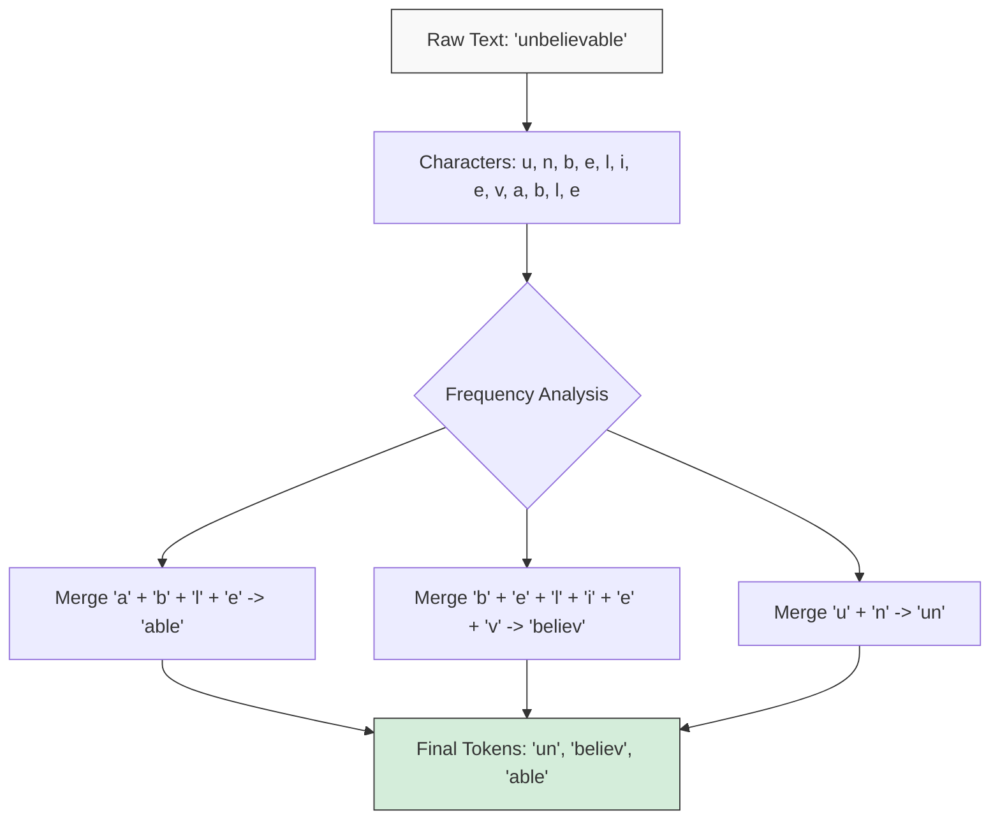

# Token - Đơn vị từ vựng

## Summary

Trong Xử lý ngôn ngữ tự nhiên (NLP) và các Mô hình ngôn ngữ lớn (LLM), **Token** là đơn vị nhỏ nhất của văn bản mà mô hình có thể đọc và hiểu. Một token không nhất thiết phải là một từ hoàn chỉnh; nó có thể là một từ, một phần của từ (âm tiết), hoặc thậm chí chỉ là một ký tự duy nhất. Quá trình chia nhỏ văn bản thành các token được gọi là Tokenization.

---

## Definition

**Token** là khối xây dựng cơ bản (building block) của dữ liệu văn bản đối với máy học. Thay vì nhận văn bản thô dạng chuỗi ký tự (string), các mô hình mạng nơ-ron nhận đầu vào là một mảng các số nguyên (Integer IDs), trong đó mỗi số nguyên đại diện cho một token duy nhất trong một từ điển (Vocabulary) đã được định nghĩa trước.

---

## Why it exists

Máy tính không hiểu chữ cái. Để mô hình ngôn ngữ xử lý văn bản, chúng ta phải số hóa nó.
* **Tại sao không token hóa theo Từng ký tự (Character-level)?**: Nếu mỗi ký tự là một token (a, b, c...), số lượng token sẽ quá dài cho một câu ngắn, làm cạn kiệt Cửa sổ ngữ cảnh (Context Window) rất nhanh và mô hình rất khó học được ngữ nghĩa của từ.
* **Tại sao không token hóa theo Từng từ (Word-level)?**: Có hàng triệu từ khác nhau trên đời, chưa kể tên riêng, từ viết tắt và các từ bị viết sai chính tả. Từ điển sẽ phình to khổng lồ (Out-Of-Vocabulary - OOV problem).

Do đó, các kỹ sư tạo ra phương pháp chia nhỏ theo **Sub-word (Một phần của từ)**, tạo ra mức cân bằng hoàn hảo giữa kích thước từ điển và độ dài chuỗi token.

---

## Core idea

* **Quy tắc ngón tay cái (Rule of thumb)**: Trong tiếng Anh, 1 token xấp xỉ bằng khoảng 4 ký tự (tương đương 0.75 từ).
* **Mảnh ghép của từ (Subword)**: Từ "unbelievable" có thể được cắt thành 3 token: `un`, `believ`, và `able`. Nhờ vậy, nếu mô hình chưa từng thấy từ "unbelievable", nó vẫn có thể nội suy ý nghĩa từ 3 mảnh ghép này.
* **Định vị khoảng trắng**: Trong nhiều bộ tokenizer (như tiktoken của OpenAI), khoảng trắng (space) thường được gắn liền với phần đầu của token tiếp theo (ví dụ: `_hello`).

---

## How it works

Hầu hết các LLM hiện đại (như GPT-4, LLaMA) sử dụng thuật toán **BPE (Byte-Pair Encoding)**:



1. Ban đầu, coi mọi byte ký tự riêng lẻ là một token.
2. Thống kê dữ liệu huấn luyện: Tìm cặp byte xuất hiện cạnh nhau nhiều nhất (ví dụ: `e` và `r` hay đi cùng nhau thành `er`). Gộp chúng lại thành một token mới `er`.
3. Lặp lại quá trình này (ví dụ ghép `t` và `h` thành `th`, rồi `th` và `e` thành `the`) cho đến khi kích thước từ điển đạt một số lượng cố định (ví dụ: 50,000 hoặc 100,000 tokens).
4. Khi đưa văn bản mới vào, thuật toán sẽ cắt văn bản thành các token lớn nhất có mặt trong từ điển.

---

## Practical example

Xét câu tiếng Việt và tiếng Anh đi qua bộ Tokenizer `tiktoken` (cl100k_base) của OpenAI:

**Tiếng Anh:**
`"Artificial Intelligence is amazing!"`
* Số lượng từ: 4
* Tokens (5): `["Artificial", " Intelligence", " is", " amazing", "!"]`
* Đánh giá: Rất tối ưu, hầu như 1 từ = 1 token.

**Tiếng Việt:**
`"Trí tuệ nhân tạo thật tuyệt vời!"`
* Số lượng từ: 7
* Tokens (11): `["Tr", "í", " tu", "ệ", " nhân", " t", "ạo", " th", "ật", " tuyệt", " vời!"]`
* Đánh giá: Không tối ưu bằng tiếng Anh, nhiều từ tiếng Việt bị cắt nát thành 2-3 tokens vì chúng không xuất hiện nhiều trong dữ liệu huấn luyện gốc của BPE.

**Đoạn mã Python minh họa đếm Token bằng thư viện `tiktoken`:**

```python
import tiktoken

# Lấy bộ mã hóa mặc định dùng cho các mô hình như GPT-4 (cl100k_base)
encoder = tiktoken.get_encoding("cl100k_base")

text_en = "Artificial Intelligence is amazing!"
text_vi = "Trí tuệ nhân tạo thật tuyệt vời!"

# Hàm encode biến văn bản thành danh sách Integer IDs
tokens_en = encoder.encode(text_en)
tokens_vi = encoder.encode(text_vi)

print(f"Tiếng Anh: {len(tokens_en)} tokens -> {tokens_en}")
print(f"Tiếng Việt: {len(tokens_vi)} tokens -> {tokens_vi}")
```

---

## Best practices

* **Kiểm tra Token trước khi gửi API**: Chi phí API của OpenAI hay Anthropic được tính bằng đơn vị "1000 tokens". Hãy dùng các thư viện như `tiktoken` (Python) để đếm chính xác số token trước khi gọi API để tránh vượt quá giới hạn và quản lý chi phí.
* **Sử dụng Tokenizer đúng với LLM**: Mỗi LLM có một từ điển token riêng. Đếm token của GPT-4 bằng công cụ đếm token của BERT sẽ cho ra kết quả hoàn toàn sai lệch.

---

## Common mistakes

* **Nhầm lẫn Token với Từ (Word)**: Cứ nghĩ 4000 tokens = 4000 từ. Đối với tiếng Việt, 4000 tokens thường chỉ tương đương 1500 - 2000 từ.
* **Không tính Token đầu ra (Output)**: API tính tiền cả phần prompt bạn gửi đi (Input tokens) và câu trả lời mô hình sinh ra (Output tokens/Generated tokens). Hơn nữa, giá tiền cho Output tokens thường đắt gấp 2 đến 3 lần Input tokens.

---

## Trade-offs

### Ưu điểm của phương pháp Subword Tokenization (BPE)
* Giải quyết triệt để lỗi Out-Of-Vocabulary (OOV). Không một chuỗi ký tự nào không thể bị token hóa (cùng lắm là chẻ nhỏ về mức từng ký tự một).
* Nén dữ liệu tốt, giảm chi phí tính toán cho mạng nơ-ron.

### Nhược điểm
* **Bất bình đẳng ngôn ngữ**: Do thuật toán thống kê trên dữ liệu tiếng Anh là chủ yếu, các ngôn ngữ khác (tiếng Việt, tiếng Hàn, Arabic) bị chia thành nhiều tokens hơn. Điều này dẫn đến người dùng không phải tiếng Anh sẽ phải trả nhiều tiền API hơn và nhận lại Context Window ít hơn khi truyền cùng một khối lượng thông tin.

---

## When to use

* Tính toán chi phí hệ thống Generative AI.
* Tối ưu hóa độ dài của chunk khi thiết kế hệ thống RAG (ví dụ: giới hạn mỗi đoạn văn là 512 tokens).

---

## Related concepts

* [Cửa sổ ngữ cảnh (Context Window)](/concepts/context-window)
* [Phân tách văn bản (Chunking)](/concepts/chunking)
* [Mô hình ngôn ngữ lớn (LLMs)](/concepts/llm)

---

## Interview questions

### 1. Thuật toán Byte-Pair Encoding (BPE) giải quyết vấn đề gì trong NLP?
* **Người phỏng vấn muốn kiểm tra**: Sự hiểu biết về nền tảng xử lý dữ liệu của LLM.
* **Gợi ý trả lời (Strong Answer)**: BPE giải quyết bài toán cân bằng giữa kích thước từ điển (Vocabulary size) và khả năng xử lý từ mới (Out-Of-Vocabulary). Nếu tokenize theo từ (Word-level), từ điển sẽ quá lớn và vẫn bị sót tên riêng. Nếu tokenize theo ký tự (Character-level), chuỗi đầu vào sẽ quá dài làm sập Context Window. BPE là cách tiếp cận Sub-word: nó học các cụm ký tự phổ biến để biến chúng thành 1 token, trong khi vẫn giữ lại khả năng phân tách các từ lạ thành các token nhỏ hơn, đảm bảo mọi văn bản đều có thể được xử lý với độ dài chuỗi tối ưu.

### 2. Tại sao gọi API LLM bằng tiếng Việt lại thường đắt hơn gọi bằng tiếng Anh?
* **Người phỏng vấn muốn kiểm tra**: Kinh nghiệm thực chiến và hiểu biết về Tokenizer đa ngữ.
* **Gợi ý trả lời (Strong Answer)**: Các LLM toàn cầu như GPT-4 sử dụng thuật toán tạo tokenizer (như BPE) được huấn luyện chủ yếu trên kho dữ liệu tiếng Anh. Do đó, từ điển token của chúng chứa sẵn hầu hết các từ tiếng Anh hoàn chỉnh (1 từ = 1 token). Đối với tiếng Việt, do tần suất xuất hiện trong tập huấn luyện ít hơn, các từ tiếng Việt không được gom thành một token nguyên vẹn mà bị chẻ nhỏ thành các âm tiết hoặc ký tự (1 từ = 2, 3 tokens). Vì nhà cung cấp API tính tiền dựa trên số lượng token xử lý, cùng một câu có độ dài ngữ nghĩa tương đương, câu tiếng Việt sẽ sinh ra nhiều token hơn tiếng Anh, dẫn đến chi phí cao hơn và chiếm dụng nhiều Context Window hơn.

---

## References

1. **Neural Machine Translation of Rare Words with Subword Units** - Sennrich et al. (2015) - Nền tảng của BPE trong NLP.
2. **OpenAI Tiktoken repository** - Thư viện mã nguồn mở minh họa cách thức hoạt động của Tokenizer hiện đại.

---

## English summary

A Token is the fundamental unit of text processed by a Large Language Model, representing a word, subword, or character. Through a process called Tokenization—typically using the Byte-Pair Encoding (BPE) algorithm—raw text is converted into a sequence of integer IDs. Subword tokenization perfectly balances vocabulary size and sequence length while eliminating the Out-Of-Vocabulary (OOV) problem. Because tokenizer vocabularies are heavily biased towards English, processing other languages like Vietnamese typically results in more tokens per word, leading to higher API costs and faster depletion of the Context Window.
