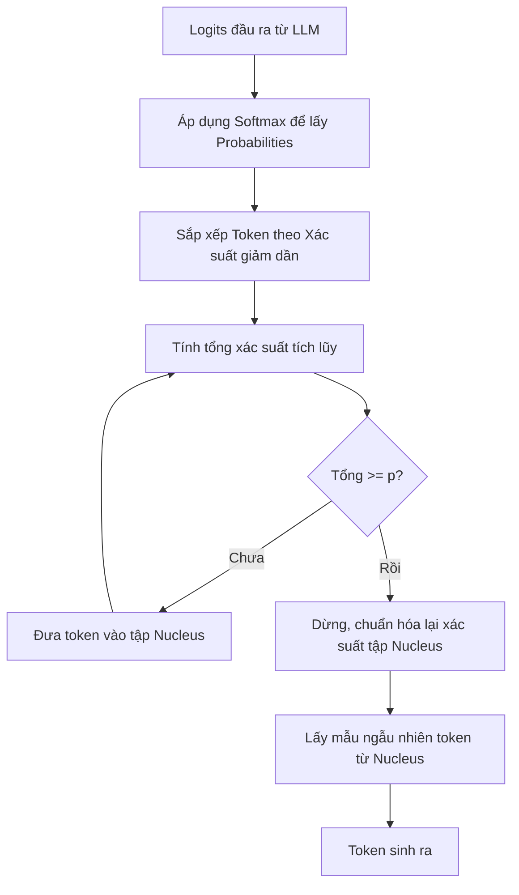

# Nucleus Sampling - Top-p

## Summary

Top-p (hay Nucleus Sampling) là một tham số giải mã (decoding parameter) được sử dụng trong các Mô hình Ngôn ngữ Lớn (LLM) để kiểm soát độ đa dạng và tính ngẫu nhiên của văn bản được sinh ra. Bằng cách chỉ lấy ngẫu nhiên từ một nhóm các từ vựng tiềm năng nhất (có tổng xác suất bằng với giá trị $p$), Top-p giúp cắt bỏ "cái đuôi dài" (long tail) chứa các từ vô nghĩa hoặc lạc đề, đảm bảo câu văn sinh ra vừa có tính sáng tạo, vừa duy trì tính mạch lạc.

---

## Definition

**Top-p (Nucleus Sampling)** là thuật toán chọn lọc từ vựng ở đầu ra của LLM. Thay vì xem xét toàn bộ từ điển (có thể lên tới hàng chục nghìn token), thuật toán sẽ sắp xếp các token theo xác suất xuất hiện giảm dần, sau đó chọn một tập hợp con nhỏ nhất các token sao cho tổng xác suất của chúng vừa vượt quá hoặc bằng ngưỡng $p$ ($0 \le p \le 1$). Token tiếp theo sẽ chỉ được bốc ngẫu nhiên (sampling) từ tập hợp "hạt nhân" (nucleus) này.

---

## Why it exists

Quá trình sinh văn bản của LLM là lấy mẫu từ một phân phối xác suất. Nếu chỉ luôn chọn token có xác suất cao nhất (Greedy Decoding), câu văn sẽ trở nên vô hồn, lặp đi lặp lại và thiếu sáng tạo.
Tuy nhiên, nếu lấy mẫu ngẫu nhiên trên toàn bộ từ điển (Random Sampling), mô hình thỉnh thoảng sẽ chọn trúng những từ ở "phần đuôi" (tail) có xác suất rất thấp, dẫn đến việc sinh ra câu vô nghĩa, sai ngữ pháp, hoặc ảo giác (hallucinations).

Nucleus Sampling ra đời để giải quyết vấn đề này một cách linh hoạt (dynamic) thay vì cắt cứng theo số lượng từ như thuật toán Top-k.

---

## Core idea

* **Tập hợp động (Dynamic Vocabulary)**: Khác với tham số Top-k (luôn cố định chỉ nhìn vào $k$ từ cao nhất), Top-p điều chỉnh linh hoạt số lượng từ được xem xét. Nếu mô hình rất tự tin (từ số 1 có xác suất 90%), tập hạt nhân có thể chỉ chứa 1-2 từ. Nếu mô hình không chắc chắn (nhiều từ có xác suất ngang nhau), tập hạt nhân sẽ phình to ra để bao gồm 10, 20 hoặc nhiều từ hơn để tăng độ sáng tạo.
* **Cắt bỏ đuôi (Truncating the tail)**: Loại bỏ triệt để các token lạ hoặc không phù hợp để đảm bảo an toàn cho câu sinh ra.

---

## How it works

Giả sử chúng ta thiết lập tham số **Top-p = 0.9**. Mô hình dự đoán token tiếp theo cho câu "Con mèo thích ăn..." với phân phối xác suất như sau:
1. "cá" (0.50)
2. "chuột" (0.20)
3. "hạt" (0.15)
4. "cỏ" (0.07)
5. "đất" (0.03)
6. ... các từ khác (Tổng = 0.05)

Hệ thống sẽ sắp xếp và cộng dồn xác suất (Cumulative Probability):
* "cá": 0.50 (< 0.9)
* "cá" + "chuột" = 0.70 (< 0.9)
* "cá" + "chuột" + "hạt" = 0.85 (< 0.9)
* "cá" + "chuột" + "hạt" + "cỏ" = 0.92 (Đạt và vượt ngưỡng 0.9)

Lúc này, tập hợp "Nucleus" sẽ là: ["cá", "chuột", "hạt", "cỏ"]. Toàn bộ xác suất được chuẩn hóa lại để tổng bằng 1. Token tiếp theo sẽ được chọn ngẫu nhiên từ 4 từ này. Từ "đất" và các từ phía sau sẽ bị loại bỏ hoàn toàn (cắt đuôi).

---

## Architecture / Flow



---

## Practical example

Chỉnh tham số `top_p` khi gọi API của OpenAI:

```python
import openai

response = openai.ChatCompletion.create(
    model="gpt-4",
    messages=[{"role": "user", "content": "Viết một bài thơ về biển."}],
    temperature=0.8,
    top_p=0.5, # Chỉ lấy ngẫu nhiên từ top các từ chiếm 50% tổng xác suất
    max_tokens=100
)

print(response.choices[0].message.content)
```
Trong cấu hình này, dù `temperature` cao (khuyến khích tính ngẫu nhiên), nhưng `top_p` là 0.5 giới hạn mạnh mẽ nhóm từ vựng mô hình được phép dùng, nên câu trả lời vẫn duy trì cấu trúc an toàn và logic.

---

## Best practices

* **Top-p thấp (0.1 - 0.3)**: Dùng cho các tác vụ cần độ chính xác cao, đòi hỏi sự logic và không cần sáng tạo (ví dụ: lập trình, viết truy vấn SQL, dịch thuật, trích xuất dữ liệu).
* **Top-p cao (0.7 - 0.95)**: Dùng cho các tác vụ cần sự đa dạng, sáng tạo, giọng văn tự nhiên (ví dụ: viết truyện, sáng tác thơ, brainstorming).
* **Top-p = 1.0**: Chế độ mặc định. Mô hình sẽ xét tất cả các token.
* **Quy tắc vàng**: Theo lời khuyên từ OpenAI, bạn **không nên** điều chỉnh cả `Temperature` và `Top-p` cùng một lúc. Thường thì chúng chi cố định một cái và thay đổi cái kia (ví dụ: giữ `top_p = 1` và điều chỉnh `temperature`, hoặc ngược lại).

---

## Common mistakes

* **Thay đổi cùng lúc cả Temperature và Top-p**: Làm cho việc gỡ lỗi hành vi của LLM trở nên khó khăn vì cả hai tham số đều thay đổi tính ngẫu nhiên của mô hình và có thể xung đột với nhau.
* **Đẩy Top-p xuống 0**: Tương đương với Greedy Decoding (luôn chọn từ xác suất cao nhất), câu văn sẽ mất hoàn toàn tính ngẫu nhiên.

---

## Trade-offs

### Ưu điểm
* Giữ được sự cân bằng hoàn hảo giữa tính sáng tạo và sự logic.
* Linh hoạt hơn Top-k rất nhiều vì tự động thích ứng với mức độ "tự tin" của mô hình ở từng ngữ cảnh cụ thể.

### Nhược điểm
* Đòi hỏi thêm bước tính toán (sắp xếp và cộng dồn) trên toàn bộ từ điển sau lớp Softmax, tạo ra overhead nhỏ trong quá trình sinh (so với Greedy Decoding).

---

## When to use

* Tinh chỉnh phong cách trả lời của các ứng dụng Generative AI.
* Là phương pháp decoding mặc định ưu việt nhất hiện nay (thay thế cho Top-k) trong các hệ sinh thái như HuggingFace, OpenAI, Anthropic.

## When not to use

* Tác vụ yêu cầu tính tất định tuyệt đối (Deterministic) như sinh mã JSON theo schema chặt chẽ. Lúc này nên đưa Temperature về 0, do đó Top-p mất tác dụng.

---

## Related concepts

* [Nhiệt độ (Temperature)](/concepts/temperature)
* [Token (Đơn vị từ vựng)](/concepts/token)
* [Mô hình ngôn ngữ lớn (LLMs)](/concepts/llm)

---

## Interview questions

### 1. Hãy so sánh sự khác biệt cơ bản giữa Top-k và Top-p (Nucleus Sampling). Tại sao Top-p lại được ưa chuộng hơn?
* **Người phỏng vấn muốn kiểm tra**: Khả năng phân biệt các kỹ thuật sinh văn bản (decoding).
* **Gợi ý trả lời (Strong Answer)**: Top-k luôn cắt cứng ở số lượng k từ có xác suất cao nhất (ví dụ: k=50). Nếu phân phối xác suất rất "phẳng" (không có từ nào nổi trội), 50 từ là không đủ để tạo sự đa dạng. Ngược lại, nếu phân phối rất "nhọn" (1 từ chiếm 90% xác suất), việc xét 50 từ vô tình đưa cả những từ "rác" vào xác suất được lấy mẫu. Top-p (Nucleus) linh hoạt dựa trên khối lượng xác suất tích lũy. Phân phối phẳng sẽ tự động lấy nhiều từ, phân phối nhọn sẽ lấy ít từ. Tính linh hoạt này giúp Top-p tránh được lỗi sinh từ ngớ ngẩn mà vẫn duy trì độ sáng tạo tự nhiên, do đó được ưa chuộng hơn.

### 2. Nếu tôi đặt Temperature = 0, thông số Top-p có còn tác dụng không?
* **Người phỏng vấn muốn kiểm tra**: Hiểu rõ về bản chất phân phối xác suất của mô hình.
* **Gợi ý trả lời (Strong Answer)**: Hoàn toàn không. Khi Temperature tiếp cận 0, lớp Softmax sẽ chuyển thành hàm argmax. Token có xác suất cao nhất ban đầu sẽ được khuếch đại thành xác suất 1.0 (hoặc 100%), và mọi token khác trở thành 0. Do đó, việc áp dụng Top-p lúc này trở nên vô nghĩa vì luôn luôn chỉ có một token duy nhất đạt tới mọi mức $p > 0$. Đây được gọi là Greedy Decoding.

---

## References

1. **The Curious Case of Neural Text Degeneration** - Holtzman et al. (2019) - Bài báo khai sinh ra khái niệm Nucleus Sampling.
2. **Hugging Face Generation Documentation** - Giải thích chi tiết các hàm Sampling trong Transformers.

---

## English summary

Top-p (Nucleus Sampling) is a decoding strategy used in Large Language Models to govern text generation. Instead of sampling from the entire vocabulary or a fixed number of top tokens (Top-k), Nucleus Sampling dynamically selects the smallest set of tokens whose cumulative probability exceeds the threshold $p$. This approach effectively truncates the "long tail" of low-probability, nonsensical words while allowing enough diversity from the high-probability tokens. It solves the issue of repetitive text seen in greedy decoding and avoids the grammatical errors or hallucinations common in pure random sampling. It is recommended to adjust either Top-p or Temperature, but not both simultaneously.
