Hãy tưởng tượng một buổi sáng thứ Hai, bạn bước vào văn phòng và thấy hệ thống báo cáo doanh thu đột ngột bị lỗi. Sau vài giờ đánh vật với code để tìm nguyên nhân, bạn phát hiện ra một sự thật trớ trêu: Đội ngũ phát triển Backend vừa cập nhật cơ sở dữ liệu để phục vụ một tính năng mới. Họ đã âm thầm đổi tên trường `customer_type` thành `customer_segment` và xóa đi một cột "không dùng đến". Nhưng trớ trêu thay, cột bị xóa đó lại là đầu vào cốt lõi cho pipeline phân tích của đội Data.

Tình huống dở khóc dở cười này xảy ra hằng ngày ở rất nhiều doanh nghiệp. Đó là lúc chúng ta cần đến **Hợp đồng dữ liệu (Data Contract)** — giải pháp giúp xây dựng những cam kết vững chắc giữa các bên trong hệ thống thông tin.

---

## Hợp đồng dữ liệu (Data Contract) thực chất là gì?

Về bản chất, **Data Contract** là một thỏa thuận chính thức, rõ ràng và có khả năng thực thi tự động (enforceable) giữa bên cung cấp dữ liệu (`Data Producers` - thường là đội Kỹ sư Phần mềm/Backend) và bên tiêu thụ dữ liệu (`Data Consumers` - Đội Phân tích/Kỹ sư dữ liệu). 

Hợp đồng này hoạt động như một cơ chế quản trị kết nối thế giới vận hành (`Operational / Microservices`) và thế giới phân tích (`Analytical / Data Warehouse`). Nó thường tồn tại dưới dạng một tệp cấu hình (YAML hoặc JSON) định nghĩa rõ ràng:

1. **Schema của dữ liệu**: Kiểu dữ liệu cụ thể và các trường bắt buộc phải có.
2. **Ngữ nghĩa (Semantics)**: Định nghĩa nghiệp vụ thực tế của từng trường dữ liệu để tránh hiểu lầm.
3. **Các quy tắc chất lượng (Quality rules)**: Ví dụ như tuổi phải lớn hơn 0, trạng thái đơn hàng chỉ được thuộc danh sách định trước.
4. **Các quy ước bảo mật**: Cách thức che giấu dữ liệu nhạy cảm (PII data masking).
5. **Thỏa thuận mức độ dịch vụ (SLA)**: Cam kết về độ trễ, tần suất cập nhật dữ liệu.

Khi Data Contract được áp dụng, bất kỳ đoạn code Backend nào vô tình phá vỡ hợp đồng này (như xóa cột hay thay đổi kiểu dữ liệu) sẽ bị chặn lại ngay lập tức từ giai đoạn CI/CD, không cho phép đưa lên môi trường Production.

---

## Tại sao chúng ta cần Data Contract?

Trong mô hình truyền thống, đội Kỹ sư Dữ liệu (Data Engineers) thường đóng vai trò là "người dọn dẹp hệ quả":

* **Sự cố âm thầm**: Khi đội Backend sửa một tính năng nhỏ trong cơ sở dữ liệu PostgreSQL mà không thông báo, hậu quả là đêm đó pipeline dữ liệu bị sập. Báo cáo tài chính buổi sáng hôm sau bị sai lệch hoặc trống trơn. Đội Data phải chạy đôn chạy đáo để vá lỗi trong sự bị động.
* **Giao tiếp dựa trên "niềm tin"**: Mối quan hệ giữa bên sản xuất và bên tiêu thụ dữ liệu chủ yếu dựa trên những cuộc chat Slack ngắn ngủi hoặc lòng tin cảm tính, hoàn toàn thiếu đi sự ràng buộc ở mức hệ thống (system-level constraints).

Data Contract ra đời để giải quyết tận gốc vấn đề này bằng cách dịch chuyển trách nhiệm đảm bảo chất lượng dữ liệu về phía hệ thống sản xuất (tư duy **Shift-Left**). Nó buộc các nhà phát triển phần mềm phải coi dữ liệu như một sản phẩm độc lập (**Data as a Product**).

---

## Ý tưởng cốt lõi: Mang tư duy API vào thế giới dữ liệu

Ý tưởng cốt lõi của Data Contract được thừa hưởng từ kiến trúc API trong phát triển phần mềm.

Giống như các REST API luôn có một hợp đồng rõ ràng (như OpenAPI / Swagger) để đảm bảo Backend trả về đúng cấu trúc mong muốn cho Frontend, dữ liệu sự kiện hoặc luồng ETL/ELT cũng cần một "Hợp đồng API" tương tự giữa cơ sở dữ liệu Backend và Data Warehouse.

Hợp đồng này cần được kiểm tra tự động ở hai chốt chặn quan trọng:
1. **CI/CD Pipeline**: Khi Kỹ sư Phần mềm tạo một Pull Request mới.
2. **Runtime Execution**: Khi dữ liệu thực tế phát ra từ nguồn (ví dụ Kafka Producer). Nếu dữ liệu vi phạm hợp đồng, nó sẽ bị đẩy vào hàng đợi lỗi (Dead Letter Queue) thay vì chảy trực tiếp vào Data Warehouse và làm bẩn kho dữ liệu sạch.

---

## Quy trình vận hành của Data Contract

Một Data Contract thường trải qua các bước vận hành chuẩn chỉ như sau:

1. **Thiết kế & Đồng thuận**: Đội Producer và Consumer ngồi lại với nhau để thống nhất và viết ra một file YAML định nghĩa cấu trúc dữ liệu.
2. **Lưu trữ tập trung**: File YAML này được lưu trên một kho lưu trữ chung (Data Contract Registry), ví dụ như một Github Repository.
3. **Tự động hóa (Generation)**: Từ file YAML này, hệ thống tự động sinh ra các schema registry tương ứng (Protobuf, Avro, JSON Schema) để phục vụ kiểm chứng.
4. **Kiểm chứng tự động (Validation)**:
   * Khi Backend Dev chỉnh sửa code làm thay đổi cấu trúc bảng, CI/CD sẽ đối chiếu xem thay đổi đó có tương thích ngược (backward compatible) với Data Contract đang chạy hay không. Nếu không tương thích, quá trình deploy sẽ bị dừng lại (`FAILED`).
   * Khi ứng dụng chạy trên Production phát dữ liệu, một thư viện kiểm chứng (validation library) sẽ kiểm tra dữ liệu theo thời gian thực và cảnh báo nếu có sai lệch so với hợp đồng.

---

## Mô hình kiến trúc luồng dữ liệu

Dưới đây là sơ đồ trực quan hóa luồng hoạt động của Data Contract từ lúc kiểm tra code đến khi dữ liệu được tiêu thụ an toàn:

```mermaid
graph TD
    subgraph "Software Engineering / Producers"
        A[Microservice Code]
        B[Database Schema]
        C[CI/CD Pipeline]
    end

    subgraph "Data Contract Registry"
        D[(YAML Contract Repo)]
    end

    subgraph "Data Engineering / Consumers"
        E[Kafka / Event Bus]
        F[Data Warehouse]
        G[BI Reports]
    end

    A -->|Code changes| C
    B -->|Schema changes| C
    C --"Validate against Contract"--> D
    D --"If violated, block deployment"--> C
    A --"Publish Data Events"--> E
    E --"Enforce Avro/Protobuf Schema"--> F
    F --> G
```


---

## Ví dụ thực tế về một Data Contract

Dưới đây là một tệp YAML khai báo Data Contract chuẩn chỉnh (dựa trên tiêu chuẩn mở tại `datacontract.com`):
```yaml
dataContractSpecification: 0.9.2
id: urn:datacontract:checkout:orders
info:
  title: Orders Checkout Data Contract
  version: 1.0.0
  owner: checkout-squad@company.com

models:
  orders:
    description: Data stream for completed customer orders.
    type: table
    fields:
      order_id:
        type: string
        required: true
        primary: true
        description: Unique identifier of the order.
      customer_id:
        type: integer
        required: true
      total_amount:
        type: decimal
        required: true
      status:
        type: string
        enum: [PENDING, COMPLETED, CANCELLED] # Quality constraint
        required: true
        
quality:
  type: SodaCL
  rules:
    - row_count > 0
    - duplicate_count(order_id) = 0
```

---

## Kinh nghiệm triển khai thực tế (Best Practices)

Để Data Contract không chỉ là một tài liệu lý thuyết, bạn nên lưu ý:

* **Ưu tiên tính tương thích ngược (Backward Compatibility)**: Mọi cập nhật trên hợp đồng nên là thêm mới cột chứ không nên xóa cột cũ hoặc thay đổi kiểu dữ liệu hiện có để tránh gây gãy vỡ hệ thống hạ nguồn.
* **Xác định rõ quyền sở hữu (Ownership)**: Hợp đồng phải ghi rõ tên đội ngũ chịu trách nhiệm (Squad) hoặc email liên hệ của Producer. Khi có lỗi xảy ra, hệ thống sẽ tự động bắn cảnh báo trực tiếp cho họ.
* **Tiếp cận từng bước (Avoid Big Bang)**: Đừng cố gắng áp dụng Data Contract cho toàn bộ hệ thống ngay lập tức. Hãy bắt đầu từ những luồng dữ liệu quan trọng nhất (Tier 1 data) như dữ liệu thanh toán (Billing) hay thông tin người dùng (Users).
* **Tích hợp sâu vào CI/CD của Backend**: Sức mạnh thực sự của Data Contract nằm ở việc chặn đứng lỗi từ source code Backend trước khi nó được deploy. Nếu bạn chỉ kiểm tra dữ liệu sau khi đã vào kho, đó chỉ là kiểm thử thông thường (Data Testing) chứ không phải Data Contract.

---

## Những sai lầm thường gặp khi áp dụng

* **Nhầm lẫn giữa Data Contract và [Data Testing](/concepts/data-quality/data-testing/)**: Các công cụ test dữ liệu như [dbt](/concepts/transformation-analytics/dbt/) tests chỉ chạy *sau khi* dữ liệu đã vào kho (Post-ingestion) - tức là khi "sự đã rồi". Data Contract đi trước một bước, ngăn chặn lỗi *trước khi* dữ liệu được ghi nhận (Pre-ingestion).
* **Đội Data tự biên tự diễn**: Nếu đội Data tự viết hợp đồng rồi tự lưu trữ mà không có sự tham gia, đồng thuận của đội Backend, hợp đồng đó chỉ là một tờ giấy vô giá trị.
* **Thiết kế quá cứng nhắc**: Việc kiểm soát quá chi tiết từng li từng tí có thể làm chậm tốc độ phát triển phần mềm của đội Backend, khiến họ cảm thấy bị cản trở và tìm cách "lách luật" hoặc từ chối sử dụng.

---

## Phân tích ưu và nhược điểm (Trade-offs)

### Ưu điểm nổi bật
* Giải quyết triệt để bài toán "Garbage In, Garbage Out" và các sự cố gãy vỡ dữ liệu trong im lặng.
* Dịch chuyển trách nhiệm chất lượng dữ liệu về gần nguồn hơn (Shift-Left Data Quality).
* Tự động sinh ra tài liệu cấu trúc dữ liệu cập nhật theo thời gian thực.

### Nhược điểm & Thách thức
* Khó khăn lớn nhất nằm ở sự chuyển dịch văn hóa làm việc (Cultural Shift). Bạn cần sự ủng hộ mạnh mẽ từ các cấp quản lý cao nhất (CTO, CDO) để đội SWE (Software Engineers) sẵn sàng phối hợp.
* Gây ra một chút cản trở (friction) làm giảm tốc độ phát triển phần mềm ở giai đoạn đầu.
* Đòi hỏi một hạ tầng kỹ thuật tương đối trưởng thành (Schema Registry, hệ thống CI/CD phức tạp).

---

## Khi nào nên và không nên áp dụng?

### Nên áp dụng khi:
* Doanh nghiệp đang chuyển dịch sang mô hình **[Data Mesh](/concepts/system-architecture/data-mesh/)**, nơi các đội domain tự sở hữu và cung cấp Data Products.
* Hệ thống sử dụng kiến trúc Microservices phức tạp với hàng trăm dịch vụ liên tục thay đổi schema mỗi ngày.
* Dữ liệu đóng vai trò quyết định trong vận hành thời gian thực (ví dụ: các mô hình Machine Learning tự động duyệt hạn mức tài chính).

### Chưa nên áp dụng khi:
* Công ty đang ở giai đoạn khởi nghiệp (Start-up), sản phẩm thay đổi liên tục và chỉ có một cơ sở dữ liệu dạng Monolith duy nhất với một đội nhóm nhỏ ngồi cạnh nhau.
* Ban giám đốc không coi chất lượng dữ liệu là ưu tiên và không hỗ trợ thuyết phục đội SWE thay đổi quy trình làm việc.
* Các nguồn dữ liệu thô hoàn toàn phụ thuộc vào bên thứ ba (như Google Ads API, Facebook API) - nơi bạn bắt buộc phải chủ động thích ứng chứ không thể bắt họ "ký hợp đồng".

---

## Các khái niệm liên quan bạn nên tìm hiểu
* [Mô hình Data Mesh](/concepts/system-architecture/data-mesh/)
* [Quản trị Chất lượng Dữ liệu (Data Quality)](/concepts/data-quality/data-quality/)
* Schema Registry (Kho lưu trữ cấu trúc dữ liệu)
* Dữ liệu như một sản phẩm (Data as a Product)

---

## Góc phỏng vấn: Những câu hỏi thường gặp

### 1. Hãy phân biệt Data Contract và dbt tests (hoặc Great Expectations)?
* **Mục đích của người phỏng vấn**: Kiểm tra xem bạn có hiểu rõ khái niệm "Shift-Left [Data Quality](/concepts/data-quality/data-quality/)" và vị trí của từng công cụ trong kiến trúc dữ liệu hay không.
* **Gợi ý trả lời**: dbt tests hay Great Expectations hoạt động ở lớp chuyển đổi dữ liệu (Transformation), tức là kiểm tra sau khi dữ liệu đã nằm trong [Data Warehouse](/concepts/data-warehouse/data-warehouse/) (Post-ingestion). Nó mang tính chất phát hiện và cảnh báo sự cố. Ngược lại, Data Contract là một cơ chế phòng vệ chủ động ngăn chặn sự thay đổi cấu trúc sai lệch ngay từ nguồn phát hoặc trong quá trình build code (Pre-ingestion). Có thể ví von: Data Contract giúp "rác không vào nhà", còn dbt tests giúp "dọn dẹp đống rác lỡ lọt vào nhà".
* **Lỗi cần tránh**: Tránh nhận định sai lầm rằng dbt tests hoàn toàn có thể thay thế Data Contract.

### 2. Ai là người sở hữu (Owner) thực sự của một bản Data Contract?
* **Mục đích của người phỏng vấn**: Kiểm tra tư duy quản lý dữ liệu theo hướng Domain-driven của ứng viên.
* **Gợi ý trả lời**: Data Producer (đội ngũ phát triển phần mềm/Backend trực tiếp quản lý miền dữ liệu đó) phải là chủ sở hữu chính của Data Contract. Họ là những người trực tiếp sinh ra dữ liệu nên họ mới có khả năng kiểm soát chất lượng từ đầu nguồn. Tuy nhiên, nội dung của hợp đồng phải là sự kết hợp thỏa thuận giữa họ và Data Consumer (đội ngũ phân tích dữ liệu ở hạ nguồn).
* **Lỗi cần tránh**: Trả lời là Data Engineer sở hữu hợp đồng (vì Data Engineer chỉ tiêu thụ chứ không sinh ra dữ liệu nguồn).

---

## Tài liệu tham khảo hữu ích
1. **"Data Contracts" by Chad Sanderson** - Tập hợp các bài viết chuyên sâu định hình nên định nghĩa Data Contract hiện đại.
2. **Data Mesh** - Zhamak Dehghani (Đặc biệt là các chương nói về "Data as a Product" và khả năng tương tác liên thông "Interoperability").

---

## Tóm tắt bằng tiếng Anh (English Summary)

A **Data Contract** is an explicit, enforceable agreement between software engineers (Data Producers) and data engineers/analysts (Data Consumers) that defines the schema, semantics, and quality standards of a data stream or dataset. Unlike traditional data quality checks that happen post-ingestion within the data warehouse, Data Contracts "shift-left" data quality by integrating validations directly into the producer's CI/CD pipeline and runtime environment. This prevents schema changes in upstream microservices from silently breaking downstream data pipelines, making it a foundational pillar for successful Data Mesh implementations.