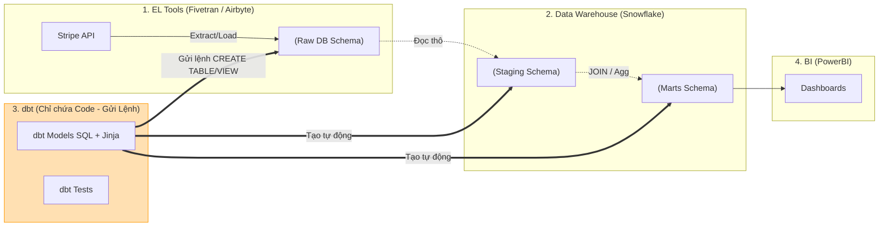

Nếu bạn hỏi bất kỳ một Analytics Engineer hay Data Engineer nào về công cụ đã thay đổi hoàn toàn cách họ làm việc trong những năm gần đây, câu trả lời nhận được nhiều nhất chắc chắn là **dbt (data build tool)**. 

Trước đây, viết code SQL để chuyển đổi dữ liệu giống như bạn đang xây một tòa nhà bằng cát — rất dễ đổ, không có cách nào để tự động kiểm thử, và cũng không có cách nào quản lý các phiên bản code một cách khoa học. dbt xuất hiện như một làn gió mới, mang tất cả những quy chuẩn tốt nhất của ngành **Kỹ nghệ phần mềm (Software Engineering)** đặt vào lòng thế giới dữ liệu.

## dbt thực chất là gì?

**dbt (data build tool)** là một công cụ mã nguồn mở được phát triển bởi dbt Labs, đảm nhận chuyên biệt chữ **"T" (Transform - Biến đổi)** trong kiến trúc dữ liệu [ELT](/concepts/etl-elt/elt/) (Extract, Load, Transform) hiện đại.

Về bản chất, dbt hoạt động như một "Trình biên dịch" (Compiler) và "Trình điều phối" (Runner):
* **Đầu vào**: Các file text chứa các câu lệnh `SELECT` SQL thuần túy kết hợp với ngôn ngữ lập trình động Jinja do kỹ sư viết (gọi là các Models).
* **Quá trình**: dbt biên dịch các file này thành mã SQL chuẩn, tính toán thứ tự chạy giữa các bảng (vẽ đồ thị phụ thuộc [DAG](/concepts/orchestration/dag/)) và gửi các câu lệnh này xuống [Data Warehouse](/concepts/data-warehouse/data-warehouse/) của bạn.
* **Đầu ra**: Các bảng (Tables) hoặc View vật lý được tạo ra tự động trên Data Warehouse để sẵn sàng phục vụ cho các công cụ BI (Tableau, Power BI).

> [!IMPORTANT]
> dbt **không hề chứa hay lưu trữ dữ liệu**, và nó cũng không tự thực hiện các phép tính toán. Tất cả sức mạnh xử lý đều dựa vào tài nguyên tính toán của chính Data Warehouse bên dưới của bạn. dbt chỉ đóng vai trò gửi các câu lệnh SQL đi mà thôi.

## Sự biến chuyển đầy "đau đớn" trước khi dbt xuất hiện

Trước khi dbt ra đời, việc quản trị logic biến đổi dữ liệu trong doanh nghiệp gặp rất nhiều khó khăn:

1. **Cơn ác mộng Stored Procedures (SP)**: Các kỹ sư phải viết hàng ngàn dòng code thủ tục (Stored Procedures) lồng nhau. Code cực kỳ khó đọc, không ai dám sửa vì sợ "sập dây chuyền", và hoàn toàn không có khả năng lưu vết lịch sử phiên bản (Git).
2. **Nút thắt cổ chai mang tên Data Engineer**: Các Data Analyst (người hiểu sâu về nghiệp vụ) chỉ biết viết SQL nhưng không biết cách đẩy code lên server hay thiết lập lịch chạy tự động. Họ phải viết mô tả logic bằng file Word rồi gửi sang cho Data Engineer code lại bằng Python/Spark. Quá trình này rất mất thời gian và dễ dẫn đến tình trạng hiểu sai ý nhau.
3. **Mớ hỗn độn mã hạ tầng (DDL/DML)**: Để tạo một bảng báo cáo, lập trình viên phải viết hàng loạt lệnh bổ trợ như `CREATE TABLE IF NOT EXISTS`, `DROP TABLE`, `INSERT INTO`. Logic nghiệp vụ (`SELECT`) bị che lấp bởi các đoạn mã hạ tầng rườm rà.

dbt ra đời để **trao quyền cho bất kỳ ai biết viết câu lệnh `SELECT` SQL**. Giờ đây, các Analysts có thể tự mình xây dựng các đường ống dữ liệu chuẩn mực mà không cần phụ thuộc vào đội ngũ DE.

## 4 Trụ cột tư duy kỹ nghệ phần mềm trong dbt

dbt mang 4 triết lý cốt lõi của ngành phần mềm vào thế giới dữ liệu:

1. **Lập trình khai báo (Declarative)**: Bạn chỉ cần tập trung viết logic `SELECT` để định nghĩa dữ liệu đầu ra trông như thế nào. dbt sẽ tự động lo phần tạo bảng (`CREATE TABLE`) hay tạo view (`CREATE VIEW`) tương ứng.
2. **Mô-đun hóa (Modular)**: Thay vì viết một file SQL khổng lồ dài 1,000 dòng, bạn chia nhỏ thành 10 file Models độc lập, mỗi file giải quyết một nhiệm vụ duy nhất. Các file này có thể liên kết và tham chiếu đến nhau thông qua hàm `{{ ref('tên_model') }}`.
3. **Kiểm thử tự động (Testing)**: Thiết lập các bài test kiểm tra chất lượng dữ liệu (như cột khóa chính không được rỗng, không được trùng lặp) cực kỳ dễ dàng thông qua các file cấu hình YAML.
4. **Tài liệu hóa tự động (Documentation)**: dbt tự động sinh ra một trang web tương tác hiển thị chi tiết từ điển dữ liệu (Data Dictionary) và sơ đồ luồng dữ liệu (DAG) trực quan cho toàn bộ công ty cùng đọc.

## dbt vận hành như thế nào trong Modern Data Stack?

Dưới đây là sơ đồ mô tả vai trò của dbt trong kiến trúc dữ liệu hiện đại:



---

## Một ví dụ thực tiễn về Data Testing trong dbt

Để đảm bảo chất lượng dữ liệu, bạn không cần phải viết những câu lệnh SQL đếm lỗi dài dòng. dbt cho phép bạn khai báo các ràng buộc dữ liệu trực tiếp trong file cấu hình `schema.yml`:

```yaml
version: 2

models:
  - name: stg_customers
    description: "Bảng dữ liệu khách hàng đã được làm sạch."
    columns:
      - name: customer_id
        description: "Khóa chính của khách hàng."
        tests:
          - unique
          - not_null
      
      - name: status
        description: "Trạng thái tài khoản."
        tests:
          - accepted_values:
              values: ['active', 'pending', 'deleted']
```

Khi bạn chạy lệnh `dbt test`, dbt sẽ tự động biên dịch cấu hình trên thành các câu truy vấn SQL chạy ngầm để kiểm tra xem có bất kỳ dòng nào vi phạm các quy tắc trên hay không.

---

## "Bí kíp" thực chiến & Những sự đánh đổi khi dùng dbt

### Những thói quen tốt cần áp dụng (Best Practices)
* **Phân tầng thư mục khoa học**: Hãy tuân thủ cấu trúc phân tầng tiêu chuẩn của cộng đồng dbt:
  * `sources`: Khai báo các bảng dữ liệu thô.
  * `staging`: Làm sạch cơ bản 1-1 với nguồn (KHÔNG JOIN ở đây).
  * `intermediate`: Thực hiện các logic tính toán trung gian phức tạp.
  * `marts`: Các bảng Fact và Dimension hoàn hảo, sẵn sàng cho công cụ BI.
* **Tận dụng Macros và Jinja**: Thực hiện nguyên lý DRY (Don't Repeat Yourself). Nếu bạn có hàng chục cột cần thực hiện quy đổi tỷ giá ngoại tệ, hãy viết một macro (giống như viết hàm trong Python bằng cú pháp Jinja) và gọi lại nó ở các file SQL thay vì copy/paste mã nguồn.
* **Tách biệt môi trường**: Thiết lập profile để khi chạy test trên máy cá nhân, dbt sẽ ghi dữ liệu vào schema nháp (ví dụ `dev_linh`), tránh ghi đè lên dữ liệu báo cáo thật ở schema `production`.

### Những sai lầm phổ biến cần tránh
* **Không dùng hàm `{{ ref() }}` mà gọi thẳng tên bảng**: Nếu bạn viết cứng đường dẫn bảng kiểu `SELECT * FROM production.stg_users` thay vì `{{ ref('stg_users') }}`, dbt sẽ không thể nhận diện được mối liên kết giữa các bảng. Điều này khiến dbt không vẽ được sơ đồ DAG, không biết bảng nào cần chạy trước bảng nào và code sẽ bị lỗi ngay khi bạn đổi môi trường từ Dev sang Prod.
* **Sử dụng dbt làm công cụ nạp dữ liệu ([ETL](/concepts/etl-elt/etl/))**: Cố gắng cấu hình dbt để gọi API hoặc đọc file Excel bên ngoài. dbt sinh ra không phải để làm tác vụ nạp dữ liệu (Extract/Load). Hãy để các công cụ chuyên dụng như Airbyte hoặc Fivetran làm việc đó, sau khi dữ liệu đã nằm gọn trong kho, dbt mới bắt đầu tham gia biến đổi.

### Điểm đánh đổi (Trade-offs)
* **Ràng buộc hạ tầng**: dbt hoạt động tốt nhất trên các Data Warehouse thế hệ mới tối ưu cho [OLAP](/concepts/database-storage/olap/) (như BigQuery, [Snowflake](/concepts/cloud-data-platform/snowflake/), Redshift). Nếu bạn cố chạy dbt trên các database giao dịch truyền thống (như PostgreSQL bản nhỏ), các tính năng nâng cao như nạp dữ liệu gia tăng ([Incremental Load](/concepts/etl-elt/incremental-load/)) sẽ không đạt hiệu năng tối đa.
* **Over-engineering cho dự án nhỏ**: Nếu dự án của bạn chỉ có dưới 10 bảng dữ liệu đơn giản, việc thiết lập Git, YAML, cấu hình dbt Core đôi khi tốn thời gian hơn rất nhiều so với việc viết một vài script SQL đơn giản.

---

## Góc phỏng vấn

### 1. Tại sao dbt lại khuyến khích việc chỉ viết lệnh `SELECT` thay vì `CREATE TABLE AS SELECT`?
* **Gợi ý trả lời**: Đây là triết lý chuyển đổi từ phong cách lập trình mệnh lệnh (Imperative) sang lập trình khai báo (Declarative). Bằng cách chỉ viết câu lệnh `SELECT` chứa logic nghiệp vụ, người kỹ sư được giải phóng hoàn toàn khỏi các tác vụ quản lý hạ tầng DDL phiền toái (như tạo bảng, xóa bảng cũ, tạo view). dbt sẽ tự động bọc câu lệnh `SELECT` đó vào các cấu hình vật chất hóa (Materialization) như `table`, `view`, hay `incremental`. Nếu muốn chuyển đổi định dạng lưu trữ của một bảng từ View sang Table, ta chỉ cần thay đổi một dòng cấu hình duy nhất ở đầu file hoặc file YAML mà không phải viết lại bất kỳ dòng code DDL nào.

### 2. Sự khác biệt giữa hàm `{{ source() }}` và `{{ ref() }}` trong mã dbt là gì?
* **Gợi ý trả lời**: 
  * Hàm **`source()`** được dùng để trỏ đến các bảng dữ liệu thô (Raw data) được nạp vào Data Warehouse từ các công cụ bên ngoài. Đây là điểm khởi đầu (gốc) của đồ thị DAG.
  * Hàm **`ref()`** được dùng để tham chiếu đến các Model (các file SQL) do chính dbt quản lý trong nội bộ dự án. Khi sử dụng hàm `ref()`, dbt sẽ tự động hiểu mối liên kết phụ thuộc giữa các bảng, từ đó thiết lập thứ tự chạy tuần tự (ví dụ: phải chạy build bảng Staging trước khi chạy build bảng Marts).

### 3. Materialization (Vật chất hóa) trong dbt là gì? Khi nào dùng `view` và khi nào dùng `table`?
* **Gợi ý trả lời**: Materialization là phương thức dbt dùng để ghi kết quả của câu lệnh `SELECT` lên Data Warehouse.
  * **`view`**: Chỉ lưu câu lệnh truy vấn dưới dạng khung nhìn ảo trên database, không tốn dung lượng lưu trữ nhưng sẽ tốn chi phí tính toán mỗi khi có ai đó truy cập vào. Thường dùng cho các bảng ở tầng Staging hoặc các bảng trung gian nhỏ.
  * **`table`**: Thực thi câu lệnh, tính toán sẵn dữ liệu và ghi thành một bảng vật lý thực sự xuống ổ đĩa. Nó chiếm dung lượng lưu trữ nhưng giúp các công cụ BI truy cập đọc dữ liệu cực nhanh. Thường dùng cho tầng Marts phục vụ báo cáo chính hoặc các bảng chứa logic tính toán quá nặng.

### 4. Jinja đóng vai trò gì trong dbt?
* **Gợi ý trả lời**: Jinja giúp biến SQL từ một ngôn ngữ truy vấn tĩnh thành một ngôn ngữ có khả năng lập trình động. Với Jinja, chúng ta có thể sử dụng các vòng lặp `FOR` để tự động sinh ra hàng chục dòng SQL lặp đi lặp lại (như logic Pivot cột), sử dụng các câu lệnh điều kiện `IF/ELSE` để thay đổi logic tùy thuộc vào môi trường (ví dụ: giới hạn dữ liệu khi chạy ở môi trường DEV để tiết kiệm chi phí). Nó cũng giúp chúng ta viết các hàm dùng chung (Macros) để tái sử dụng trên nhiều Model khác nhau.

### 5. Làm sao dbt xử lý việc kiểm thử chất lượng dữ liệu (Testing)?
* **Gợi ý trả lời**: dbt biến việc viết kiểm thử dữ liệu thành việc cấu hình file YAML cực kỳ tinh gọn. dbt cung cấp sẵn các bài kiểm thử cơ bản (Generic Tests) như: `unique`, `not_null`, `accepted_values`, và `relationships` (kiểm tra khóa ngoại). Khi chúng ta chạy lệnh `dbt test`, hệ thống sẽ dịch các cấu hình này thành các câu lệnh SQL đếm dòng lỗi. Nếu kết quả trả về bằng 0 dòng lỗi, test đạt (Passed); ngược lại sẽ báo lỗi (Failed). Ngoài ra, ta có thể tự viết các bài test nghiệp vụ riêng (Singular Tests) bằng SQL thuần tùy ý.

---

## Đọc thêm & Tài liệu tham khảo

1. **[dbt Models - Tầng biến đổi và cấu trúc dự án](/concepts/transformation-analytics/dbt-models/)** - Tìm hiểu sâu về kiến trúc phân tầng models.
2. **[Kiểm thử tự động - dbt Testing](/concepts/transformation-analytics/dbt-testing/)** - Hướng dẫn chi tiết về các cơ chế test dữ liệu trong dbt.
3. **dbt Labs Documentation** - Trang chủ hướng dẫn học tập và sử dụng dbt chính thức từ nhà phát triển.

## English Summary

**dbt (data build tool)** is an open-source framework dedicated entirely to the "Transform" layer of the modern ELT stack. It revolutionizes data modeling by allowing Data Analysts and Analytics Engineers to write transformations exclusively in modular SQL `SELECT` statements, enhanced dynamically by Jinja templating. dbt acts as a compiler and runner: it parses dependencies via the `{{ ref() }}` function, infers a Directed Acyclic Graph (DAG), and executes the DDL/DML wrappers directly within cloud data warehouses like Snowflake or BigQuery. By applying software engineering best practices—such as version control, automated schema testing, multi-environment deployments, and auto-generated documentation—dbt ensures robust, scalable, and maintainable analytics pipelines.
