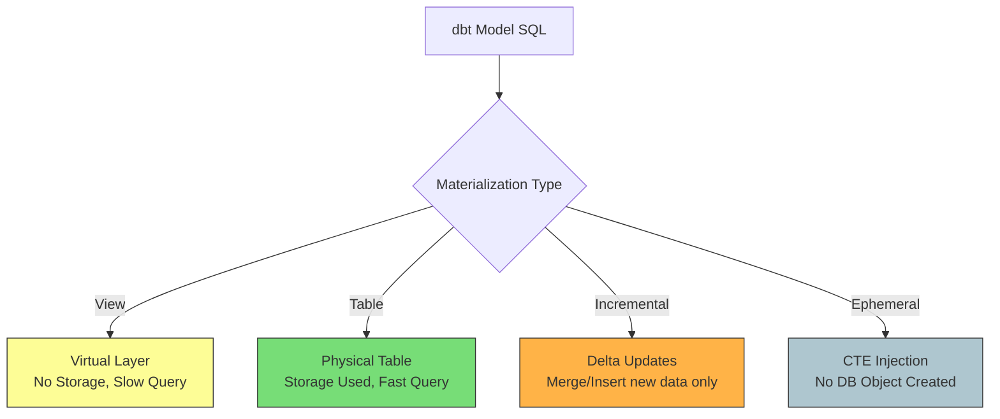

Khi bạn viết một mô hình (model) trong [dbt](/concepts/transformation-analytics/dbt/) (data build tool), về mặt bản chất bạn chỉ đang viết một câu lệnh `SELECT` thuần túy. Vậy làm thế nào để câu lệnh `SELECT` đó biến thành một bảng dữ liệu thực tế hay một khung nhìn ảo trên [Data Warehouse](/concepts/data-warehouse/data-warehouse/) ([Snowflake](/concepts/cloud-data-platform/snowflake/), BigQuery, Redshift,...)? 

Câu trả lời nằm ở **Materialization (Vật liệu hóa / Phương thức lưu trữ)**.

Việc chọn đúng loại materialization là một trong những quyết định quan trọng nhất của một Analytics Engineer. Nó không chỉ ảnh hưởng trực tiếp đến tốc độ chạy của pipeline mà còn quyết định hóa đơn chi phí Cloud hàng tháng của doanh nghiệp.

## Materialization là gì?

Nói một cách đơn giản, **Materialization** là chiến lược xác định cách dbt biên dịch và thực thi mã SQL của bạn trên Data Warehouse. Thay vì bắt bạn phải tự tay viết các câu lệnh DDL (Data Definition Language) phức tạp và dễ lỗi như `CREATE TABLE AS` hay `CREATE VIEW AS`, dbt cho phép bạn tập trung 100% vào logic nghiệp vụ của câu lệnh `SELECT`. dbt sẽ tự động "bọc" câu lệnh của bạn bằng cú pháp tương ứng với chiến lược lưu trữ mà bạn chọn.

## Bốn phương thức lưu trữ cốt lõi trong dbt

dbt cung cấp cho chúng ta 4 loại materialization được xây dựng sẵn:



### 1. View (Mặc định)
Khi cấu hình là View, dbt sẽ tạo ra một khung nhìn logic ảo trên database (`CREATE VIEW AS`). 
* **Đặc điểm**: Phương thức này không chiếm bất kỳ dung lượng đĩa cứng nào vì nó không lưu dữ liệu thực tế. Mỗi khi bạn chạy truy vấn đến View này, cơ sở dữ liệu sẽ phải lục lại logic SQL ban đầu và chạy lại từ đầu.
* **Thời gian build**: Gần như tức thời.

### 2. Table
Với Table, dữ liệu được tính toán trước và ghi vật lý xuống đĩa cứng (`CREATE TABLE AS`).
* **Đặc điểm**: Tốn dung lượng lưu trữ nhưng tốc độ truy vấn sau đó cực kỳ nhanh vì dữ liệu đã nằm sẵn ở đó, không cần tính toán lại.
* **Thời gian build**: Chậm vì phải ghi dữ liệu xuống đĩa.

### 3. Incremental (Cập nhật gia tăng)
Đây là phiên bản nâng cấp của Table dành cho các bảng dữ liệu khổng lồ. Thay vì xóa đi và xây lại toàn bộ bảng (Full Refresh) mỗi ngày, dbt sẽ chỉ chèn (insert) hoặc cập nhật (merge) các dòng dữ liệu mới xuất hiện hoặc có thay đổi kể từ lần chạy cuối cùng.
* **Đặc điểm**: Tiết kiệm tối đa tài nguyên tính toán và chi phí khi làm việc với các bảng dữ liệu hàng trăm triệu dòng.

### 4. Ephemeral (Bảng tạm thời)
Đây là một cơ chế đặc biệt giúp dbt dọn dẹp Data Warehouse. Mô hình cấu hình Ephemeral sẽ không tạo ra bất kỳ đối tượng vật lý hay ảo nào trên database. Khi có một mô hình khác tham chiếu đến nó thông qua hàm `ref()`, dbt sẽ tự động tiêm toàn bộ logic của mô hình Ephemeral này vào dưới dạng một CTE (`WITH ... AS ()`).

---

## Kiến trúc và Cách dbt thực thi Materialization

Khi bạn gõ lệnh `dbt run`, hệ thống sẽ thực hiện các bước sau để đảm bảo an toàn cho dữ liệu và hạn chế tối đa thời gian gián đoạn (downtime) của hệ thống:
1. **Biên dịch (Compile)**: Đọc file SQL và cấu hình (khai báo trong khối `{{ config(materialized='...') }}` ở đầu file hoặc trong file `dbt_project.yml`).
2. **Tạo đối tượng tạm (Temp objects)**: Tạo ra một bảng hoặc view tạm thời (ví dụ: `model_name__dbt_tmp`).
3. **Thực thi DDL**: Chạy câu lệnh SQL để đổ dữ liệu vào bảng tạm đó.
4. **Swap & Drop**: Đổi tên bảng tạm thành bảng chính thức và xóa bảng cũ đi. Quy trình này đảm bảo nếu có lỗi xảy ra trong lúc build, bảng cũ vẫn hoạt động bình thường, không gây ảnh hưởng đến người dùng cuối.

---

## Thực hành: Thiết lập Incremental Materialization

Dưới đây là một ví dụ thực tế về cách cấu hình một mô hình cập nhật gia tăng (Incremental) cho bảng theo dõi sự kiện truy cập web (`pageviews`):

```sql
{{
    config(
        materialized='incremental',
        unique_key='event_id'
    )
}}

SELECT
    event_id,
    user_id,
    page_url,
    event_timestamp
FROM {{ source('web_tracking', 'raw_pageviews') }}

-- Khối logic này chỉ chạy trong các lần chạy incremental, không chạy khi full-refresh


  WHERE event_timestamp >= (SELECT max(event_timestamp) FROM {{ this }})

```

---

## Cân nhắc ưu nhược điểm và kinh nghiệm thực chiến

### So sánh các chiến lược lưu trữ

| Loại | Chi phí Lưu trữ (Storage) | Chi phí Tính toán (Compute) | Thời gian Build | Tốc độ Query sau đó |
|---|---|---|---|---|
| **View** | Không tốn | Cao (mỗi lần query đều chạy lại) | Siêu nhanh | Chậm (nếu logic phức tạp) |
| **Table** | Tốn | Thấp (chỉ tính 1 lần lúc build) | Chậm | Nhanh |
| **Incremental**| Tốn | Siêu thấp (chỉ xử lý delta) | Nhanh | Nhanh |
| **Ephemeral** | Không tốn | Tùy thuộc downstream model | Không tốn | Phụ thuộc downstream |

### Kinh nghiệm xương máu khi triển khai (Best Practices)
* **Bắt đầu từ sự đơn giản (View-first)**: Khi tạo một model mới, hãy luôn để mặc định là View. Chỉ chuyển sang Table khi bạn nhận thấy View đó chạy quá chậm hoặc dashboard BI liên kết với nó bắt đầu bị nghẽn.
* **Tận dụng Ephemeral cho các bước trung gian**: Những mô hình chỉ làm nhiệm vụ dọn dẹp dữ liệu sơ bộ (như rename cột, ép kiểu dữ liệu) và không được query trực tiếp bởi công cụ khác nên được khai báo là Ephemeral để tránh làm rác database của bạn.
* **Luôn đặt unique_key cho Incremental**: Nếu không cấu hình `unique_key`, dbt sẽ chỉ chạy lệnh `INSERT` mỗi lần chạy. Việc này sẽ nhanh chóng làm trùng lặp dữ liệu nếu pipeline của bạn bị chạy lại.
* **Tận dụng tính năng Partition và Cluster**: Hãy kết hợp Table/Incremental với các cấu hình phân vùng (partition) của Data Warehouse (như BigQuery Partition) để tối ưu hóa chi phí quét dữ liệu.

### Những sai lầm phổ biến cần tránh
* **Tạo chuỗi Ephemeral quá dài**: Việc lồng ghép các model Ephemeral gọi lẫn nhau sẽ tạo ra các câu truy vấn SQL lồng CTE cực kỳ phức tạp. Database optimizer sẽ bị quá tải và báo lỗi Out of Memory.
* **Lạm dụng Incremental quá sớm**: Incremental yêu cầu bạn phải tự quản lý logic lọc dữ liệu (`is_incremental()`). Nó rất dễ bị sai lệch số liệu nếu nguồn dữ liệu bị cập nhật hồi tố (historical updates). Chỉ nên dùng khi bảng Table của bạn mất hơn 15-30 phút để build.
* **Quên đặt mệnh đề lọc dữ liệu**: Cấu hình `materialized='incremental'` nhưng không viết block `` sẽ khiến dbt quét sạch toàn bộ dữ liệu nguồn rồi MERGE vào bảng đích. Cách này thậm chí còn chạy chậm và tốn kém hơn cả Table.

---

## Khi nào nên và không nên chọn loại nào?

### View
* **Nên dùng**: Các mô hình Staging ở tầng đầu tiên (chỉ lấy dữ liệu thô, rename, lọc nhẹ), hoặc các logic đơn giản không tốn tài nguyên tính toán.
* **Không nên dùng**: Các bảng Fact hoặc Dimension lớn được truy vấn liên tục bởi các dashboard BI.

### Table
* **Nên dùng**: Các bảng Dimension (khách hàng, sản phẩm) quy mô vừa và nhỏ, hoặc các bảng Fact cần tổng hợp dữ liệu phức tạp.
* **Không nên dùng**: Các bảng lưu trữ log hoặc transaction khổng lồ tăng trưởng hàng triệu dòng mỗi ngày.

### Incremental
* **Nên dùng**: Các bảng Fact khổng lồ lưu trữ logs, clickstreams, transactions.
* **Không nên dùng**: Các bảng nhỏ (dưới vài trăm ngàn dòng) vì chi phí overhead để tìm key và thực hiện lệnh MERGE đôi khi còn lâu hơn việc tạo mới hoàn toàn bảng.

---

## Góc phỏng vấn: Câu hỏi thường gặp

### 1. Phân biệt `is_incremental()` macro và cấu hình incremental materialization trong dbt? Tại sao chúng ta luôn cần cả hai?
* **Mục đích của người phỏng vấn**: Đánh giá xem bạn có thực sự hiểu cơ chế hoạt động bên dưới của dbt hay chỉ học thuộc lòng cú pháp.
* **Gợi ý trả lời**:
  * Cấu hình `materialized='incremental'` nói cho dbt biết chiến lược DDL cần thực thi trên Data Warehouse (sử dụng lệnh `MERGE` hoặc `INSERT` thay vì `CREATE TABLE AS`).
  * Tuy nhiên, nếu chỉ cấu hình như vậy mà không có macro `is_incremental()`, dbt vẫn sẽ quét sạch toàn bộ dữ liệu từ bảng nguồn để merge vào bảng đích, gây lãng phí tài nguyên.
  * Macro `is_incremental()` giúp chúng ta viết câu lệnh lọc dữ liệu động (như `WHERE event_timestamp >= (SELECT max(event_timestamp) FROM {{ this }})`). Nhờ đó, dbt chỉ phải quét và xử lý một lượng nhỏ dữ liệu mới sinh ra, giúp tối ưu hiệu năng chạy.

### 2. Điều gì xảy ra nếu bạn chạy một Incremental model nhưng schema của bảng nguồn đã thay đổi (ví dụ: có thêm cột mới)?
* **Mục đích của người phỏng vấn**: Đánh giá kinh nghiệm thực chiến của bạn trong việc vận hành và bảo trì hệ thống dữ liệu (Schema Evolution).
* **Gợi ý trả lời**:
  * Mặc định, dbt sẽ bỏ qua các cột mới được thêm vào ở bảng nguồn để bảo vệ cấu trúc bảng đích. 
  * Để thay đổi hành vi này, chúng ta có thể cấu hình tham số `on_schema_change` với các giá trị như `append_new_columns` (tự động thêm cột mới vào bảng đích) hoặc `sync_all_columns` (đồng bộ hoàn toàn cấu trúc).
  * Đối với các thay đổi cấu trúc lớn (như đổi kiểu dữ liệu cột), giải pháp an toàn nhất là chạy lệnh `dbt run --full-refresh` để dbt xóa bảng cũ và xây dựng lại toàn bộ cấu trúc mới từ đầu.

### 3. Ephemeral materialization hoạt động như thế nào và khi nào nó có thể gây ra lỗi hiệu năng trong dbt?
* **Gợi ý trả lời**: 
  * Ephemeral materialization không tạo ra bất kỳ bảng hay view nào trong database. Thay vào đó, dbt sẽ tiêm toàn bộ code SQL của model này dưới dạng một Common Table Expression (CTE) vào tất cả các model downstream tham chiếu đến nó.
  * Nó gây lỗi hiệu năng khi bạn lồng ghép quá nhiều model Ephemeral liên tiếp hoặc tham chiếu đến cùng một model Ephemeral ở nhiều nơi trong cùng một truy vấn downstream. Điều này khiến database optimizer phải biên dịch và thực thi cùng một khối logic CTE nhiều lần, làm tăng vọt lượng CPU sử dụng và có thể gây lỗi hết bộ nhớ (OOM).

## Đọc thêm và Tài liệu tham khảo

1. [dbt Models (Mô hình dbt)](/concepts/transformation-analytics/dbt-models/) - Quản lý các tầng biến đổi dữ liệu.
2. [dbt Testing (Kiểm thử dbt)](/concepts/transformation-analytics/dbt-testing/) - Tích hợp kiểm thử chất lượng dữ liệu.
3. [Data Warehouse (Kho dữ liệu)](/concepts/data-warehouse/data-warehouse/) - Hệ thống lưu trữ dữ liệu phân tích tập trung.
4. **dbt Labs Documentation** - *Materializations*.
5. **Data Pipelines Pocket Reference** - James Densmore.

---

## English summary

In dbt, materialization refers to the strategies defining how an underlying SQL model is instantiated in the target Data Warehouse. The four primary materializations are **View** (virtual layer, zero build time but slow query), **Table** (physical instantiation, fast query but slow build), **Incremental** (inserting or updating only new data to an existing table to save compute time on massive datasets), and **Ephemeral** (compiled directly as CTEs within downstream models without physical persistence). Choosing the correct materialization is crucial for optimizing cloud compute costs, storage, and pipeline execution time.
