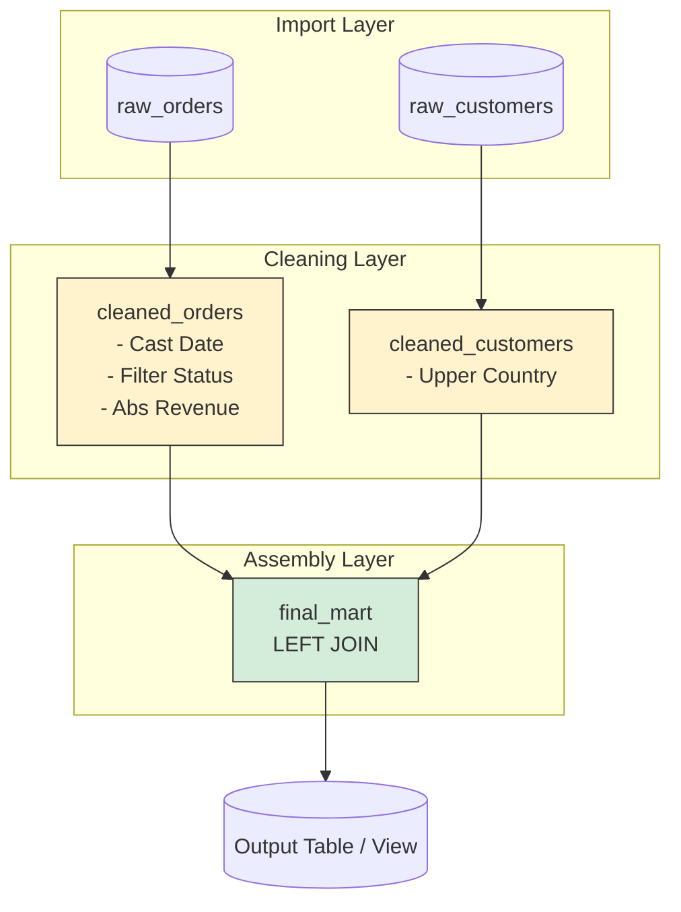

Hãy tưởng tượng bạn đang có một kho chứa đầy nguyên liệu thô (Raw Data) được thu thập từ khắp nơi về. Chúng hỗn loạn, móp méo và chưa thể sử dụng ngay được. **SQL Transformation** chính là quá trình chúng ta vào bếp, sử dụng ngôn ngữ truy vấn có cấu trúc (SQL) làm công cụ chính để làm sạch, sơ chế, kết hợp và biến đổi đống nguyên liệu thô ấy thành những "món ăn" dữ liệu thơm ngon, sẵn sàng phục vụ cho việc phân tích và ra quyết định kinh doanh (Business-ready Data).

Với sự trỗi dậy mạnh mẽ của các siêu máy tính Cloud Data Warehouse như [Snowflake](/concepts/cloud-data-platform/snowflake/) hay BigQuery, SQL đã quay trở lại vị trí "ngôn ngữ mẹ đẻ" thống trị toàn bộ mảng chuyển đổi dữ liệu, vượt qua cả các framework lập trình phức tạp.

## Sự trỗi dậy của SQL trong kỷ nguyên đám mây và ELT

Nửa thập kỷ trước, trong thời kỳ hoàng kim của Hadoop và Big Data (mô hình [ETL](/concepts/etl-elt/etl/) truyền thống), nhiều người từng nghĩ SQL đã "hết thời". Họ cho rằng SQL không thể mở rộng (not scalable). Quá trình biến đổi dữ liệu khi đó thường được thực hiện bên ngoài kho dữ liệu bằng Python, Java hoặc Scala (thông qua MapReduce hay Spark). Cách tiếp cận này vô tình dựng lên một rào cản lớn: nó đòi hỏi đội ngũ Data Engineer phải cực kỳ giỏi lập trình, trong khi các Data Analyst – những người hiểu rõ nghiệp vụ nhất – lại không thể chạm tay vào logic biến đổi dữ liệu.

Tuy nhiên, từ năm 2016 trở đi, cục diện hoàn toàn thay đổi. Các Cloud Data Warehouse chứng minh rằng chúng có thể xử lý hàng Petabytes dữ liệu bằng câu lệnh SQL chỉ trong nháy mắt. Mô hình dịch chuyển từ ETL sang **[ELT](/concepts/etl-elt/elt/)** (Extract, Load, rồi mới Transform). SQL Transformation trở thành ngôi sao sáng nhờ ba lý do cốt lõi:

1. **Dân chủ hóa dữ liệu (Data Democratization):** Hầu như ai làm việc với dữ liệu cũng biết SQL. Nhờ SQL Transformation, hàng triệu Data Analyst giờ đây có thể tự tay xây dựng pipeline chuyển đổi dữ liệu mà không cần phụ thuộc hoàn toàn vào Data Engineer.
2. **Không tốn chi phí di chuyển dữ liệu:** Thay vì mất công copy hàng triệu dòng dữ liệu từ Database ra một máy chủ Python riêng để tính toán rồi lại lưu ngược trở lại, SQL Transformation thực thi logic trực tiếp ngay tại nơi lưu trữ dữ liệu (Push-down compute).
3. **Hiệu năng vượt trội:** Các SQL engine hiện đại được tối ưu hóa sâu ở mức độ phần cứng (Vectorized Processing), giúp chạy các phép JOIN trên hàng tỷ dòng dữ liệu mượt mà hơn nhiều so với việc tự viết code Python thông thường.

## Từ dữ liệu thô đến sản phẩm hoàn chỉnh: Cách thức vận hành

Trong một đường ống dẫn dữ liệu ([Data Pipeline](/concepts/foundation/data-pipeline/)), quá trình biến đổi (T - Transform) bao gồm các thao tác cơ bản nhưng vô cùng quan trọng:
* **Làm sạch (Cleaning):** Loại bỏ dữ liệu rác, xử lý giá trị NULL và khử trùng lặp ([Deduplication](/concepts/etl-elt/deduplication/)).
* **Ép kiểu (Casting):** Đồng nhất định dạng, ví dụ chuyển chuỗi chữ số thành số nguyên (`INT`), chuyển đổi các định dạng ngày tháng khác nhau về một chuẩn `DATE`.
* **Hợp nhất (Joining):** Kết nối dữ liệu phân mảnh từ nhiều nguồn khác nhau (ví dụ: nối bảng Đơn hàng với bảng Khách hàng).
* **Gom nhóm (Aggregating):** Tính tổng doanh thu theo tháng, tính trung bình chi tiêu của khách hàng.

Để không bị rối khi xử lý logic phức tạp, một quy trình SQL Transformation chuẩn sẽ áp dụng chiến thuật "chia để trị" thông qua các tầng dữ liệu:

* **Tầng 1 (Raw $\rightarrow$ Staging):** Thực hiện dọn dẹp nhẹ nhàng như đổi tên cột cho chuẩn `snake_case`, ép kiểu dữ liệu.
* **Tầng 2 (Staging $\rightarrow$ Intermediate):** Sử dụng các Window Function phức tạp để tính toán các logic nghiệp vụ trung gian.
* **Tầng 3 (Intermediate $\rightarrow$ Marts):** Kết hợp các bảng trung gian lại (`JOIN`) và gom nhóm (`GROUP BY`) để tạo ra các mô hình dữ liệu đa chiều (Dimensional Model) cuối cùng phục vụ cho báo cáo.

> [!NOTE]
> Công cụ [dbt (data build tool)](/concepts/transformation-analytics/dbt/) ra đời chính là để giúp chúng ta quản lý cấu trúc chia tầng này một cách chuyên nghiệp và tự động.

## Kiến trúc luồng dữ liệu chuẩn mực với CTE Pattern

Một trong những thiết kế kinh điển và chuẩn mực nhất khi viết SQL Transformation là sử dụng **CTE (Common Table Expression)** thay thế hoàn toàn cho các sub-query lồng nhau. Hãy xem sơ đồ luồng dữ liệu dưới đây:


Dưới đây là mã SQL minh họa cho luồng biến đổi trên bằng cách áp dụng CTE:
```sql
-- Pattern chuẩn mực Analytics Engineering (Sử dụng CTE)

WITH 
-- 1. Khai báo nguồn dữ liệu đầu vào (Import layer)
raw_orders AS (
    SELECT * FROM my_db.raw_schema.sales_orders
),

raw_customers AS (
    SELECT * FROM my_db.raw_schema.customers
),

-- 2. Tầng làm sạch độc lập (Cleaning layer)
cleaned_orders AS (
    SELECT
        order_id,
        customer_id,
        CAST(order_date AS DATE) AS order_date,
        ABS(revenue) AS revenue -- Sửa lỗi âm tiền
    FROM raw_orders
    WHERE status != 'cancelled'
),

cleaned_customers AS (
    SELECT
        customer_id,
        UPPER(country) AS country_code
    FROM raw_customers
),

-- 3. Tầng hội tụ nghiệp vụ (Final Assembly)
final_mart AS (
    SELECT
        o.order_id,
        c.country_code,
        o.order_date,
        o.revenue
    FROM cleaned_orders o
    LEFT JOIN cleaned_customers c 
        ON o.customer_id = c.customer_id
)

-- 4. Xuất dữ liệu cuối cùng
SELECT * FROM final_mart;
```

## Nghệ thuật viết SQL: Best Practices và những cạm bẫy cần tránh

### Những nguyên tắc vàng (Best Practices)
* **Dùng CTE (`WITH`) thay vì Sub-query:** Viết sub-query lồng nhau (`SELECT * FROM (SELECT * FROM ...)`) bắt người đọc phải phân tích từ trong ra ngoài, cực kỳ hại não. CTE giúp mã nguồn của bạn chạy tuyến tính từ trên xuống dưới hệt như một câu chuyện kể.
* **Đồng nhất quy ước đặt tên (Naming Conventions):** Hãy đặt ra quy tắc rõ ràng và tuân thủ nó. Ví dụ: hậu tố `_id` cho khóa chính/khóa ngoại, `_at` hoặc `_tz` cho mốc thời gian, và tiền tố `is_` hoặc `has_` cho kiểu đúng/sai (`is_active`, `has_delivered`).
* **Khai thác sức mạnh của Window Functions:** Đây là vũ khí tối tân của SQL hiện đại. Khi cần lọc trùng dữ liệu (Deduplication) để lấy bản ghi mới nhất, thay vì viết `JOIN` phức tạp với hàm `MAX()`, hãy dùng `ROW_NUMBER() OVER(PARTITION BY id ORDER BY updated_at DESC)`.
* **Nói không với `SELECT *` ở tầng cuối:** Hãy luôn liệt kê tường minh tên từng cột ở kết quả đầu ra. Điều này giúp bạn kiểm soát chặt chẽ schema và tránh việc hệ thống nguồn tự ý thêm cột rác làm hỏng báo cáo phía sau.

### Những sai lầm kinh điển (Common Mistakes)
* **Thảm họa "Fan-out" khi JOIN:** Đây là lỗi cực kỳ nguy hiểm. Giả sử bạn có bảng Đơn hàng (100 dòng) mang đi `LEFT JOIN` với bảng Lịch sử khách hàng (trong đó có khách hàng sở hữu 2 dòng lịch sử). Kết quả sau JOIN bị phình lên thành 150 dòng. Khi bạn chạy hàm `SUM(revenue)`, doanh thu sẽ bị nhân đôi nhân ba một cách thầm lặng mà không hề báo lỗi. Luôn nhớ khử trùng lặp bảng phụ trước khi thực hiện JOIN.
* **Làm nghẽn mạng do Data Shuffling vô tội vạ:** Sử dụng `ORDER BY` trên tập dữ liệu hàng tỷ dòng trong các bước trung gian của Cloud Data Warehouse. Hành động này bắt các node trong cluster phải liên tục trao đổi dữ liệu với nhau qua mạng để sắp xếp thứ tự, gây lãng phí tài nguyên và làm chậm pipeline. Hãy chỉ dùng `ORDER BY` ở câu lệnh SELECT cuối cùng phục vụ hiển thị.

## Đánh đổi và giới hạn của SQL Transformation

### Điểm mạnh
* Dễ học, dễ viết, dễ tìm kiếm nhân sự phù hợp.
* Logic biến đổi tường minh, trực quan và dễ dàng review code hơn các hàm Python Pandas phức tạp.
* Tận dụng tối đa năng lực xử lý phân tán mạnh mẽ của Cloud Data Warehouse.

### Điểm yếu
* **Rất tệ khi xử lý cấu trúc phức tạp:** Nếu bạn phải bóc tách các mảng (Arrays) hoặc tài liệu JSON lồng nhau nhiều cấp, câu lệnh SQL unnest trông sẽ rất đáng sợ và khó bảo trì.
* **Không phù hợp cho Machine Learning:** SQL không phải là công cụ để huấn luyện các mô hình AI/ML phức tạp.
* **Thiếu tính hướng đối tượng (OOP):** Việc tái sử dụng code SQL thuần khá khó khăn. Tuy nhiên, vấn đề này đã được khắc phục phần nào nhờ cơ chế Jinja Macros trong công cụ dbt.

## Khi nào nên và không nên chọn SQL Transformation?

**Nên chọn khi:**
* Bạn có 90% nhu cầu biến đổi dữ liệu dạng bảng (Tabular/Relational Data) từ các hệ thống nguồn như CRM, ERP vào Data Warehouse.
* Bạn muốn xây dựng mô hình tự phục vụ (Self-service analytics), cho phép các Analytics Engineer hoặc Data Analyst tự chủ động xây dựng logic báo cáo.

**Nên tránh khi:**
* Cần xử lý dữ liệu phi cấu trúc như hình ảnh, âm thanh, hoặc phân tích văn bản tự do (NLP) - lúc này Python/Spark là lựa chọn tốt hơn.
* Yêu cầu xử lý dữ liệu dòng chảy (Streaming) thời gian thực với độ trễ mili-giây (hãy nghĩ tới Apache Flink hoặc Java).
* Kích thước dữ liệu vượt quá giới hạn và khả năng tối ưu chi phí của Data Warehouse, cần tính toán song song quy mô cực lớn ở tầng hạ tầng chuyên biệt (như Spark trên EMR).

## Khái niệm liên quan & Tài liệu tham khảo

**Khái niệm liên quan:**
* [dbt (data build tool)](/concepts/transformation-analytics/dbt/)
* [Data Warehouse - Kho dữ liệu](/concepts/data-warehouse/data-warehouse/)
* [OLAP - Xử lý phân tích trực tuyến](/concepts/database-storage/olap/)

**Tài liệu tham khảo:**
1. **dbt Labs Blog** - *What is Analytics Engineering?*
2. **Data Pipelines Pocket Reference** - *James Densmore*.
3. **The Data Warehouse Toolkit** - *Ralph Kimball*.

---

## Góc phỏng vấn: Các câu hỏi thường gặp

### 1. Sự khác biệt kiến trúc giữa ETL và ELT là gì? Tại sao Cloud Data Warehouse lại thúc đẩy xu hướng ELT?
**Gợi ý trả lời:**
ETL truyền thống yêu cầu một máy chủ tính toán độc lập ở giữa (ví dụ chạy Spark/Python) để thực hiện biến đổi dữ liệu (Transform) trước khi nạp vào kho dữ liệu. Điều này tốn chi phí vận chuyển dữ liệu qua mạng và duy trì hai hệ thống riêng biệt. 

Ngược lại, ELT đẩy trực tiếp dữ liệu thô vào kho (Extract & Load), sau đó dùng chính SQL Engine nội bộ siêu mạnh của Cloud Data Warehouse (như Snowflake, BigQuery) để thực hiện biến đổi (Transform). CDW tận dụng lưu trữ dạng cột (Columnar Storage) và khả năng tính toán phân tán co giãn vô hạn giúp việc chạy SQL biến đổi dữ liệu trở nên cực kỳ nhanh và tiết kiệm chi phí.

### 2. Kỹ thuật chống "Fan-out" (nhân bản dữ liệu) khi thực hiện LEFT JOIN trong SQL là gì?
**Gợi ý trả lời:**
Hiện tượng Fan-out xảy ra khi khóa JOIN ở bảng bên phải không phải là duy nhất (Unique), dẫn đến việc một dòng ở bảng bên trái khớp với nhiều dòng ở bảng bên phải và bị nhân bản lên. 

Để khắc phục, chúng ta phải xử lý bảng bên phải trước khi JOIN để đảm bảo quan hệ là 1-1 hoặc N-1. Ta có thể dùng CTE để `GROUP BY` theo khóa chính của bảng bên phải hoặc sử dụng Window Function `ROW_NUMBER() OVER (PARTITION BY join_key ORDER BY updated_at DESC)` rồi lọc lấy dòng đầu tiên (`row_number = 1`) trước khi mang đi JOIN.

### 3. Tại sao trong môi trường Data Warehouse, việc sử dụng CTEs (mệnh đề `WITH`) lại được khuyến khích hơn Sub-queries truyền thống?
**Gợi ý trả lời:**
* **Độ đọc hiểu (Readability):** Sub-query bắt người đọc phải phân tích lồng nhau từ trong ra ngoài, còn CTE giúp chia nhỏ logic và đọc tuần tự từ trên xuống dưới giống như các bước của một dây chuyền sản xuất.
* **Tái sử dụng code:** Một CTE có thể được tham chiếu nhiều lần trong cùng một câu truy vấn, giúp tránh lặp lại code.
* **Tối ưu hóa:** Hầu hết các Optimizer của các Data Warehouse hiện đại đều xử lý CTE rất tốt, thậm chí đôi khi còn tối ưu hơn sub-query thông thường.

### 4. Bảng Dimensional Model yêu cầu tạo ra các ID giả (Surrogate Keys). Làm thế nào để tự tạo ra một ID duy nhất trên toàn cụm phân tán bằng SQL?
**Gợi ý trả lời:**
Trong hệ thống phân tán, việc sử dụng cơ chế tự tăng (`AUTO_INCREMENT` 1, 2, 3...) là một nút thắt cổ chai lớn vì các node cần giao tiếp với nhau để đồng bộ số thứ tự. 

Giải pháp chuẩn là sử dụng phương pháp băm (Hashing). Chúng ta kết hợp các khóa tự nhiên (Natural Keys) tạo nên tính duy nhất của bản ghi thành một chuỗi, sau đó chạy qua hàm băm như `MD5` hoặc `SHA256` để tạo ra chuỗi định danh duy nhất (Surrogate Key). Ví dụ trong dbt, chúng ta hay dùng macro `generate_surrogate_key` để tự động hóa việc này.

### 5. Dữ liệu của bạn là tập bản ghi sự kiện có cột `status` và `changed_at`. Bạn muốn tính xem mỗi status (VD: 'Pending') đã tồn tại trong bao nhiêu giây trước khi chuyển sang status khác. Bạn sẽ viết SQL như thế nào?
**Gợi ý trả lời:**
Bài toán này có thể giải quyết hoàn hảo bằng Window Function `LEAD()`. Chúng ta sử dụng `LEAD(changed_at) OVER (PARTITION BY order_id ORDER BY changed_at ASC)` để lấy mốc thời gian của trạng thái kế tiếp và đưa lên dòng hiện tại (đặt tên cột là `next_changed_at`). Sau đó, chỉ cần sử dụng hàm tính khoảng cách thời gian giữa `changed_at` và `next_changed_at` (như `DATEDIFF` hoặc trừ trực tiếp tùy database) là ra được số giây tồn tại của trạng thái đó.

---

## English summary

**SQL Transformation** is the process of applying Data Manipulation Language (DML) logic via SQL to clean, standardize, join, and aggregate raw data residing directly inside a Data Warehouse. Driven by the massive computational capabilities of modern cloud columnar engines (like Snowflake and BigQuery), the industry has shifted from ETL to ELT, repositioning SQL as the dominant programming language for data transformations. Utilizing features like Common Table Expressions (CTEs) for modularity and Window Functions for complex event handling, SQL Transformation enables data analysts (Analytics Engineers) to democratize pipeline development while maintaining software engineering rigor through tools like dbt.