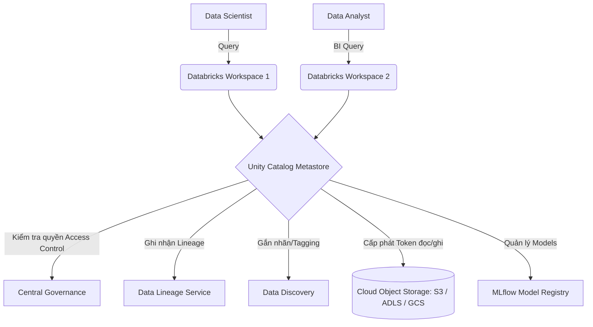

# Unity Catalog: Người gác đền thông minh cho Data Lakehouse

Trong kiến trúc dữ liệu hiện đại, việc lưu trữ hàng Petabyte dữ liệu trên Data Lake giờ đây đã trở nên đơn giản và tiết kiệm. Thế nhưng, câu hỏi hóc búa đặt ra là: Làm thế nào để kiểm soát được ai có quyền xem bảng nào? Làm sao che đi các thông tin nhạy cảm của khách hàng như số điện thoại, số thẻ tín dụng mà không phải copy ra bảng khác? Và làm thế nào để biết một bảng dữ liệu báo cáo được tạo ra từ những nguồn nào? 

Để trả lời những câu hỏi đó, Databricks đã cho ra đời **Unity Catalog** – giải pháp quản trị dữ liệu (Data Governance) và tài sản AI tập trung, đóng vai trò như một "người gác đền" thông minh và tin cậy cho cấu trúc Data Lakehouse.

## Unity Catalog là gì? Tấm khiên quản trị dữ liệu tập trung

Về mặt kiến trúc, **Unity Catalog** là một lớp quản trị (Governance Layer) thống nhất nằm ngay phía trên kho lưu trữ đám mây (như AWS S3, Azure ADLS, hay Google Cloud Storage). 

Thay vì phải cấu hình các quyền truy cập tệp tin phức tạp và rời rạc trên Cloud IAM của từng nhà cung cấp đám mây, hoặc quản lý quyền truy cập riêng rẽ trên từng Workspace độc lập, Unity Catalog cho phép bạn sử dụng cú pháp ANSI SQL tiêu chuẩn để cấp quyền (`GRANT`/`REVOKE`) chi tiết đến tận cấp độ bảng, dòng, cột hoặc thậm chí là các mô hình Machine Learning và các Dashboard báo cáo.

## Tại sao quản trị dữ liệu trên Data Lake từng là một cơn ác mộng?

Trước khi Unity Catalog và các công cụ quản trị dữ liệu hiện đại xuất hiện, việc thiết lập bảo mật trên Data Lake là nỗi ám ảnh của các Data Engineer và Cloud Admin:

1. **Quyền truy cập bị phân mảnh:** Quản trị viên phải cấu hình quyền đọc file trên Cloud IAM (như AWS IAM, Azure RBAC) và đồng thời phải quản lý tài khoản, quyền hạn trên nhiều Workspace khác nhau của doanh nghiệp.
2. **Không hỗ trợ bảo mật cấp độ dòng/cột (Row/Column-level security):** Nếu bạn muốn chia sẻ bảng Khách hàng cho bộ phận Marketing nhưng cần che đi cột số điện thoại, giải pháp duy nhất lúc đó là nhân bản dữ liệu, tạo ra một bảng copy đã lược bỏ cột nhạy cảm. Việc này làm phình to chi phí lưu trữ và rất khó đồng bộ.
3. **Mất dấu vết dòng chảy dữ liệu (Data Lineage):** Khi một con số trên báo cáo BI bị sai lệch, các kỹ sư dữ liệu phải tốn hàng giờ, thậm chí hàng ngày để rà soát thủ công xem bảng báo cáo đó được tổng hợp từ những nguồn nào (Lineage), do ai viết logic và việc sửa đổi sẽ ảnh hưởng đến những hệ thống nào phía sau.
4. **Sự tách rời giữa Dữ liệu và AI:** Các mô hình Machine Learning (ML Models) được huấn luyện một nơi, còn tập dữ liệu dùng để huấn luyện lại được lưu trữ ở một nẻo, không có sự liên kết chặt chẽ nào về mặt quản trị.

Unity Catalog ra đời để giải quyết triệt để tất cả các nút thắt trên bằng cách cung cấp một giao diện quản lý duy nhất (Single Pane of Glass) cho toàn bộ tài sản Dữ liệu và AI của doanh nghiệp.

## Những trụ cột cốt lõi của Unity Catalog

* **Cấu trúc đặt tên 3 tầng (3-level Namespace):** Khác với các hệ thống cũ chỉ có 2 cấp tên (`schema.table`), Unity Catalog nâng cấp lên mô hình 3 cấp: `catalog.schema.table`. Cấu trúc này giúp doanh nghiệp dễ dàng phân tách dữ liệu theo môi trường phát triển (`dev`, `staging`, `prod`) hoặc phân chia theo các phòng ban nghiệp vụ một cách mạch lạc.
* **Tách biệt tuyệt đối giữa Storage và Compute:** Các chính sách bảo mật và quyền hạn của Unity Catalog được thực thi đồng bộ, bất kể người dùng truy cập dữ liệu thông qua Spark Cluster, SQL Warehouse hay gọi qua các API bên ngoài.
* **Tự động theo dõi dòng chảy dữ liệu (Automated Lineage):** Hệ thống sẽ tự động ghi chép và vẽ sơ đồ mối quan hệ giữa các bảng dữ liệu mỗi khi có các câu lệnh SQL như `INSERT`, `MERGE` hay `CREATE TABLE AS SELECT` chạy qua.

## Sơ đồ kiến trúc hoạt động

Dưới đây là mô hình hoạt động của Unity Catalog kiểm soát luồng truy cập dữ liệu từ nhiều đối tượng người dùng khác nhau:



## Ví dụ thực tế: Che giấu dữ liệu nhạy cảm ở cấp độ dòng (Row-level security)

Giả sử bạn có bảng giao dịch `transactions` chứa dữ liệu của toàn quốc. Bạn chỉ muốn các nhân viên thuộc chi nhánh Hà Nội xem được các giao dịch phát sinh ở khu vực Hà Nội. 

Với Unity Catalog, bạn có thể giải quyết bài toán này cực kỳ thanh lịch bằng cách tạo một Function lọc dữ liệu và gắn nó trực tiếp vào bảng:

```sql
-- 1. Tạo một function kiểm tra quyền của người dùng hiện tại
CREATE FUNCTION region_filter(region_name STRING)
RETURN IF(
    IS_ACCOUNT_GROUP_MEMBER('admin'), 
    true, 
    region_name = CURRENT_USER_REGION()
);

-- 2. Gắn function lọc này vào cột region của bảng transactions
ALTER TABLE main.sales.transactions 
SET ROW FILTER region_filter ON (region);

-- 3. Cấp quyền truy cập cho nhóm sales
GRANT SELECT ON TABLE main.sales.transactions TO `sales_team`;
```

Khi một nhân viên thuộc chi nhánh Hà Nội chạy lệnh `SELECT * FROM main.sales.transactions`, Unity Catalog sẽ tự động lọc và chỉ hiển thị các dòng dữ liệu có `region = 'Hanoi'` mà không cần phải nhân bản dữ liệu hay tạo thêm các bảng phụ.

## Thiết lập Unity Catalog chuẩn: Best Practices và lỗi cần tránh

### Các Best Practices nên áp dụng
* **Cấu trúc Catalog theo môi trường (SDLC):** Hãy thiết kế các Catalog ở cấp độ cao nhất tương ứng với các môi trường làm việc: `dev_catalog`, `staging_catalog`, và `prod_catalog`. Các Schema bên trong Catalog sẽ được chia theo các miền nghiệp vụ (ví dụ: `prod_catalog.marketing.campaigns`).
* **Sử dụng Managed Tables cho dữ liệu lõi:** Hãy để Unity Catalog chịu trách nhiệm quản lý hoàn toàn vòng đời của các bảng quan trọng (Managed Tables). Khi bạn chạy lệnh `DROP TABLE`, Unity Catalog sẽ tự động dọn dẹp sạch sẽ các tệp tin dữ liệu vật lý tương ứng trên Cloud Storage.
* **Chăm viết Comment và gắn Tag cho dữ liệu:** Hãy tận dụng lệnh `COMMENT ON COLUMN` để giải thích ý nghĩa các cột dữ liệu. Unity Catalog sở hữu bộ tìm kiếm thông minh tích hợp AI, cho phép người dùng chỉ cần gõ "Doanh thu quý 1" là hệ thống tự động tìm ra đúng bảng đích dù tên bảng được viết tắt dạng `q1_rev_fct`.

### Những sai lầm phổ biến
* **Cấp quyền trực tiếp cho từng cá nhân:** Tuyệt đối không sử dụng lệnh `GRANT` trực tiếp cho một địa chỉ email cụ thể (ví dụ: `GRANT SELECT ... TO 'john@company.com'`). Việc này sẽ khiến hệ thống cấp quyền trở nên hỗn loạn và rất khó thu hồi khi nhân sự nghỉ việc. Hãy luôn tạo các Group (như `data_engineers`, `marketing_analysts`) và cấp quyền thông qua Group.
* **Mập mờ giữa Hive Metastore cũ và Unity Catalog:** Các hệ thống Databricks đời cũ sử dụng Hive Metastore cục bộ (chỉ hỗ trợ 2 cấp tên). Khi nâng cấp lên Unity Catalog, nếu không dọn dẹp hoặc khóa Hive Metastore cũ, các Data Analyst sẽ rất dễ bị bối rối và truy vấn nhầm vào các bảng dữ liệu cũ không còn chuẩn xác.

## Những đánh đổi khi áp dụng Unity Catalog

### Điểm mạnh
* Loại bỏ triệt để các ốc đảo dữ liệu (Data Silos), quản lý tập trung toàn bộ tài sản dữ liệu từ một nơi duy nhất.
* Nhật ký kiểm toán (Audit Log) chi tiết và tập trung: Ghi nhận chính xác ai đã đọc/ghi vào cột dữ liệu nhạy cảm nào vào lúc nào, giúp doanh nghiệp dễ dàng vượt qua các kỳ kiểm tra tuân thủ bảo mật (GDPR, HIPAA).
* Hỗ trợ chia sẻ dữ liệu ra bên ngoài doanh nghiệp một cách an toàn và nhanh chóng bằng cơ chế Delta Sharing mà không cần thực hiện copy dữ liệu.

### Điểm yếu
* **Sự ràng buộc hệ sinh thái (Vendor Lock-in):** Mặc dù Databricks đã mã nguồn mở một phần của Unity Catalog, nhưng trải nghiệm tối ưu nhất của công cụ này vẫn nằm gọn trong hệ sinh thái của Databricks.
* Việc thiết lập ban đầu (setup Storage Credentials, kết nối IAM Roles) khá phức tạp, đòi hỏi sự phối hợp chặt chẽ giữa đội ngũ Data Engineer và các quản trị viên Cloud/DevOps.

## Khái niệm liên quan & Tài liệu tham khảo

**Khái niệm liên quan:**
* [Data Warehouse - Kho dữ liệu](/concepts/data-warehouse)
* [Data Lake - Hồ dữ liệu](/concepts/data-lake)

**Tài liệu tham khảo:**
1. **Databricks Documentation** - *What is Unity Catalog?*
2. **Data Governance: The Definitive Guide** - *Evren Eryurek et al.*

---

## Góc phỏng vấn: Câu hỏi thường gặp

### 1. Sự khác biệt cốt lõi giữa Hive Metastore truyền thống và Unity Catalog trong Databricks là gì?
**Gợi ý trả lời:**
* **Hive Metastore (HMS):** Là giải pháp quản trị cũ gắn liền với từng Workspace độc lập. Nó chỉ hỗ trợ cấu trúc đặt tên 2 cấp (`schema.table`) và không có cơ chế quản lý bảo mật chi tiết cấp độ hàng/cột, không hỗ trợ theo dõi dòng chảy dữ liệu (Data Lineage) và phụ thuộc hoàn toàn vào cấu hình IAM của đám mây.
* **Unity Catalog:** Là giải pháp quản trị cấp độ tài khoản (Account-level), hoạt động xuyên suốt qua tất cả các Workspace. Nó nâng cấp lên cấu trúc đặt tên 3 cấp (`catalog.schema.table`), cho phép quản lý quyền truy cập chi tiết đến cấp độ hàng/cột bằng SQL, tự động vẽ sơ đồ dòng chảy dữ liệu (Lineage) và quản trị tập trung cả các mô hình Machine Learning lẫn tài sản AI.

### 2. Làm thế nào để triển khai tính năng che giấu dữ liệu (Data Masking) cho các cột chứa thông tin PII nhạy cảm trong Unity Catalog?
**Gợi ý trả lời:**
Chúng ta có thể sử dụng tính năng **Column Masking** của Unity Catalog. Quy trình thực hiện gồm hai bước:
* Tạo một SQL Function kiểm tra quyền của người dùng hiện tại (ví dụ: dùng hàm `IS_ACCOUNT_GROUP_MEMBER('hr_team')`). Nếu người dùng thuộc nhóm HR, trả về giá trị thực; nếu không, trả về chuỗi đã được che giấu như `***-***-****`.
* Sử dụng lệnh `ALTER TABLE` để gắn function này vào cột dữ liệu nhạy cảm cần bảo vệ.
Dữ liệu vật lý lưu trữ bên dưới Cloud Storage hoàn toàn không bị thay đổi, nhưng khi người dùng thực hiện lệnh `SELECT`, Unity Catalog sẽ tự động kiểm tra danh tính của họ để ẩn hoặc hiện dữ liệu tương ứng theo thời gian thực.

---

## English summary

Unity Catalog is Databricks' flagship, centralized data and AI governance solution for the Lakehouse architecture. Operating above the cloud storage layer, it breaks down data silos by providing a single, account-wide Metastore across all workspaces. Utilizing a 3-level namespace (`catalog.schema.table`), Unity Catalog enables fine-grained access control (Row and Column-level security) via standard ANSI SQL, automated data lineage tracking, and seamless integration with ML model management. It eliminates the complexities of raw cloud IAM configurations, offering a unified pane of glass for compliance, auditing, and secure data sharing across the enterprise.
