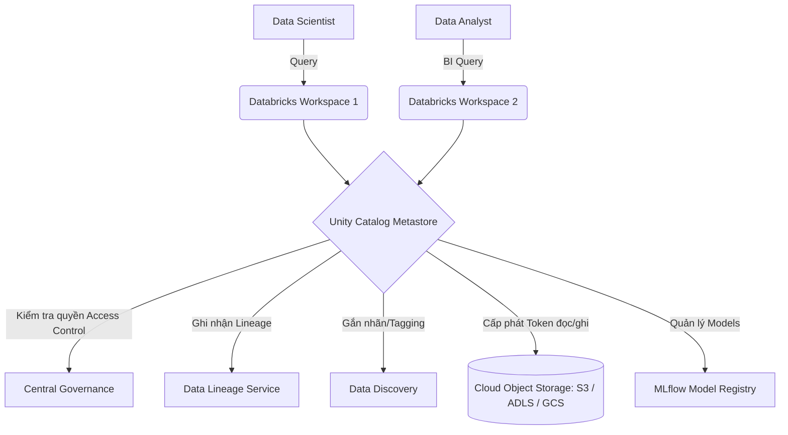

# Unity Catalog

## Summary

Unity Catalog là giải pháp quản trị dữ liệu (Data Governance) tập trung dành cho cấu trúc Data Lakehouse, được phát triển bởi Databricks. Nó cung cấp một giao diện quản lý duy nhất để cấu hình quyền truy cập (Access Control), theo dõi dòng chảy dữ liệu (Data Lineage), và khám phá tài sản (Data Discovery) cho cả dữ liệu có cấu trúc (Tables), phi cấu trúc (Files) lẫn các tài sản AI (ML Models, Dashboards) trên mọi không gian làm việc (Workspaces).

---

## Definition

Trong kiến trúc dữ liệu hiện đại, **Unity Catalog** đóng vai trò là một lớp quản trị (Governance Layer) đặt phía trên kho lưu trữ đám mây (Cloud Storage). Thay vì quản lý quyền truy cập rời rạc trên từng cụm tính toán (cluster) hoặc từng thư mục S3/ADLS bằng các quyền IAM phức tạp, Unity Catalog cung cấp chuẩn ANSI SQL để cấp quyền (GRANT/REVOKE) ở cấp độ bảng, cột, hoặc hàng. 

---

## Why it exists

Trước khi có Unity Catalog (và các Data Catalog hiện đại khác), quản trị dữ liệu trên Data Lake / Lakehouse là một cơn ác mộng:
1. **Phân mảnh quyền truy cập**: Quản trị viên phải cấp quyền truy cập file trên Cloud IAM (AWS IAM, Azure RBAC) và đồng thời quản lý quyền trên các Workspace độc lập.
2. **Không có quyền cấp độ cột (Column/Row-level security)**: Rất khó để chia sẻ một bảng dữ liệu mà che đi (masking) cột số điện thoại hoặc mã thẻ tín dụng của khách hàng. Phải tạo ra các bảng copy rất tốn kém.
3. **Mất dấu dòng chảy dữ liệu (No Lineage)**: Khi một bảng báo cáo bị sai số, Data Engineer không biết bảng này được sinh ra từ những bảng nguồn nào, do ai viết và ảnh hưởng đến những Dashboard nào (Impact Analysis).
4. **Quản lý AI Model rời rạc**: Mô hình Machine Learning và dữ liệu dùng để huấn luyện mô hình đó không được kết nối với nhau.

Unity Catalog ra đời để giải quyết bài toán: **Một nơi duy nhất (Single Pane of Glass)** để quản lý bảo mật và khám phá cho toàn bộ tài nguyên Dữ liệu và AI.

---

## Core idea

* **Namespace 3 tầng (3-level Namespace)**: Unity Catalog tổ chức dữ liệu theo mô hình 3 cấp `catalog.schema.table` thay vì mô hình 2 cấp truyền thống. Điều này cho phép tách biệt dữ liệu môi trường (Dev/Prod) hoặc phòng ban (Marketing/HR) cực kỳ rõ ràng.
* **Tách biệt Storage và Compute**: Tính năng quản trị được thực thi bất kể bạn dùng SQL Warehouse, Spark Cluster hay truy cập qua API.
* **Lineage tự động**: Tự động bắt và vẽ sơ đồ mối quan hệ giữa các bảng dữ liệu mỗi khi có câu lệnh SQL `INSERT`, `MERGE` hoặc `CREATE TABLE AS` được thực thi.

---

## How it works

Hệ thống Unity Catalog bao gồm các thành phần chính:

1. **Metastore**: Kho lưu trữ siêu dữ liệu (metadata) cao nhất, thường mỗi khu vực địa lý (Cloud Region) có một Metastore. Nó liên kết với nhiều Databricks Workspaces.
2. **Storage Credentials & External Locations**: Thay vì cấp quyền IAM cho từng người dùng, Quản trị viên cấp một IAM Role cho Unity Catalog (Storage Credential). Unity Catalog sau đó thay mặt người dùng để đọc/ghi vào các External Location (thư mục S3/GCS).
3. **Mô hình cấp quyền ANSI SQL**: 
   Khi người dùng chạy `SELECT * FROM prod.sales.transactions`, cụm tính toán sẽ hỏi Unity Catalog: "Người dùng này có quyền SELECT không?". Nếu có, Unity sẽ cung cấp token ngắn hạn để cụm tính toán xuống Cloud Storage đọc dữ liệu.

---

## Architecture / Flow



---

## Practical example

**Cấp quyền bảo mật cấp độ hàng (Row-level security):**
Giả sử bạn có bảng `sales`, bạn chỉ muốn nhân viên chi nhánh ở "Hanoi" nhìn thấy dữ liệu bán hàng của Hà Nội. Trong Unity Catalog, bạn tạo một Dynamic View hoặc Filter:

```sql
-- Tạo function kiểm tra user hiện tại
CREATE FUNCTION region_filter(region_name STRING)
RETURN IF(IS_ACCOUNT_GROUP_MEMBER('admin'), true, region_name = CURRENT_USER_REGION());

-- Gắn filter vào bảng
ALTER TABLE main.sales.transactions 
SET ROW FILTER region_filter ON (region);

-- Cấp quyền đọc cho nhóm sales
GRANT SELECT ON TABLE main.sales.transactions TO `sales_team`;
```
Khi nhân viên ở Hà Nội `SELECT * FROM main.sales.transactions`, họ chỉ thấy các dòng có `region = 'Hanoi'` mà không cần tạo bảng riêng.

---

## Best practices

* **Thiết kế Catalog theo môi trường (Môi trường)**: Cấu trúc tốt nhất là chia Catalog theo SDLC: `dev_catalog`, `staging_catalog`, `prod_catalog`. Schema bên trong Catalog sẽ chia theo Data Domain (ví dụ: `prod_catalog.marketing.campaigns`).
* **Sử dụng Managed Tables cho dữ liệu lõi**: Hãy để Unity Catalog quản lý hoàn toàn vòng đời lưu trữ của các bảng quan trọng (Managed Tables). Khi bạn `DROP TABLE`, dữ liệu thực tế trên Cloud Storage cũng sẽ bị xóa gọn định.
* **Gắn Tag và Comment**: Luôn dùng câu lệnh `COMMENT ON COLUMN` để giải nghĩa dữ liệu. Unity Catalog có tính năng tìm kiếm (Discovery) cực mạnh, người dùng có thể gõ "Doanh thu khách hàng" và Unity sẽ dùng AI để tìm ra đúng bảng dù tên bảng là `cust_rev_fct`.

---

## Common mistakes

* **Trộn lẫn Workspace-local Hive Metastore với Unity Catalog**: Databricks cũ dùng Hive Metastore (chỉ có 2 cấp `schema.table`). Quá trình chuyển đổi (migration) lên Unity Catalog nếu không xóa sạch Hive Metastore cũ sẽ gây ra nhầm lẫn lớn cho Data Analyst khi họ không biết bảng nào là bảng chuẩn xác.
* **Cấp quyền trực tiếp cho User**: Đừng bao giờ `GRANT` quyền cho một email cụ thể (như `john@company.com`). Hãy tạo các Group (ví dụ: `data_engineers`, `marketing_analysts`) và cấp quyền cho Group.

---

## Trade-offs

### Ưu điểm
* Giải quyết triệt để vấn đề "Data Silos" (ốc đảo dữ liệu) giữa các Workspaces và các nhóm làm việc.
* Audit Log (Nhật ký kiểm toán) tập trung: Biết chính xác ai đã truy cập cột dữ liệu nhạy cảm vào thời điểm nào để phục vụ tuân thủ (GDPR, HIPAA).
* Hỗ trợ Data Sharing (Delta Sharing) an toàn ra ngoài công ty mà không cần copy dữ liệu.

### Nhược điểm
* **Vendor Lock-in**: Dù có nguồn mở một phần, trải nghiệm Unity Catalog tuyệt vời nhất vẫn nằm trọn trong hệ sinh thái của Databricks.
* Quy trình thiết lập ban đầu (setup IAM, Storage Credentials) phức tạp và đòi hỏi sự phối hợp chặt chẽ với Cloud Administrator (Đội ngũ Cloud / DevOps).

---

## When to use

* Doanh nghiệp sử dụng Databricks làm Data Platform chính thức (Data Lakehouse).
* Các tổ chức lớn (Tài chính, Y tế) yêu cầu khắt khe về bảo mật, che giấu dữ liệu (PII masking) và truy xuất nguồn gốc dữ liệu (Lineage).

## When not to use

* Nếu bạn không dùng Databricks mà dùng Snowflake (Snowflake có giải pháp governance riêng) hoặc thuần AWS (nên dùng AWS Lake Formation).
* Tổ chức quá nhỏ, dữ liệu không có tính nhạy cảm và mọi người đều có quyền xem mọi thứ.

---

## Related concepts

* [Data Warehouse](/concepts/data-warehouse)
* [Data Lake](/concepts/data-lake)

---

## Interview questions

### 1. Phân biệt Hive Metastore truyền thống và Unity Catalog trong Databricks. Unity Catalog mang lại lợi ích gì nổi trội?
* **Người phỏng vấn muốn kiểm tra**: Sự am hiểu về lịch sử phát triển của kiến trúc dữ liệu và Data Governance.
* **Gợi ý trả lời (Strong Answer)**: Hive Metastore (HMS) là giải pháp quản trị cũ, gắn chặt với từng Workspace. Cấu trúc của HMS là 2 cấp (`schema.table`) và quản lý bảo mật rất yếu, phụ thuộc vào IAM của Cloud, không hỗ trợ bảo mật mức độ hàng/cột (Row/Column-level security) và Data Lineage. Unity Catalog được thiết kế cho cấp độ toàn tổ chức (Account-level), vượt qua ranh giới Workspace. Nó nâng cấp lên cấu trúc 3 cấp (`catalog.schema.table`), sử dụng cú pháp ANSI SQL quen thuộc để quản lý quyền chi tiết đến từng cột dữ liệu, và tự động vẽ sơ đồ dòng chảy dữ liệu (Automated Lineage) kết hợp quản lý cả ML Models.

### 2. Làm thế nào để áp dụng Data Masking (che giấu dữ liệu nhạy cảm) trong Unity Catalog mà không làm thay đổi bảng gốc?
* **Người phỏng vấn muốn kiểm tra**: Kiến thức thực hành bảo mật dữ liệu PII trong Data Lakehouse.
* **Gợi ý trả lời (Strong Answer)**: Ta có thể sử dụng tính năng **Dynamic View** hoặc **Column Masking** của Unity Catalog. Bằng cách viết một SQL Function kiểm tra quyền của người dùng (ví dụ sử dụng hàm `IS_ACCOUNT_GROUP_MEMBER('hr_team')`), nếu người dùng không thuộc nhóm HR, hàm sẽ tự động che đi số CMND thành chuỗi ẩn `***-***-****`, còn nếu đúng là HR thì trả về chuỗi thật. Sau đó, ta gán function này vào cột của bảng thông qua lệnh `ALTER TABLE`. Dữ liệu vật lý ở dưới Cloud Storage không hề bị thay đổi, nhưng dữ liệu hiển thị (khi chạy lệnh SELECT) sẽ tự động ẩn/hiện tùy vào danh tính người gọi.

---

## References

1. **Databricks Documentation** - What is Unity Catalog?
2. **Data Governance: The Definitive Guide** - Evren Eryurek et al.

---

## English summary

Unity Catalog is Databricks' flagship, centralized data and AI governance solution for the Lakehouse architecture. Operating above the cloud storage layer, it breaks down data silos by providing a single, account-wide Metastore across all workspaces. Utilizing a 3-level namespace (`catalog.schema.table`), Unity Catalog enables fine-grained access control (Row and Column-level security) via standard ANSI SQL, automated data lineage tracking, and seamless integration with ML model management. It eliminates the complexities of raw cloud IAM configurations, offering a unified pane of glass for compliance, auditing, and secure data sharing across the enterprise.
