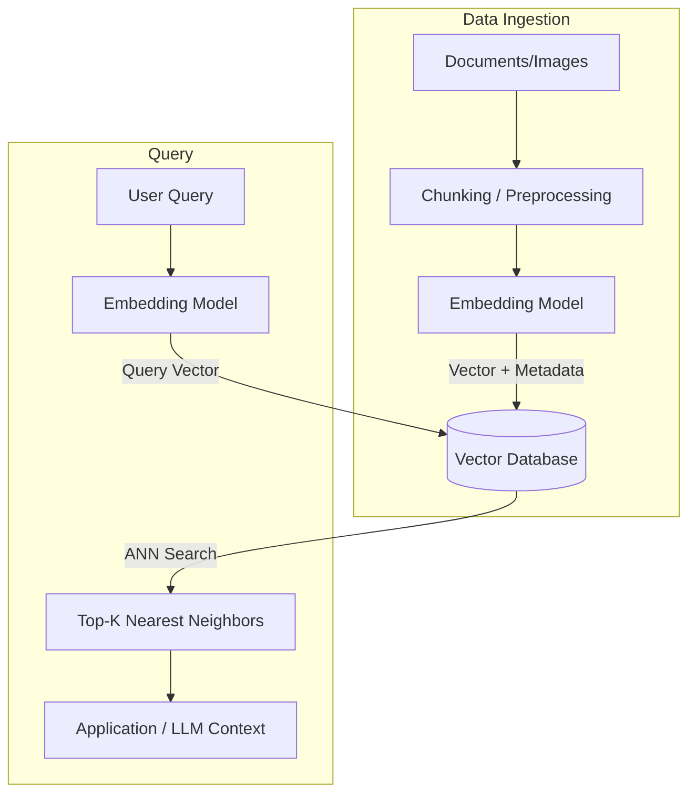

# Cơ sở dữ liệu Vector - Vector Database

## Summary

Vector Database (Cơ sở dữ liệu Vector / Vector Store) là một hệ thống quản trị cơ sở dữ liệu chuyên biệt được thiết kế để lưu trữ, lập chỉ mục (index) và truy vấn dữ liệu dưới dạng các vector đa chiều (Embeddings). Khác với CSDL quan hệ tìm kiếm theo từ khóa chính xác (exact match keyword), Vector Database tìm kiếm dựa trên sự tương đồng về mặt ngữ nghĩa (semantic similarity). Đây là công nghệ cốt lõi đứng sau sự bùng nổ của các ứng dụng GenAI như Hệ thống Gợi ý (Recommender Systems), Tìm kiếm Hình ảnh/Văn bản và Kiến trúc RAG (Retrieval-Augmented Generation).

---

## Definition

**Cơ sở dữ liệu Vector** là hệ thống lưu trữ các dãy số (vector) biểu diễn toán học cho các thực thể phi cấu trúc (văn bản, hình ảnh, âm thanh). 

Quá trình chuyển đổi từ dữ liệu thô sang vector được gọi là **Embedding**, thực hiện bởi các mô hình học máy (như OpenAI `text-embedding-3-large`, BERT, CLIP). Một Vector Database không chỉ lưu trữ các vector này mà còn cung cấp các thuật toán tối ưu (Approximate Nearest Neighbor - ANN) để tìm ra các vector "gần" nhất với vector truy vấn của người dùng trong một không gian hàng nghìn chiều, trong thời gian chỉ vài mili-giây.

---

## Why it exists

Dữ liệu truyền thống chủ yếu là dữ liệu có cấu trúc (số, chuỗi ngắn, ngày tháng) và CSDL quan hệ (SQL) hay NoSQL xử lý chúng rất tốt. Tuy nhiên, 80% dữ liệu của doanh nghiệp hiện nay là **phi cấu trúc** (tài liệu PDF, email, hình ảnh, video). 

Nếu bạn dùng cơ sở dữ liệu SQL để tìm kiếm một bức ảnh chứa "con mèo đang ngủ", hoặc một đoạn văn có "ý nghĩa tương đương với từ hạnh phúc", SQL hoàn toàn bất lực vì nó chỉ hiểu so khớp chuỗi (`LIKE %cat%`). 

Vector Database ra đời để giải quyết bài toán **Tìm kiếm theo ngữ nghĩa (Semantic Search)**. Thay vì so sánh chuỗi ký tự, nó đo lường khoảng cách toán học giữa các ý tưởng. Hai câu "Tôi rất vui" và "Tôi ngập tràn hạnh phúc" dù không có từ nào chung nhưng sẽ có vector nằm rất gần nhau trong không gian biểu diễn.

---

## Core idea

Cốt lõi của Vector Database bao gồm 3 thành phần chính:
1. **Embedding**: Chuyển đổi dữ liệu phi cấu trúc thành mảng số thực (Float Array) thường có số chiều từ 384 đến 3072 chiều.
2. **Khoảng cách toán học (Distance Metrics)**: Cách để đo lường độ gần gũi giữa 2 vector. Các chuẩn đo lường phổ biến:
   * *Cosine Similarity*: Đo góc giữa 2 vector (rất phổ biến cho văn bản).
   * *Euclidean Distance (L2)*: Khoảng cách đường thẳng hình học giữa 2 điểm.
   * *Dot Product (Tích vô hướng)*: Dùng khi các vector đã được chuẩn hóa (normalized).
3. **Thuật toán Tìm kiếm xấp xỉ (Approximate Nearest Neighbor - ANN)**: Nếu quét qua hàng triệu vector để tính khoảng cách (K-Nearest Neighbors - KNN), hệ thống sẽ vô cùng chậm. ANN đánh đổi một chút độ chính xác (Precision) để lấy tốc độ truy xuất cực nhanh. Các thuật toán ANN phổ biến: HNSW (Hierarchical Navigable Small World), IVF (Inverted File Index), PQ (Product Quantization).

---

## How it works

Quy trình hoạt động của một hệ thống có sử dụng Vector Database:

**Giai đoạn ghi (Indexing Pipeline):**
1. Đọc dữ liệu thô (tài liệu văn bản).
2. Cắt nhỏ tài liệu thành các đoạn (Chunking).
3. Đưa các đoạn này qua mô hình Embedding để lấy vector (ví dụ: `[0.12, -0.45, 0.89, ...]`).
4. Lưu vector kèm theo dữ liệu gốc (Metadata) vào Vector Database. Vector DB sẽ tự động xây dựng chỉ mục (Index) theo cấu trúc đồ thị hoặc phân cụm (HNSW/IVF).

**Giai đoạn đọc (Search Pipeline):**
1. Người dùng nhập câu hỏi (Query).
2. Câu hỏi đi qua chính mô hình Embedding ở trên để biến thành Vector Query.
3. Vector Database dùng thuật toán ANN để tính toán và trả về Top-K vector gần nhất với Vector Query.
4. Trả về Metadata (đoạn văn bản gốc) tương ứng với Top-K vector đó cho ứng dụng.

---

## Architecture / Flow



---

## Practical example

Mã SQL dưới đây minh họa việc sử dụng **PostgreSQL** kết hợp với extension **pgvector** để lưu trữ và tìm kiếm vector trực tiếp trong cơ sở dữ liệu quan hệ.

```sql
-- 1. Kích hoạt extension pgvector
CREATE EXTENSION vector;

-- 2. Tạo bảng lưu trữ tài liệu với cột vector (ví dụ 3 chiều)
CREATE TABLE documents (
    id SERIAL PRIMARY KEY,
    content TEXT,
    embedding vector(3)
);

-- 3. Thêm tài liệu (Vector đã được tính toán từ ứng dụng)
INSERT INTO documents (content, embedding) VALUES 
('Mèo thích ăn cá', '[0.1, 0.2, 0.8]'),
('Chó thích gặm xương', '[0.2, 0.1, 0.3]');

-- 4. Tìm kiếm ngữ nghĩa (Tìm tài liệu có vector gần nhất với truy vấn)
-- Toán tử <=> dùng để tính khoảng cách Cosine
SELECT content, embedding 
FROM documents
ORDER BY embedding <=> '[0.11, 0.22, 0.79]' 
LIMIT 1;
-- Kết quả trả về dòng "Mèo thích ăn cá"
```

---

## Best practices

* **Lưu Metadata cẩn thận**: Đừng chỉ lưu vector. Hãy lưu kèm Metadata (ID tài liệu gốc, tác giả, ngày tạo). Metadata cho phép bạn thực hiện **Hybrid Search** (Lọc kết quả Vector kết hợp với lọc SQL truyền thống kiểu `WHERE author='Alice'`).
* **Chọn Metric phù hợp**: Luôn kiểm tra tài liệu của mô hình Embedding để xem họ huấn luyện dựa trên Distance Metric nào. Nếu dùng mô hình của OpenAI, hãy dùng `Cosine Similarity`. Nếu chọn sai Metric, độ chính xác sẽ sụt giảm thê thảm.
* **Cân bằng giữa Tốc độ và Độ chính xác**: Các Vector DB cho phép tinh chỉnh tham số của thuật toán HNSW (như `m`, `ef_construction`). Nếu cần độ chính xác tuyệt đối, tăng các tham số này nhưng thời gian build index và query sẽ chậm đi.
* **Định kỳ Re-index**: Khi xóa dữ liệu, Vector DB thường chỉ đánh dấu xóa (soft delete) trên đồ thị. Bạn cần phải lên lịch định kỳ (vacuum/optimize) để dọn dẹp và tổ chức lại index nhằm giữ hiệu năng cao.

---

## Trade-offs

### Ưu điểm
* **Tìm kiếm theo ngữ nghĩa xuất sắc**: Hiểu được từ đồng nghĩa, ngữ cảnh, điều mà search engine từ khóa như Elasticsearch cơ bản không làm được.
* **Tốc độ siêu nhanh**: Nhờ các thuật toán ANN tối ưu, có thể tìm kiếm trong hàng tỷ vector chỉ trong vài mili-giây.
* **Hỗ trợ đa phương tiện (Multi-modal)**: Có thể tìm kiếm hình ảnh bằng văn bản hoặc ngược lại, miễn là chúng được nhúng vào chung một không gian vector (ví dụ: mô hình CLIP).

### Nhược điểm
* **Chi phí lưu trữ RAM cao**: Các chỉ mục HNSW bắt buộc phải lưu hoàn toàn trên RAM (In-Memory) để đảm bảo tốc độ. Việc lưu trữ hàng tỷ vector tốn hàng trăm GB RAM, rất đắt đỏ.
* **Tính khả giải (Explainability) thấp**: Không thể giải thích chính xác TẠI SAO kết quả A lại gần với Query B bằng ngôn ngữ con người, vì tất cả chỉ là phép tính trên mảng số thực.
* **Mù từ khóa chính xác**: Rất tệ trong việc tìm kiếm các mã số chính xác (ví dụ: mã bưu điện, mã sản phẩm `SKU-12345`). Để khắc phục, cần dùng Hybrid Search.

---

## When to use

* Xây dựng lõi Retrieval cho hệ thống RAG (Chatbot hỏi đáp trên tài liệu nội bộ).
* Hệ thống gợi ý sản phẩm (Recommender System) tìm các sản phẩm tương tự.
* Ứng dụng tìm kiếm bằng hình ảnh (Visual Search), nhận diện khuôn mặt.
* Phát hiện bất thường (Anomaly Detection): Các hành vi gian lận thường sẽ nằm ở các cụm vector xa lạ.

## When not to use

* Các bài toán tìm kiếm cần chính xác 100% từ khóa, mã số, số điện thoại (Hãy dùng Elasticsearch hoặc RDBMS).
* Dữ liệu hoàn toàn là dữ liệu có cấu trúc (bảng biểu tài chính, log hệ thống).
* Doanh nghiệp có quy mô dữ liệu rất nhỏ (vài nghìn dòng), việc tính toán Cosine Similarity trực tiếp trên bộ nhớ bằng Numpy/Postgres pgvector quét toàn bảng (KNN) là đủ nhanh, không cần cài đặt một engine Vector DB phức tạp.

---

## Related concepts

* [RAG (Retrieval-Augmented Generation)](/concepts/rag)
* [Embeddings](/concepts/embeddings)
* [Reranking](/concepts/reranking)
* [Chunking Strategy](/concepts/chunking-strategy)

---

## Interview questions

### 1. Phân biệt KNN (K-Nearest Neighbors) và ANN (Approximate Nearest Neighbors) trong Vector Database.
* **Người phỏng vấn muốn kiểm tra**: Hiểu biết cơ bản về thuật toán đằng sau Vector Store.
* **Gợi ý trả lời (Strong Answer)**:
  * KNN là thuật toán quét cạn (brute-force). Nó tính khoảng cách giữa vector truy vấn và TOÀN BỘ các vector trong database. Đảm bảo chính xác 100% nhưng tốc độ là $O(N)$, không thể mở rộng khi có hàng triệu dữ liệu.
  * ANN là thuật toán xấp xỉ. Nó xây dựng các chỉ mục thông minh (như đồ thị HNSW hoặc phân cụm IVF) để thu hẹp không gian tìm kiếm, chỉ tính toán với một nhóm nhỏ vector tiềm năng. Tốc độ là $O(\log N)$, cực nhanh nhưng đánh đổi một tỷ lệ rất nhỏ kết quả có thể không phải là tối ưu nhất. Các Vector DB thực thụ đều dùng ANN.
* **Lỗi cần tránh**: Không nắm được khái niệm ANN mà nhầm lẫn Vector DB chỉ là việc dùng vòng lặp For chạy tính toán khoảng cách.

### 2. HNSW (Hierarchical Navigable Small World) hoạt động như thế nào ở mức độ ý tưởng?
* **Người phỏng vấn muốn kiểm tra**: Kiến thức sâu về cấu trúc dữ liệu đồ thị trong Vector Search.
* **Gợi ý trả lời (Strong Answer)**:
  * HNSW kết hợp hai ý tưởng: Skip List (Danh sách nhảy) và Small World Graph (Đồ thị thế giới thu nhỏ).
  * Hệ thống chia các vector thành nhiều tầng (layers). Tầng trên cùng có rất ít điểm (như bản đồ thế giới nhìn từ xa), tầng dưới cùng chứa toàn bộ dữ liệu (bản đồ đường phố).
  * Khi tìm kiếm, thuật toán bắt đầu ở tầng trên cùng, nhảy những bước dài về phía gần giống với query nhất. Sau đó đi dần xuống các tầng thấp hơn để tinh chỉnh độ chính xác. Nhờ phân tầng này, HNSW đạt tốc độ tìm kiếm $O(\log N)$ vượt trội.

### 3. PostgreSQL với extension `pgvector` có thể thay thế hoàn toàn các Vector Database chuyên dụng (như Milvus, Pinecone, Qdrant) không?
* **Người phỏng vấn muốn kiểm tra**: Kỹ năng lựa chọn công nghệ (Technology Selection) và hiểu biết về System Design.
* **Gợi ý trả lời (Strong Answer)**:
  * Với quy mô nhỏ và vừa (dưới vài triệu vector), `pgvector` là lựa chọn hoàn hảo vì nó nằm ngay trong Postgres, giảm thiểu độ phức tạp kiến trúc, hỗ trợ ACID và kết hợp dễ dàng với data SQL có sẵn (Hybrid Search cực tốt).
  * Tuy nhiên, với quy mô lớn (hàng chục, hàng trăm triệu vector) và yêu cầu chịu tải (high QPS), các Vector DB chuyên dụng (như Milvus, Qdrant) vượt trội hơn. Chúng có kiến trúc phân tán (distributed computing), quản lý bộ nhớ In-Memory tối ưu cho đồ thị HNSW, và hỗ trợ tách biệt phần tính toán (Compute) và phần lưu trữ (Storage).
* **Lỗi cần tránh**: Khẳng định tuyệt đối Postgres là đủ dùng cho mọi bài toán hoặc bài xích Postgres mà chỉ tôn sùng Vector DB chuyên dụng.

---

## English summary

A Vector Database is a specialized data management system designed to store, index, and query high-dimensional mathematical representations of unstructured data, known as embeddings. Unlike traditional relational databases that rely on exact keyword matches, vector databases perform semantic searches by calculating mathematical distances (e.g., Cosine Similarity, Euclidean Distance) between vectors. Utilizing Approximate Nearest Neighbor (ANN) algorithms like HNSW, they can retrieve conceptually similar items across millions of records in milliseconds. Vector databases are the foundational retrieval engine powering modern Generative AI applications, Recommender Systems, and Retrieval-Augmented Generation (RAG) architectures.
