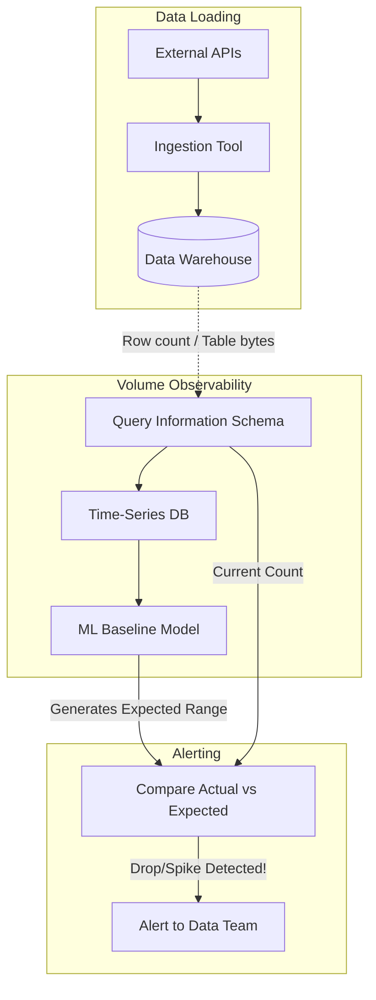

# Phát hiện bất thường về khối lượng dữ liệu - Volume Anomalies

## Summary

Phát hiện bất thường về khối lượng dữ liệu (Volume Anomalies / Volume Monitoring) là một trong năm trụ cột của Data Observability. Trụ cột này tập trung giám sát số lượng bản ghi (row count) hoặc kích thước tệp (byte size) được nạp vào, biến đổi hoặc xóa đi trong hệ thống dữ liệu theo thời gian. Việc theo dõi khối lượng giúp Data Team phát hiện sớm các sự cố mất mát dữ liệu (Data Loss) hoặc bùng nổ dữ liệu (Data Duplication) một cách tự động.

---

## Definition

**Volume Anomalies** là tình trạng số lượng dữ liệu đầu vào hoặc đầu ra của một bảng/pipeline lệch một cách đáng kể (vượt ngưỡng cho phép) so với kỳ vọng lịch sử (baseline).

Giám sát Volume trả lời câu hỏi: *Ngày hôm nay, chúng ta nhận được bao nhiêu dòng dữ liệu? Con số đó có bình thường so với các ngày thứ Hai khác trong tháng không?*

Ví dụ về bất thường khối lượng:
* Một bảng `events` hàng ngày nhận đều đặn khoảng 2 triệu dòng, hôm nay đột ngột giảm xuống chỉ còn 50,000 dòng. (Drop Anomaly)
* Một bảng `daily_transactions` bình thường nạp 10,000 dòng, hôm nay tăng vọt lên 30,000 dòng một cách vô lý. (Spike Anomaly)

---

## Why it exists

Biến động về khối lượng là "cờ đỏ" (red flag) rõ ràng nhất báo hiệu một đường ống dữ liệu đang bị bệnh.
1. **Mất mát dữ liệu do thay đổi kỹ thuật**: Đội ngũ Backend vô tình phát hành một bản cập nhật ứng dụng làm mất đi 50% sự kiện tracking click của người dùng. Hệ thống Data Pipeline vẫn chạy xanh (thành công), dữ liệu vẫn mới (Freshness bình thường), cấu trúc không đổi (Schema ổn), nhưng khối lượng giảm sút 50%.
2. **Trùng lặp dữ liệu (Data Duplication)**: Do thiết lập cấu hình chạy Airflow backfill sai, một khoảng thời gian dữ liệu bị tải lại 2 lần (append thay vì merge/upsert). Khối lượng tăng gấp đôi.
3. **Sự cố API / Giới hạn Rate Limit**: Khi kéo dữ liệu từ API bên thứ 3 (như Facebook Ads, Salesforce), việc chạm ngưỡng rate limit hoặc token bị hết hạn giữa chừng khiến pipeline chỉ lấy được một phần dữ liệu rồi tự ngắt (Partial Load).

Nếu không có giám sát Volume, hệ thống báo cáo (Dashboard) sẽ hiển thị sai lệch trầm trọng doanh thu/traffic mà kỹ sư dữ liệu không hề hay biết.

---

## Core idea

Cốt lõi của giám sát khối lượng nằm ở việc thiết lập **Baseline (Đường cơ sở)**.

Vì khối lượng dữ liệu không bao giờ là một hằng số tĩnh (hôm nay có thể có nhiều khách hàng mua hàng hơn hôm qua), việc đặt một cảnh báo tĩnh dạng "Cảnh báo nếu số dòng < 1 triệu" là không khả thi.

Hệ thống Data Observability hiện đại sử dụng **Thuật toán Machine Learning (Time-series Forecasting / Anomaly Detection)** để:
* Nhận diện xu hướng (Trend): Dữ liệu đang tăng trưởng dần theo tháng.
* Nhận diện tính mùa vụ (Seasonality): Khối lượng dữ liệu luôn thấp vào cuối tuần và cao vọt vào ngày Thứ Hai đầu tuần.
Từ đó, nó vẽ ra một "dải dung sai dự kiến" (expected range). Nếu khối lượng thực tế nằm ngoài dải này, một sự kiện "Volume Anomaly" sẽ được kích hoạt.

---

## How it works

Quy trình phát hiện bất thường Volume:
1. **Thu thập Metrics (Telemetry Collection)**: Mỗi khi một Data Job (Airflow, dbt, Fivetran) kết thúc, hệ thống sẽ log lại thông tin `rows_inserted`, `rows_updated`, `rows_deleted` hoặc truy vấn Metadata DWH để lấy tổng số dòng hiện tại của bảng (`COUNT(*)`).
2. **Lưu trữ chuỗi thời gian (Time-Series Storage)**: Các metrics này được lưu thành chuỗi thời gian (ví dụ: `[Day 1: 1M], [Day 2: 1.1M], [Day 3: 1.05M]...`).
3. **Dự báo (Forecasting / Baseline Generation)**: Hệ thống sử dụng mô hình dự báo (như ARIMA, Prophet, hoặc Isolation Forest) để dự đoán dải giá trị kỳ vọng cho "Day 4".
4. **So sánh & Cảnh báo (Alerting)**: Khi dữ liệu Day 4 được nạp vào là `0.3M` (rơi ra ngoài dải kỳ vọng dưới), hệ thống kích hoạt Volume Drop Alert.

---

## Architecture / Flow



---

## Practical example

**Bối cảnh:** Bảng `web_pageviews` lưu lượng truy cập web mỗi ngày. 

**Cách giám sát truyền thống (dùng SQL tĩnh qua dbt tests):**
```sql
-- Kiểm tra xem số bản ghi ngày hôm nay có giảm quá 30% so với trung bình 7 ngày trước không
WITH recent_avg AS (
    SELECT AVG(daily_count) as avg_7d
    FROM (
        SELECT DATE(event_time), COUNT(*) as daily_count
        FROM web_pageviews
        WHERE event_time >= CURRENT_DATE - 7 AND event_time < CURRENT_DATE
        GROUP BY 1
    )
),
today_count AS (
    SELECT COUNT(*) as current_count
    FROM web_pageviews
    WHERE DATE(event_time) = CURRENT_DATE
)
SELECT current_count, avg_7d
FROM today_count CROSS JOIN recent_avg
WHERE current_count < (avg_7d * 0.70) -- Báo lỗi nếu giảm trên 30%
```

**Cách giám sát hiện đại (Nền tảng Data Observability ML):**
DE không cần viết câu SQL phức tạp trên. Nền tảng tự động theo dõi bảng `web_pageviews`. 
Vào ngày lễ Giáng Sinh, lượng truy cập website tự nhiên giảm sút (Volume drop).
* *Cách SQL tĩnh* sẽ báo động sai (False Positive) vì giảm > 30% so với ngày thường.
* *Nền tảng ML* đã học được từ Giáng Sinh năm ngoái (Seasonality) rằng sự sụt giảm này là bình thường, nên nó tự động mở rộng dải dung sai dự kiến xuống và **không** gửi cảnh báo rác, giúp Data Team có một kỳ nghỉ lễ yên bình.

---

## Best practices

* **Kết hợp Volume với Freshness**: Một bảng có khối lượng giảm thường đi kèm với việc cập nhật bị trễ. Nhóm các cảnh báo này lại với nhau (Incident Grouping) để nhanh chóng xác định nguyên nhân gốc (Source ingestion issue).
* **Theo dõi Volume ở nhiều cấp độ (Granularity)**: Không chỉ đo `COUNT(*)` toàn bộ bảng (vì dữ liệu cũ có thể làm lu mờ sự cố của lượng dữ liệu mới), mà phải đo khối lượng theo các phân vùng thời gian (Ví dụ: Số dòng được insert *trong ngày hôm nay*).
* **Đo lường Volume của các nhóm dữ liệu cốt lõi (Segment Volume)**: Nếu tổng số đơn hàng vẫn bình thường nhưng số đơn hàng từ Mỹ (`region='US'`) giảm về 0, Volume tổng sẽ khó nhận ra. Cần theo dõi Volume trên các thuộc tính/chiều phân tích quan trọng.

---

## Common mistakes

* **Quên tính đến ngày lễ hoặc sự kiện kinh doanh**: Chạy Flash Sale khiến dữ liệu ngày đó tăng gấp 10 lần. Nền tảng báo Spike Anomaly. Qua ngày hôm sau, dữ liệu trở về bình thường, hệ thống dự báo bằng SQL tự viết lại báo Drop Anomaly. (Đây là lúc cần công cụ Observability thông minh có tính năng Mute/Feedback cho AI).
* **Truy vấn quét toàn bảng (Full Table Scan) để đếm số dòng**: Chạy `SELECT COUNT(*)` hàng giờ trên một bảng Petabytes ở BigQuery để kiểm tra Volume sẽ tiêu tốn hàng nghìn USD. Hãy dùng bảng Metadata (Ví dụ `INFORMATION_SCHEMA.TABLE_STORAGE` hoặc `__TABLES__`) để lấy con số ước lượng chi phí 0 đồng.

---

## Trade-offs

### Ưu điểm
* Dễ hiểu, trực quan. Volume là một chỉ số "sức khỏe" thô nhưng phản ánh cực kỳ rõ ràng việc pipeline chạy có ra kết quả đúng hay không (Partial data load).
* Giúp phát hiện lỗi logic (như JOIN làm nhân bản dữ liệu / Cartesian product) mà các bài test Schema hay Freshness không thể bắt được.

### Nhược điểm
* Rất dễ sinh ra cảnh báo giả (False Positives) trong các mô hình kinh doanh có tính biến động cao (như E-commerce) nếu thuật toán dự báo (Baseline) không đủ thông minh.

---

## When to use

* Bắt buộc phải áp dụng cho tất cả các bảng dữ liệu lõi (Core Tables, Fact Tables) lưu trữ giao dịch, sự kiện hệ thống (Logs, Events, Telemetry) có tần suất sinh dữ liệu liên tục và tương đối ổn định.

## When not to use

* Không hữu ích cho các bảng Reference/Dimension nhỏ, ví dụ bảng `Country_Codes` hoặc `Currency_Types` vì chúng rất hiếm khi tăng số lượng, khiến việc đo lường Volume trở nên vô nghĩa.

---

## Related concepts

* [Giám sát khả năng quan sát dữ liệu - Data Observability](/concepts/data-observability)
* [Giám sát độ trễ - Freshness Monitoring](/concepts/freshness-monitoring)
* [Data Quality](/concepts/data-quality)

---

## Interview questions

### 1. Sự khác biệt giữa việc đo lường Data Volume bằng `COUNT(*)` và việc đọc từ Information Schema (Metadata) là gì?
* **Người phỏng vấn muốn kiểm tra**: Tối ưu chi phí và hiểu biết về Cloud Data Warehouse.
* **Gợi ý trả lời**: Chạy `COUNT(*)` (trong nhiều RDBMS/DWH cũ hoặc Data Lake) sẽ yêu cầu quét (scan) tài nguyên vật lý, gây tốn kém tiền bạc và thời gian (Compute cost). Đọc từ `Information Schema` là lấy số liệu từ bảng thống kê nội bộ của hệ thống (Metadata storage), hoàn toàn miễn phí và trả kết quả tức thì (O(1)). Tuy nhiên, đôi khi Metadata có thể bị trễ một vài phút so với dữ liệu thực tế tùy thuộc vào kiến trúc của DWH.

### 2. Làm thế nào để phát hiện "Partial Load" (Dữ liệu tải bị thiếu một phần) khi dùng Airflow?
* **Người phỏng vấn muốn kiểm tra**: Kinh nghiệm xử lý lỗi pipeline thực tế.
* **Gợi ý trả lời**: Airflow job có thể báo "Success" kể cả khi nó chỉ kéo về được 100/1000 dòng từ API (do bị rate limit). Để phát hiện, ta không thể tin vào Task Status. Ta phải đưa logic kiểm tra Volume vào cuối Task: Đoán nhận số dòng mong đợi (ví dụ trung bình 7 ngày qua) và so sánh với `len(data)` vừa kéo về. Nếu độ lệch vượt ngưỡng, ta chủ động `raise Exception` để đánh rớt (Fail) Airflow Task và ngăn chặn việc ghi đè/append dữ liệu thiếu vào kho.

---

## References

1. **Monte Carlo Blog** - The 5 Pillars of Data Observability.
2. **dbt Expectations Package** - Các macro hỗ trợ kiểm tra Volume và Data Quality tĩnh bằng SQL.
3. **Prophet by Meta (Facebook)** - Thuật toán Time-Series Forecasting phổ biến được ứng dụng nhiều trong Volume Anomaly Detection.

---

## English summary

Volume Anomalies refer to unexpected spikes or drops in the row count or byte size of a dataset. As a core pillar of Data Observability, monitoring data volume helps detect silent pipeline failures—such as partial API loads, unintentional logic filtering, or data duplication (e.g., from an exploding JOIN)—where the pipeline execution status remains "green". Instead of relying on static thresholds which lead to alert fatigue, modern data observability platforms utilize machine learning (time-series forecasting) to understand seasonality and trends, generating dynamic baselines. Monitoring volume via metadata (rather than full-table `COUNT(*)` queries) is a highly cost-effective best practice for ensuring data completeness.
