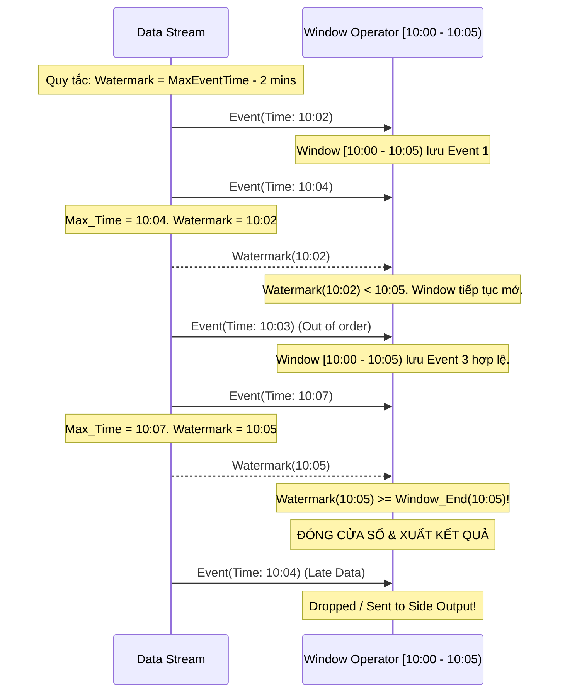

# Watermark - Dấu chuẩn thời gian

## Summary

**Watermark** (Dấu chuẩn thời gian) là một cơ chế cốt lõi trong hệ thống xử lý dữ liệu luồng (Stream Processing) khi sử dụng Event Time. Nó hoạt động như một bộ đếm nhịp hoặc một tuyên bố của hệ thống rằng: "Theo như tôi biết, sẽ không còn bất kỳ sự kiện nào có Event Time cũ hơn mốc thời gian X tới nữa". Watermark giúp hệ thống quyết định thời điểm "chốt sổ" (đóng các cửa sổ thời gian - Window) để xuất kết quả tính toán, là công cụ then chốt để cân bằng giữa tính chính xác của dữ liệu và độ trễ chờ đợi dữ liệu đến muộn (late data).

---

## Definition

Trong xử lý luồng, một **Watermark** $W(t)$ là một sự kiện đặc biệt (hoặc tín hiệu ngầm định) chạy lẫn trong luồng dữ liệu, mang giá trị thời gian $t$. Khi hệ thống nhận được $W(t)$, nó hiểu rằng tất cả các sự kiện có Event Time $\le t$ đã đến đầy đủ, và hệ thống có thể an toàn đóng các cửa sổ thời gian (Windows) kết thúc trước $t$ để kích hoạt tính toán.

Nói cách khác, Watermark đo lường **tiến trình của Event Time** so với thời gian xử lý thực tế.

---

## Why it exists

Khi xử lý dữ liệu bằng Event Time, dữ liệu từ các thiết bị phân tán thường không đến theo đúng thứ tự (out-of-order) do độ trễ mạng. 

Giả sử bạn cần tính tổng doanh thu mỗi phút. Bạn đang tính cho phút từ `10:00 - 10:01`. Hệ thống hiện tại đã xử lý đến dữ liệu của `10:02`. Liệu hệ thống có được phép "đóng sổ" phút `10:00 - 10:01` chưa? Có thể có một sự kiện xảy ra lúc `10:00:45` nhưng bị kẹt mạng, chưa đến được server. 

Nếu hệ thống chờ đợi vô hạn, kết quả sẽ không bao giờ được xuất ra (tắc nghẽn hoàn toàn). Nếu không chờ, kết quả sẽ bị thiếu và sai lệch. **Watermark ra đời để giải quyết tình huống tiến thoái lưỡng nan này**, cung cấp một ngưỡng chờ đợi hợp lý (heuristic) để hệ thống tự tin xuất kết quả.

---

## Core idea

Ý tưởng của Watermark là tạo ra một độ trễ cho phép (Allowed Lateness / Bounded Out-Of-Orderness). 

Hệ thống sẽ quan sát các Event Time lớn nhất (max_event_time) nó từng nhận được, và sinh ra Watermark bằng công thức:
`Watermark = max_event_time - max_allowed_delay`

Khi `Watermark` tịnh tiến vượt qua ranh giới cuối của một Cửa sổ thời gian (Window), cửa sổ đó sẽ được đóng lại, tính toán aggregations và giải phóng bộ nhớ (state). Bất kỳ dữ liệu nào đến sau khi Watermark đã vượt qua Window của nó sẽ bị coi là **Late Data** (dữ liệu đến muộn) và bị xử lý theo các chiến lược ngoại lệ (như bỏ qua, đẩy ra side-output, hoặc cập nhật đính chính).

---

## How it works

1. **Khởi tạo và Phát sinh**: Khi dữ liệu đi vào hệ thống (từ Kafka, Kinesis), Source sẽ sinh ra các Watermark xen kẽ vào luồng dữ liệu dựa trên các Event Time nó quan sát được.
2. **Lan truyền (Propagation)**: Watermark chảy qua các toán tử (operators) trong DAG của pipeline như những record bình thường.
3. **Kích hoạt Window**: Một Window `[10:00, 10:01)` sẽ chờ đợi. Khi một Watermark mang giá trị `10:01:00` (hoặc lớn hơn) đi vào operator của Window, operator biết rằng không còn dữ liệu nào thuộc window này nữa.
4. **Đóng sổ và tính toán**: Operator thực thi hàm tổng hợp (SUM, COUNT) cho window đó, gửi kết quả xuống hạ lưu và xóa dữ liệu thô khỏi state.
5. **Xử lý Late Data**: Nếu sau đó có một record mang Event Time `10:00:30` đến, nó được nhận diện là "quá trễ" vì Watermark hiện tại đã là `10:01:00` trở lên. Tuỳ cấu hình, record này sẽ bị rớt (dropped) hoặc đẩy vào kho lưu trữ riêng.

---

## Architecture / Flow



---

## Practical example

Sử dụng Apache Flink để định nghĩa Watermark trễ tối đa 5 giây (Bounded-out-of-orderness):

```java
DataStream<MyEvent> stream = ...;

WatermarkStrategy<MyEvent> strategy = WatermarkStrategy
    // Chấp nhận dữ liệu đến trễ tối đa 5 giây so với sự kiện mới nhất
    .<MyEvent>forBoundedOutOfOrderness(Duration.ofSeconds(5))
    // Hàm trích xuất thời gian thực tế của sự kiện
    .withTimestampAssigner((event, timestamp) -> event.getTimestamp());

DataStream<MyEvent> withWatermarks = stream.assignTimestampsAndWatermarks(strategy);

// Định nghĩa Window và Side Output cho Late Data
OutputTag<MyEvent> lateDataTag = new OutputTag<MyEvent>("late-data"){};

SingleOutputStreamOperator<Result> result = withWatermarks
    .keyBy(event -> event.getUserId())
    .window(TumblingEventTimeWindows.of(Time.minutes(1)))
    .allowedLateness(Time.minutes(2)) // Cho phép update kết quả nếu trễ thêm tối đa 2 phút
    .sideOutputLateData(lateDataTag)  // Bắt những dữ liệu trễ hơn cả 2 phút
    .process(new MyWindowFunction());

// Lấy luồng dữ liệu trễ để lưu vào DB/Log
DataStream<MyEvent> lateStream = result.getSideOutput(lateDataTag);
```

---

## Best practices

* **Đừng cấu hình Allowed Lateness quá lớn**: Nếu bạn đặt độ trễ Watermark quá cao (ví dụ: chờ 1 giờ), Window Operator sẽ phải giữ toàn bộ dữ liệu thô của 1 giờ đó trong bộ nhớ (State), dẫn đến quá tải RAM/RocksDB và làm chậm toàn bộ ứng dụng.
* **Luôn xử lý Late Data**: Đừng để hệ thống âm thầm rớt dữ liệu (silent drop). Hãy định tuyến dữ liệu đến trễ vào các Side Output (như S3, hoặc DLQ) để sau này có thể dùng batch job để tính toán đính chính.
* **Cân bằng giữa Độ trễ (Latency) và Sự đầy đủ (Completeness)**: Tùy nghiệp vụ. Với ứng dụng phát hiện gian lận (Fraud Detection), cần Watermark thật ngắn để ra quyết định ngay. Với ứng dụng tính lương/doanh thu, cần Watermark đủ dài để bắt đủ dữ liệu.

---

## Common mistakes

* **Quên rằng Watermark là Global/Partition-based**: Trong Kafka, luồng dữ liệu có nhiều partitions. Mức Watermark tổng thể của một operator sẽ bằng **MIN** của Watermark các partitions nguồn. Nếu một partition không có dữ liệu mới (idle), Watermark của nó sẽ không tăng, kéo theo Watermark của toàn bộ hệ thống bị treo, không có Window nào được đóng. (Cần cấu hình `withIdleness` trong Flink để xử lý).
* **Phụ thuộc hoàn toàn vào Watermark tuyệt đối**: Nghĩ rằng Watermark xử lý được 100% dữ liệu muộn. Thực tế Watermark chỉ là heuristic (ước đoán). Sẽ luôn có dữ liệu đến muộn hơn cả Watermark.

---

## Trade-offs

### Ưu điểm
* Giải quyết bài toán out-of-order một cách thanh lịch, giúp Event Time hoạt động được trong môi trường phân tán.
* Cung cấp cơ chế linh hoạt để đánh đổi giữa tính chính xác (Accuracy) và tốc độ đáp ứng (Latency).

### Nhược điểm
* Rất khó để cấu hình ngưỡng trễ (delay) hoàn hảo. Quá ngắn thì rớt dữ liệu, quá dài thì tốn tài nguyên và tăng độ trễ xuất kết quả.
* Làm tăng độ phức tạp của logic lập trình, khó debug khi hệ thống treo không rõ nguyên nhân (thường do Watermark không tịnh tiến).

---

## When to use

* Bắt buộc sử dụng Watermark khi bạn tính toán luồng (Windowing, Joins, Aggregation) dựa trên **Event Time**.
* Khi dữ liệu thực tế từ thiết bị IoT, Mobile Apps gửi về server có tỷ lệ rớt mạng và đến không theo thứ tự cao.

## When not to use

* Không dùng khi hệ thống chạy ở chế độ **Processing Time** (vì không cần chờ đợi).
* Không cần thiết đối với các pipeline chỉ biến đổi từng bản ghi độc lập (Stateless Map/Filter/Format) không yêu cầu gom nhóm (Windowing).

---

## Related concepts

* [Event Time & Processing Time](/concepts/event-time-processing-time)
* [Windowing](/concepts/windowing)
* [Exactly-Once Semantics](/concepts/exactly-once-semantics)

---

## Interview questions

### 1. Watermark là gì và tại sao chúng ta cần nó trong stream processing?
* **Người phỏng vấn muốn kiểm tra**: Sự hiểu biết cơ bản về cơ chế đồng bộ thời gian trong hệ thống phân tán.
* **Gợi ý trả lời (Strong Answer)**: Watermark là một giá trị thời gian cho biết hệ thống tin rằng tất cả các sự kiện có Event Time nhỏ hơn giá trị này đã đến đầy đủ. Nó giải quyết bài toán dữ liệu đến muộn (late data) và không theo thứ tự. Nếu không có watermark, các cửa sổ thời gian (Windows) dùng Event Time sẽ không bao giờ biết khi nào nên đóng để kích hoạt tính toán, dẫn đến treo bộ nhớ, hoặc đóng ngay lập tức dẫn đến kết quả sai.
* **Lỗi cần tránh**: Định nghĩa nhầm Watermark là "thời gian tối đa mà hệ thống giữ dữ liệu". Watermark là "thời gian logic" báo hiệu sự tiến triển của dữ liệu.

### 2. Chuyện gì xảy ra nếu Watermark không tăng lên (không tịnh tiến)?
* **Người phỏng vấn muốn kiểm tra**: Kinh nghiệm debug hệ thống luồng trong thực tế (Idleness problem).
* **Gợi ý trả lời (Strong Answer)**: Nếu Watermark không tăng, các Window đang mở sẽ không bao giờ được đóng, kết quả không được phát ra và bộ nhớ (State) sẽ phình to cho đến khi Out of Memory. Nguyên nhân phổ biến nhất là một trong các partition của Kafka không có dữ liệu (idle), vì Watermark của toán tử bằng MIN(Watermarks của các source partitions). Để khắc phục, cần đánh dấu nguồn là "idle" (ví dụ dùng `withIdleness` trong Flink) để hệ thống tạm thời phớt lờ partition đó khi tính toán Watermark tổng.
* **Lỗi cần tránh**: Không biết về cơ chế MIN() của Watermark khi gộp nhiều luồng.

### 3. Dữ liệu đến sau khi Watermark đã vượt qua Window của nó (Late Data) sẽ được xử lý như thế nào?
* **Người phỏng vấn muốn kiểm tra**: Hiểu biết về cách thiết kế kiến trúc chịu lỗi cho dữ liệu.
* **Gợi ý trả lời (Strong Answer)**: Mặc định nó sẽ bị rớt (dropped) vì cửa sổ đã đóng. Tuy nhiên, trong môi trường sản xuất, ta có 2 cách xử lý: (1) Cấu hình `allowedLateness`, cửa sổ sẽ vẫn giữ state thêm một thời gian để nhận Late Data và phát ra kết quả cập nhật đính chính (retract/update). (2) Đẩy các record trễ này vào một Side Output (như lưu ra S3/Kafka) để phân tích ngoại lệ hoặc batch processing đính chính sau này.
* **Lỗi cần tránh**: Cho rằng dữ liệu trễ sẽ làm sập hệ thống hoặc gây lỗi Exception.

### 4. Bounded-out-of-orderness Watermark hoạt động như thế nào?
* **Người phỏng vấn muốn kiểm tra**: Hiểu chi tiết thuật toán sinh Watermark phổ biến nhất.
* **Gợi ý trả lời (Strong Answer)**: Thuật toán này theo dõi Event Time lớn nhất (Max Event Time) mà hệ thống từng nhận được cho đến hiện tại. Giá trị Watermark phát ra sẽ luôn bằng: `Max Event Time - Độ trễ cấu hình (T)`. Ví dụ cấu hình trễ là 5 giây. Nếu nhận sự kiện phút `10:00:15`, Watermark là `10:00:10`. Nếu nhận một sự kiện `10:00:12` tiếp theo, Max Event Time không đổi, Watermark vẫn là `10:00:10`. Điều này tạo ra một "vùng đệm" 5 giây chạy theo thời gian thực tế để đợi dữ liệu trễ.

### 5. Sự đánh đổi giữa việc đặt độ trễ Watermark lớn và độ trễ nhỏ là gì?
* **Người phỏng vấn muốn kiểm tra**: Tư duy kiến trúc, cân nhắc Trade-off.
* **Gợi ý trả lời (Strong Answer)**: 
  * Watermark delay nhỏ (ví dụ 1 giây): Hệ thống phản hồi rất nhanh, kết quả ra liên tục, state nhỏ. Nhưng đổi lại tỷ lệ dữ liệu bị đánh dấu là Late Data rất cao, làm giảm độ chính xác của kết quả.
  * Watermark delay lớn (ví dụ 1 giờ): Đảm bảo thu thập được gần như 100% dữ liệu, độ chính xác rất cao. Nhưng đổi lại hệ thống bị trễ 1 giờ mới có kết quả, và phải tốn một lượng RAM/Disk cực lớn để duy trì trạng thái của tất cả các sự kiện trong 1 giờ chờ đợi đó.

---

## References

1. **Streaming Systems** - Tyler Akidau (Chương 2 và 3 giải thích sâu sắc về Watermark).
2. **Apache Flink Documentation** - Generating Watermarks.

---

## English summary

A **Watermark** is a crucial mechanism in stream processing when dealing with Event Time. It acts as a metric of progress in logical time, signaling to the system that "no events with a timestamp older than the watermark will arrive anymore." Because network delays cause events to arrive out-of-order, operators like Time Windows rely on Watermarks to know when it is safe to close a window and emit aggregation results. Configuring the correct Watermark delay involves trading off between system latency (fast answers) and data completeness (correct answers). Late arriving data that passes the watermark threshold can be handled via allowed lateness window extensions or routed to side outputs for dead-letter processing.
