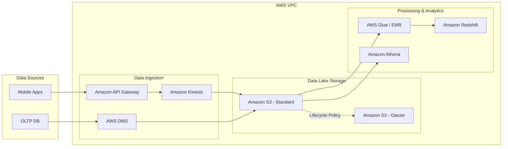

Công nghệ điện toán đám mây (Cloud Computing) đã trở thành tiêu chuẩn mặc định của hầu hết các hệ thống dữ liệu hiện đại. Tuy nhiên, sự tiện lợi và linh hoạt của Cloud luôn đi kèm với một cái giá rất đắt nếu chúng ta thiết kế sai lầm. Một câu truy vấn BigQuery viết cẩu thả có thể "đốt sạch" hàng ngàn USD trong vài giây; hay một cổng mạng VPC cấu hình sai có thể làm rò rỉ dữ liệu nhạy cảm của hàng triệu khách hàng ra ngoài Internet. 

Vòng phỏng vấn **Cloud Platform** ra đời không phải để kiểm tra xem bạn có thuộc lòng danh sách hàng trăm tên gọi dịch vụ của AWS, GCP hay Azure hay không. Người phỏng vấn thực sự muốn đánh giá tư duy thiết kế kiến trúc phân tán (Distributed Architecture) của bạn, cách bạn cân bằng giữa hiệu năng và chi phí (tư duy FinOps), cũng như khả năng xây dựng một hệ thống dữ liệu "Vững chắc, Bảo mật và Tối ưu hóa".

---

## Bản chất của các câu hỏi Cloud Platform

Trong vai trò là một Data Engineer, bạn cần có khả năng lắp ráp khéo léo các mảnh ghép dịch vụ đám mây (Lưu trữ, Tính toán, Mạng, Bảo mật) để tạo nên một đường ống dữ liệu (data pipeline) hoàn chỉnh. 

Bạn phải trả lời được một cách thuyết phục các câu hỏi kiểu như:
* Tại sao bạn lại chọn lưu trữ trên Amazon S3 thay vì EBS?
* Khi nào nên chạy các tác vụ Apache Spark trên dịch vụ Managed (như AWS EMR) và khi nào nên tự quản lý trên cụm Kubernetes (như AWS EKS)?
* Làm thế nào để thiết lập các chính sách phân quyền IAM để đảm bảo dữ liệu không bị rò rỉ?

---

## Ba trụ cột vàng cấu thành nên kiến trúc đám mây vững chắc

Khi thảo luận hoặc thiết kế hạ tầng Cloud trong buổi phỏng vấn, bạn nên bám sát vào ba trụ cột cốt lõi sau:

* **Lựa chọn dịch vụ phù hợp (Service Selection)**: Thể hiện sự hiểu biết sâu sắc về các mô hình dịch vụ IaaS (như EC2 máy ảo), PaaS (dịch vụ được quản lý một phần như EMR, Cloud SQL) và SaaS/Serverless (những kho dữ liệu được quản lý hoàn toàn như [Snowflake](/concepts/3-storage-engines-formats/snowflake), BigQuery). Luôn đặt lên bàn cân các điểm mạnh và điểm yếu của từng mô hình trước khi đưa ra quyết định.
* **Tối ưu hóa chi phí ([Cost Optimization](/concepts/8-security-governance-finops/cost-optimization) / FinOps)**: Đây là một kỹ năng cực kỳ ăn điểm. Hãy chứng minh bạn biết cách tiết kiệm tài nguyên cho doanh nghiệp thông qua việc sử dụng các máy ảo giá rẻ (Spot Instances), tự động tắt/bật hoặc co giãn tài nguyên theo nhu cầu thực tế (Auto-scaling), và phân loại dữ liệu để chuyển các dữ liệu cũ sang tầng lưu trữ lạnh giá rẻ (Cold Storage).
* **Bảo mật và Tuân thủ (Security & Compliance)**: Hãy chứng tỏ bạn luôn đặt tính bảo mật lên hàng đầu bằng cách áp dụng nguyên tắc đặc quyền tối thiểu (Least Privilege) khi phân quyền IAM, mã hóa dữ liệu ở cả hai trạng thái — khi lưu trữ (Encryption at rest) và khi truyền tải (Encryption in transit), cũng như thiết lập các vùng mạng an toàn.

---

## Phương pháp tiếp cận bài toán thiết kế hạ tầng

Khi nhận được một câu hỏi thiết kế hệ thống trên Cloud, thay vì lập tức liệt kê các dịch vụ, bạn hãy bình tĩnh đi theo các bước sau:

1. **Làm rõ Quy mô và Ngân sách (Understand Scale & Budget)**: Đặt câu hỏi ngược lại cho người phỏng vấn để xác định lượng dữ liệu và ngân sách cho phép. Nếu là một startup nhỏ cần tối ưu chi phí vận hành, hãy hướng tới kiến trúc Serverless (dùng bao nhiêu trả bấy nhiêu). Nếu là một tập đoàn lớn với lượng truy cập lớn và ổn định 24/7, hãy cân nhắc giải pháp mua trước tài nguyên dài hạn (Provisioned instances) để có giá tốt hơn.
2. **Ánh xạ công nghệ (Component Mapping)**: Lựa chọn các dịch vụ Cloud tương ứng cho từng công đoạn của luồng dữ liệu (ví dụ trên AWS: nạp dữ liệu bằng Kinesis, lưu trữ thô trên S3, xử lý dữ liệu bằng AWS Glue/EMR và phân tích bằng Amazon Redshift).
3. **Thiết kế tính sẵn sàng cao (High Availability & Disaster Recovery)**: Đảm bảo hệ thống vẫn sống sót nếu một trung tâm dữ liệu gặp sự cố vật lý bằng cách thiết kế đa vùng (Multi-AZ) hoặc đa khu vực (Multi-Region).
4. **Giải trình chi phí (Justify Cost)**: Chủ động giải thích tại sao thiết kế bạn đề xuất lại giúp doanh nghiệp tối ưu chi phí hơn các phương án khác.

---

## Mô hình tham chiếu Modern Data Stack trên AWS

Sơ đồ dưới đây minh họa một kiến trúc [Modern Data Stack](/concepts/1-distributed-systems-architecture/modern-data-stack) chuẩn mực được thiết kế an toàn trong mạng ảo VPC của AWS:

---

## Tình huống thực chiến: Giải cứu cụm Hadoop đắt đỏ

**Đề bài từ người phỏng vấn**: *"Công ty chúng tôi đang tốn khoảng 50,000 USD/tháng để tự vận hành một cụm Hadoop trên các máy ảo EC2. Hệ thống chạy rất chậm vào ban ngày do lượng truy cập cao, nhưng lại hoàn toàn rảnh rỗi vào ban đêm. Bạn sẽ tối ưu chi phí và hiệu năng cho hệ thống này như thế nào?"*

**Cách giải quyết thông minh (Tư duy FinOps)**:

* **Tách rời tầng tính toán và tầng lưu trữ**: Không tiếp tục sử dụng hệ thống tệp tin phân tán HDFS trên các máy ảo EC2 nữa. Hãy chuyển toàn bộ dữ liệu lịch sử xuống lưu trữ trên Amazon S3 (chi phí lưu trữ trên S3 rẻ hơn khoảng 10 lần so với đĩa EBS gắn liền máy ảo).
* **Chuyển sang cụm tính toán tạm thời (Ephemeral Clusters)**: Thay thế cụm EC2 chạy 24/7 bằng dịch vụ Amazon EMR. Vào ban ngày khi cần xử lý dữ liệu, hệ thống tự động kích hoạt cụm EMR để tính toán. Đến ban đêm khi rảnh rỗi, ta tắt cụm EMR này đi hoàn toàn. Dữ liệu lịch sử vẫn được bảo vệ an toàn tuyệt đối trên S3. Thao tác này có thể giúp công ty tiết kiệm ngay 50% chi phí.
* **Tận dụng Spot Instances**: Cấu hình cụm Spark/EMR sử dụng Spot Instances cho các node chuyên tính toán (Task Nodes) thay vì mua máy ảo trả phí theo giờ thông thường (On-Demand). Spot Instances có giá rẻ hơn từ 70% đến 90%. Nếu AWS có thu hồi máy ảo giữa chừng, cơ chế tự phục hồi của Spark sẽ tự động chạy lại các task đó trên các node khác mà không làm hỏng toàn bộ job.

**Kết quả**: Chi phí vận hành giảm mạnh từ 50,000 USD xuống dưới 15,000 USD/tháng, đồng thời hiệu năng xử lý ban ngày tăng lên rõ rệt nhờ cơ chế tự động mở rộng (Auto-scaling) theo nhu cầu thực tế.

---

## Những nguyên tắc vàng và Best Practices

* **Ưu tiên kiến trúc Serverless (Serverless First)**: Trừ khi hệ thống của bạn có khối lượng công việc khổng lồ chạy ổn định và liên tục ở cường độ cao, hãy luôn ưu tiên các dịch vụ Serverless (AWS Lambda, [Google BigQuery](/concepts/3-storage-engines-formats/google-bigquery), Amazon Athena). Bạn sẽ không phải tốn nhân sự vận hành máy ảo và chỉ phải trả tiền cho từng giây tính toán thực tế.
* **Áp dụng chính sách vòng đời dữ liệu ([Data Lifecycle](/concepts/1-distributed-systems-architecture/data-lifecycle) Policies)**: Hãy cấu hình các quy tắc tự động chuyển các file dữ liệu cũ (ví dụ: các file log hệ thống đã lưu trên 30 ngày) xuống các tầng lưu trữ lạnh có chi phí siêu rẻ như Amazon S3 Glacier hay Google [Cloud Storage](/concepts/3-storage-engines-formats/cloud-storage) Coldline.
* **Gắn nhãn tài nguyên (Resource Tagging)**: Luôn xây dựng quy định gắn tag rõ ràng cho mọi tài nguyên tạo ra trên Cloud (ví dụ: `Environment=Prod`, `Team=Marketing`, `Project=Data-Sync`). Điều này giúp bạn dễ dàng xuất báo cáo tài chính hàng tháng để biết chính xác dự án nào đang tiêu tốn nhiều ngân sách nhất.

---

## Những sai lầm kinh điển dễ làm "đốt tiền" của công ty

* **Bỏ quên chi phí truyền tải mạng (Data Transfer / Egress Cost)**: Việc nạp dữ liệu từ bên ngoài vào Cloud (Ingress) thường được các nhà cung cấp miễn phí hoàn toàn. Tuy nhiên, việc lấy dữ liệu ra khỏi Cloud (Egress) hoặc truyền tải dữ liệu giữa các vùng địa lý khác nhau (Cross-Region/Cross-AZ) bị tính phí rất đắt. Nhiều kỹ sư chỉ tập trung vào chi phí lưu trữ mà bỏ quên khoản chi phí mạng khổng lồ này.
* **Lạm dụng hệ quản trị cơ sở dữ liệu quan hệ (RDBMS) cho các tác vụ phân tích**: Cố gắng lưu trữ và xử lý hàng tỷ dòng dữ liệu phân tích trên các dịch vụ cơ sở dữ liệu giao dịch như Amazon RDS hay Google Cloud SQL sẽ khiến hóa đơn bản quyền và ổ đĩa tăng chóng mặt. Hãy chuyển hướng các dữ liệu này sang các kho dữ liệu chuyên dụng (Data Warehouse) như BigQuery hay Redshift.
* **Quyền hạn IAM quá lỏng lẻo**: Việc cấu hình công khai (public) các bucket lưu trữ S3 ra ngoài Internet hoặc nhúng trực tiếp mã khóa truy cập `Access Key / Secret Key` của tài khoản Admin tối cao vào trong code ứng dụng là những lỗ hổng bảo mật chết người. Hãy luôn phân quyền thông qua cơ chế IAM Roles và Service Accounts ngắn hạn.

---

## Bài toán đánh đổi: Tự quản lý (Self-hosted) hay Thuê dịch vụ (Managed)?

* **Dịch vụ được quản lý (Managed Services - PaaS/SaaS)** như AWS MSK (Kafka) hay Google Cloud SQL giúp doanh nghiệp tiết kiệm tối đa thời gian vận hành. Bạn không cần lo lắng về việc nâng cấp phiên bản, vá lỗi bảo mật hay sao lưu dữ liệu. Đổi lại, bạn phải trả chi phí dịch vụ cao hơn và dễ bị phụ thuộc hoàn toàn vào một nhà cung cấp Cloud (Vendor Lock-in).
* **Tự quản lý trên máy ảo (Self-hosted - IaaS)** giúp bạn chủ động cấu hình hệ thống theo ý muốn, dễ dàng di chuyển mã nguồn sang nhà cung cấp khác và tiết kiệm chi phí thuê dịch vụ. Tuy nhiên, bạn buộc phải nuôi một đội ngũ kỹ sư hệ thống (SysAdmin/DevOps) có chuyên môn cao trực chiến 24/7 để xử lý các sự cố hạ tầng phát sinh.

---

## Bộ câu hỏi phỏng vấn thực tế và Gợi ý trả lời ghi điểm

### 1. Tại sao Amazon S3 được coi là lựa chọn hàng đầu khi xây dựng Data Lake?
* **Gợi ý trả lời**: Amazon S3 đáp ứng hoàn hảo các yêu cầu cốt lõi của một Data Lake:
  * **Khả năng mở rộng không giới hạn**: Bạn có thể lưu trữ bao nhiêu dữ liệu tùy thích mà không bao giờ lo hệ thống báo hết dung lượng đĩa.
  * **Chi phí tối ưu**: Chi phí lưu trữ thô rất rẻ, kết hợp với các tầng lưu trữ lạnh giúp tiết kiệm tối đa ngân sách.
  * **Độ bền bỉ siêu việt (Durability)**: Thiết kế đạt độ bền dữ liệu lên tới 11 số 9 (99.999999999%), gần như loại bỏ hoàn toàn rủi ro mất mát dữ liệu do hỏng hóc vật lý.
  * **Hệ sinh thái tích hợp sâu rộng**: Các công cụ tính toán phân tán hàng đầu như Spark, Presto hay AWS Athena đều hỗ trợ kết nối và truy vấn trực tiếp dữ liệu dạng file (như Parquet, ORC) lưu trên S3 mà không cần di chuyển dữ liệu đi nơi khác.

### 2. Hãy so sánh sự khác biệt về mặt kiến trúc giữa AWS Redshift và Google BigQuery.
* **Gợi ý trả lời**: 
  * **AWS Redshift**: Sử dụng kiến trúc MPP (Massively Parallel Processing) truyền thống. Hệ thống yêu cầu chúng ta phải tự khai báo và quản lý số lượng máy chủ (Provisioned nodes). Dữ liệu được phân bổ cố định trên các node tính toán này. Redshift rất phù hợp cho các doanh nghiệp có lượng công việc phân tích chạy liên tục, đều đặn hàng ngày và muốn dự báo chính xác hóa đơn chi phí cố định hàng tháng.
  * **Google BigQuery**: Đi theo hướng kiến trúc Serverless hoàn toàn. Tầng tính toán và tầng lưu trữ được tách biệt độc lập qua mạng cáp quang nội bộ siêu tốc của Google. Người dùng không cần phải quan tâm đến việc quản trị hay khởi tạo máy chủ. Khi bạn chạy một câu truy vấn lớn, BigQuery sẽ tự động phân phối hàng ngàn worker chạy ngầm để xử lý và tính tiền dựa trên lượng dữ liệu (Terabytes) bị quét qua. Công cụ này cực kỳ tối ưu cho các hệ thống có lượng công việc biến động thất thường (spiky workloads).

### 3. Bạn sẽ thiết lập những giải pháp gì để bảo vệ dữ liệu nhạy cảm (PII - Personally Identifiable Information) trên Cloud?
* **Gợi ý trả lời**: Tôi sẽ áp dụng chiến lược bảo mật nhiều lớp:
  * **Lớp ứng dụng**: Thực hiện mã hóa ẩn danh (Data Masking), băm dữ liệu (Hashing) hoặc thay thế dữ liệu bằng mã định danh (Tokenization) trước khi ghi xuống tầng lưu trữ.
  * **Lớp lưu trữ**: Kích hoạt tính năng mã hóa dữ liệu tự động ở trạng thái nghỉ bằng cách sử dụng các khóa mã hóa do khách hàng quản lý (SSE-KMS).
  * **Lớp mạng**: Đưa toàn bộ hệ thống lưu trữ và tính toán vào trong mạng ảo riêng VPC, sử dụng Private Subnet và chặn toàn bộ các cổng kết nối từ Internet công cộng.
  * **Lớp truy cập**: Áp dụng cơ chế IAM chặt chẽ (RBAC) kết hợp với các công cụ giám sát lịch sử truy cập (như AWS CloudTrail) để ghi nhận chi tiết ai đã truy cập vào dữ liệu và vào thời điểm nào.

---

## Tài liệu tham khảo hữu ích

1. **AWS Well-Architected Framework** - Cẩm nang chuẩn mực của Amazon (đặc biệt là các chương về Cost Optimization và Security).
2. **Google Cloud Architecture Center** - Tài liệu hướng dẫn thiết kế hệ thống dữ liệu trên GCP.
3. **FinOps Foundation** - Các phương pháp và tiêu chuẩn quản trị tài chính đám mây doanh nghiệp.

---

## English Summary

The Cloud Platform Interview focuses on evaluating a candidate's ability to architect distributed data systems using public cloud providers (AWS, GCP, Azure) while balancing performance, security, and cost. Candidates must demonstrate FinOps thinking (e.g., separating storage from compute, using spot instances, applying data lifecycle policies to cold storage) and choose the appropriate abstraction level (IaaS, PaaS, or Serverless/SaaS) for the use case. Familiarity with networking (VPC), Identity Access Management (IAM/Least Privilege), and mitigating data transfer costs are critical factors to succeed in this round.

## Tài Liệu Tham Khảo
* **Fundamentals of Data Engineering - Joe Reis & Matt Housley**
* [Designing Data-Intensive Applications - Martin Kleppmann](https://dataintensive.net/)
* [The Pragmatic Engineer - Gergely Orosz](https://blog.pragmaticengineer.com/)
* **Data Engineering at Scale: Netflix Tech Blog**
* **Building Data Infrastructure at Airbnb**
