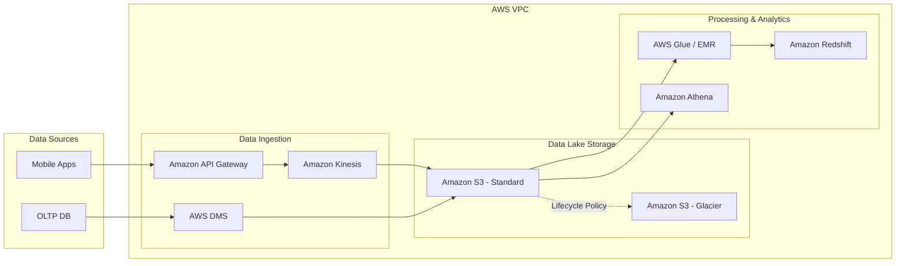

Trên cloud, một quyết định thiết kế sai có hóa đơn đi kèm. Câu truy vấn BigQuery quét cả bảng thay vì một partition có thể tốn hàng nghìn USD trong vài phút; một bucket S3 mở public có thể làm lộ dữ liệu hàng triệu khách hàng. Vòng phỏng vấn Cloud Platform vì thế không kiểm tra bạn thuộc bao nhiêu tên dịch vụ AWS — nó kiểm tra xem mỗi lựa chọn của bạn có đi kèm ý thức về chi phí, bảo mật và độ tin cậy hay không.

Đây cũng là vòng mà kinh nghiệm "đã từng trả tiền cloud" lộ ra rõ nhất. Người chưa vận hành thật thường thiết kế đúng về chức năng nhưng đắt gấp ba lần cần thiết.

---

## Ba trục đánh giá của vòng phỏng vấn này

**Chọn đúng mức dịch vụ.** IaaS (máy ảo EC2 — toàn quyền, tự vận hành), PaaS (dịch vụ quản lý một phần như EMR, Cloud SQL), và Serverless/SaaS (quản lý hoàn toàn như [Snowflake](/concepts/3-storage-engines-formats/snowflake), BigQuery, Athena). Không mức nào "tốt hơn" tuyệt đối — câu trả lời tốt luôn gắn lựa chọn với quy mô đội ngũ và đặc tính workload, và nói được mình đánh đổi gì.

**Tư duy chi phí ([Cost Optimization](/concepts/8-security-governance-finops/cost-optimization) / FinOps).** AWS Well-Architected Framework có hẳn một pillar riêng cho cost optimization, định nghĩa workload tối ưu chi phí là workload "đạt kết quả ở mức giá thấp nhất mà vẫn đáp ứng yêu cầu chức năng". Các công cụ cụ thể: Spot Instances, auto-scaling, tầng lưu trữ lạnh, tắt tài nguyên khi không dùng.

**Bảo mật.** Nguyên tắc least privilege khi phân quyền IAM, mã hóa cả hai trạng thái (at rest và in transit), và cô lập mạng bằng VPC/private subnet. Trong phỏng vấn, bảo mật thường không phải câu hỏi riêng mà là thứ người phỏng vấn quan sát xem bạn có *tự* nhắc đến không.

---

## Trình tự trả lời bài toán thiết kế hạ tầng

1. **Hỏi quy mô và ngân sách trước.** Startup nhỏ, tải thất thường → serverless, trả theo dùng. Tập đoàn với tải lớn ổn định 24/7 → tài nguyên đặt trước (reserved/committed) rẻ hơn đáng kể. Cùng một đề bài, hai bối cảnh cho hai thiết kế ngược nhau — không hỏi thì không biết mình đang giải bài nào.
2. **Ánh xạ dịch vụ theo từng công đoạn**: ví dụ trên AWS — ingest bằng Kinesis, lưu thô trên S3, xử lý bằng Glue/EMR, phân tích bằng Redshift hoặc Athena. Nói kèm lý do chọn, không chỉ tên.
3. **Tính sẵn sàng cao**: thiết kế Multi-AZ cho sự cố cấp trung tâm dữ liệu; Multi-Region chỉ khi nghiệp vụ thật sự cần — vì chi phí và độ phức tạp tăng vọt, đặc biệt là phí truyền dữ liệu liên vùng.
4. **Giải trình chi phí của chính thiết kế mình vừa vẽ.** Bước này ít ứng viên làm, và là bước khiến người phỏng vấn nhớ bạn.

---

## Kiến trúc tham chiếu trên AWS

Sơ đồ [Modern Data Stack](/concepts/1-distributed-systems-architecture/modern-data-stack) trong VPC của AWS:

Hai điểm đáng chỉ vào khi trình bày sơ đồ: mũi tên lifecycle policy từ S3 Standard sang Glacier (chi phí lưu trữ giảm tự động theo tuổi dữ liệu, không cần ai làm gì), và việc Athena truy vấn thẳng trên S3 (nhiều nhu cầu phân tích không cần warehouse riêng — tiết kiệm được cả một hệ thống).

---

## Bài toán thực chiến: cụm Hadoop 50.000 USD/tháng

**Đề bài**: *"Chúng tôi tốn ~50.000 USD/tháng tự vận hành một cụm Hadoop trên EC2. Ban ngày quá tải, ban đêm rảnh hoàn toàn. Bạn tối ưu thế nào?"*

Đề này gói ba bài học FinOps vào một tình huống:

**Tách compute khỏi storage.** Chuyển dữ liệu từ HDFS-trên-EBS xuống S3. Lưu trữ object rẻ hơn đĩa gắn máy ảo nhiều lần, và quan trọng hơn: dữ liệu không còn "sống nhờ" vào việc cluster phải bật.

**Cụm tính toán tạm thời (ephemeral clusters).** Khi dữ liệu đã ở S3, cluster EMR chỉ cần tồn tại lúc có việc: bật lên xử lý, xong tắt hẳn. Hệ thống "rảnh hoàn toàn ban đêm" mà vẫn trả tiền 24/7 chính là mùi vấn đề mà đề bài cố tình để lộ — nhận ra nó ngay là điểm cộng đầu tiên.

**Spot Instances cho task node.** Spot rẻ hơn on-demand 70-90% theo bảng giá AWS, đổi lại có thể bị thu hồi bất kỳ lúc nào. Với Spark điều này chấp nhận được: task trên node bị thu hồi sẽ được chạy lại trên node khác nhờ cơ chế chịu lỗi sẵn có. Điều kiện đi kèm phải nêu: master node và core node (giữ dữ liệu HDFS tạm) vẫn nên là on-demand — spot toàn bộ cluster là tự chuốc rủi ro mất job giữa chừng.

Ba thay đổi này thường đưa hóa đơn về một phần ba, đồng thời ban ngày chạy nhanh hơn nhờ auto-scaling. Con số chính xác phụ thuộc workload — trong phỏng vấn, đưa khoảng ước lượng kèm điều kiện thuyết phục hơn hứa một con số đẹp.

---

## Ba bẫy chi phí và bảo mật kinh điển

**Chi phí egress.** Đưa dữ liệu *vào* cloud miễn phí; lấy dữ liệu *ra* (egress) và truyền giữa các region/AZ thì không hề rẻ. Kiến trúc đọc dữ liệu cross-region thường xuyên, hoặc kế hoạch "multi-cloud" đồng bộ dữ liệu qua lại giữa hai nhà cung cấp, có thể có phí mạng lớn hơn cả phí lưu trữ. Đây là khoản mục bị bỏ quên nhiều nhất khi ước tính chi phí.

**Dùng RDBMS giao dịch cho việc phân tích.** Nhồi hàng tỷ dòng vào RDS/Cloud SQL rồi chạy truy vấn phân tích trên đó: chậm (row-based storage không hợp scan phân tích) và đắt (trả tiền cho IOPS và instance size thay vì cho lượng dữ liệu quét). Dữ liệu phân tích thuộc về warehouse dạng cột — BigQuery, Redshift, Snowflake.

**IAM lỏng lẻo.** Bucket S3 public và access key của admin nhúng thẳng trong code là hai lỗi gây ra phần lớn các vụ rò rỉ dữ liệu trên cloud được công bố. Chuẩn thực hành: IAM Role/Service Account cấp quyền ngắn hạn theo least privilege, không bao giờ có credential dài hạn trong mã nguồn.

---

## Managed hay self-hosted: khung trả lời

Dịch vụ managed (AWS MSK, Cloud SQL) mua lại thời gian vận hành: không lo vá lỗi, nâng cấp, backup — đổi bằng đơn giá cao hơn và mức độ gắn chặt với nhà cung cấp (vendor lock-in). Self-hosted trên IaaS cho toàn quyền cấu hình, dễ mang đi nơi khác, đơn giá hạ tầng thấp hơn — nhưng "đơn giá thấp" chưa phải "tổng chi phí thấp": phải cộng lương đội SysAdmin/DevOps trực 24/7 vào phép tính.

Câu trả lời trưởng thành xoay quanh khái niệm tổng chi phí sở hữu (TCO) và quy mô đội: đội dữ liệu 3 người thì thời gian kỹ sư là tài nguyên đắt nhất → managed; tổ chức có sẵn đội platform mạnh và workload đủ lớn → self-host phần nào có lợi thế chi phí rõ ràng.

---

## Ba câu hỏi thực tế và cách trả lời

### 1. Vì sao S3 là lựa chọn mặc định cho Data Lake?

Bốn lý do, mỗi lý do ứng với một yêu cầu của data lake: **mở rộng không giới hạn** (không bao giờ "hết đĩa"); **chi phí thấp** với các tầng lưu trữ theo tần suất truy cập (Standard → Infrequent Access → Glacier); **độ bền 11 số 9** (99,999999999% durability theo tài liệu AWS — dữ liệu được sao chép qua nhiều AZ); và **hệ sinh thái**: Spark, Trino/Presto, Athena đều truy vấn trực tiếp Parquet/ORC trên S3, không cần chuyển dữ liệu đi đâu. Điểm cộng nếu nêu giới hạn kèm theo: S3 là object store bất biến — cần update/delete cấp dòng thì phải thêm table format (Iceberg, Delta) bên trên.

### 2. So sánh kiến trúc Redshift và BigQuery

* **Redshift**: kiến trúc MPP với node do người dùng khai báo (dù đã có tùy chọn serverless, mô hình gốc là provisioned). Phù hợp workload phân tích chạy đều đặn, muốn chi phí cố định dự đoán được hàng tháng.
* **BigQuery**: serverless hoàn toàn — compute và storage tách rời, người dùng không thấy máy chủ; mỗi truy vấn được phân phối cho hàng nghìn worker và tính tiền theo lượng dữ liệu quét (hoặc theo slot đặt trước). Rất hợp workload thất thường, đội không muốn vận hành gì.

Mấu chốt của câu này là mô hình tính tiền dẫn đến hành vi khác nhau: với BigQuery on-demand, câu `SELECT *` không partition filter là lỗi tài chính chứ không chỉ lỗi kỹ thuật; với Redshift provisioned, cluster để không vẫn tốn đủ tiền. Nói được hệ quả hành vi này là vượt mức "thuộc bảng so sánh".

### 3. Bảo vệ dữ liệu PII trên cloud thế nào?

Trả lời theo các lớp, từ trong ra ngoài: **lớp dữ liệu** — masking, hashing hoặc tokenization các trường nhạy cảm trước khi ghi xuống storage, để chính warehouse cũng không giữ PII thô; **lớp lưu trữ** — mã hóa at rest bằng khóa do mình quản lý (SSE-KMS), tách quyền dùng khóa khỏi quyền đọc bucket; **lớp mạng** — tài nguyên trong VPC/private subnet, không có đường từ Internet công cộng; **lớp truy cập** — IAM theo vai trò kết hợp audit log (CloudTrail) để trả lời được "ai đã đọc dữ liệu này, khi nào". Kết bằng ý tuân thủ (GDPR, các quy định địa phương về lưu trữ dữ liệu) cho thấy bạn hiểu đây là bài toán pháp lý chứ không thuần kỹ thuật.

---

## Tài liệu tham khảo

* [AWS Well-Architected Framework — Cost Optimization Pillar](https://docs.aws.amazon.com/wellarchitected/latest/cost-optimization-pillar/welcome.html) — tài liệu chuẩn về tư duy chi phí trên cloud.
* [AWS Well-Architected Framework — The Pillars](https://docs.aws.amazon.com/wellarchitected/latest/framework/the-pillars-of-the-framework.html) — sáu pillar: operational excellence, security, reliability, performance, cost, sustainability.
* [Google Cloud Architecture Center](https://cloud.google.com/architecture) — kiến trúc tham chiếu cho hệ thống dữ liệu trên GCP.
* [FinOps Foundation — FinOps Framework](https://www.finops.org/framework/) — chuẩn quản trị tài chính cloud ở góc độ tổ chức, bổ trợ cho góc kỹ thuật của Well-Architected.
* **Fundamentals of Data Engineering — Joe Reis & Matt Housley (O'Reilly)** — các chương về lựa chọn công nghệ và undercurrent về cost management.
