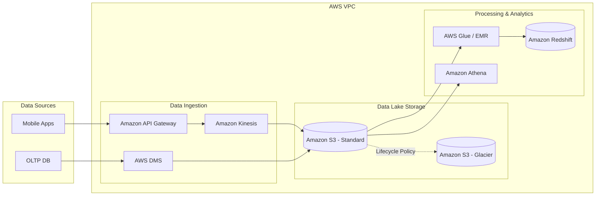

# Nền tảng Cloud (Phỏng vấn) - Cloud Platform Interview

## Summary

**Cloud Platform Interview** là vòng phỏng vấn xoay quanh kiến thức về hạ tầng đám mây (AWS, GCP, Azure). Mục đích không phải là kiểm tra xem bạn có thuộc lòng tên các dịch vụ hay không, mà để đánh giá tư duy thiết kế kiến trúc phân tán (Distributed Architecture), sự hiểu biết về mô hình Managed vs Self-hosted, và đặc biệt là kỹ năng thiết kế hệ thống tối ưu hóa chi phí (Cost Optimization / FinOps).

---

## Definition

Trong Data Engineering, phỏng vấn nền tảng Cloud yêu cầu ứng viên có khả năng lắp ráp các thành phần dịch vụ đám mây (Lưu trữ, Tính toán, Mạng, Bảo mật) thành một giải pháp hoàn chỉnh. Ứng viên phải giải thích được tại sao lại chọn Amazon S3 thay vì EBS, khi nào nên chạy Spark trên EMR (Managed) so với chạy trên EKS (Kubernetes), và làm thế nào để đảm bảo dữ liệu không bị rò rỉ ra ngoài (VPC, IAM).

---

## Why it exists

Cloud đã trở thành tiêu chuẩn mặc định của ngành Dữ liệu. Tuy nhiên, sự tiện lợi của Cloud đi kèm với cái giá rất đắt nếu thiết kế sai lầm. Một truy vấn BigQuery viết sai cấu trúc có thể đốt hàng ngàn USD trong vài giây. Một cổng mạng thiết lập sai có thể làm rò rỉ dữ liệu cá nhân (PII) của khách hàng. Vòng phỏng vấn này giúp công ty tìm ra những kỹ sư có khả năng xây dựng hệ thống "Vững chắc, Bảo mật và Rẻ".

---

## Core idea

Ba trụ cột chính khi thảo luận về Cloud Platform trong phỏng vấn:
* **Service Selection (Lựa chọn dịch vụ)**: So sánh sự đánh đổi giữa các mô hình IaaS (EC2), PaaS (EMR, Cloud SQL) và SaaS/Serverless (Snowflake, BigQuery).
* **Cost Optimization (Tối ưu chi phí)**: Cắt giảm chi phí không cần thiết bằng cách sử dụng Spot Instances, phân loại dữ liệu lưu trữ lạnh (Cold Storage) và tính toán tài nguyên theo nhu cầu thực tế (Auto-scaling).
* **Security & Compliance (Bảo mật và Tuân thủ)**: Hiểu về Identity and Access Management (IAM), phân quyền theo nguyên tắc đặc quyền tối thiểu (Least Privilege), và bảo vệ dữ liệu ở trạng thái nghỉ (Encryption at rest) và di chuyển (Encryption in transit).

---

## How it works

Cách tiếp cận và trả lời một câu hỏi Thiết kế Hạ tầng Cloud:
1. **Understand Scale & Budget**: Khởi đầu bằng việc làm rõ ngân sách và quy mô dữ liệu. Nếu startup ít tiền, hãy hướng tới Serverless (Pay-as-you-go). Nếu tập đoàn lớn với tải liên tục 24/7, hãy hướng tới Provisioned instances.
2. **Component Mapping**: Đề xuất các công nghệ đám mây tương ứng. (Ví dụ: Ingestion -> Kinesis/PubSub; Storage -> S3/GCS; Processing -> EMR/Dataproc; Serving -> Redshift/BigQuery).
3. **High Availability (HA) & Disaster Recovery (DR)**: Thiết kế đa vùng (Multi-AZ) hoặc đa khu vực (Multi-Region) để đảm bảo hệ thống không sập khi một trung tâm dữ liệu gặp sự cố.
4. **Justify Cost**: Giải thích tại sao thiết kế của bạn lại tối ưu chi phí hơn các lựa chọn khác.

---

## Architecture / Flow

Mô hình tham chiếu Modern Data Stack trên AWS:

---

## Practical example

**Tình huống phỏng vấn**: "Công ty đang tốn 50,000 USD/tháng cho cụm Hadoop tự host trên EC2 (AWS). Hệ thống bị chậm vào ban ngày nhưng rảnh rỗi vào ban đêm. Làm sao để tối ưu chi phí?"

**Phân tích & Giải quyết (Tư duy FinOps)**:
* **Phân tách Storage và Compute**: Không dùng HDFS trên EC2 nữa. Chuyển toàn bộ dữ liệu lịch sử lưu xuống Amazon S3 (rẻ hơn khoảng 10 lần).
* **Chuyển sang Ephemeral Clusters**: Dùng Amazon EMR thay thế. Ban ngày kích hoạt cụm EMR để phân tích, ban đêm tắt cụm đi hoàn toàn. Dữ liệu vẫn an toàn trên S3. Tiết kiệm 50% chi phí.
* **Sử dụng Spot Instances**: Đối với các Task Node (các node chỉ tính toán, không lưu trữ trong Spark), cấu hình sử dụng Spot Instances thay vì On-Demand. Spot Instances có giá rẻ hơn 70-90%. Nếu bị AWS thu hồi giữa chừng, Spark sẽ tự động retry các task trên node khác.
* *Kết quả*: Giảm chi phí từ 50,000 USD xuống dưới 15,000 USD/tháng trong khi hệ thống chạy nhanh hơn nhờ khả năng Auto-scaling vào ban ngày.

---

## Best practices

* **Serverless First**: Trừ khi bạn có một khối lượng công việc (workload) chạy liên tục và có thể đoán trước ở cường độ cao, hãy ưu tiên các dịch vụ Serverless (Lambda, BigQuery, Athena) để không tốn công sức bảo trì và trả tiền theo đúng phần trăm CPU sử dụng.
* **Data Lifecycle Policies**: Thiết lập quy tắc tự động chuyển các dữ liệu cũ (ví dụ: log trên 1 tháng) xuống các tầng lưu trữ lạnh (Cold Storage như S3 Glacier/Deep Archive) để tiết kiệm hàng ngàn USD chi phí ổ cứng.
* **Resource Tagging**: Luôn gắn thẻ (Tagging) cho mọi tài nguyên (Ví dụ: `Team=Marketing`, `Environment=Prod`) để có thể xuất báo cáo phân bổ chi phí và tìm ra dự án nào đang "đốt" tiền nhất.

---

## Common mistakes

* **Quên tính chi phí truyền tải mạng (Data Transfer Cost)**: Di chuyển dữ liệu vào Cloud (Ingress) thì miễn phí, nhưng mang dữ liệu ra khỏi Cloud (Egress) hoặc truyền dữ liệu giữa các Availability Zone/Region sẽ bị tính phí mạng rất đắt.
* **Lạm dụng RDBMS cho phân tích**: Cố gắng nhồi nhét dữ liệu khổng lồ vào Amazon RDS hoặc Cloud SQL thay vì dùng dịch vụ Data Warehouse chuyên dụng (Redshift/BigQuery), dẫn đến chi phí license và storage tăng phi mã.
* **Quyền IAM lỏng lẻo**: Mở public bucket S3 ra toàn bộ internet hoặc sử dụng cặp khóa `Access Key / Secret Key` của tài khoản Root (quản trị tối cao) trong mã nguồn thay vì cấp quyền thông qua IAM Roles.

---

## Trade-offs

### Managed Services (PaaS) vs Self-hosted (IaaS)
* Các dịch vụ có sẵn (Managed Services như AWS MSK, Cloud SQL) giúp đội ngũ không tốn thời gian cài đặt, nâng cấp phiên bản và vá lỗi bảo mật (Zero-ops). Đổi lại, chi phí license đắt hơn và bị trói buộc vào hệ sinh thái của Cloud đó (Vendor Lock-in).
* Tự cài đặt trên máy ảo (Self-hosted trên EC2/GCE) tiết kiệm tiền dịch vụ và dễ chuyển nhà sang Cloud khác, nhưng bạn phải tự nuôi một đội ngũ SysAdmin/DevOps lớn để trực page 24/7.

---

## When to use

* Bất cứ khi nào phỏng vấn cho các công ty Product/Tech định hướng Cloud-Native.
* Vòng System Design (Infrastructure) để xét bậc Senior hoặc Lead.

---

## Related concepts

* [Data Lake](/concepts/data-lake)
* Serverless Computing
* Separation of Compute and Storage

---

## Interview questions

### 1. Tại sao Amazon S3 được coi là tiêu chuẩn vàng (gold standard) cho Data Lake?
* **Gợi ý trả lời**: 
  1. Khả năng mở rộng vô hạn (không bao giờ báo lỗi hết đĩa cứng). 
  2. Chi phí cực kỳ rẻ và hỗ trợ phân tầng lưu trữ (Intelligent-Tiering, Glacier). 
  3. Độ bền dữ liệu (Durability) đạt 11 số 9 (99.999999999%), gần như không thể mất dữ liệu. 
  4. Hỗ trợ hệ sinh thái mạnh mẽ (Spark, Presto, Athena đều có thể truy vấn trực tiếp file Parquet/ORC trên S3 thông qua giao thức API).

### 2. Sự khác biệt kiến trúc giữa AWS Redshift và Google BigQuery là gì?
* **Gợi ý trả lời**: 
  * Redshift (kiến trúc truyền thống MPP): Yêu cầu người dùng phải tự cấp phát số lượng node (Provisioned). Dữ liệu được chia theo kiểu phân tán trên từng máy chủ cố định. Phù hợp cho tải hoạt động liên tục, dự đoán được chi phí.
  * BigQuery (kiến trúc Serverless): Tính toán và lưu trữ tách biệt hoàn toàn bởi mạng cáp quang siêu tốc của Google (Borg & Colossus). Bạn không cần quản lý máy chủ, truy vấn sẽ tự động phân phối hàng ngàn worker chạy ngầm. Trả phí theo số lượng Terabyte dữ liệu bị quét (Pay-per-query). Phù hợp cho tải phân tích không đều đặn (spiky workloads).

### 3. Bạn sẽ bảo mật dữ liệu PII (Personally Identifiable Information) trên Cloud như thế nào?
* **Gợi ý trả lời**:
  1. Ở mức ứng dụng: Áp dụng Data Masking hoặc Hashing/Tokenization trước khi ghi xuống đĩa.
  2. Ở mức lưu trữ: Bật mã hóa ở trạng thái nghỉ (Encryption at Rest - SSE-KMS).
  3. Ở mức mạng: Sử dụng VPC (Virtual Private Cloud) với Private Subnet, ngăn chặn mọi kết nối từ Internet công cộng.
  4. Ở mức truy cập: Áp dụng IAM với Role-Based Access Control (RBAC) và theo dõi bằng CloudTrail để audit log ai đã đọc dữ liệu.

---

## References

1. **AWS Well-Architected Framework** - Cẩm nang chuẩn mực của Amazon (Pillars: Cost Optimization, Security, Reliability).
2. **Google Cloud Architecture Center** - Tài liệu Data Engineering on GCP.
3. **FinOps Foundation** - Các phương pháp quản trị tài chính đám mây doanh nghiệp.

---

## English summary

The Cloud Platform Interview focuses on evaluating a candidate's ability to architect distributed data systems using public cloud providers (AWS, GCP, Azure) while balancing performance, security, and cost. Candidates must demonstrate FinOps thinking (e.g., separating storage from compute, using spot instances, applying data lifecycle policies to cold storage) and choose the appropriate abstraction level (IaaS, PaaS, or Serverless/SaaS) for the use case. Familiarity with networking (VPC), Identity Access Management (IAM/Least Privilege), and mitigating data transfer costs are critical factors to succeed in this round.
